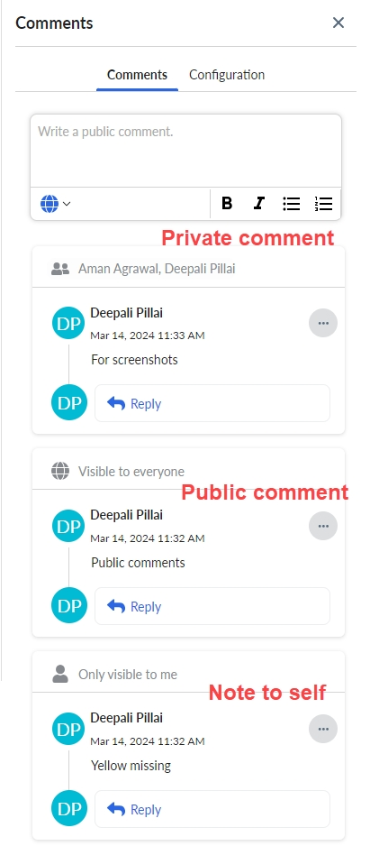

# Comentários e colaboração Recurso de comentários privados

Comentários privados

O recurso de comentários privados permite que os usuários tenham discussões que são mais adequadas a um grupo fechado. Qualquer pessoa incluída no grupo pode enviar comentários privados dentro de um grupo de usuários ou enviar comentários públicos visíveis para todos os usuários que têm acesso ao relatório.

Para iniciar uma conversa privada, adicione outros usuários ou funções como membros do tópico de comentários. Nesta versão, você pode adicionar até 50 membros a um grupo. Qualquer membro do grupo pode clicar no ícone Comentário privado no cabeçalho do tópico de comentários para ver a lista completa de membros em qualquer ponto da conversa. Uma conversa privada não pode se tornar pública e uma conversa pública não pode se tornar privada. Os membros do grupo não podem modificar a lista de membros depois de iniciar uma conversa privada.

Esse recurso também pode ser usado para fazer suas próprias anotações. Para criar uma nota, inicie uma conversa privada e insira o comentário sem adicionar nenhum membro.

Os diagramas a seguir mostram como fazer uma anotação para você mesmo, um comentário privado e um comentário público.

Opções de formatação de comentários

Você pode formatar seus comentários com parágrafos e formatação de texto simples, incluindo negrito, itálico, listas de marcadores e listas numeradas.

A mensagem é então exibida para todos os usuários.

**Tópico principal:** [Cálculo de custos e faturamento](../costing-billing/home.html)
