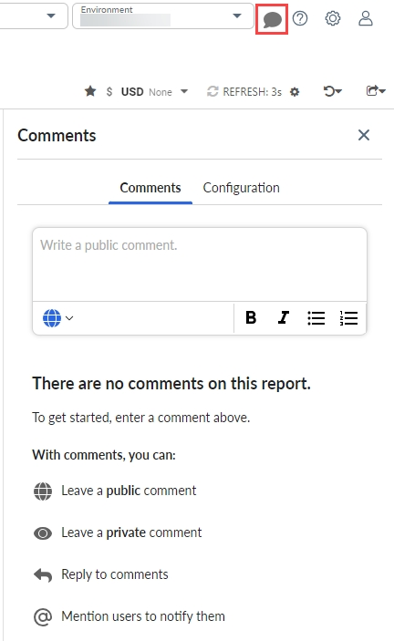
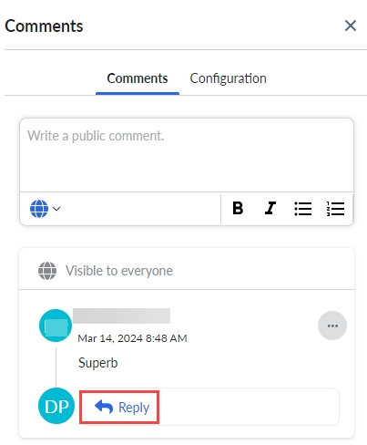
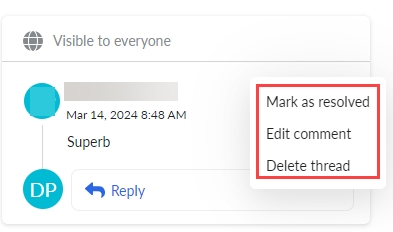

# Usando comentários

Comments and Collaboration permite que você participe de conversas com outras pessoas sobre relatórios. Essas conversas podem incluir discussões sobre a análise de variações, o status do projeto, possíveis iniciativas de economia, exceções, tendências, dados ausentes, próximas etapas e assim por diante.

Digite um comentário

1. Para adicionar um comentário a um relatório, clique no ícone Comments (Comentários)  .

   
2. Na caixa sem rótulo no painel Comments (Comentários), digite seu comentário e clique em Submit (Enviar ).

Responder a um comentário

Para responder a um comentário, clique em Responder, digite sua resposta e clique em Responder.

Para notificar uma pessoa sobre o comentário, mencione-a usando a convenção @<username>.

Se não quiser responder, você pode iniciar um novo tópico de comentários.

Editar e excluir comentários

Para editar ou excluir um comentário, clique nas reticências verticais associadas ao comentário e, em seguida, clique em Editar comentário ou Excluir tópico.

Você só pode excluir seus próprios comentários. Os administradores podem excluir os comentários de qualquer pessoa. As notificações não são enviadas quando os comentários são editados ou excluídos.

Desativar notificações

As notificações por e-mail são ativadas por padrão para alertar os usuários sobre menções e respostas em tópicos de comentários. Não há suporte para notificações no produto. No entanto, se quiser desativar as notificações, entre em contato com o representante de suporte Apptio.

**Tópico principal:** [Cálculo de custos e faturamento](../costing-billing/home.html)
