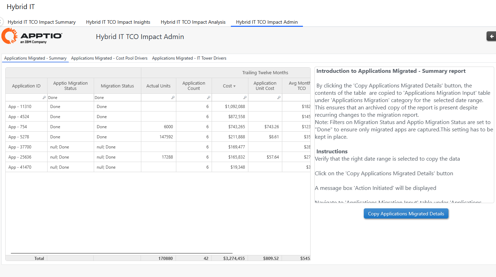
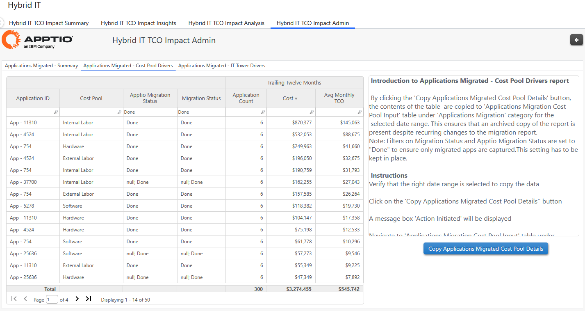
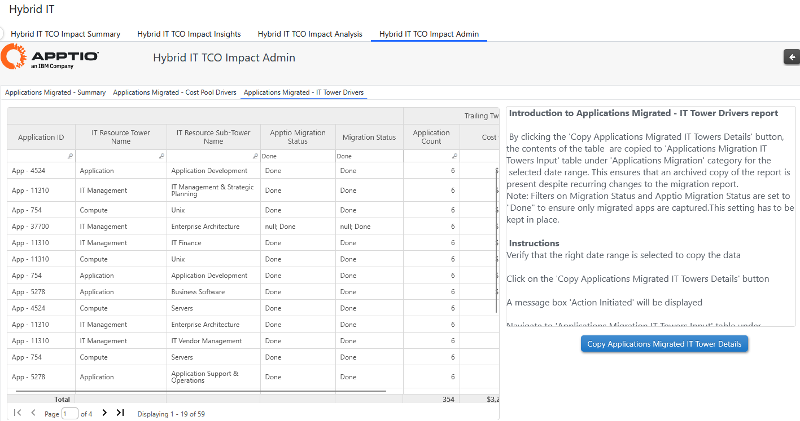
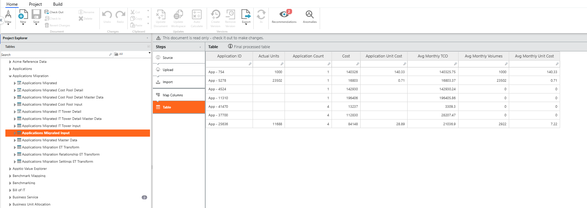
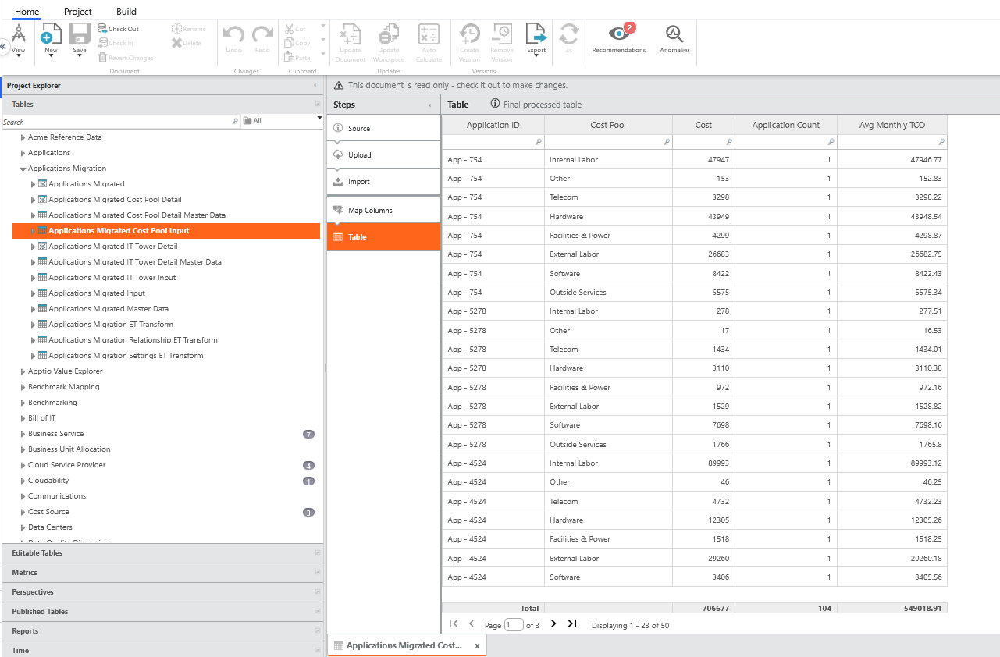
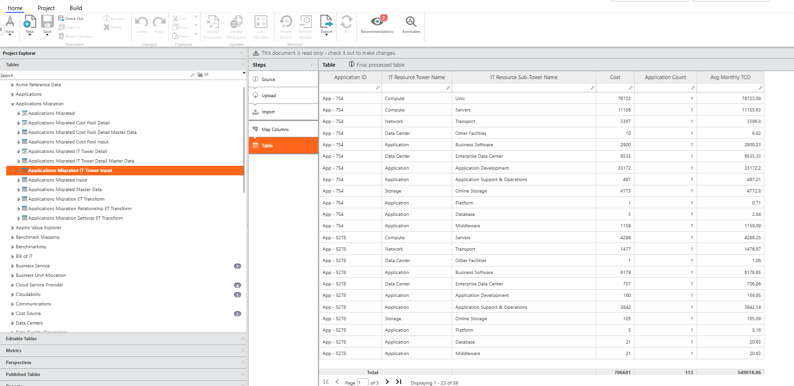

# Impacto do TCO da TI híbrida - Admin

Essa é uma substituição do conector mensal Apptio Datalink usado para "congelar" todos os aplicativos migrados com seu TCO, volume e custo unitário. As instruções estão disponíveis no relatório do administrador.

O relatório Hybrid IT TCO Impact Admin foi criado com as guias abaixo e adicionado à Coleção de relatórios de TI híbrida:

- Aplicativos migrados - Resumo

  
- Aplicativos migrados - fatores determinantes do pool de custos

  
- Aplicativos migrados - Drivers de torre de TI

  

Depois que o botão copiar tabela é clicado, a tabela de entrada abaixo é exibida e os valores são copiados do relatório para as respectivas tabelas. Os valores são os mesmos na tabela e no relatório após a cópia bem-sucedida

- Entrada de resumo de aplicativos migrados

  
- Aplicativos migrados Entrada do pool de custos

  
- Aplicativos migrados Entrada da torre de TI

  
