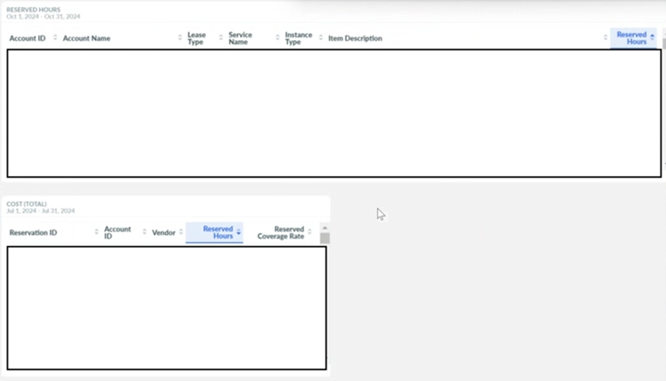
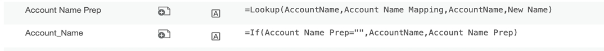
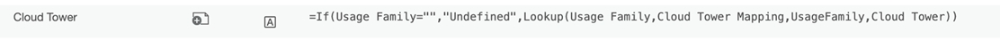
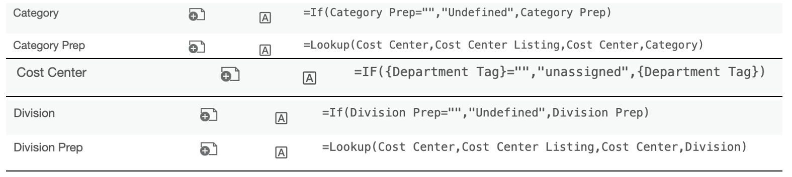
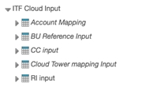
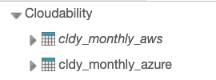
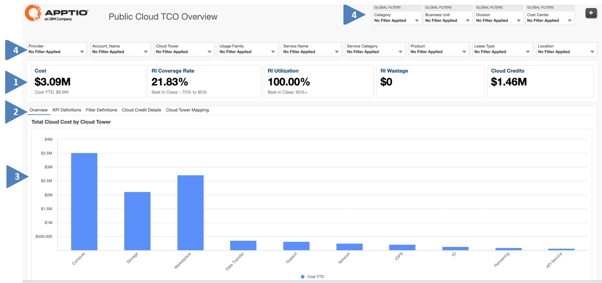
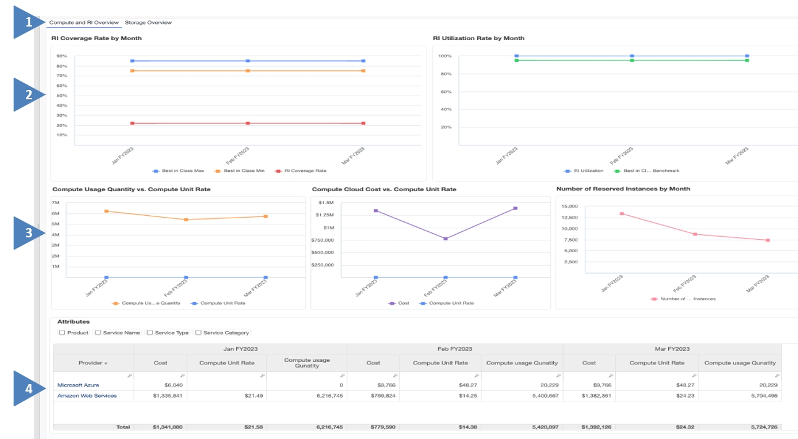
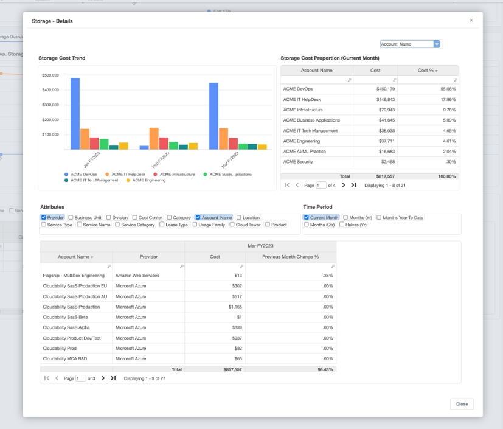

# Configuração de TCO da nuvem pública

## Visão geral

O IBM Apptio Public Cloud TCO Reports oferece aos membros da equipe de finanças, usuários típicos do produto IBM Apptio, insights valiosos sobre seus gastos mensais com a nuvem. Esses relatórios fornecem uma perspectiva financeira sobre quais serviços de nuvem pública estão impactando os custos, identificando os principais geradores de custos e seus efeitos. Ele também ajuda as equipes de finanças a entender as tendências, o desempenho e a necessidade de FinOps práticas para a operação ideal da nuvem para os dois principais provedores de serviços em nuvem a seguir:

**Amazon Web Services (AWS)**

**Microsoft Azure**

Os seguintes problemas específicos podem ser resolvidos por essa solução.

## Etapas de configuração

1. (TBM Studio): Criar um projeto.
2. (TBM Studio):

   **Template\_V120** instale o componente "Public Cloud TCO" no projeto.

   

   **Template\_V200** instalar o componente "Cost- Public Cloud TCO" e "Cost- Public Cloud TCO Reporting" no projeto.

   

   **Arquitetura**

   

   Observação: Os dados de "cldy\_monthly\_aws" e "cldy\_monthly\_azure" podem ser obtidos no conector Cloudability CDI Datalink. Os dados das horas reservadas podem ser obtidos nos relatórios do Cloudabitlity RI por meio dos serviços REST do conector Datalink.

   *Snapshot de referência para os relatórios de RI do site Cloudability*

   
3. (TBM Studio):

   **Template v120 & Template v200** : Crie 5 tabelas de entrada (consulte a captura de tela de exemplo) para garantir que os detalhes relevantes sejam carregados e mapeie esses conjuntos de dados para as tabelas de dados de entrada fornecidas abaixo

   **Mapeamento do nome da conta** : Refere-se à lista de nomes de contas recuperados dos conjuntos de dados cldy\_monthly\_aws e cldy\_monthly\_azure.

   Novo nome: Isso mapeia ou agrupa os valores de AccountName ao plano de contas correspondente.

   Se uma conta não puder ser mapeada para um novo nome, o modelo foi projetado para usar o padrão existente AccountName. 

   **Referência da unidade de negócios**

   Ele é usado para normalizar vários nomes de regiões em nomes padronizados.

   

   **Mapeamento de torres de nuvem**

   Ele é usado para mapear diferentes famílias de uso para seus respectivos nomes de torres de nuvem.

   

   **Listagem de centros de custo**

   É usado para mapear o centro de custo e a categoria para a tabela mestre; se não forem mapeados, serão marcados como "Não atribuído" 

   **Horas reservadas**

   Ele é usado no cálculo de diferentes métricas para instâncias reservadas descritas abaixo.

   

   Amostra para referência:

   O nome das tabelas pode ser específico do cliente

   

   Exemplo de mapeamento de referência: No exemplo acima, o mapeamento é feito da seguinte forma:
   - Mapeamento de contas -> Mapeamento de nomes de contas
   - BU Reference Input -> Referência da unidade de negócios
   - Entrada do mapeamento da torre de nuvem -> Mapeamento da torre de nuvem
   - CC Input -> Listagem de centros de custo
   - Entrada RI -> Horas reservadas
4. (TBM Studio): Salvar e registrar as alterações.

   \*\* **Etapa adicional para o modelo v120 (TBM Studio )** : Mapeie as tabelas abaixo para 'Dados Mestres de Finanças de TI na Nuvem'.

   

   Dica: Defina a coluna Fonte de dados = Nome do CSP de entrada

   Ex: mapear a fonte de dados = "cldy\_monthly\_aws" ao mapear cldy\_monthly\_aws para os dados mestre da nuvem de finanças de TI 

   Observação: Em Template\_v200, essas tabelas já estão mapeadas para o "IT Finance Master Data".
5. (TBM Studio):

**Modelo v120 & Modelo v200** : Abra o "IT Finance Cloud" e verifique as alocações de custo.

**Custo**

\*\*Esta captura de tela é para fins de referência e as alocações de custos podem variar de acordo com os dados

**Créditos na nuvem**

\*\*Esta captura de tela é para fins de referência e as alocações de custos podem variar de acordo com os dados

## Estrutura de relatórios

| Descrição do elemento-chave |
| --- |
| 1. Resumo financeiro e operacional do Cloud for Cost YTD, incluindo quaisquer créditos aplicáveis |
| 2. Os metadados adicionais o tornam autointuitivo, alinham a taxonomia e facilitam a compreensão. |
| 3. A tendência de custo em diferentes serviços de nuvem ( AWS e Microsoft Azure ). |
| 4. As tendências de custo por atributos de negócios, como provedor, centro de custos, nome da conta etc. |

| Descrição |
| --- |
| 1. O relatório aprimora os serviços que impulsionam a direção dos custos. |
| 2. A eficácia do modelo de compra na nuvem e como ele se compara aos benchmarks Best-in-Class. |
| 3. A tendência da taxa unitária em relação às mudanças no consumo. |
| 4. Detalhamento dos custos, consumo e taxas unitárias dos provedores de serviços |

## Relatórios drill down

Aprofunde-se mais para entender os motivadores comerciais e técnicos de cada um dos relatórios.

- Os fatores que determinam o custo do serviço, incluindo a conta responsável e o valor correspondente.
- O serviço/aplicativo comercial que impulsionou a mudança.

**Custo da nuvem - detalhes**

**Horas da CPU - Detalhes**

**Armazenamento - Detalhes**

