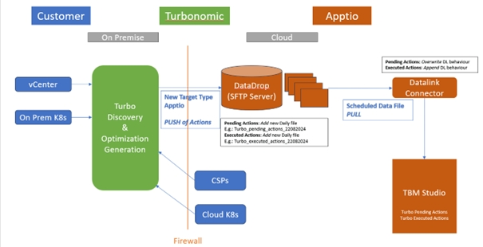
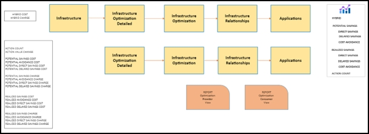

# Conectividade e arquitetura de dados

O diagrama a seguir ilustra o fluxo de dados de IBM Turbonomic para IBM Apptio 's Datalink. As etapas estão descritas abaixo:

1. **IBM Configuração do Turbonomic e descoberta de dados** : IBM O Turbonomic realiza sua configuração normal e descobre dados para cada alvo adicionado. Uma lista completa dos alvos suportados está disponível [aqui](https://www.ibm.com/docs/en/tarm/8.13.0?topic=documentation-target-configuration "(Abre em uma nova guia ou janela)"). O Turbonomic descobre recursos, monitora a utilização e recomenda ações. O diagrama mostra alguns exemplos de alvos em azul.
2. **IBM Apptio Configuração do tipo de destino** : Configure o tipo de destino IBM Apptio em IBM Turbonomic de acordo com os pré-requisitos. Essa configuração envia os dados de IBM Turbonomic para IBM Apptio 's Datadrop. Verifique se o Datadrop do IBM Apptio foi configurado corretamente. As instruções para configurar o Datadrop/SFTP Server no site Apptio podem ser encontradas na [ Apptio Help Center](#).
3. **Carregamento e atualização de arquivos** : os arquivos no formato JSON são carregados diariamente no servidor Datadrop/SFTP baseado em nuvem do Apptio. A carga útil consiste em quatro conjuntos de dados: Ações pendentes e executadas para os ambientes On-Prem e Cloud. A cada dia, quatro novos arquivos aparecerão no repositório do visualizador do Datadrop. Para obter detalhes sobre o conteúdo do arquivo, consulte a seção Carga de dados.
4. **Datalink Configuração de conectores** : Crie conectores Datalink para extrair dados do repositório do Datadrop para o site TBM Studio:
   - Para ações pendentes, defina o comportamento de upload como "OVERWRITE" Cada arquivo diário do IBM Turbonomic mostra as ações pendentes mais recentes, portanto, ele deve substituir o arquivo anterior em TBM Studio.
   - Para ações executadas, defina o comportamento de upload como "APPEND" O arquivo contém as ações executadas nas últimas 24 horas, portanto, anexe os dados para criar uma exibição de mês até a data.
   - O TBMA pode programar execuções do conector (diárias, semanais ou mensais). Para automatizar o processo, atribua os nomes de destino da tabela diretamente aos conjuntos de dados criados pelo IBM Apptio Framework.
5. **Integração de dados em TBM Studio**  : Depois de executar os conectores, a carga útil será armazenada nas seguintes tabelas de TBM Studio :
   - Ações pendentes do Turbo Cloud
   - Ações pendentes do Turbo On-Prem
   - Ações executadas no Turbo Cloud
   - Turbo On-Prem Ações executadas

## IBM Apptio Estrutura

O diagrama da estrutura fornece uma visão geral da arquitetura de otimização da TI híbrida com a tecnologia IBM Turbonomic's Pending and Executed Actions. Ele apresenta novas tabelas e conjuntos de dados mestre de uma perspectiva do IBM Turbonomic (instalado por meio do componente IBM Turbonomic - Actions) e de uma perspectiva mais ampla do Hybrid IT Optimization (instalado por meio do componente Hybrid IT Optimization).

Essa arquitetura relaciona novos pontos de dados aos dados existentes no modelo IBM Apptio. Há 12 etapas de configuração, com bolhas vermelhas indicando as configurações exigidas pelo usuário e bolhas laranja para as etapas automatizadas/pré-configuradas. Essas etapas estão detalhadas na seção Configuração.

## IBM Apptio Alocações de modelos

A estrutura IBM Apptio oferece uma visão geral das novas tabelas e conjuntos de dados, enquanto o diagrama acima se concentra nas novas métricas e alocações do modelo:

**Custo híbrido/carga híbrida**

Essas são métricas novas e paralelas que aproveitam os modelos de custo/tarifa existentes, concentrando-se exclusivamente no custo total da camada de infraestrutura. As métricas existentes não são reutilizadas para evitar alocações duplas e conflitos.

Os usuários precisam criar drivers para esses modelos. Depois que as alocações para o novo objeto do modelo de infraestrutura forem configuradas, o modelo restante seguirá o fluxo descrito.

**Contagem de ações**

Novas métricas independentes para relatórios acumulados no mês (MTD) e no ano (YTD) sobre contagens de ações pendentes e executadas.

**Economia potencial/Poupança Realizada**

Essas são as principais métricas da estrutura de otimização da TI híbrida.

- As economias potenciais são baseadas em ações pendentes.
- As economias realizadas são baseadas em ações executadas. Ambas as métricas são divididas em duas dimensões, Custo e Cobrança
  - **Custo** : Para a nuvem, a economia em dólares é obtida diretamente do site IBM Turbonomic. Para o On-Prem, a economia é calculada usando a alteração do valor da ação (por exemplo, 12 vCPU reduzido para 2 vCPU,, gerando uma economia de 10 vCPU ) e o custo unitário dos serviços técnicos. Os ajustes são feitos com base na % endereçável definida pelo usuário.
  - **Cobrança** : segue uma abordagem semelhante, usando o preço dos serviços técnicos e ajustando com base na % endereçável definida pelo usuário. Essas economias são direcionadas para o serviço voltado para o negócio ou para o consumidor do aplicativo.

**Nível de endereçamento**

Os usuários devem definir e editar a % endereçável tanto para o custo unitário quanto para o preço. A definição dessa porcentagem afeta os cálculos de economia de custo e de cobrança. O detalhamento da poupança é dividido em:

- Poupança direta
- Poupança atrasada
- Prevenção de custos

Os usuários têm total autonomia para definir a alocação da % endereçável entre essas categorias. Isso pode ser definido por meio da guia Workbench no relatório Infrastructure Optimization - Provider View.

Espera-se que as colunas em cinza claro sejam anexadas à tabela editável, provenientes do catálogo de serviços existente, enquanto as colunas em branco devem ser definidas pelo usuário.

