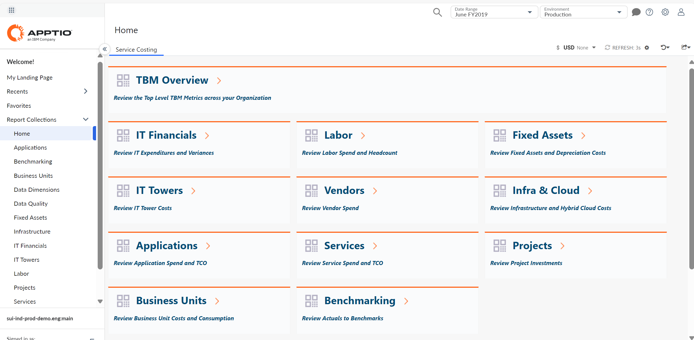
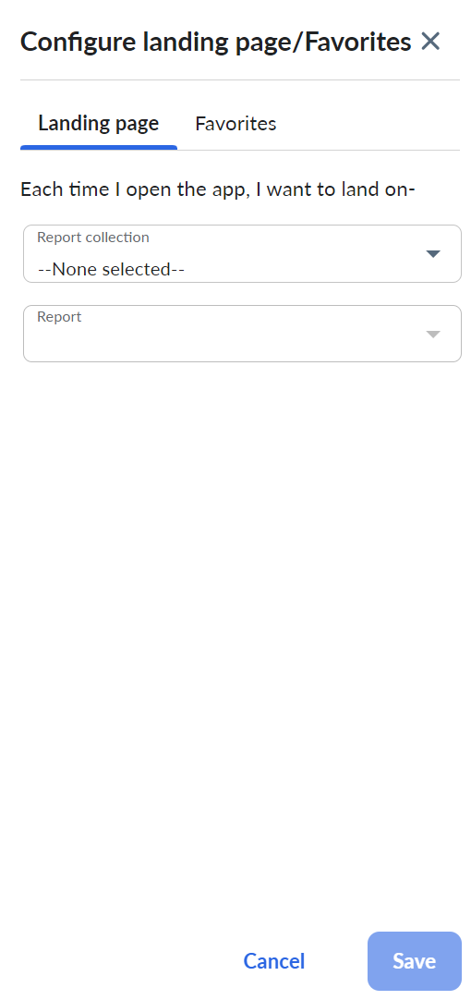
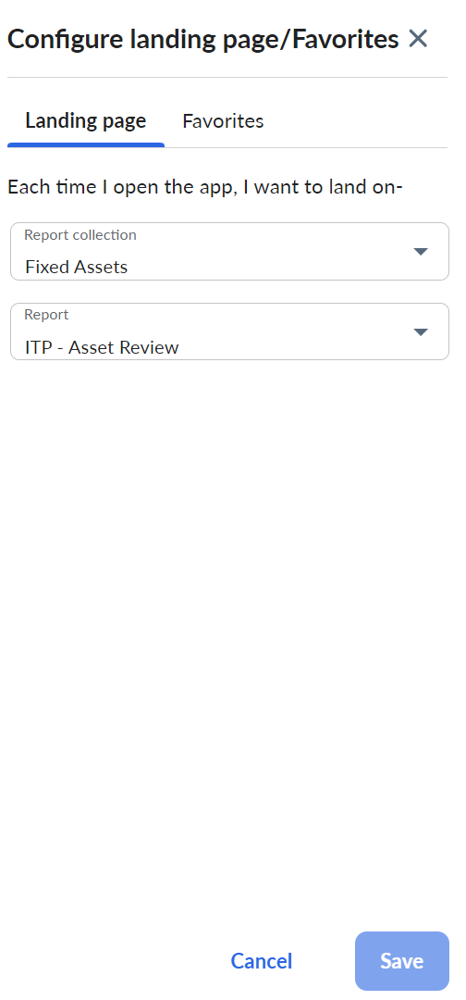
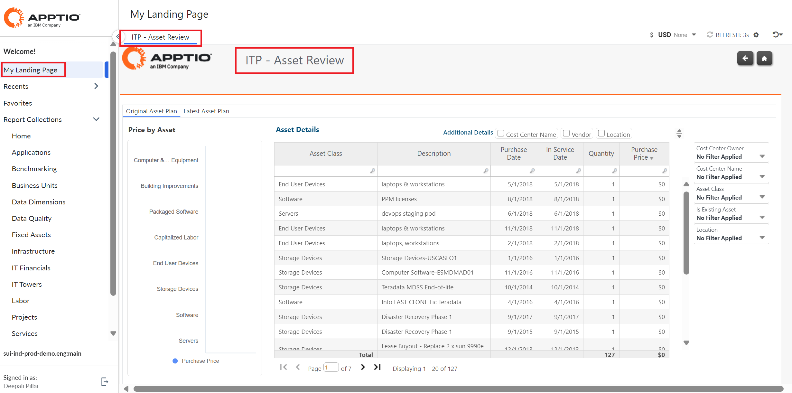

# Minha página de destino

Esse recurso permite que você selecione uma página ou relatório específico para ser sua página de destino padrão. A opção Home é ativada por padrão e sempre mostrará o relatório Service Costing.

## Adição da página de destino

Para configurar sua página de destino preferida, navegue até Settings (Configurações ) e selecione a opção Configure landing page/Favorites (Configurar página de destino/Favoritos ).

Selecione os valores apropriados na coleção de relatórios e no menu suspenso Relatório.

Observação: os valores no painel Configure Landing Page/Favorites serão classificados em ordem alfabética. Você pode redefinir a página de destino selecionando o valor "nenhum selecionado". Se a opção Configure Favorites (Configurar favoritos ) não estiver selecionada nos recursos do projeto, a guia Favorites (Favoritos) será desativada no pop-up Configure landing page/Favorites (Configurar página de destino/Favoritos ).

Os valores no painel Configure Landing Page/Favorites serão classificados em ordem alfabética. Você pode redefinir a página de destino selecionando o valor "nenhum selecionado". Se a opção Configure Favorites (Configurar favoritos ) não estiver selecionada nos recursos do projeto, a guia Favorites (Favoritos) será desativada no pop-up Configure landing page/Favorites (Configurar página de destino/Favoritos ).

Selecione Salvar. Uma mensagem de confirmação "*Página inicial configurada com sucesso!* " aparece. Se você atualizar My Landing Page ou abrir o aplicativo na próxima vez, ele mostrará a página selecionada como página de destino padrão.

- Qualquer relatório OOTB ou de nível superior personalizado pode ser selecionado como página de destino.
- Se um administrador remover ou revogar um relatório para um usuário e se ele tiver sido armazenado nos dados do serviço Preference, ele será automaticamente removido da My Landing Page depois de ser carregado pela primeira vez na visualização CT.
- Se um administrador se passar por um usuário, o usuário poderá ver as alterações feitas na página de destino pelo administrador.
- Relatórios drill-to ou outros relatórios ocultos (via Coleção de relatórios) não podem ser selecionados como a página de destino padrão.

Observação: não é possível criar nenhuma página de destino personalizada. A página de destino selecionada é salva em todas as sessões, navegadores e dispositivos, mas não no cache do navegador.

**Tópico principal:** [Cálculo de custos e faturamento](../costing-billing/home.html)
