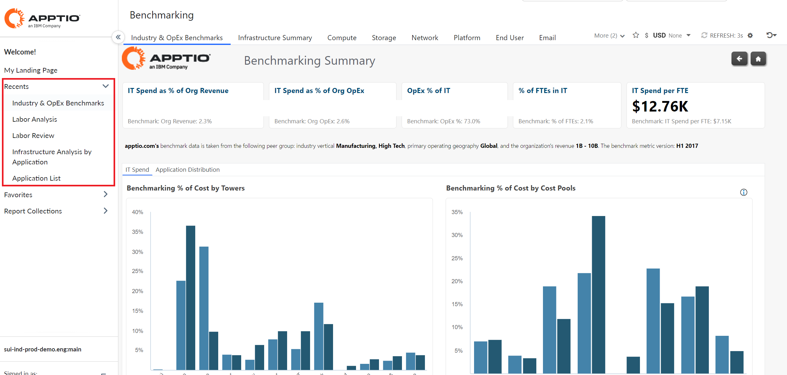

# Recentes

Esse recurso permite que você veja os relatórios que usou mais recentemente. A opção Recents é ativada por padrão e aparecerá no menu de navegação esquerdo. Ele exibirá a lista de relatórios acessados recentemente.

A opção Recentes mostrará um máximo de cinco relatórios, com o relatório acessado mais recentemente na parte superior.

Observação: Se um administrador remover ou revogar um relatório para um usuário e se ele tiver sido armazenado nos dados do serviço Preference (Preferência), ele será automaticamente removido de Recents (Recentes) depois de ser carregado pela primeira vez na exibição CT.

**Tópico principal:** [Cálculo de custos e faturamento](../costing-billing/home.html)
