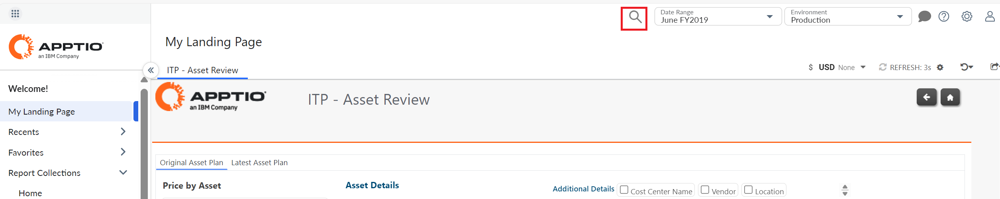
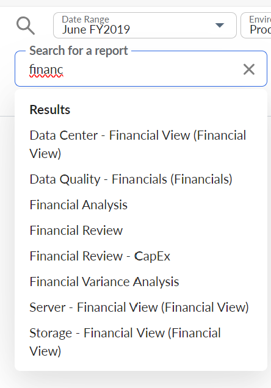
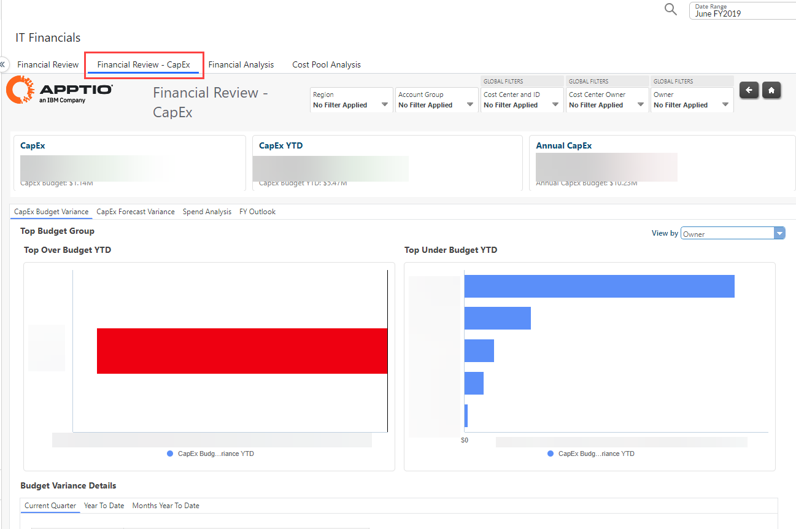
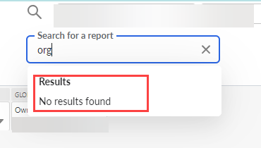

# Pesquisar

Esse recurso permite pesquisar um relatório, para que você possa acessá-lo facilmente, em vez de pesquisar e visualizar. O ícone Pesquisar é ativado por padrão e aparece na barra de navegação superior da interface do usuário.

Aplica-se a : Costing Standard, Faturamento, Hybrid Business Management, Vendor Insights, Costing Essentials e Demanda.

Observação: O ícone de pesquisa é visível para um usuário final e não para um administrador.

Selecione o ícone Pesquisar e digite o nome completo/parcial do relatório na caixa de texto de pesquisa. Os resultados da pesquisa são exibidos somente quando são inseridos 3 ou mais caracteres. A lista de relatórios que atendem aos critérios de pesquisa será exibida à medida que você digitar. O resultado da pesquisa mostrará o Report Name (Alias) se o alias estiver presente, caso contrário, apenas o Report Name.

Selecione o nome do relatório que você deseja visualizar.

A função de pesquisa é aplicável somente a relatórios de nível superior. Os relatórios de pesquisa não serão exibidos nos resultados da pesquisa.

Se um administrador se passar por um usuário, o usuário poderá ver os relatórios pesquisados pelo administrador.

Se não houver nenhum relatório correspondente, será exibida a mensagem "Nenhum resultado encontrado".

Se a opção "Configurar Recentes" estiver ativada, o relatório pesquisado aparecerá automaticamente na seção [Recentes](modernization-recent.html "Esse recurso permite que você veja os relatórios que usou mais recentemente. A opção Recents é ativada por padrão e aparecerá no menu de navegação esquerdo. Ele exibirá a lista de relatórios acessados recentemente."), na parte superior.

**Tópico principal:** [Cálculo de custos e faturamento](../costing-billing/home.html)
