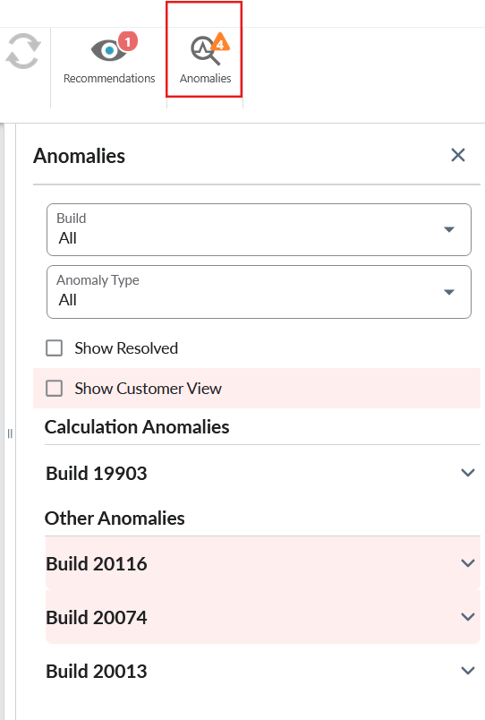
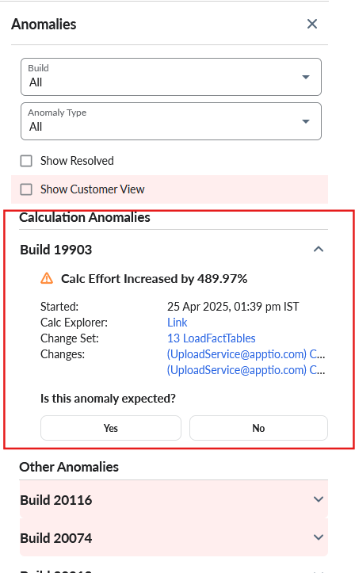
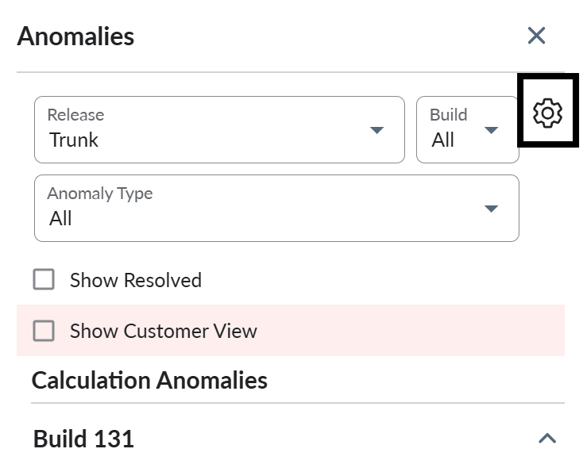
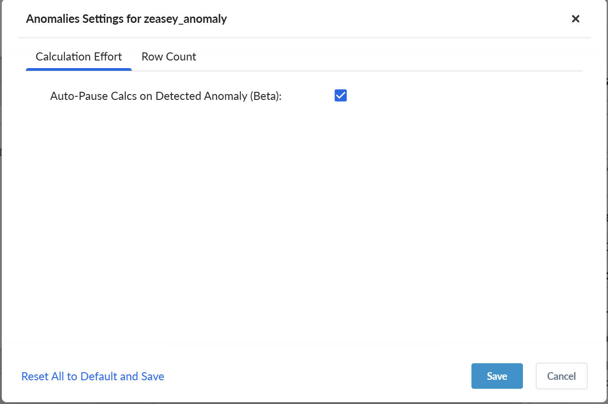
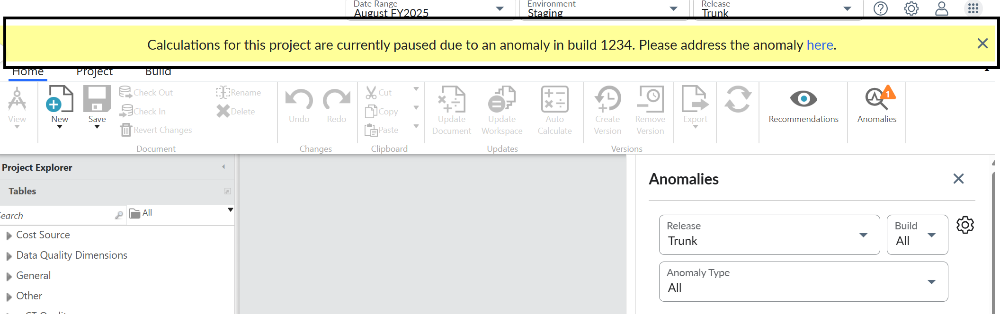
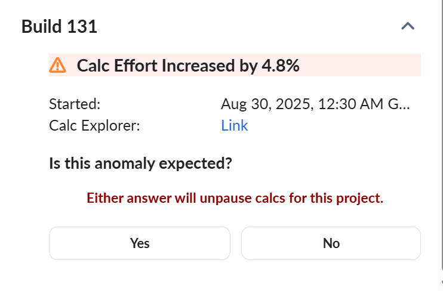

# Criar detecção de anomalias

O recurso de detecção de anomalias foi projetado para ajudá-lo a identificar alterações incomuns no esforço de cálculo, o que pode ajudá-lo a otimizar seus relatórios e transformações. Esse recurso é baseado nos dados coletados pelo Calc Explorer, que fornece informações detalhadas sobre o esforço de cálculo para cada compilação.

O recurso de detecção de anomalias usa os dados do Calc Explorer para identificar alterações incomuns no esforço de cálculo. Ele compara o esforço de cálculo de cada compilação com as compilações anteriores e identifica quaisquer alterações significativas. Se uma alteração significativa for detectada, o recurso o alertará e fornecerá informações detalhadas sobre a alteração.

## Benefícios da detecção de anomalias

O recurso de detecção de anomalias pode ajudá-lo:

- Identificar e otimizar relatórios e transformações ineficientes
- Reduzir o esforço de cálculo e melhorar o desempenho
- Melhorar a qualidade e a confiabilidade gerais de seus relatórios e transformações

## Como usar a detecção de anomalias

Para ativar o recurso de detecção de anomalias, faça o seguinte:

1. Navegue até **Project** > **Enable Features** e marque a caixa de seleção **Show Anomalies Panel**.
2. Navegue até **TBM Studio** > **Projeto** > guia **Anomalias**.

   
3. Expanda o tipo de anomalia e investigue as anomalias detectadas.

   

   Tabela 1.

   | Campo | Descrição |
   | --- | --- |
   | Início | Mostra o registro de data e hora em que o cálculo foi iniciado |
   | Explorador de cálculos | Links para o cálculo que apresentou a anomalia |
   | Conjunto de modificações | Links para a lista de transformações e entidades alteradas com a compilação |
   | Alterações | Links para as mensagens de alteração associadas à compilação |
4. Tome as medidas adequadas para otimizar os relatórios e transformações, conforme necessário.

## Como fazer a pausa automática do cálculo (Beta)

O recurso Auto-Pause Calcs foi introduzido para pausar os cálculos quando uma anomalia é detectada. Para ativar esse recurso,

1. Na guia **Anomalies (Anomalias** ), selecione o ícone **Settings (Configurações** ).

   
2. Na guia **Esforço de cálculo**, ative a opção **Auto-Pause Calcs on Detected Anomaly (Beta)**

   
3. Clique em **Salvar**

Quando o recurso estiver ativado e se uma anomalia for detectada, um banner será exibido para confirmar que o cálculo foi pausado.

Quando você resolver a anomalia, selecione **Yes (Sim** ) ou **No (Não)** para cancelar a pausa dos cálculos.

## Tipos de anomalias

Há dois tipos de anomalias que o recurso pode detectar:

- **Anomalia de cálculo** : esse tipo de anomalia é um aumento no esforço de cálculo em relação ao que era esperado para um cálculo.
- **Anomalia baseada em entidade** : esse tipo de anomalia ocorre quando há um padrão incomum na forma dos dados (por exemplo, um número incomum de linhas).
- **Combinadas** : Esse tipo de anomalia ocorre quando há uma combinação de anomalias baseadas em cálculos e entidades.

**Anomalias de cálculo**

Uma anomalia de cálculo ocorre quando o tempo de cálculo de uma compilação é significativamente maior do que o normal. Isso pode ser causado por vários fatores, como:

- Fazer upload de uma grande quantidade de dados, modificar fórmulas ou alterar configurações de relatórios.
- Alterações que aumentam o esforço de cálculo, como a adição de novos relatórios ou transformações.

**Investigando anomalias de cálculo**

Para investigar uma anomalia de cálculo, você pode:

- **Visualizar o conjunto de alterações** : Veja as alterações específicas feitas na compilação, como arquivos carregados ou fórmulas modificadas.
- **Explore o Calc Explorer** : Analise o esforço de cálculo para a construção e identifique as áreas em que o tempo de cálculo é maior do que o normal.

O sistema eventualmente fornecerá recursos de explicação para ajudá-lo a entender a causa da anomalia de cálculo. Isso incluirá informações como:

- **Arquivos ou alterações específicos** : Quais arquivos ou alterações causaram o aumento do tempo de cálculo.
- **Tabela de proporções de atribuições** : Como as alterações na tabela de taxas de atribuição afetaram o tempo de cálculo.

## Resolução de problemas

Se você encontrar algum problema com o recurso de detecção de anomalias, faça o seguinte:

- Verifique os dados do Calc Explorer para garantir que sejam precisos e atualizados.
- Investigue todas as anomalias detectadas e tome medidas para otimizar os relatórios e as transformações, conforme necessário.

## Perguntas mais frequentes

- P: Qual é a finalidade do recurso de detecção de anomalias? R: O recurso de detecção de anomalias foi projetado para ajudá-lo a identificar alterações incomuns no esforço de cálculo, o que pode ajudá-lo a otimizar seus relatórios e transformações.
- P: Como funciona o recurso de detecção de anomalias? R: O recurso de detecção de anomalias usa os dados do Calc Explorer para identificar alterações incomuns no esforço de cálculo. Ele compara o esforço de cálculo de cada compilação com as compilações anteriores e identifica quaisquer alterações significativas.
- P: Que tipos de anomalias o recurso pode detectar? R: O recurso detecta alterações no esforço de cálculo devido a alterações de material, aumento do esforço de cálculo ou anomalias na forma dos dados, como outliers, distorção ou mudanças na distribuição.
