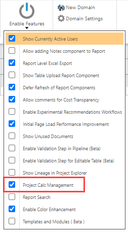
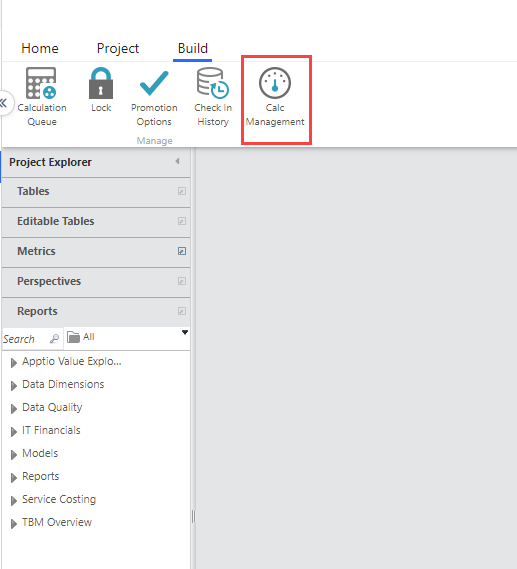
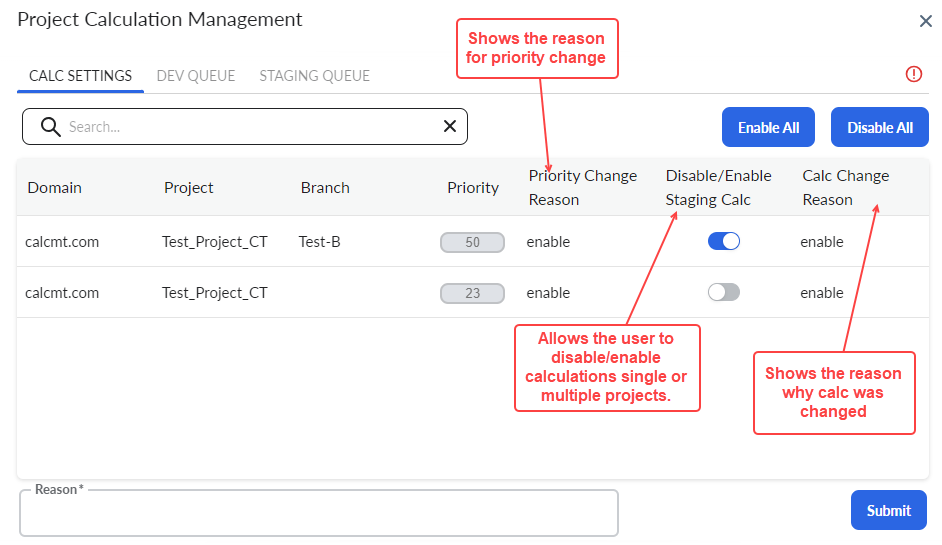

# Configurações de gerenciamento do Calc

Aplica-se a: 12.11.0 e posterior. Os clientes agora podem desativar/ativar os cálculos de preparação em um nível de projeto, para que possam controlar quais projetos são calculados e, por sua vez, reduzir o número total de cálculos.

O Calc Management não está ativo por padrão. Para ativá-lo, navegue até **Projeto** > **Ativar recursos** e, em seguida, selecione **Gerenciamento do Project Calc**.

## Navegação

Navegue até a guia **Build** na faixa de opções TBM Studio e selecione **Calc Management**

O pop-up Gerenciamento de cálculo de projeto aparece com três guias - Configurações de cálculo, Fila de desenvolvimento e Fila de preparação

## Configurações de cálculo

Essa guia mostra a lista de projetos com a respectiva prioridade, juntamente com o estado do ambiente de preparação (ativado/desativado). Você pode atualizar a prioridade arrastando a linha ou inserindo o valor desejado na caixa de entrada de prioridade. Além disso, você pode atualizar o estado de qualquer projeto nessa guia por meio do botão de alternância. Se quiser ativar/desativar todos os projetos de uma só vez, você pode usar o botão **Enable All/Disable All** na parte superior da tabela. \*\*

Depois disso, insira um **Motivo** para documentar a finalidade da alteração e clique no botão Enviar.

## Fila de desenvolvimento e fila de preparação

Não há nenhuma alteração na funcionalidade da **Dev Queue** e da **Staging Queue**. Para saber mais, consulte [Calc Prioritization](default-calc-prioritization.htm "(Abre em uma nova guia ou janela)").

## Cenário de vários locatários

Há dois cenários em um sistema multilocatário:

- **Com acesso limitado** : Se um usuário tiver acesso a todos ou a poucos locatários, ele poderá atualizar o estado dos projetos aos quais tem acesso, mas não poderá atualizar a prioridade de nenhum projeto. O Stage Queue e o Dev Queue seriam desativados para um usuário com acesso limitado.
- **Com acesso total** : Se um usuário tiver acesso a todos os locatários, ele poderá atualizar o estado ou a prioridade de qualquer projeto listado na guia.
