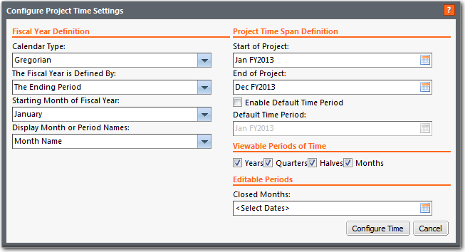
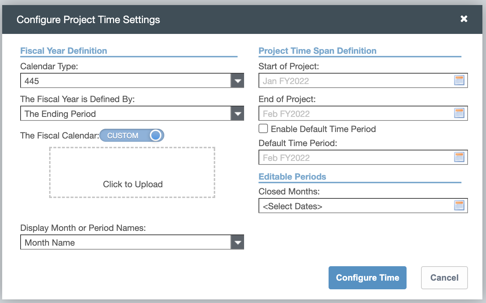
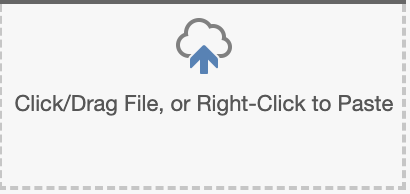
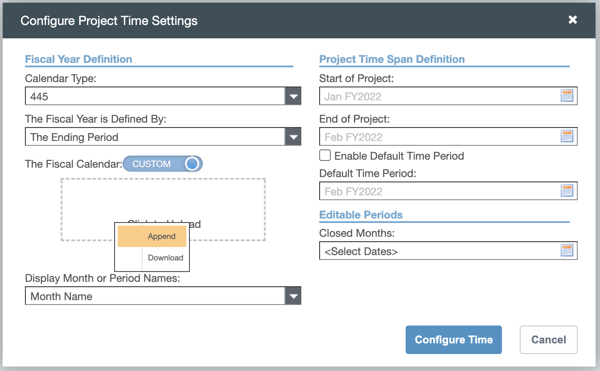
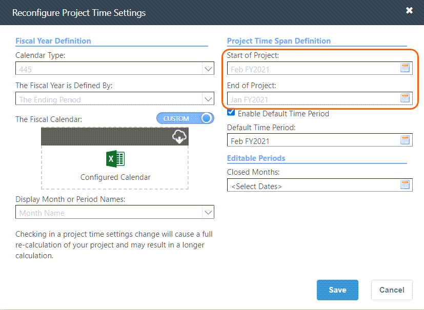
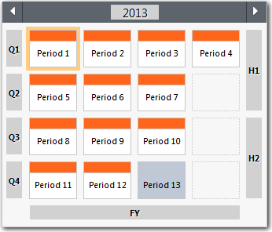
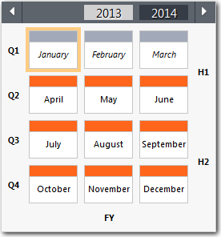

# Configurar as definições de tempo do projeto

**Aplica-se a** : TBM Studio 12.0 e posterior. As opções exibidas na caixa de diálogo **Configure Project Time Settings** dependem do tipo de calendário selecionado.

Ao definir as configurações de tempo do projeto, considere as seguintes diretrizes:

- Quando você salva as configurações, não é possível voltar e alterar a definição do exercício.
- Se quiser incluir dados históricos em seu projeto, escolha uma data de início do projeto que abranja as datas dos dados.

## Tipos de calendário compatíveis

O aplicativo é compatível com os seguintes tipos de calendário:

- Gregoriano
- 445, 454 e 544
- 13 período (444)

O tipo de calendário selecionado determina os campos exibidos na seção **Definição do ano fiscal** da caixa de diálogo **Configurar definições de tempo do projeto** mostrada na imagem a seguir. Não é possível alterar o tipo de calendário depois que ele foi definido.

Observação: O mesmo tipo de calendário deve ser usado em todos os projetos.

Os campos de cada tipo de calendário estão descritos nas informações abaixo. Os campos da seção **Definição do ano fiscal** são descritos primeiro, seguidos pelas descrições das seções **Definição do intervalo de tempo do projeto**, **Períodos de tempo visualizáveis** e **Períodos editáveis**. As últimas seções são semelhantes para todos os tipos de calendários.

## Definição de ano fiscal - calendário gregoriano

Os campos do calendário gregoriano estão descritos abaixo.

- **Calendar Type (Tipo de calendário** ) - Selecione o tipo de calendário gregoriano.
- **O ano fiscal é definido por** - Selecione **o período inicial** ou **o período final**. Se você selecionar **Período inicial**, o ano fiscal será baseado no primeiro período do calendário. Se você selecionar **Período final**, o ano fiscal será baseado no último período do calendário.
  - Por exemplo, suponha que você tenha um ano fiscal que vai de junho de 2016 a maio de 2017. Se você selecionar **Período inicial**, o ano fiscal será 2016. Se você selecionar **Período final**, o ano fiscal será 2017.
- **Mês inicial do ano fiscal** - Selecione um mês/período que será o início do ano fiscal.

  Observação: Depois de salvar essa configuração, você não poderá alterá-la.
- **Exibir nomes de mês ou período** - Escolha se as datas exibirão o nome do mês (por exemplo, g.: Jan 2016, Feb 2016) ou do período (por exemplo, g.: P1 2016, P3 2016). Essa configuração se aplica a muitas áreas do produto, incluindo o seletor de datas.
  - Se o seu ano fiscal começar em um mês diferente de janeiro, talvez você queira exibir períodos em vez de meses para eliminar a confusão sobre a qual ano fiscal um mês pertence to.For exemplo, suponha que seu ano fiscal comece em 1º de abril e que o ano fiscal seja definido pela data de início. A data 15 de abril de 2016 pertenceria ao ano fiscal de 2016 e seria exibida como Período 1. A data 15 de março de 2016 pertenceria ao ano fiscal de 2015 e seria exibida como Período 12.

## Definição de exercício fiscal - 445, 454 e 544

Os campos para os calendários 445, 454 e 544 estão descritos abaixo.

- **Calendar Type** (Tipo de calendário) - Selecione um tipo de calendário 445, 454 ou 544. Os números representam o número de semanas em cada um dos quatro trimestres do ano fiscal. Por exemplo, 445 representa 4 semanas, 4 semanas, 5 semanas.
- **O ano fiscal é definido por** - Selecione **o período inicial** ou **o período final**. Se você selecionar **Período inicial**, o ano fiscal será baseado no primeiro período do calendário. Se você selecionar **Período final**, o ano fiscal será baseado no último período do calendário.
- Por exemplo, suponha que você tenha um ano fiscal que vai de junho de 2016 a maio de 2017. Se você selecionar **Período inicial**, o ano fiscal será 2016. Se você selecionar **Período final**, o ano fiscal será 2017.
- **O calendário fiscal** - Use os quatro campos dessa seção para definir o dia inicial ou final do calendário fiscal. Selecione valores em cada uma das listas suspensas.
- **Exibir nomes de mês ou período** - Escolha se as datas exibirão o nome do mês (por exemplo, g.: Jan 2016, Feb 2016) ou do período (por exemplo, g.: P1 2016, P2 2016). Essa configuração se aplica a muitas áreas do produto, incluindo o seletor de datas.

## Calendário personalizado 454

**Como configurar o calendário do cliente? (Configuração da primeira vez)**

1. Você pode selecionar o Tipo de calendário como 445 ou variante e alternar o **Calendário fiscal** de Padrão para Personalizado. Um widget de upload é exibido com o texto "Clique para fazer upload".

   
2. O widget Clique para carregar é semelhante ao pipeline de transformação:

   
3. Você pode procurar o arquivo de calendário personalizado clicando na opção Append no menu suspenso. Depois de carregar o nome do arquivo, ele será exibido na caixa de diálogo de configuração de hora.

   
4. Após concluir a seleção de outros campos, você pode selecionar o botão **Configure Time (Configurar hora** ). Depois de carregar o arquivo de calendário, a hora do início e do fim do projeto será atualizada para refletir o arquivo de calendário.

   
5. Na caixa de diálogo de configurações de horário, você pode **Baixar** o calendário personalizado configurado ou **Anexar** outras configurações de calendário.
6. A reconfiguração do calendário pode ser feita por meio da configuração do projeto. Como parte de uma reconfiguração, você pode **anexar** o arquivo de calendário existente que, por sua vez, estenderá as datas do calendário. Quando você fizer o upload novamente do arquivo de calendário, a hora de término do projeto será atualizada de acordo com a nova hora de término do arquivo de calendário.

Observação: a data de **início do projeto** não será alterada durante a reconfiguração. Ele será alterado apenas uma vez quando você estiver configurando o projeto pela primeira vez. Somente o **End of Project** será alterado a cada reenvio do arquivo.

## Como você faz a migração?

As informações do calendário histórico são migradas por meio de uma ação em /data. A migração será feita somente para projetos que tenham o tipo de calendário 445. Para migrar:

- Para migrar para as configurações de calendário personalizado, você deve ter um projeto padrão com o tipo de calendário 445 configurado.
- Entre em contato com a equipe de suporte ao cliente para migrar as informações do calendário padrão e a configuração personalizada.

Observação: Como o início e o fim do projeto são ditados pela tabela de calendário carregada, eles não são mais configuráveis por meio da caixa de diálogo de configurações de hora. Isso significa que, depois de entrar no Custom Calendar 454, você não poderá voltar atrás e alterar as datas. A data de início do projeto é configurada apenas uma vez quando você configura o projeto pela primeira vez. Somente o Fim do projeto é atualizado a cada reenvio do arquivo.

## Tabela de calendário

1. Colunas obrigatórias: FiscalYear, StartsOnInclusive
2. A tabela não tem versão de tempo e é carregada para o período de tempo inicial.
3. A validação da coluna e do formato é feita no upload bem-sucedido do arquivo de calendário.
4. A tabela deve ter o primeiro período do ano n + 1, para calcular o final do ano n.
5. Se você quiser corrigir erros em uma tabela de calendário com check-in, reverta a configuração de check-in.

   Por exemplo, tabela de calendário.

   | Ano fiscal | Começa com a inclusão |
   | --- | --- |
   | 2021 | 04/02/2021 |
   | 2021 | 04/03/2021 |
   | 2021 | 08/04/2021 |
   | 2021 | 06/05/2021 |
   | 2021 | 03/06/2021 |
   | 2021 | 08/07/2021 |
   | 2021 | 05/08/2021 |
   | 2021 | 02/09/2021 |
   | 2021 | 07/10/2021 |
   | 2021 | 04/11/2021 |
   | 2021 | 02/12/2021 |
   | 2021 | 06/01/2022 |
   | 2022 | 03/02/2022 |

**Observações** :

- Só é possível migrar para o Custom Calendar no limite do fim do ano e antes que qualquer dado seja carregado ou que sejam feitas alterações de configuração no ano seguinte.
- Se os dados tiverem sido carregados ou se tiverem sido feitas alterações de configuração, elas precisarão ser revertidas.
- Os clientes que estiverem usando um calendário não gregoriano (por exemplo, 445, 454, 544 ou 13º período) devem começar a planejar a transição antes do final do ano.

## Definição do exercício fiscal - 13 Período (444)

Os campos para calendários de 13 períodos (444) estão descritos abaixo.

- **Calendar Type (Tipo de calendário** ) - Selecione o tipo de calendário de 13 períodos (444). Os números representam o número de semanas em cada um dos períodos do ano fiscal: 4 semanas, 4 semanas, 4 semanas.
- **O ano fiscal é definido por** - Selecione **o período inicial** ou **o período final**. Se você selecionar **Período inicial**, o ano fiscal será baseado no primeiro período do calendário. Se você selecionar **Período final**, o ano fiscal será baseado no último período do calendário.
  - Por exemplo, suponha que você tenha um ano fiscal que vai de junho de 2016 a maio de 2017. Se você selecionar **Período inicial**, o ano fiscal será 2016. Se você selecionar **Período final**, o ano fiscal será 2017.
- **O calendário fiscal** - Use os quatro campos dessa seção para definir o dia inicial ou final do calendário fiscal. Selecione valores em cada uma das listas suspensas.
- **O trimestre com 4 períodos é o quarto** - Em um calendário de 13 períodos, três trimestres têm três períodos cada. O quarto trimestre tem quatro períodos. Selecione o trimestre que terá quatro periods.In o exemplo abaixo, o primeiro trimestre tem quatro períodos:

Observação: O futuro Serviço de Calendário Fiscal (FCS) centralizado usará uma tabela carregada semelhante à configuração do Calendário Personalizado. **TBM Studio** > **As configurações de hora** não serão mais usadas para gerenciar atualizações do calendário fiscal. Em vez disso, a tabela será carregada e gerenciada no FCS e funcionará com outros produtos Apptio à medida que eles se integrarem ao FCS.

## Definição do intervalo de tempo do projeto

Os campos **de Definição do intervalo de tempo do projeto** são descritos a seguir.

- **Início do projeto** - Clique no campo e selecione um mês e um ano para a data de início do projeto. Use as setas nas margens esquerda e direita do seletor de datas para alternar entre os anos.

  Observação: Depois de salvar a data de início de um projeto, você não poderá alterá-la. O campo **Início do projeto** também é usado para selecionar períodos de tempo visualizáveis, consulte [Períodos de tempo visualizáveis](#Configureprojecttimesettings__ViewablePeriodsofTime)
- **Fim do projeto** - Clique no campo e selecione um mês e um ano para a data de término do projeto. Use as setas nas margens esquerda e direita do seletor de datas para alternar entre os anos. Você pode alterar essa data a qualquer momento.
- Ao definir a data final, lembre-se de que o aplicativo executa cálculos até a data final. Quanto mais meses precisarem ser calculados, mais demorados serão os cálculos. Por esse motivo, é melhor definir a data de término do projeto com antecedência suficiente para atender às necessidades de planejamento e previsão, mas não tão longe a ponto de gerar cálculos desnecessários.
- **Ativar período de tempo padrão** - Quando marcada, a opção ativa o campo Período de tempo padrão.
- **Período de tempo padrão** - O período que você selecionar será o período de tempo padrão exibido para todos os usuários quando eles abrirem um projeto. Você pode selecionar um período, trimestre, semestre ou ano inteiro. Os usuários podem alterar o período de tempo usando o seletor de datas. A definição do período de tempo padrão é útil para projetos dependentes de tempo, como orçamento e previsão.
- Se você não definir um período de tempo padrão, quando um usuário abrir um projeto, será exibido o último período de tempo ativo.

## Períodos de tempo visualizáveis

Selecione os períodos que serão exibidos no seletor de datas. Serão meses para calendários gregorianos e períodos para todos os outros tipos de calendário. Você deve selecionar pelo menos uma opção do grupo, mas também pode selecionar qualquer combinação de opções. Por exemplo, você pode selecionar apenas meses, meses e trimestres, ou trimestres e semestres. Você pode alterar essa configuração a qualquer momento.

Para selecionar um mês ou período, use os seguintes campos **de Definição de intervalo de tempo do projeto** :

- **Início do projeto** - Clique no campo e selecione um mês e um ano para o período de tempo que você deseja visualizar. Use as setas nas margens esquerda e direita do seletor de datas para alternar entre os anos.
- **Fim do projeto** - Clique no campo e selecione um mês e um ano para o período de tempo que você deseja visualizar. Use as setas nas margens esquerda e direita do seletor de datas para alternar entre os anos.

Os períodos que você seleciona controlam os períodos incluídos no pré-processamento. Os anos levarão menos tempo para serem processados do que metades ou quartos. Você pode selecionar qualquer combinação dos três. Os cálculos mensais/periódicos são realizados por padrão. Se os usuários visualizarem relatórios apenas para meses ou períodos, não selecione essas opções.

## Períodos editáveis

Pode haver projetos em que você queira encerrar a entrada de dados por determinados períodos. Por exemplo, se estiver fazendo um orçamento, talvez queira encerrar o período de orçamento atual depois que o orçamento tiver sido finalizado. No seletor de datas, os nomes dos períodos fechados são exibidos em itálico e a barra na parte superior do período é cinza. No exemplo abaixo, janeiro, fevereiro e março estão fechados:

Usando o campo **Períodos fechados**, você pode selecionar os períodos a serem fechados. Clique no campo para exibir um seletor de datas em que você pode selecionar meses ou períodos, trimestres, semestres ou anos completos. Essa configuração fecha o período para conjuntos de dados, entrada de dados por meio de tabelas editáveis em relatórios e grades de mapeamento de alocação em modelos. Você pode alterar essa configuração a qualquer momento.
