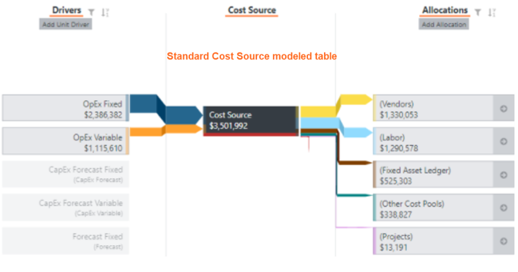
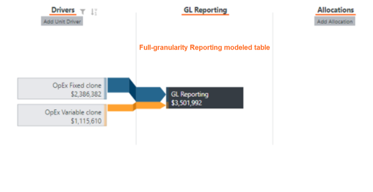
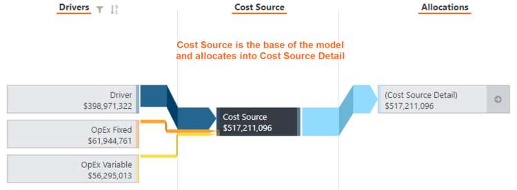
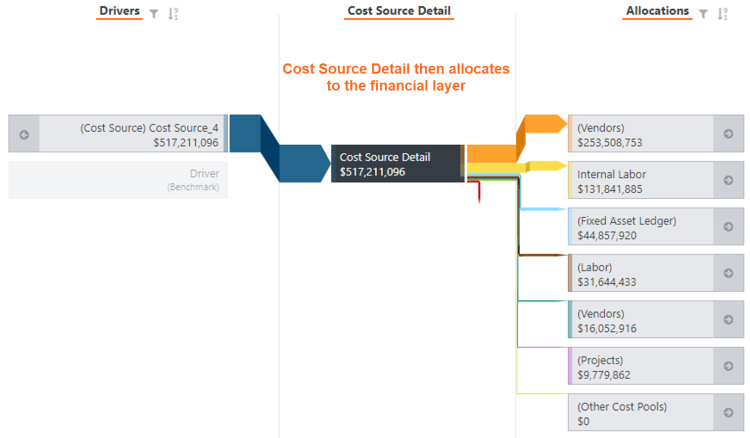
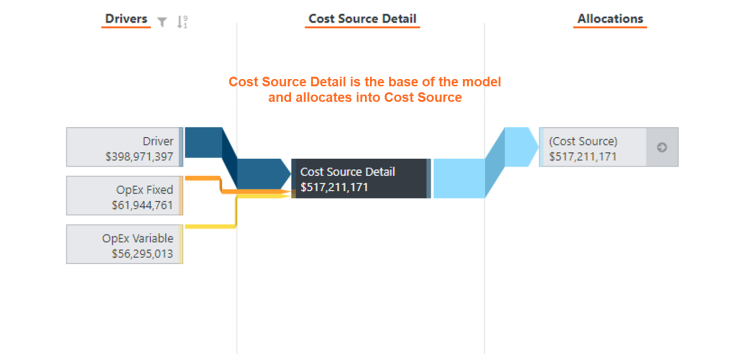
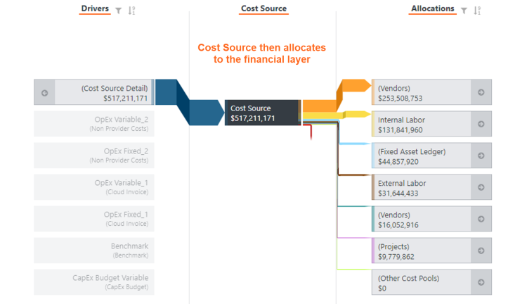
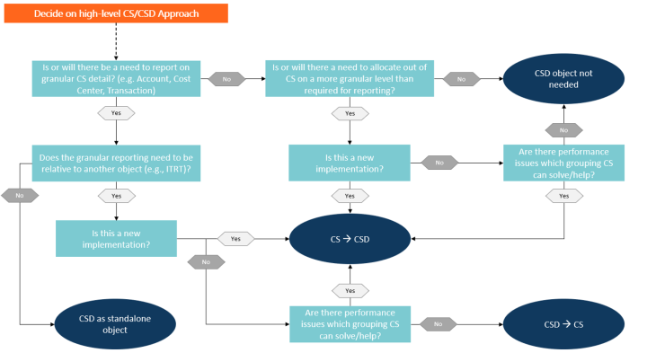

# Implementação do Cost Source Detail com o desempenho em mente

Frequentemente, configuramos a origem de custos para ser o mais granular possível e nos esquecemos de determinar se usamos ou precisamos dessa granularidade. A maioria dos relatórios padrão e das estratégias de alocação não exige nem faz referência a toda a gama de elementos que normalmente vemos nos arquivos do tipo razão geral que sustentam nossa tabela de dados mestre de origem de custos. O aumento da granularidade geralmente não melhora nossos relatórios, mas sempre diminui seu desempenho.

O objetivo deste artigo é discutir maneiras de reduzir a granularidade desnecessária.

## Considerações arquitetônicas

Antes de analisar as opções, determine primeiro o seguinte:

- Quais colunas e qual nível de granularidade eu preciso para dar suporte às alocações? Por exemplo, colunas usadas em drivers, filtros e relações de dados em alocações fora da origem de custos.
- De quais colunas e de qual nível de granularidade preciso para dar suporte aos relatórios?

Embora as colunas sejam a maneira mais simples de pensar em granularidade na Fonte de custos ou em outras tabelas modeladas, a granularidade necessária pode, em alguns casos, ser um subconjunto de valores dentro dessas colunas. Nesses casos, pode ser possível criar uma coluna que omita valores supérfluos.

## Agrupar linhas para eliminar elementos de dados desnecessários

Se a granularidade necessária para dar suporte a alocações e relatórios for substancialmente menor do que a granularidade já existente na fonte de custos, essa é a melhor opção.

Um exemplo comum de granularidade excessiva é a data da transação ou outras informações em nível de transação. Considere o seguinte cenário para visualizar isso. Se quisermos ver quanto um determinado centro de custos está gastando em cada conta, não precisaremos da tabela completa de 6 linhas ([tabela de alta granularidade](#ImplementingCostSourceDetailwithperformanceinmind__High-granularity_table) ). O agrupamento dos elementos de dados de que precisamos não nos deixa com menos informações para tomar nossa decisão, mas reduziu nossa contagem de linhas em quase 50% ([tabela de baixa granularidade](#ImplementingCostSourceDetailwithperformanceinmind__Low-granularity) ). O benefício do desempenho é ainda maior quando se trabalha com as dezenas de milhares de linhas frequentemente presentes nos dados financeiros que consumimos.

## Tabela de alta granularidade

| Centro de custo | Conta | Quantia | Data da transação |
| --- | --- | --- | --- |
| CC123 | 80001 | US$ 400 | 2/4/17 |
| CC123 | 80001 | $585 | 3/4/17 |
| CC123 | 90001 | $500 | 2/4/17 |
| CC456 | 80001 | US$ 450 | 2/4/17 |
| CC456 | 80001 | US$ 400 | 3/4/17 |
| CC789 | 90001 | $500 | 2/4/17 |

## Tabela de baixa granularidade

| Centro de custo | Conta | Quantia | Data da transação |
| --- | --- | --- | --- |
| CC123 | 80001 | $985 | {Various} |
| CC123 | 90001 | $500 | 2/4/17 |
| CC456 | 80001 | R$ 850 | {Various} |
| CC789 | 90001 | $500 | 2/4/17 |

## Use tabelas autônomas para relatórios de granularidade total

Observação: essa é uma opção avançada que requer a criação de relatórios personalizados ou a modificação de relatórios prontos para uso. Essa opção é recomendada somente quando é necessário um relatório granular em nível de linha.

Quando há um requisito comercial para relatar detalhes além do que é necessário para dar suporte às alocações, a melhor opção é uma tabela *de detalhes* autônoma. Essa é a solução mais simples e evita erros no futuro, como a criação de um relatório excessivamente detalhado.

Em cenários mais complexos, em que relatórios granulares em nível de linha podem ser necessários, ainda podemos atender a esses casos de uso sem afetar gravemente o desempenho do modelo. Uma maneira de conseguir isso é criar uma tabela modelada *de relatórios de* granularidade total que não seja usada para alocações e manter a tabela modelada de origem de custos padrão agrupada apenas com o que é estritamente necessário para a lógica de alocação. Isso significa que os dados estão facilmente disponíveis para geração de relatórios e que podemos usar métricas padrão e personalizadas com eles, mas nosso tempo de cálculo e os exercícios de relatório são minimamente afetados.

## Use uma tabela *de detalhes de origem de custos* para apoiar as alocações

Se você precisar de granularidade na origem de custos para suportar alocações em tabelas modeladas acima da origem de custos, poderá inserir uma tabela de *detalhes da origem de custos* entre a origem de custos e esses objetos.

Observação: Se você criar novos relatórios com tabelas que mostrem a relação entre o Detalhe da origem de custos e outras tabelas modeladas mais altas no modelo, isso poderá reduzir os benefícios do cálculo.

Você pode criar uma tabela de detalhes da origem de custos usando uma transformação da origem de custos.

Para transformar a fonte de custos:

1. Na guia Página inicial, selecione Novo > Tabela.
2. Digite o nome e a categoria da nova tabela e selecione OK.
3. Quando a etapa Source for aberta, selecione Existing Table (Tabela existente).
4. Na lista suspensa Input Table (Tabela de entrada), selecione Cost Source Master Data (Dados mestre da fonte de custos) como a fonte.

Os processos abaixo resumem a criação de uma tabela de detalhes da origem de custos:

- Para definir o identificador de objeto para o Cost Source Detail, selecione as colunas que formam o identificador original. Eles contêm a granularidade necessária.
- A Fonte de custos detalhada é a base do modelo e é alocada na Fonte de custos.
- Para definir o identificador de objeto para a origem de custos, selecione as colunas para criar um *identificador otimizado*. O identificador otimizado é uma versão reduzida do identificador original e contém apenas os campos necessários para alocar ao Detalhe da fonte de custos.
- A origem do custo é alocada na camada financeira.

Depois de definir os identificadores, os direcionadores e as alocações precisam ser ajustados para passar os custos da origem de custos para o detalhe da origem de custos e daí para o restante da camada financeira. O processo de ajuste de drivers e alocações varia entre as implementações, portanto, é difícil descrever etapas específicas neste artigo. Em resumo, os drivers e as alocações que estão sendo alocados do Detalhe da origem de custos devem ter exatamente os mesmos valores monetários na métrica do objeto que tinham quando estavam sendo alocados do objeto Origem de custos.

Ao alocar por meio da Fonte de custos detalhada, os usuários podem manter a granularidade extra no objeto de detalhe e, ao mesmo tempo, evitar que a Fonte de custos seja muito granular.

## Use uma tabela *de detalhes da fonte de custos* abaixo Fonte de custos

Se a granularidade da origem de custos necessária para suportar requisitos específicos de relatórios exceder o que é necessário para suportar alocações a objetos, então a criação de uma tabela de detalhes da origem de custos abaixo da origem de custos é uma opção. Os relatórios que precisam de granularidade extra devem ser alterados para apontar para o Detalhe da fonte de custos em vez de Fonte de custos.

O processo é semelhante a [Usar uma tabela de detalhes da origem de custos para dar suporte às alocações](#ImplementingCostSourceDetailwithperformanceinmind__UseaCostSourceDetailtabletosupportallocations), mas é mais simples, pois normalmente é necessário menos trabalho para implementar as alterações se todas as alocações entre a origem de custos e os objetos na camada financeira não forem alteradas.

Dependendo do status de um projeto, recomendamos que você use uma configuração em que o Detalhe da fonte de custos fique abaixo da Fonte de custos. Isso se deve ao fato de que, quanto mais um projeto estiver em desenvolvimento, mais tempo será necessário para fazer alterações para colocar o Detalhe da fonte de custos acima da Fonte de custos. Se um projeto for novo, projete o modelo de modo que a fonte de custos alimente a fonte de custos detalhada. Se você configurar o modelo de modo que o Detalhe da origem de custos seja o objeto inferior, lembre-se dos riscos a seguir.

Nota:

- Se os usuários criarem novos relatórios com tabelas que mostrem a relação entre o Detalhe da origem de custos e outras tabelas modeladas mais altas no modelo, isso pode reduzir os benefícios do cálculo.
- Se os requisitos mudarem e você precisar usar detalhes adicionais para apoiar as alocações, talvez seja necessário mover o Cost Source Detail para cima do Cost Source.

  

  

## Como fazer um relatório detalhado

Por definição, o uso do Cost Source Detail na superfície do relatório deve ser limitado a uma tabela de resumo. Isso permite que os usuários aproveitem a granularidade extra dentro do objeto, sem experimentar a redução de desempenho causada por uma perfuração no objeto. Se os requisitos de negócios mudarem e surgir a necessidade de pesquisar o objeto Detalhe da fonte de custos, recomendamos que você entre em contato com o CSM para analisar melhor as opções possíveis.

## Resumo

Para uma referência fácil sobre a abordagem a ser adotada ao discutir o detalhamento da fonte de custos, consulte a tabela a seguir:

")

Para saber mais sobre a criação de objetos, drivers e relatórios personalizados, visite a [base de conhecimento](https://community.apptio.com/community/apptio/product-central/cost-transparency "(Abre em uma nova guia ou janela)") TBM Studio's R12.

Nota:

- Lembre-se de que o objetivo dos dados em Apptio é preencher relatórios que ajudem a tomar decisões. Se um elemento de dados não puder ajudá-lo a tomar uma decisão ou alocar custos, ele não é um bom candidato para ser incluído em um identificador.
- Ver *{various}* não é necessariamente um sinal de configuração ruim, especialmente quando se está configurando para melhorar o desempenho.
- Ao fazer exceções às recomendações de granularidade padrão ou ao adicionar novos objetos e relatórios, busque primeiro as opções menos invasivas. A partir daí, você pode aumentar a granularidade até o nível desejado.
- Lembre-se de que o Costing Standard não é um sistema de contabilidade. A maioria dos analistas que poderiam fazer uso de dados extremamente granulares em nível de transação já tem acesso a essas informações. O nível de detalhe necessário para modelagem de custos, alocações e decisões estratégicas de negócios costuma ser muito menor.
