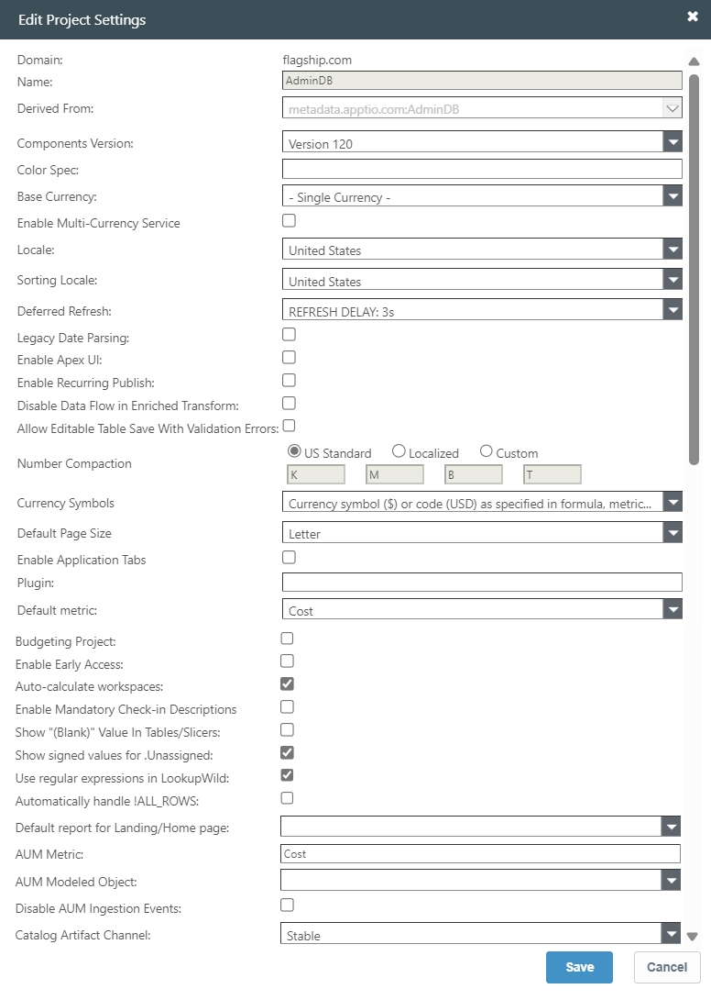
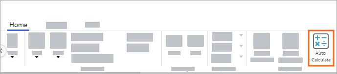

# Editar configurações do projeto

**Aplica-se a** : TBM Studio 12.0 e posterior. Algumas configurações estão disponíveis em versões posteriores do site TBM Studio, conforme indicado abaixo.

Depois de criar um projeto, você pode editar as configurações do projeto.

1. Para exibir a faixa de opções no menu Aplicativos/Projetos, clique em **TBM Studio**.
2. Na guia **Projeto**, no grupo **Configuração de projeto**, clique em **Configurações de projeto**. A caixa de diálogo Editar configurações do projeto é exibida.

Observação: o campo Login Message foi descontinuado em TBM Studio 12.4.1.

Os campos da caixa de diálogo **Editar configuração do projeto** estão descritos abaixo. Os campos que exigem a função Apptio Admin estão marcados com um asterisco (\*). Se você não estiver atribuído à função de administrador, não verá esses campos.

- **Domínio** - O domínio é o ambiente Apptio estabelecido para sua organização. Todos os projetos são criados no mesmo domínio. Esse campo não pode ser editado.
- **Nome** - O nome do projeto e da compilação criados para sua organização. Esse campo não pode ser editado.
- **Derived From (Derivado de** ) - Se o projeto foi derivado de um projeto existente, o nome do projeto de origem é exibido nesse campo**.NOTICE**

  Em TBM Studio R12, você não pode criar um novo projeto a partir de um projeto existente. Se você atualizar de v11 para R12, os projetos derivados exibirão o projeto de origem nesse campo, mas não será possível alterar a derivação.
- **Versão dos componentes** - Especifique a versão a ser usada para atualizações de componentes. Para saber mais, consulte [Especificar a versão para upgrades de componentes](specify-version-component.html "aplica-se a: TBM Studio 12.3.1 e posterior. Ao fazer upgrade de aplicativos no TBM Studio, você pode especificar a versão a ser usada para upgrades de componentes. Essa configuração se aplica a todos os upgrades de componentes e novas instalações de componentes.").
- **Color Spec (Especificação de cor** ) - Insira uma string de formatação de cor para alterar a cor de uma entidade em todos os gráficos. Para obter mais informações, consulte [Definir as cores padrão para as métricas do projeto](set-default-colors.html "Aplica-se a: TBM Studio 12.0 e posterior").
- **Moeda base** - Se o projeto usar várias moedas, selecione a moeda padrão que será usada para exibir valores nos relatórios. Os usuários podem substituir essa configuração escolhendo uma moeda diferente para os relatórios que visualizam. Para saber mais, consulte [Configurar várias moedas](configure-multi-currency.html "Aplica-se a: TBM Studio v12.1 e posterior").
- Enable Multi-Currency Service (Ativar serviço em várias moedas) - Introduzida em TBM Studio 12.10.5, essa configuração permite ativar o serviço em várias moedas para o seu projeto. O Multi-Currency Service oferece uma plataforma centralizada para gerenciar tabelas de câmbio de moedas para seus produtos Apptio.

  [O que é o serviço de várias moedas?](/docs/SSPA2JP/multi-currency/gettingstarted/mcs-overview.html)

  O Multi-Currency Service é ativado automaticamente para todos os novos projetos que usam um calendário gregoriano. Para os projetos existentes que usam um calendário gregoriano, você pode ativar manualmente o Multi-Currency Service marcando essa caixa de seleção. Atualmente, o Multi-Currency Service não é compatível com projetos que usam calendários de 13 períodos ou 454 variantes.

  Observação: lembre-se de que, uma vez ativado o serviço de várias moedas na caixa de diálogo Configurações do projeto, você não poderá revertê-lo sem uma reversão.

  Quando você ativa o Multi-Currency Service e faz o check-in das configurações do projeto, as tabelas de câmbio são automaticamente sincronizadas para corresponder aos dados armazenados nas tabelas do Multi-Currency Service. A moeda base também é atualizada para corresponder aos dados armazenados no Multi-Currency Service. Depois que o Multi-Currency Service for ativado, as tabelas de câmbio do projeto não poderão mais ser editadas no site TBM Studio; você só poderá editar essas tabelas na interface do Multi-Currency Service.

  [Sincronização da tabela de câmbio](/docs/SSPA2JP/multi-currency/admin/currency-exchange-table-sync.html)
- **Localidade** - Selecione um país. A seleção determina os formatos de número, moeda e data usados no projeto para relatórios e métricas.
- **Sorting Locale (Local de classificação** ) - É usado em projetos localizados para determinar como classificar os dados. Selecione um país. As opções atuais são os Estados Unidos e o Japão. A classificação não diferencia maiúsculas e minúsculas, nem kana, nem largura, nem diacríticos.
- **Deferred Refresh (Atualização adiada** ) - É usado para adiar o tempo para que os usuários selecionem filtros, seletores ou segmentações e vejam os resultados atualizados com base no relatório. Para obter mais informações, consulte [aqui](../reports/delayed-refresh.html).
- **Análise de data herdada** - Isso é necessário para compatibilidade com versões anteriores, para que a análise de data funcione da mesma forma após as atualizações. Ative o check-in para o ícone Legacy Date Parsing.
- **Ativar a interface do usuário do Apex** - Essa configuração foi introduzida em TBM Studio 12.11.0. Isso é usado para ativar ou desativar a aparência da interface do usuário para o GWT. Para obter mais informações, consulte [aqui](../getting_started_with_tbm_studio/apex-ui-uplift.html "Aplica-se a: 12.11.0 e posterior").
- **Ativar publicação recorrente** - Essa opção foi introduzida em TBM Studio 12.11.8. Ele permite que o TBMA publique os dados da tabela editável em sua transformação, configurando um cronograma. Para obter mais informações, consulte [Recurring Publish](recurring-publish-et.html "Aplica-se a: 12.11.7 e posterior. A opção Recurring Publish (Publicação recorrente) permite que o TBMA agende programações de publicação recorrentes automáticas para tabelas editáveis que tenham tabelas de transformação. Quando esse recurso for ativado, a opção \"Publicar no período\" será convertida em uma programação padrão e será anexada no pipeline Tabela editável, em Transformar tabela. Todos os \"Publicar no período\" serão convertidos em agendamento padrão na página Recurring Schedule, e a transformação vinculada ao agendamento estará disponível na página Transform Table.").
- **Disable Data Flow in Enriched Transform (Desativar fluxo de dados na transformação enriquecida** ) - Essa opção impede que os dados da tabela bruta sejam movidos automaticamente para a tabela Transform, no ambiente de desenvolvimento, somente se a tabela tiver check-out. para obter mais informações, consulte [Desativar fluxo de dados](../data_studio/create-table-from-et.html).
- **Allow Editable Table Save With Validation Errors (Permitir salvar tabela editável com erros de validação** ) - Essa opção permite que você salve as linhas no relatório mesmo se houver algum erro de validação.
- **Compactação de números** - (Essa configuração foi introduzida em TBM Studio 12.3. Para obter mais informações, consulte as notas de versão. Alguns setores (como o de petróleo e gás) usam milhares e milhões de notações financeiras diferentes (como K, KK ou MM) que não são empregadas em outros setores. Essa notação é usada pelos KPIs. Para personalizar as abreviações de compactação, clique em Custom (Personalizar) e insira os valores de abreviação desejados.
- **Símbolos de moeda** - Se o projeto usar várias moedas, selecione a opção de exibição de moeda desejada. Para saber mais, consulte [Configurar várias moedas](configure-multi-currency.html "Aplica-se a: TBM Studio v12.1 e posterior").
- **Default Page Size\* (Tamanho de página padrão) -** Define o tamanho de página padrão para os relatórios quando eles são impressos. Esse campo está disponível somente para a função Apptio Admin.
- **Enable Application Tabs\*-** Essa opção não se aplica à versão atual do produto. O campo está disponível somente para a função Apptio Admin.
- **Plugin** - Esse campo está disponível somente para a função Apptio Admin.
- **Métrica padrão** - A métrica padrão do modelo é Custo. Se você tiver outras métricas definidas, elas estarão disponíveis na lista suspensa.
- **Projeto orçamentário\*** - Esse campo está disponível somente para a função Apptio Admin. Ele controla o comportamento de mudança de tempo para métricas de planejamento de TI herdadas entre projetos. Marcar essa opção melhora muito a velocidade de processamento. Se você usar o Assistente de planejamento de TI para criar um projeto, esse campo será definido automaticamente.
- **Ativar acesso antecipado** - Quando essa opção está marcada, os usuários podem acessar recursos que ainda estão em desenvolvimento. Em geral, você não deve marcar essa opção.
- **Cálculo automático de espaços de trabalho\*** - Determina a configuração padrão do ícone Cálculo automático na guia Página **inicial**. Quando marcada, a opção Auto Calculate (Cálculo automático) estará ativa quando um usuário fizer login em um projeto. Quando um usuário faz check-in de um documento, o aplicativo atualiza todos os documentos que o usuário fez check-out. Quando a opção é desmarcada, o usuário pode executar atualizações manualmente usando as outras opções de atualização: Atualizar documento e Atualizar espaço de trabalho. O usuário também pode ativar a opção Auto Calculate (Cálculo automático) clicando no ícone.

  

  Para projetos com grandes bancos de dados que levam um tempo significativo para serem calculados, recomendamos que você desmarque a opção e deixe a critério do usuário determinar se deseja ativar o cálculo automático.
- **Enable Mandatory Check in Descriptions** - (Aplica-se a TBM Studio 12.7.1. e posterior) Essa opção pode forçar os usuários a inserir uma descrição sempre que fizerem o check-in do trabalho. Quando a caixa dessa opção estiver marcada, os usuários não poderão clicar em Check In até que algo seja digitado na caixa de mensagem (mostrada acima). Antes que uma mensagem seja digitada, o cursor aparecerá como um círculo vermelho riscado com um aviso: Please add a message to check in.

  
- **Mostrar valor (em branco) em tabelas/slicers** - (Aplica-se a TBM Studio 12.7.1. e posteriores). Essa opção atualiza a forma como as tabelas e as segmentações exibem os valores em branco, da mesma forma que os gráficos preenchem automaticamente os valores em branco com (Blank). Por padrão, as tabelas e os slicers não mostrarão um valor se um campo estiver vazio, como pode ser visto no lado Desmarcado abaixo. Quando essa caixa estiver marcada, o sistema preencherá as células vazias em tabelas e segmentações com (Em branco), conforme mostrado no lado marcado abaixo. Isso facilita a filtragem e a execução de operações em campos com um valor em branco.

  
- **Mostrar valores assinados para.Unassigned** - A coluna "Unassigned" na tabela.Unassigned continua sendo o valor absoluto dos custos alocados, pois isso é necessário para calcular corretamente os valores % atribuídos.
- **Use expressões regulares em Lookup Wild** - As expressões regulares em colunas que usam valores de retorno Lookup\_Wild ajudam a obter a granularidade desejada no mapeamento de alocação de fornecedores.
- **Manipular automaticamente!ALL\_ROWS** - Adiciona e remove automaticamente as permissões quando necessário. Ou seja, ele elimina a necessidade de marcar a caixa Todas as linhas nas perspectivas.
- **Relatório padrão para Landing/Home page** - Esse é o relatório padrão que aparece para o usuário em sua Landing ou Home page.
- **AUM Metric (Métrica AUM** ) - Esta é uma lista de métricas modeladas a serem usadas para cálculos de gastos sob gerenciamento. É uma variável de sistema que pode ser usada no painel Configuração de componentes ad hoc para uma tabela publicada.
- **AUM Modeled Object (Objeto modelado de AUM** ) - Essa é a lista de objetos modelados a serem usados nos cálculos de gastos sob gerenciamento. É uma variável de sistema que pode ser usada no painel Configuração de componentes ad hoc para uma tabela publicada.
- **Catalog Artifact Channel (Canal de artefato do catálogo** ) - O canal do catálogo que precisa ser selecionado é Stable (Estável).

- **[Criar uma tabela a partir de uma tabela editável](../../studio/data_studio/create-table-from-et.html)**
