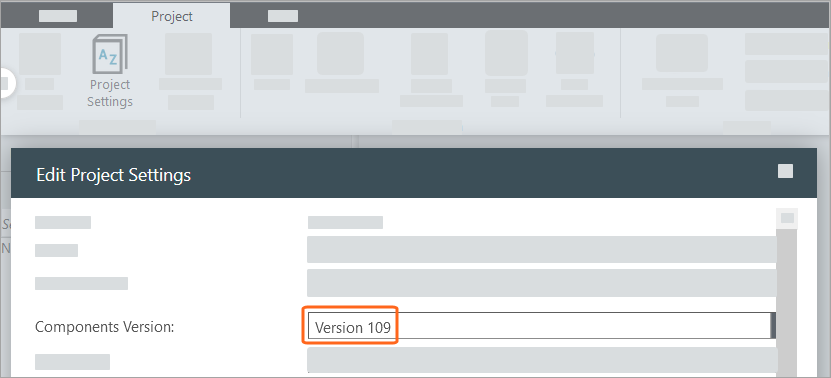
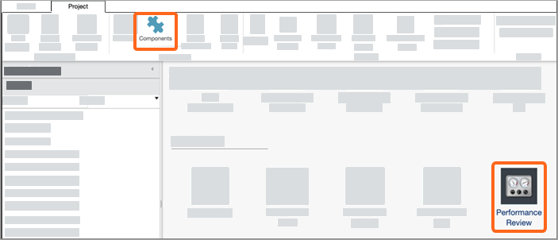
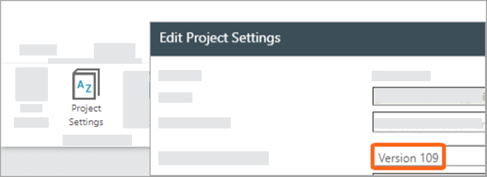
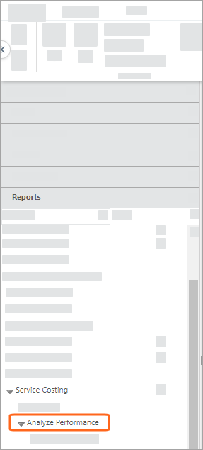
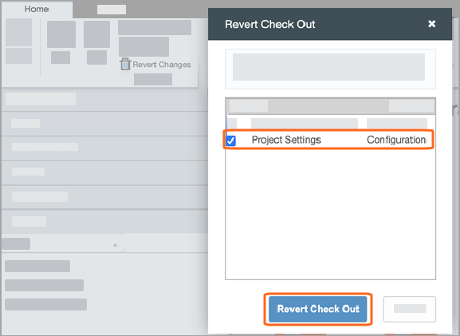
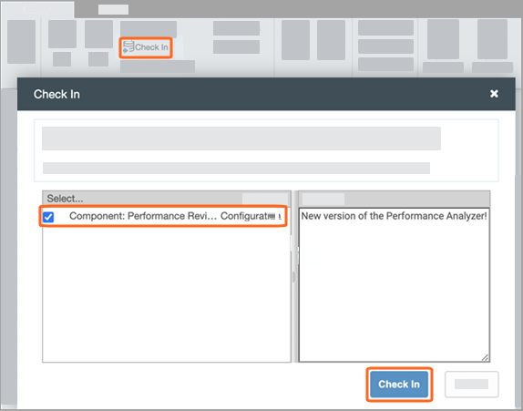
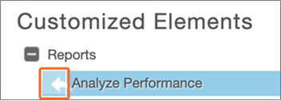
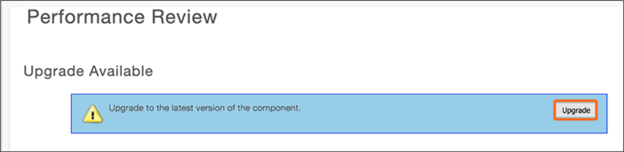

# Instalar o componente Performance Review

Aplica-se a: Apptio Costing Standard em TBM Studio 12.5 e posterior. O componente Performance Review é um utilitário no aplicativo que cria relatórios que um administrador do Apptio TBM Studio pode usar para obter informações sobre o impacto da configuração atual do projeto no desempenho do aplicativo.

## Disponibilidade

| Versão da Plataforma | Versão de conteúdo |
| --- | --- |
| R12.5 e posteriormente | v.105 carga útil de conteúdo |
| R12.9.3 | v.109 carga útil de conteúdo |

Observação: para instalar o componente, você deve estar em uma versão de plataforma compatível com a versão de conteúdo associada.

## Pré-requisitos para a instalação

Siga estas etapas para verificar se seu ambiente tem acesso a uma versão de conteúdo adequada:

1. Abra o site TBM Studio no projeto em que você deseja instalar o componente Performance Review.
2. Navegue até Projeto > Configurações do projeto.
3. Para validar a versão do conteúdo, em Versão do componente, verifique se a Versão 109 está disponível para seleção.
4. Clique em Cancel.

   

## Instale o componente Performance Review em um projeto com o conteúdo v.109 configurado

Se o seu projeto estiver usando atualmente a versão de conteúdo v.109, siga estas etapas para instalar o componente Performance Review.

1. Na guia Projeto, no grupo Dados do projeto, clique em Componentes.

   
2. Clique em Avaliação de desempenho.
3. Na caixa de diálogo Instalação de componentes, clique em Ativar.

Depois que você concluir a instalação do componente, os relatórios de Análise de desempenho serão exibidos no Project Explorer em Relatórios > Service Costing > Analyze Performance.

## Instale o componente Performance Review em um projeto com uma versão de conteúdo anterior a v.109

Se o seu projeto não estiver usando a versão de conteúdo v.109, mas você a vir no menu suspenso Components Version (Versão dos componentes) em Project Settings (Configurações do projeto) de acordo com os Prerequisites (Pré-requisitos) no início deste documento, você ainda poderá instalá-la sem se comprometer com uma atualização completa do conteúdo ou mesmo sem salvar a alteração da versão do conteúdo.

Siga estas etapas para instalar o componente Avaliação de desempenho sem precisar migrar para os modelos de conteúdo do site v.109.

1. Na guia Projeto, no grupo Configuração de projeto, clique em Configurações de projeto.
2. Na lista suspensa Versão dos componentes, selecione Versão 109 e clique em Salvar.

   
3. Na guia Projeto, no grupo Dados do projeto, clique em Componentes. Agora você deve ver o componente Performance Review.
4. Clique em Avaliação de desempenho.
5. Na caixa de diálogo Instalação de componentes, clique em Ativar. Depois de concluir a instalação do componente, os relatórios de Análise de desempenho serão exibidos no Project Explorer em Report > Service Costing > Analyze Performance.

   
6. Na faixa de opções do menu na parte superior da tela, selecione Home > Revert Changes (Página inicial > Reverter alterações).
7. Na caixa de diálogo Reverter check-out, selecione Configurações do projeto, deixe todas as outras opções desmarcadas e clique em Reverter check-out.

   

   Agora você reverteu as configurações do projeto.
8. Na faixa de opções do menu, selecione Home > Check In.

   

   Você já fez o check-in da nova versão do Performance Analyzer.

## Atualização do componente Performance Review

Se você já tiver uma versão mais antiga do componente Performance Review instalada, deverá reverter as personalizações existentes. Siga estas etapas.

1. Na faixa de opções do menu na parte superior da tela, selecione Projeto > Componentes > Análise de desempenho.

   

   Se houver personalizações presentes, elas aparecerão na parte inferior da página. Para reverter os elementos personalizados, clique na seta ao lado da personalização. Faça isso para cada personalização.

   
2. Navegue até as Configurações do projeto e altere a Versão dos componentes para a Versão 109.

   
3. Navegue de volta para Componentes > Avaliação de desempenho.
4. Role a tela para baixo, se necessário, e clique em Upgrade.

   

## Use o componente Avaliação de desempenho

Para obter informações sobre como usar o componente Performance Review e os relatórios Analyze Performance, consulte [Usar o componente Performance Review](use%20the%20performance%20review.htm "(Abre em uma nova guia ou janela)").
