# Pesquisa de linhagem

A pesquisa de linhagem permite que o usuário pesquise no complexo gráfico de linhagem uma entidade que corresponda ao termo de pesquisa.

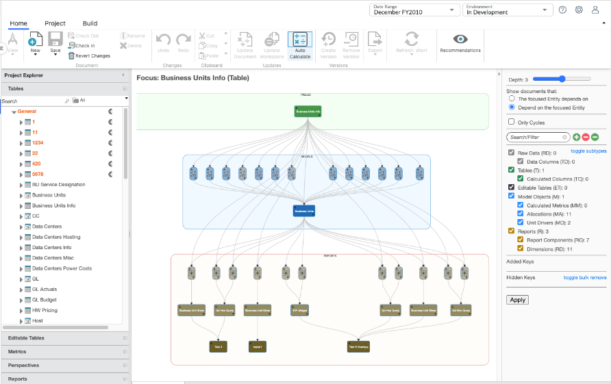

Mesmo em um diagrama de linhagem relativamente pequeno como esse, pode ser difícil, em uma olhada rápida, dizer quais são todas as entidades. Isso é especialmente verdadeiro para subtipos como colunas ou dimensões, que são representados como ícones em vez de caixas completas com nomes. É aí que entra a pesquisa. Por exemplo, digitar "unit" (a pesquisa não diferencia maiúsculas de minúsculas) destacará todas as entidades que correspondem à consulta de pesquisa:

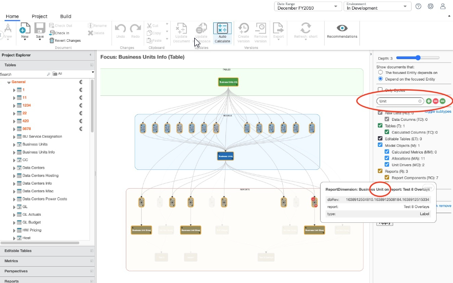

E elimine as entidades que não correspondem à consulta de pesquisa

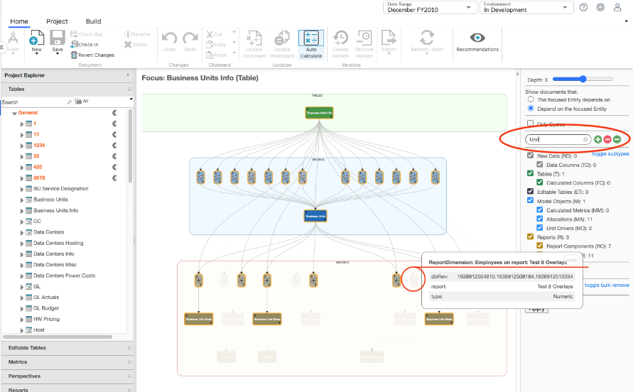

Vários termos de pesquisa separados por um espaço são tratados como um OR implícito, por exemplo, uma entidade será destacada se corresponder a qualquer um dos termos de pesquisa

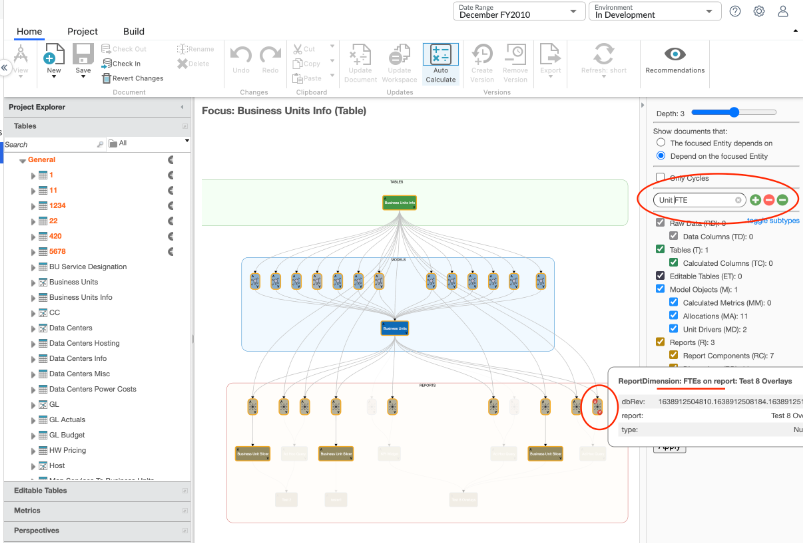

## Filtro

Além de destacar as entidades que correspondem às consultas de pesquisa, os resultados também podem ser usados para filtrar o gráfico para solicitações subsequentes. Os três botões à direita da barra de pesquisa são usados para essa finalidade:

- Adicionar correspondência
- Ocultar não correspondente
- Ocultar correspondência

## Adicionar correspondência

Clique no botão Adicionar correspondência (sinal de mais verde)

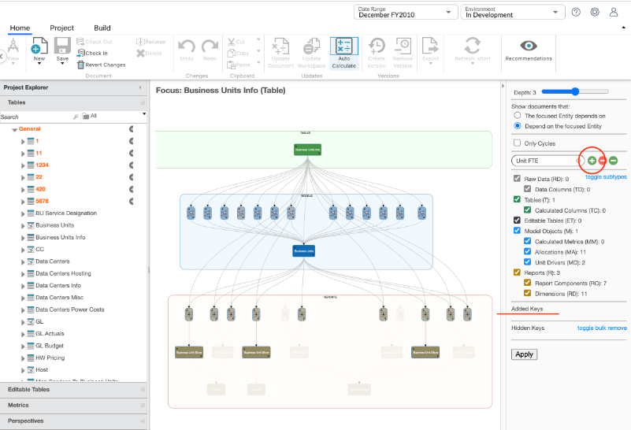

Isso gerará um novo diagrama de linhagem em que todas as entidades que corresponderam anteriormente à consulta de pesquisa foram adicionadas à seção "Chaves adicionadas". Embora isso possa não ter um efeito óbvio imediato no diagrama, significa que essas entidades persistirão em consultas subsequentes, mesmo que seu subtipo geral esteja oculto. Isso é muito útil quando você deseja encontrar uma entidade específica, como uma coluna ou uma dimensão, para a qual deseja rastrear a linhagem, mesmo que não esteja realmente interessado nesse tipo de entidade ou deseje excluí-la para facilitar a leitura.

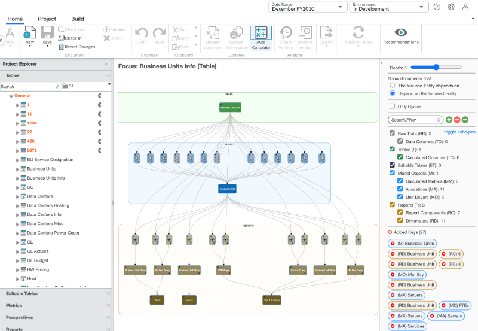 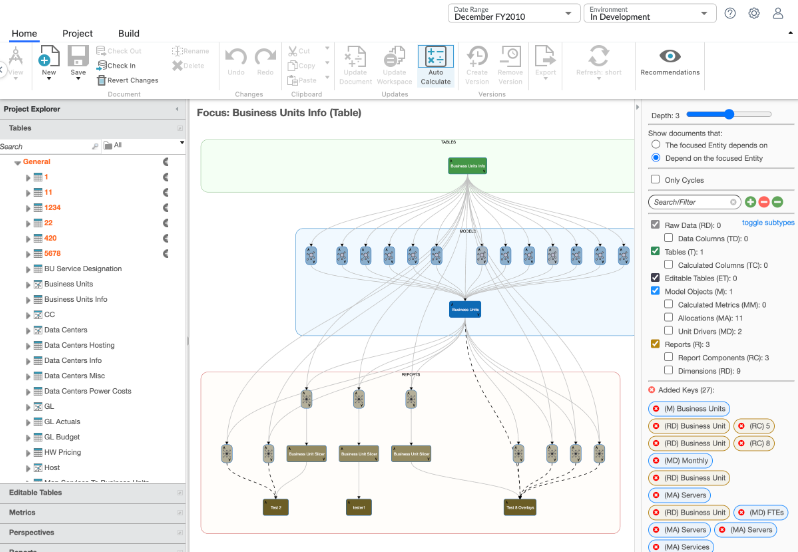

## Ocultar não correspondente

Para ocultar entidades do diagrama que não correspondem à consulta "Units FTE", selecione o ícone Hide Non-matching (menos vermelho).

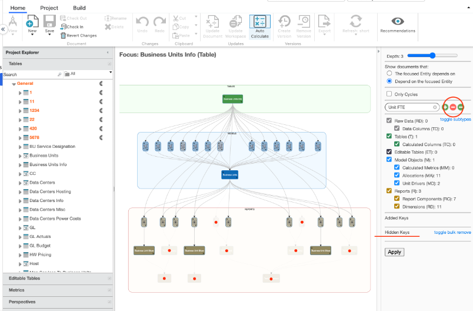

Uma nova consulta de linhagem é emitida, na qual todas as entidades que foram anteriormente apagadas estão agora efetivamente ocultas do diagrama e de todas as consultas de linhagem subsequentes

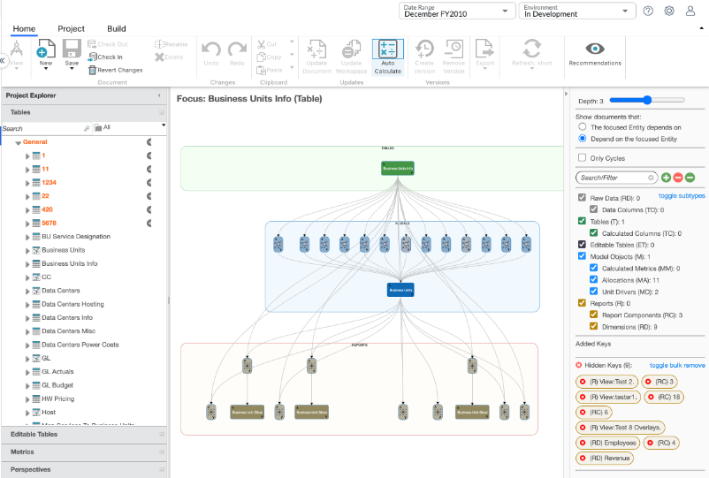

## Ocultar correspondência

Para ocultar entidades do diagrama que correspondem à consulta "Units FTE", selecione o ícone **Hide Matching** (menos verde) mais à direita

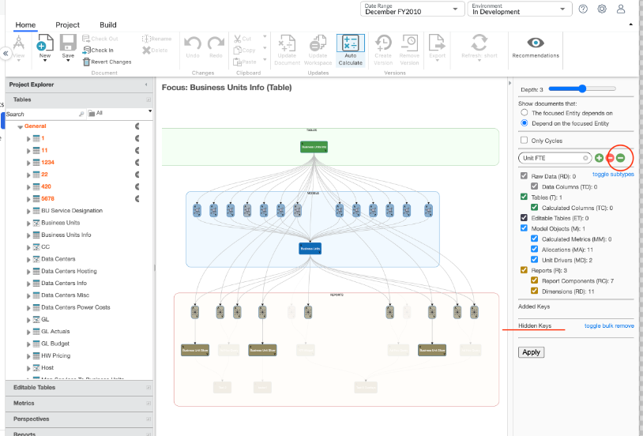

Isso gerará um novo diagrama de linhagem em que todas as entidades que corresponderam anteriormente à consulta de pesquisa foram adicionadas à seção "Hidden Keys" (Chaves ocultas), ocultando-as efetivamente do diagrama e de todas as consultas de linhagem subsequentes. Isso pode ser útil para filtrar rapidamente resultados espúrios ou caminhos de ramificação que você não tem interesse em rastrear:

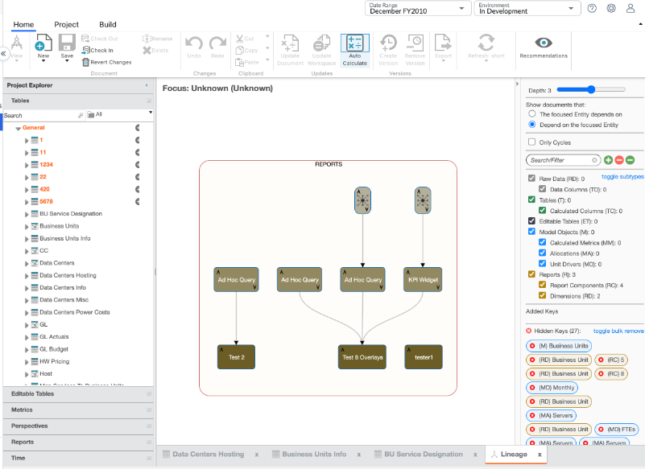
