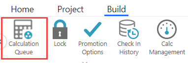

# Monitorar compilações com a fila de cálculo

aplica-se a: TBM Studio 12.2 e posterior. Use a tabela Calculation Queue para monitorar o estado das compilações dos ambientes (Development, Staging e Production) em seu domínio.

Você pode acessar a fila de cálculo na guia **Construir**.

Uma compilação é iniciada automaticamente nos ambientes de desenvolvimento e preparação sempre que um usuário faz o check-in de um documento. A compilação incorpora todos os documentos registrados desde a última compilação e atualiza todos os números calculados no projeto.

As compilações nos ambientes de desenvolvimento e de preparação podem ocorrer simultaneamente, mas executá-las ao mesmo tempo pode resultar em um atraso entre as duas compilações e em números de compilação que não correspondem. Além disso, o número de compilação para o ambiente de produção pode ser significativamente diferente, dependendo da frequência com que o ambiente de preparação é promovido para o ambiente de produção.

## Compreender as colunas da tabela

A coluna **Status** exibe um dos seguintes status:

- **Pending (Pendente** ) - Uma compilação está na fila e esperando para ser processada.
- **Calculando** - Uma construção está em andamento. Ao lado desse status, é exibido o número de cálculos concluídos em relação ao número total de cálculos. No exemplo acima, 140 dos 6.337 cálculos foram concluídos.
- **Finished (Finalizado** ) - A construção está concluída. Ao lado desse status é exibido o tempo decorrido desde a conclusão da compilação e, entre parênteses, a duração da compilação.

A coluna **Alterações** lista todos os check-ins processados durante a compilação.

Para classificar a tabela pelos valores em uma coluna, selecione o cabeçalho da coluna e, em seguida, selecione uma opção de classificação.

Para exibir apenas as linhas com um determinado valor em uma coluna, digite o texto no campo de pesquisa abaixo de cada cabeçalho de coluna.

Observação: se você estiver no projeto Welcome, a fila de cálculo não listará os ambientes (Development, Staging e Production) na parte superior da fila de cálculo porque o projeto Welcome não tem ambientes.

## Perguntas Frequentes

**O que é o Precision Calc?**

O cálculo de precisão é um novo aprimoramento de desempenho que reduz o tempo de cálculo das alterações que foram registradas. O cálculo de precisão usa informações de linhagem para entender melhor os impactos específicos do cálculo com base nos tipos de alterações feitas: por exemplo, uploads de tabelas, alterações no esquema de dados, transformações, métricas calculadas, perspectivas, relatórios, configurações de projeto etc. No recurso Calculation Queue, os administradores verão:

- Tempos de cálculo mais rápidos do que antes Cálculos de precisão
- Maior variação nos tempos de cálculo para diferentes construções.

**Como ativar esse recurso?**

Esse recurso é ativado automaticamente para todos os clientes a partir da versão do Server 12.10.10.1.

**Com que rapidez ele calcula o tempo?**

As compilações com alterações "somente de relatório" ou alterações que não afetam o modelo de cálculo serão concluídas em segundos. As compilações com outros tipos de alterações serão calculadas e concluídas mais rapidamente do que antes. O cálculo de precisão não reduzirá o tempo de um cálculo completo necessário após uma reinicialização de instância com limpeza de cache.

**As alterações na configuração da interface do usuário afetarão as otimizações?**

As seguintes alterações na interface do usuário não afetarão os dados que estão sendo calculados

- Alterar especificação de cor
- Alterar o tamanho padrão da página
- Ativar abas de aplicativos
- Alternar o espaço de trabalho de cálculo automático
- Alternar Ativar descrições de check-in obrigatórias
- Encerramento / Redução do número de períodos calculados
- Fazer uma alteração na configuração do projeto para ativar a IU do Apex

**Como ele otimiza os cálculos?**

O servidor otimizará os cálculos para processar apenas as áreas afetadas pelas alterações registradas

**Como posso otimizar esse recurso?**

Substitua o uso da função [Eval()](../formulas-and-functions/functions/eval.htm "(Abre em uma nova guia ou janela)") pela função [DynamicColumn( ) para se beneficiar das melhorias de desempenho do Precision Calc.](../formulas-and-functions/functions/dynamic-column.htm "(Abre em uma nova guia ou janela)")

Para maximizar as melhorias de desempenho de cálculo do novo recurso "cálculos de precisão", a funcionalidade da função Eval() é substituída por DynamicColumn( ) ou outras alterações de código. Os clientes que ainda têm Eval() na configuração do projeto podem fazer as alterações necessárias usando o documento [de código de substituição OOTB Eval()](../formulas-and-functions/updated-eval-formulas.htm "(Abre em uma nova guia ou janela)"), que contém informações de todos os relatórios e alterações de métricas.

Observação: AVISO: Se você tiver modificado os relatórios OOTB, o Eval() não será removido dos relatórios em modelos anteriores (por exemplo, v104, v105, v106. v107 ).
