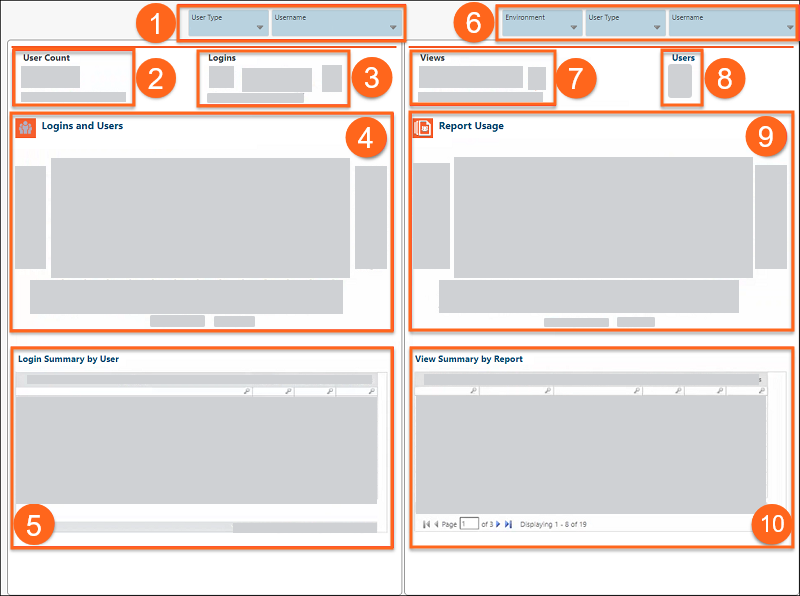
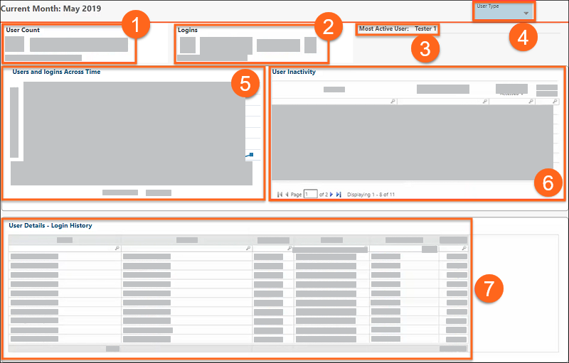
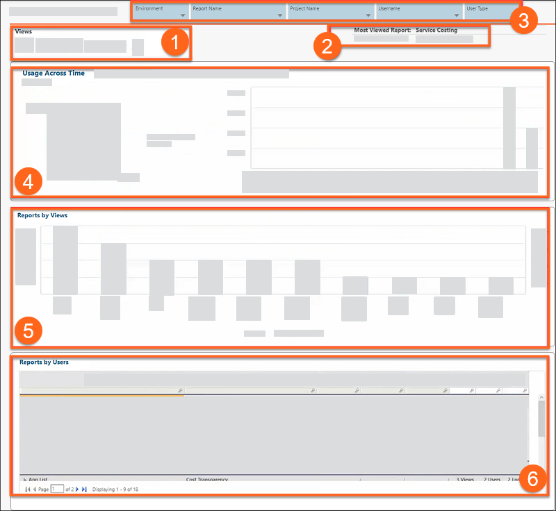
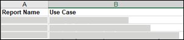
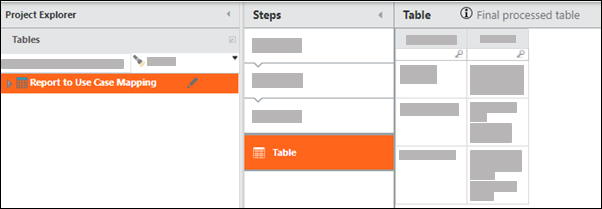
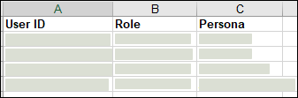
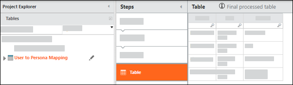

# Acompanhe o engajamento com os relatórios de uso d Apptio

CUIDADO:

Apptio o projeto Usage do usuário não pode ser personalizado. Qualquer personalização resultará em falha crítica do sistema e todas as alterações deverão ser revertidas. Se houver uma solicitação de aprimoramento dos relatórios disponíveis, entre em contato com o Apptio Support ou com o Product Management.

Como administrador do aplicativo Apptio, talvez você queira monitorar o número de pessoas que estão usando os aplicativos Apptio e os relatórios que elas estão visualizando. O painel Apptio Usage é uma ferramenta de geração de relatórios analíticos que fornece insights sobre como os usuários da sua organização interagem com os aplicativos Apptio. Especificamente, o site ApptioUsage pode ajudá-lo a identificar o seguinte:

- Geral Apptio relatar métricas de engajamento em sua organização
- Usuários ativos e inativos
- Relatórios populares e impopulares
- Desempenho do relatório e tempos de carregamento

Apptio recomenda que uma revisão regular da análise de uso do Apptio se torne parte de sua estratégia de adoção.

## Ativar o painel de controle Apptio Usage

Apptio O uso está disponível nas versões TBM Studio 12.7.1 e posteriores. Depois de fazer o upgrade, você deve importar o projeto **Usage** para o seu ambiente.

1. Em TBM Studio, no menu **Configurações** (), clique em **Importar**.
2. Clique em **Usage (Uso)** e depois em **OK**.

   

   Aguarde o cálculo do projeto. Os cálculos podem levar mais de uma hora, dependendo da complexidade de seu projeto.
3. Após a conclusão dos cálculos, no menu **Settings (Configurações** ), clique em **Access
   Administration**. Como alternativa, você pode fazer login em Enhanced Access
   Administration e navegar até **Access Administration**.
4. Na guia **Aplicativos**, ao lado de **Uso**, clique em **Mostrar** para torná-lo visível. Se você quiser modificar ainda mais o acesso à função, clique em **Edit Visibility (Editar visibilidade** ).

Agora você pode acessar **o Usage** no menu Project que lista todos os aplicativos Apptio.

## Configurar a cadência de atualização do uso

Depois de ativar o projeto Usage, você pode definir um cronograma para atualizações. **Recomenda-se começar com uma atualização semanal fora do horário de expediente**, por exemplo, todo sábado ou domingo, e depois ajustar a frequência se os requisitos mudarem.

1. Em TBM Studio, clique em **Build** > **Promotion Options**.
2. Clique em **Recurring Updates (Atualizações recorrentes** ).
3. Configure a frequência de recorrência desejada e clique em **Save (Salvar** ).
4. Clique em **Recurring Promotions (Promoções recorrentes** ).
5. Configure a recorrência para ocorrer logo após as atualizações e clique em **Salvar**

## Apptio Relatórios do painel de controle de uso

Os seguintes relatórios estão disponíveis no painel de controle Apptio Usage.

## Relatório de resumo de uso

O relatório Resumo de Uso fornece uma visão geral rápida do envolvimento do usuário, o que é especialmente útil para as TBMAs entenderem o valor que os usuários estão obtendo do Apptio e as áreas de adoção que podem precisar de mais atenção. O relatório Resumo de uso fornece informações sobre o usuário nos painéis à esquerda e informações sobre o uso nos painéis à direita. Cada painel exibe indicadores-chave de desempenho (KPIs) que fornecem insights de engajamento.

- **(1)** **Filtros de usuário** - Selecione um tipo de usuário ou nome de usuário para filtrar os dados exibidos nos painéis à esquerda que exibem os dados do usuário.
- **(2)** **Contagem de usuários** - Esse KPI mostra o número de usuários únicos que fizeram login durante o mês selecionado e o número médio de logins por usuário.
- **(3)** **Logins** - Esse KPI mostra o número de logins do mês selecionado em comparação com o mês anterior.
- **(4)** **Logins e usuários** - Use esse gráfico para ver o número de usuários e logins no mês até o momento, tendências na atividade do usuário e alterações na adoção.
- **(5)** **Resumo de login por usuário** - Use essa tabela para ver o total de logins por usuário no mês, no trimestre e no acumulado do ano. Clique em qualquer item da coluna **Full Name (Nome completo** ) para detalhar dados específicos do usuário.
- **(6)** **Filtros de uso** - Selecione um ambiente, tipo de usuário ou nome de usuário para filtrar os dados exibidos nos painéis à direita que exibem dados de uso. A configuração padrão do filtro **Ambiente** é **Produção**.
- **(7)** **Visualizações** - Este KPI mostra o número de relatórios visualizados durante o mês selecionado em comparação com o mês anterior.
- **(8)** **Usuários** - Esse KPI mostra o número de usuários únicos que visualizaram relatórios no mês selecionado.
- **(9)** **Uso de relatórios** - Use esse gráfico para ver o total de relatórios e o número de visualizadores únicos no mês até o momento. Esse elemento pode destacar tendências no uso geral e ajudá-lo a entender o valor de relatórios específicos.
- **(10)** **Resumo das visualizações por relatório** - Essa tabela lista relatórios específicos e suas contagens de visualizações por mês, trimestre e acumulado do ano. Clique em qualquer item da coluna **Nome do relatório** para detalhar dados específicos, como tempo de carregamento e caso de uso.

## Relatório de logins de usuários

O relatório **User Logins** exibe detalhes mais detalhados sobre os usuários, como horários específicos de login, duração da sessão e atividade durante o login.

- **(1)** **Contagem de usuários** - Esse KPI mostra o número de usuários únicos que fizeram login durante o mês selecionado e o número médio de logins por usuário. Esse KPI também inclui a diferença mês a mês como uma porcentagem.
- **(2)** **Logins** - Esse KPI mostra o número de logins acumulado no mês em comparação com a contagem de logins do mês anterior. Esse KPI também inclui a diferença mês a mês como uma porcentagem.
- **(3)** **Most Active User (Usuário mais ativo** ) - O KPI mostra o usuário mais ativo do seu produto Apptio no mês selecionado. Você pode usar esse elemento para identificar rapidamente os principais adotantes e examinar como eles estão usando o sistema.
- **(4)** **User Type Filter (Filtro de tipo de usuário) -** Selecione um tipo de usuário para filtrar os dados de login do usuário.
- **(5)** **Usuários e logins ao longo do tempo** - Use esse gráfico para ver o número de usuários únicos conectados em comparação com o número total de logins no mês até o momento. O ideal é que ambos os valores aumentem com o tempo, o que sugere uma adoção adequada entre sua base de usuários. Se ambos os valores estiverem diminuindo, esse gráfico pode lhe mostrar quais períodos devem ser investigados mais a fundo.
- **(6)** **Inatividade do usuário** - Use esse gráfico para ver uma lista dos usuários menos ativos, a hora do último acesso e se o último login foi feito nos últimos 30 dias. Combine as informações desse gráfico com as do gráfico Usuários e logins ao longo do tempo para identificar os usuários que talvez não tenham adotado adequadamente as soluções Apptio.
- **(7)** **Detalhes do usuário – Histórico de login** - Use esta tabela para visualizar históricos de login de usuários individuais, incluindo data, hora e informações do navegador. Clique em **View History (Exibir histórico)** em qualquer linha para exibir a atividade de um usuário específico enquanto ele estava conectado. Essa pode ser uma ferramenta valiosa para solucionar problemas inesperados que seus usuários enfrentam.

## Relatório Visualizações do relatório

O relatório Visualizações de relatórios fornece métricas detalhadas sobre a visualização de projetos e relatórios.

- **(1)** **Visualizações** - Este KPI mostra o número total de visualizações de relatórios durante o mês selecionado e a diferença mês a mês como uma porcentagem.
- **(2)** **Relatório mais visualizado e visualizador mais ativo** :
  - **Relatório mais visualizado** - Esse KPI mostra o relatório com o maior número de visualizações durante o mês selecionado.
  - **Most Active Viewer (Visualizador mais ativo** ) - Esse KPI mostra o usuário com o maior número de visualizações de relatórios em todos os relatórios durante o mês selecionado.
- **(3)** **Filtros** - Selecione um ambiente, relatório, projeto ou nome de usuário para filtrar os dados exibidos no relatório.
- **(4)** **Uso ao longo do tempo por projeto** - Use esse painel para visualizar o uso por projeto ao longo do tempo. Selecione uma opção acima dos gráficos para exibir dados de usuário, dados de relatório, dados de login ou dados de visualização. O gráfico de pizza mostra a métrica que você selecionou em todos os seus projetos. O gráfico de barras mostra a mesma métrica no acumulado do mês.
- **(5)** **Relatórios por visualizações** - Use esse gráfico para ver os relatórios que recebem mais visualizações e o número de usuários únicos que visualizam esses relatórios. Você pode clicar em **Views (Visualizações** ) ou **Unique User Count (Contagem de usuários únicos** ) para filtrar o gráfico apenas por essa métrica. Clique nela novamente para voltar à visualização original.
- **(6)** **Relatórios por usuários** - Use essa tabela para ver as sessões de usuário classificadas por nome de relatório. Você pode expandir os nomes dos relatórios para ver todos os usuários que acessaram o relatório e, em seguida, detalhar as informações sobre as sessões desse usuário.

## Relatório Relatório de desempenho

O relatório Report Performance destaca os tempos de carregamento experimentados pelos seus usuários. Esses dados lhe dão uma visão dos problemas de desempenho e de como resolvê-los.

- **(1)** **Filtros** - Selecione um ambiente, relatório, projeto ou nome de usuário para filtrar os dados exibidos no relatório.
- **(2)** **Percentis de tempo de carregamento de relatório - 5 principais** - Use esse gráfico para visualizar os cinco relatórios de carregamento mais lento. Por exemplo, o 20º percentil (ou " P20 ") dos tempos de carregamento de relatórios representa os 20% mais lentos dos tempos de carregamento.
- **(3)** **Report Latency - Top 5** - Use este gráfico para ajudar a identificar a causa do desempenho ruim. Em seguida, use as tabelas **Load Time** e **Latency** para investigar a origem do problema. As métricas de desempenho a seguir fornecem dados relacionados aos cinco relatórios de carregamento mais lento:
  - **Latência** - o tempo necessário para que o tráfego de rede trafegue entre o computador de um usuário e o data center da Apptio.
  - **Tempo de solicitação** - O tempo que leva para a solicitação ser recebida pelo data center do Apptio.
  - **Load Time (Tempo de carregamento)** - O tempo que o data center do Apptio leva para computar os dados de relatório necessários após receber uma solicitação.
- **(4)** **Tempo de carregamento** e **latência** - Use essas tabelas para investigar problemas relacionados ao desempenho. Cada tabela é organizada por elementos diferentes, mas geralmente inclui o seguinte:

  **tempo do percentil 90**

  **Tempos mais rápidos e mais lentos**

  **Porcentagem do tempo total de espera** - Essa é a porcentagem do tempo total de carga para a métrica de desempenho determinada. A linha central e escura é o foco desse gráfico. Quanto mais a linha estiver à direita, mais tempo será gasto no carregamento.

  Clique em **View Details (Exibir detalhes** ) para detalhar as informações. As tabelas específicas incluem o seguinte:
  - **Tempo de carregamento -** As entradas são classificadas por Relatório / ID de usuário / InitalLoad ou SlicersApplied. Um fator que pode aumentar o tempo de cálculo da solicitação é o uso de determinadas consultas de suporte em Apptio que não podem ser pré-calculadas.
  - **Latência** - As entradas são classificadas por ID de usuário / endereço IP / data / Application.Two fatores que podem aumentar o tempo de latência são problemas de conectividade com a Internet ou um firewall antivírus.
- **(5)** **Acesso ao período do projeto** - Use essa tabela para ver quando seus usuários estão usando seus relatórios por mês e período. Esses dados podem ajudá-lo a entender quais períodos de tempo são usados com mais frequência pelos seus usuários, para que você possa pausar os cálculos em períodos de tempo usados com menos frequência.

## Relatórios de mapeamento de casos de uso

A partir de TBM Studio 12.8, dois novos relatórios (Report to Use Case Mapping e User to Persona Mapping) permitem rastrear e analisar o uso de relatórios com base no caso de uso. Com esses relatórios, você pode entender quais casos de uso são mais importantes para seus usuários e quais casos de uso não são tão eficazes. Essas informações podem ajudar a conduzir conversas sobre as áreas da organização que podem exigir atenção. Os novos relatórios permitem que você acompanhe as seguintes informações:

- Rastrear logins com base no caso de uso
- Rastreie os logins com base na personalidade dos usuários finais
- Determine quais casos de uso são de alto impacto para sua organização
- Mapear relatórios prontos para uso e personalizados no rastreamento

Use as instruções a seguir para configurar os casos de uso e as personas para que você possa vê-los nos novos relatórios de uso do Apptio. Seus casos de uso não precisam estar em conformidade com os casos de uso do Apptio Value Explorer (AVE).

## Tabela de mapeamento de relatório para caso de uso

1. Extraia a tabela Report to Use Case Mapping do site TBM Studio e preencha as seguintes colunas para cada relatório:
   - **Nome do relatório** - O nome do relatório pronto para uso ou personalizado
   - **Caso de uso** - O caso de uso que você deseja implantar para alinhar ao nome do relatório
2. Carregue a tabela preenchida de volta na tabela Report to Use Case Mapping.

   

O relatório **Report Usage by Use Case** agora é preenchido com dados de casos de uso.

## Tabela de mapeamento de usuário para persona

A tabela User to Persona Mapping (Mapeamento de usuário para persona) mapeia cada usuário para sua persona dentro da organização, para que você possa rastrear quais personas estão acessando cada caso de uso.

1. Extraia a tabela de TBM Studio e preencha um ID de usuário, uma função e uma persona para cada usuário.

   

   - **ID do usuário** - O endereço de e-mail do usuário (seu login Enhanced
     Access Administration )
   - **Role (Função** ) - A função do usuário em Enhanced Access
     Administration (Admin, Business User, etc.)
   - **Persona** - A persona do usuário final (TBMA, Finanças de TI, Proprietário do Aplicativo, Proprietário da Infraestrutura de TI, Proprietário do Serviço, etc.)
2. Carregue a tabela preenchida de volta na tabela **User to Persona Mapping (Mapeamento de usuário para persona** ).

   

O relatório **Report Usage by Use Case** agora permite filtrar por personas para que você possa ver quais personas estão acessando cada relatório.

**Tópico principal:** [Noções básicas sobre relatórios](../../studio/new-uc/howtoguides/create-reports/report-basic.html)
