# Publicação recorrente da tabela de transformação

**Aplica-se a** : 12.11.7 e posterior. A opção Recurring Publish (Publicação recorrente) permite que o TBMA agende programações de publicação recorrentes automáticas para tabelas editáveis que tenham tabelas de transformação. Quando esse recurso for ativado, a opção "Publicar no período" será convertida em uma programação padrão e será anexada no pipeline **Tabela editável**, em **Transformar tabela**. Todos os "Publicar no período" serão convertidos em agendamento padrão na página Recurring Schedule, e a transformação vinculada ao agendamento estará disponível na página **Transform Table**.

## Ativar a publicação recorrente para tabelas de transformação

Observação: Antes de ativar o recurso, você deve definir o Recurring Schedule (Programação recorrente) em Promotion Options (Opções de promoção), caso contrário, a opção "Publish" (Publicar) na superfície do relatório sempre publicará o período atual.

Para ativar essa opção em 12.11.7, navegue até a guia **Projeto** > **Ativar recursos** e, em seguida, selecione **Ativar publicação recorrente para tabelas de transformação**.

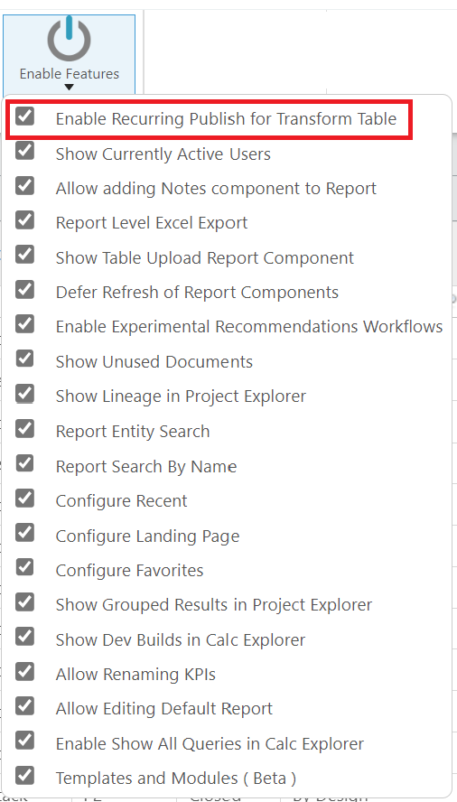

É exibida uma mensagem de confirmação, conforme mostrado.

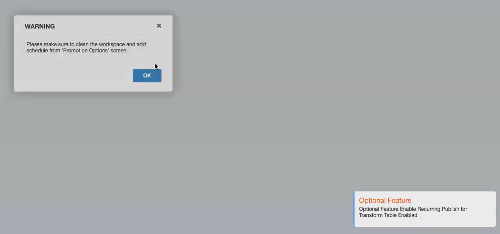

A guia Recurring Publish (Publicação recorrente) está ativada na guia TBM Studio > Builds (Construções).

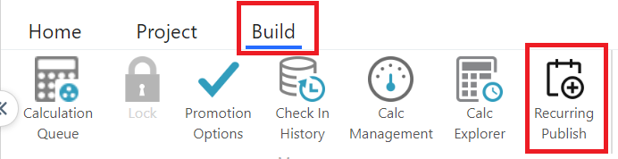

Observação: Se a opção **Recurring Publish (Publicação recorrente** ) estiver ativada, o botão **Promotion Options (Opções de promoção** ) > **Recurring Updates for Editable Tables (Atualizações recorrentes para tabelas editáveis** ) será desativado.

Na guia Build (Criação), selecione a opção **Recurring Publish (Publicação recorrente** ). A página Recurring Publish é exibida com duas guias.

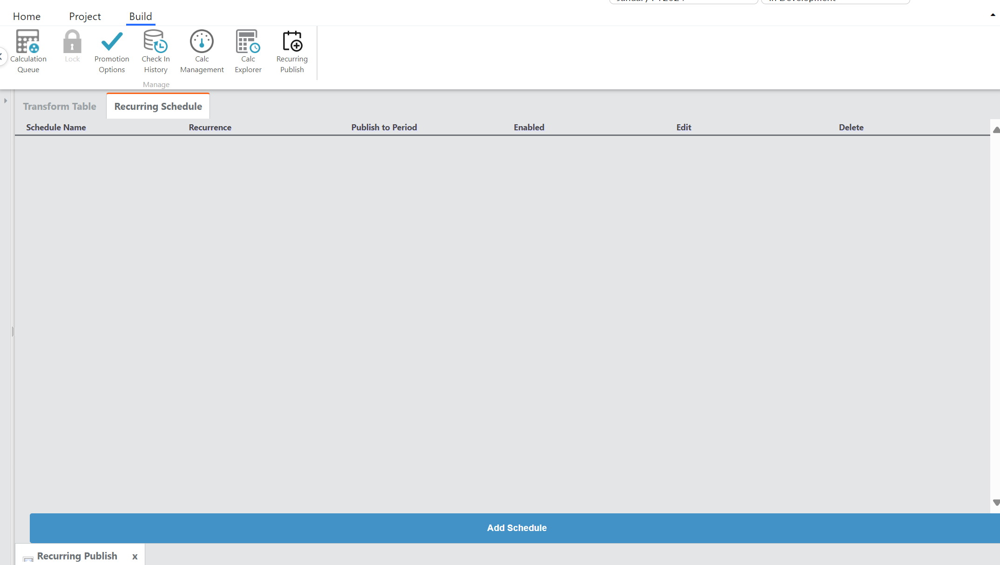

## Mesa de transformação

Esta é uma página somente leitura que lista todas as tabelas de transformação originadas de uma tabela editável.

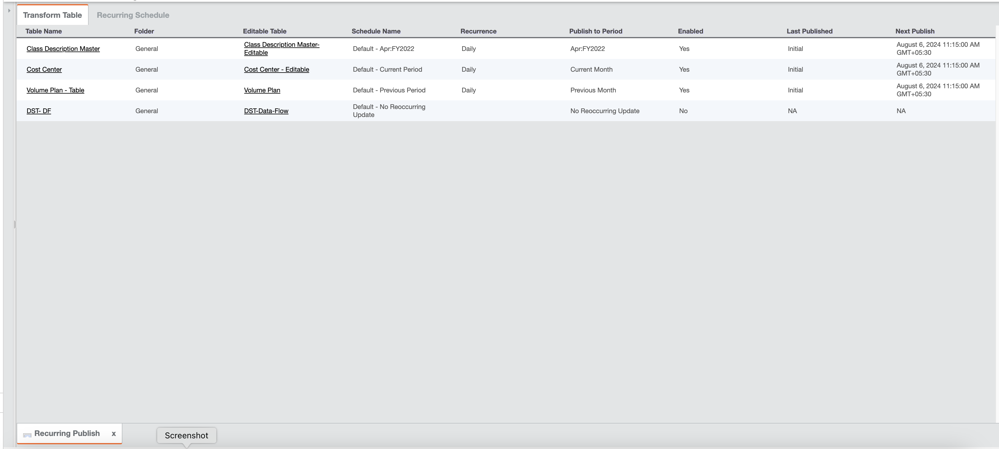

Ele contém as seguintes informações:

| Campos | Descrição |
| --- | --- |
| Nome da tabela | Nome da tabela de transformação. |
| Pasta | Localização da tabela de transformação. |
| Tabela editável | Nome da tabela editável. Em 12.11.8, o valor é um hiperlink, e ao clicar nele, a tabela editável vinculada será aberta. |
| Nome de agendamento | Nome dado ao criar a programação recorrente. |
| Recorrência | O tipo de recorrência - por hora, diariamente, semanalmente ou mensalmente. |
| Publicar no período | O período de publicação para selecionado durante a criação da programação recorrente - os valores são Primeiro período do exercício fiscal atual, Primeiro período do próximo exercício fiscal, Primeiro período do projeto, mês atual, mês anterior, período específico e nenhuma atualização recorrente. |
| Ativado | Se a agenda recorrente foi ativada ou não - os valores são Yes (Sim) ou No (Não). |
| Data e hora da última publicação | O registro de data e hora da última publicação no formato <mon dd, yyyy> <hh:mm> <AM/PM>< timezone>.  Se nenhuma programação recorrente for escolhida, o valor em NA  Se a programação recorrente ainda não tiver começado, o valor será Inicial. |
| Data e hora da próxima publicação | O registro de data e hora da próxima publicação no formato <mon dd, yyyy> <hh:mm> <AM/PM>< timezone>.  Se nenhuma programação recorrente for escolhida, o valor em NA  Se a programação recorrente ainda não tiver começado, o valor será Inicial. |

## Programações recorrentes

Essa página contém a lista de todas as programações padrão e disponíveis.

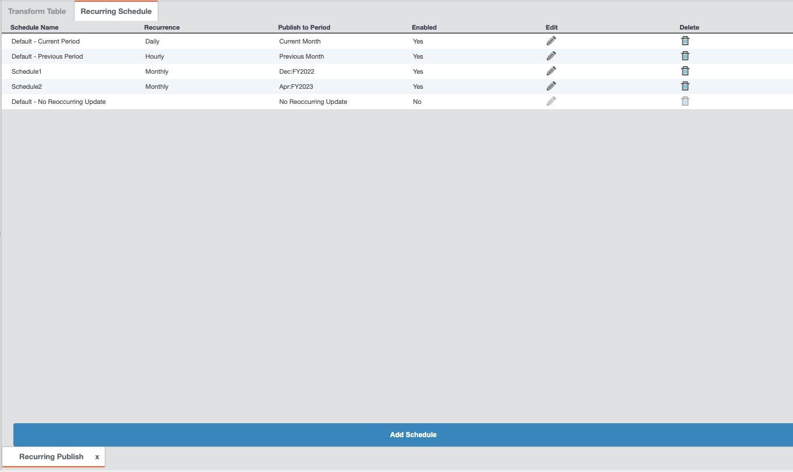

Ele permite que a TBMA adicione, remova ou edite programações. Não será permitida a adição de programações duplicadas.

## Como adicionar um cronograma

Na guia Recurring Schedules (Agendas recorrentes), selecione **Add Schedule (Adicionar agenda** ). O pop-up Atualizações recorrentes para tabelas editáveis é exibido conforme mostrado:

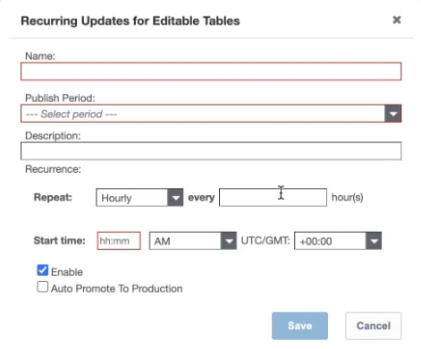

Insira dados nos seguintes campos

| Campos | Descrição |
| --- | --- |
| Nome | Digite um nome para a programação de publicação recorrente |
| Período de publicação | Selecione um dos valores na lista suspensa  Primeiro período do ano fiscal atual (disponível em 12.11.8 )Primeiro período do próximo ano fiscal (disponível em 12.11.8 )  Primeiro período do projeto (disponível em 12.11.8 )  Período atual - como está  Período anterior - como está  Período específico - como está, capacidade de selecionar manualmente o período desejado |
| Recorrência | **Repetição** : selecione por hora (padrão), diariamente, semanalmente ou **mensalmente a cada** <frequência de repetições> hora/dias/mês.  **Hora de início** : Digite <hh:mm> <AM/PM> e selecione **UTC/GMT** <fuso horário> |
| Adicionar nova hora de início | Esse botão é exibido para recorrência diária, semanal e mensal.  Clique no botão para adicionar valores de **Repetição** e **Hora de início**, conforme mencionado acima. Você pode clicar nesse botão 23 vezes (para repetir a hora de início para cada hora), após o que o botão será desativado.  Clique no ícone x para excluir qualquer hora de início |
| Repetir em | Esse campo aparece para a recorrência **semanal**. Selecione os dias em que você deseja que a recorrência funcione. |
| Ativar | Marque essa caixa de seleção para ativar, desativar ou suspender temporariamente a agenda. |
| Promoção automática para produção | Aplica-se a 12.11.10 e posterior. Marque essa caixa de seleção para promover automaticamente a programação recorrente para produção. |

Selecione **Salvar**. Uma mensagem de confirmação é exibida e a programação é adicionada à lista.

- "Padrão" é o valor inicial gerado pelo sistema que aparece quando o recurso é ativado.
- A agenda "Default - No Reoccurring Update" (Padrão - Sem atualização recorrente) não tem nenhuma atualização recorrente e não pode ser editada ou excluída.
- Todas as escalas dessa página aparecerão na etapa do pipeline Editable Table (Tabela editável) da Transform Table (Tabela de transformação).

## Edição de programações

O TBMA pode editar ou excluir a programação selecionando o ícone apropriado. Ao selecionar **Salvar**, uma mensagem de confirmação é exibida como "*New Schedule is saved for editable table updates. Pode haver poucos Transforms com check-out. Faça o check-in no Transforms.*"

Observação: as programações padrão são estabelecidas usando configurações herdadas encontradas em "Promotion Options > Recurring Updates for Editable Tables" (Opções de promoção > Atualizações recorrentes para tabelas editáveis) e "Publish to Period" (Publicar no período) da origem das tabelas de transformação para tabelas editáveis.

## Migração de configurações existentes para a nova publicação recorrente

Siga as etapas mencionadas se você quiser ativar o recurso para migrar as configurações existentes.

Observação: Antes de ativar o recurso Recurring Publish, certifique-se de que todas as transformações das tabelas editáveis tenham sido verificadas, ou as alterações serão revertidas. Não prossiga se as tabelas de transformação tiverem sido verificadas.

1. Na guia **Projeto**, selecione **Ativar recursos** e, em seguida, marque a caixa de seleção **Ativar publicação recorrente para a tabela de transformação**.

   Se houver várias tabelas, aguarde de 10 a 15 minutos enquanto o sistema verifica e altera cada transformação
2. Expanda a seção **Tabelas** no Project Explorer, filtre por **Usando** > **Editável** para ver se todas as tabelas de transformação foram retiradas
3. Na guia **Build (Construção** ), selecione o recurso **Recurring Publish (Publicação recorrente** ).
4. Selecione a guia **Transform Table (Transformar tabela** ) para verificar se as tabelas estão listadas.
5. Selecione a guia **Recurring Schedule (Programação recorrente** ) para visualizar as programações "padrão" que se baseiam na configuração existente.
6. Crie novas programações, conforme desejado, com base em seus casos de uso exclusivos de tabelas editáveis.
7. Altere cada tabela de transformação da programação anterior "padrão" para uma nova programação, se desejar.

A ativação do recurso Recurring Publish migrará apenas um projeto de cada vez. Se houver mais de um projeto com tabelas editáveis, essas etapas deverão ser repetidas para cada projeto. É importante desmarcar e selecionar novamente a opção **Enable Recurring Publish for Transform Table** em Enable Features

## 12.11.8 e posteriormente

Os seguintes aprimoramentos são aplicáveis a partir de 12.11.8 e posteriores.

- Ative esse recurso em **Configurações do projeto** e, em seguida, marque a caixa de seleção **Ativar publicação recorrente**.

  Observação: se estiver migrando da versão 12.11.7 para 12.11.8, será necessário ativar manualmente esse recurso na tela Project Settings (Configurações do projeto), pois ele não será ativado por padrão. Não haverá perda de configuração; os cronogramas e as transformações permanecerão intactos e visíveis após a ativação.

  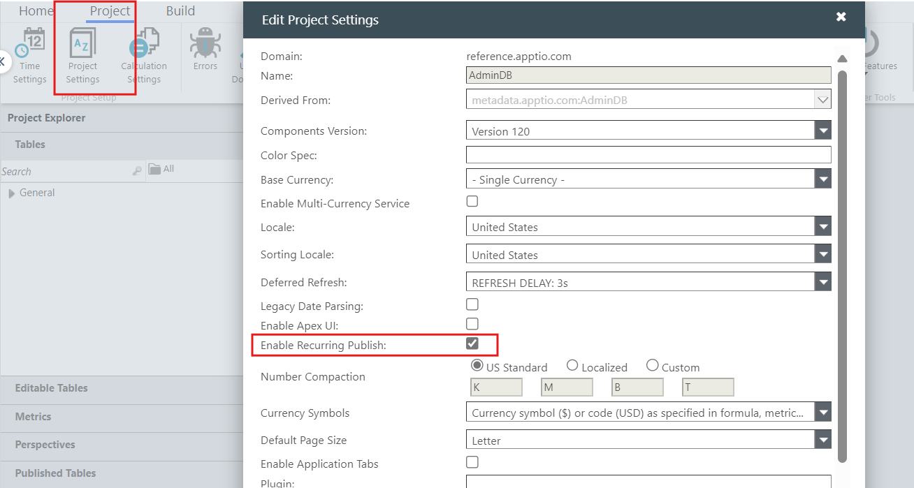
- Três outras opções foram adicionadas ao "Publish To Period" (Publicar no período), a saber, "First Period of the Current Fiscal Year" (Primeiro período do ano fiscal atual), "First Period of the Next Fiscal Year" (Primeiro período do ano fiscal seguinte) e "First Period of the Project" (Primeiro período do projeto).
  - Primeiro período do ano fiscal atual: Esse é o mês inicial do ano fiscal definido na tela Configuração de tempo do projeto associada ao ano atual. Exemplo: Se o mês inicial do ano fiscal for março, o primeiro período do ano fiscal atual será Mar:FY2024.
  - Primeiro período do próximo exercício fiscal: É igual ao primeiro período do exercício fiscal atual, exceto pelo fato de que o ano será alterado. Exemplo: Mar:FY2025.
  - Primeiro período do projeto: "Início do projeto" definido na tela Configuração de tempo do projeto será o valor do primeiro período do projeto. Exemplo: Se a configuração for Apr FY2024, o primeiro período do projeto deverá ser Apr:FY2024.
- Duas novas colunas foram adicionadas à tela Recurring Schedule: "Run Now" (Executar agora) e "Description" (Descrição)
- O recurso "Run Now" permite que os administradores executem programações instantaneamente, em vez de esperar pelo horário programado.
- A coluna "Description" permite que você adicione descrições significativas para cada programação.

  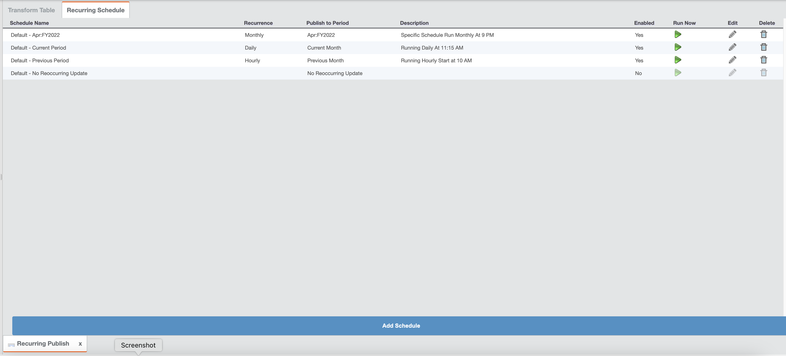

## 12.11.10 e posteriormente

Uma nova coluna Auto Promote to Production (Promover automaticamente para produção) foi adicionada à guia Recurring Schedule (Programação recorrente). Para ver essa coluna, faça o seguinte:

1. Navegue até **Enable Features (Ativar recursos** ) e selecione a opção **Enable Auto-promote For Editable Table Recurring Schedules (Ativar promoção automática para programações recorrentes de tabelas editáveis** ).

   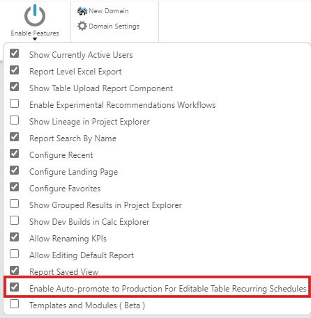
2. A caixa de seleção **Auto Promote to Production (Promover automaticamente para produção** ) é exibida no pop-up Recurring Updates for Editable Table (Atualizações recorrentes para tabela editável).

   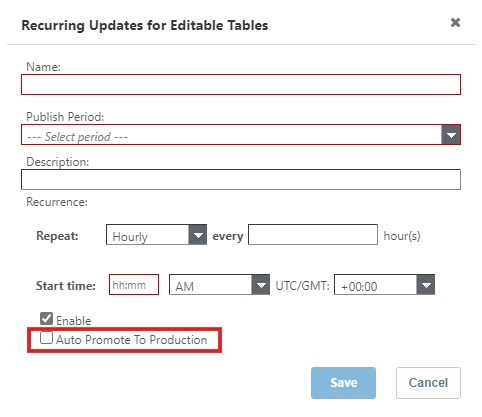
3. Ao marcar essa caixa de seleção, é exibida uma mensagem de aviso. A caixa de texto **Email Recipients (Destinatários de e-mail** ) será exibida para adicionar os IDs de e-mail das pessoas que você deseja notificar sobre a promoção automática.

   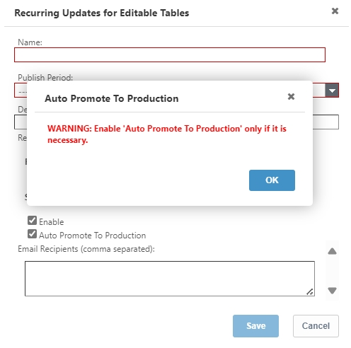

   Observação: se a caixa de seleção não estiver marcada, o valor de Auto Promote to production (Promover automaticamente para produção) na guia Recurring Schedules (Agendas recorrentes) será No (Não).
4. A coluna **Auto Promote to Production (Promover automaticamente para produção** ) também aparece na guia Recurring Schedules (Agendas recorrentes).

   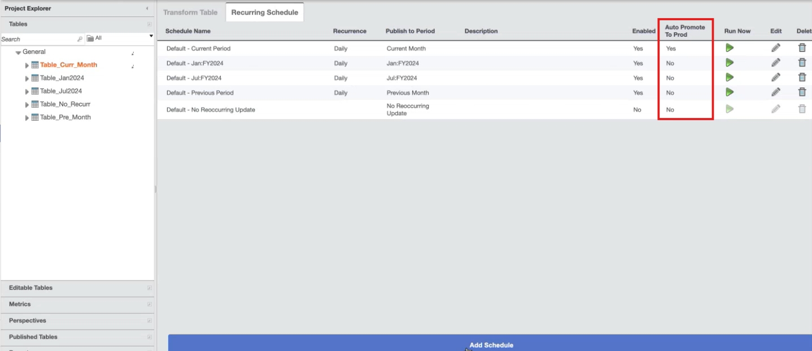
