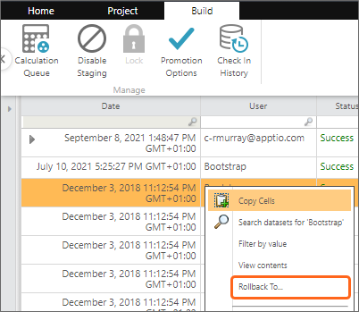
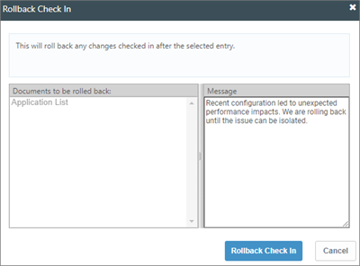
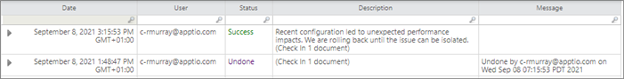
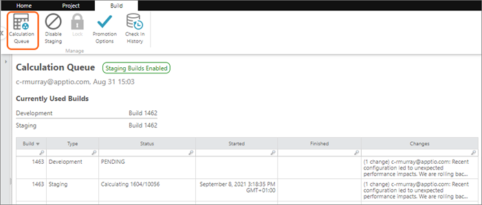

# Reverter uma configuração

Na versão Apptio TBM Studio 12.2.2 e posteriores, é possível usar o recurso de **reversão** no Check In History para reverter uma configuração para um ponto anterior no tempo. Esse recurso é útil para reverter alterações quando algo dá errado e é semelhante ao recurso Undo All After (Desfazer tudo depois) no registro de auditoria v.11.

Observação: há considerações importantes antes de executar uma reversão. Recomendamos que você leia e entenda completamente este artigo antes de tentar fazer uma reversão. Se ainda tiver dúvidas ou preocupações, entre em contato com o suporte Apptio para obter assistência.

Aqui estão alguns motivos pelos quais você pode considerar o uso do recurso de reversão:

- Foi verificado algo que está causando problemas de desempenho.
- Algo foi implantado na produção prematuramente. Consulte [as práticas recomendadas de check-out e check-in](bp-check-out.html "aplica-se a: Apptio TBM Studio 12.x e posterior. No Apptio TBM Studio R12, todos os elementos são documentos, incluindo tabelas de dados, métricas, perspectivas e modelos. Para editar um documento, você deve primeiro verificá-lo. Quando você faz o check-out de um documento, ele é bloqueado para que outras pessoas não possam editá-lo. Você pode salvar suas alterações no documento sem acionar um novo cálculo. Quando terminar de editar um documento, você poderá fazer o check-in. O check-in de um documento aciona um novo cálculo. Outras pessoas verão as alterações que você fez no documento quando o cálculo do modo de desenvolvimento for concluído e o espaço de trabalho delas for atualizado. Além disso, outras pessoas agora poderão conferir esse documento.") para obter informações sobre como fazer hotfix em um projeto se esse for o motivo para considerar uma reversão, pois isso pode ser mais rápido.

## Considerações importantes

A reversão não deve ser usada levianamente. Quando uma reversão é executada, todos os cálculos em execução do projeto são interrompidos e um novo cálculo é iniciado, usando a configuração associada ao check-in para o qual a reversão está sendo feita. Quando a reversão é executada, as seguintes considerações se aplicam:

- Todos os check-ins posteriores ao check-in para o qual você está voltando serão descartados. Se houver alterações nesses check-ins que você deseja, será necessário reimplementá-las. Consulte a última seção deste documento para saber como tornar isso mais fácil.
- Será necessário executar um cálculo de estágio completo, o que pode demorar um pouco, dependendo da configuração do projeto no check-in para o qual você está revertendo.
- Se os cálculos existentes para outros projetos estiverem em andamento, o cálculo resultante de uma reversão poderá ser enfileirado atrás desses cálculos.

## Reverter uma configuração

[Confira e faça o check-in das práticas recomendadas](bp-check-out.html "aplica-se a: Apptio TBM Studio 12.x e posterior. No Apptio TBM Studio R12, todos os elementos são documentos, incluindo tabelas de dados, métricas, perspectivas e modelos. Para editar um documento, você deve primeiro verificá-lo. Quando você faz o check-out de um documento, ele é bloqueado para que outras pessoas não possam editá-lo. Você pode salvar suas alterações no documento sem acionar um novo cálculo. Quando terminar de editar um documento, você poderá fazer o check-in. O check-in de um documento aciona um novo cálculo. Outras pessoas verão as alterações que você fez no documento quando o cálculo do modo de desenvolvimento for concluído e o espaço de trabalho delas for atualizado. Além disso, outras pessoas agora poderão conferir esse documento.").

1. Selecione o documento no **Project Explorer**.
2. Na guia **Build**, selecione **Check In History**.
3. Clique com o botão direito do mouse no check-in para o qual você deseja reverter e selecione **Reverter para**.

   
4. Digite o motivo da reversão (recomenda-se que seja o mais descritivo possível) e clique em **Rollback Check In**.

   

   Após a reversão, o resultado é exibido de forma semelhante ao exemplo abaixo:

   

   Você pode ver o status do cálculo na guia Builds (Construções):

   

   Observação: todos os check-ins após o check-in selecionado para reversão são desfeitos, com exceção do fechamento da ramificação (as operações de ramificação estão isentas de reversão).
5. Quando a compilação estiver concluída, atualize todos os espaços de trabalho com documentos com check-out. Na guia Home, selecione **Update Workspace (Atualizar espaço de trabalho** ).
6. Para forçar a atualização do espaço de trabalho, talvez seja necessário desativar temporariamente o Auto Calculate. Na guia Home, selecione Auto Calculate (Cálculo automático), depois selecione Update Workspace (Atualizar espaço de trabalho) e selecione Auto Calculate (Cálculo automático) novamente.

   Observação: a atualização dos espaços de trabalho é especialmente importante se a reversão for devida a problemas de desempenho. Se os documentos tiverem sido verificados enquanto a configuração suspeita estava em execução, o espaço de trabalho do usuário poderá sofrer os mesmos efeitos negativos que levaram à reversão.

## Examinar algo que foi revertido

Depois de uma reversão, talvez você queira examinar o que estava nos check-ins que foram desfeitos para depurar o que estava causando problemas de desempenho ou para ver uma configuração que você deseja reimplementar. Para fazer isso, você usaria uma ramificação. Consulte [as práticas recomendadas de check-out e check-in](bp-check-out.html "aplica-se a: Apptio TBM Studio 12.x e posterior. No Apptio TBM Studio R12, todos os elementos são documentos, incluindo tabelas de dados, métricas, perspectivas e modelos. Para editar um documento, você deve primeiro verificá-lo. Quando você faz o check-out de um documento, ele é bloqueado para que outras pessoas não possam editá-lo. Você pode salvar suas alterações no documento sem acionar um novo cálculo. Quando terminar de editar um documento, você poderá fazer o check-in. O check-in de um documento aciona um novo cálculo. Outras pessoas verão as alterações que você fez no documento quando o cálculo do modo de desenvolvimento for concluído e o espaço de trabalho delas for atualizado. Além disso, outras pessoas agora poderão conferir esse documento.") para entender como criar uma ramificação. É possível ramificar a partir de check-ins desfeitos. Também é possível copiar o conteúdo do relatório de uma ramificação e colá-lo em documentos com check-out em seu espaço de trabalho. Em alguns casos, isso pode ser desejável para minimizar o retrabalho.
