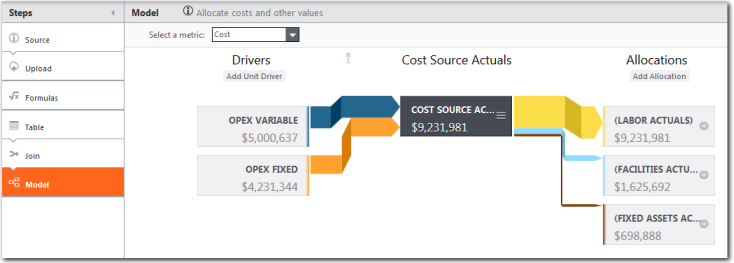

# Dados do modelo

**Aplica-se a** : TBM Studio 12.0 e posterior

Quando você quiser adicionar uma tabela a um modelo, adicione uma etapa de modelo ao pipeline de transformação de tabela. Clicar na etapa do modelo exibe uma visualização de tabela única do modelo, conforme mostrado abaixo. Nessa visualização, você pode adicionar drivers à tabela e alocar valores da tabela para outras tabelas. Para obter informações sobre dados de modelagem, consulte [Model Studio: Calcular custo e outras métricas](../model%20studio/models-chapter-title-page.htm "(Abre em uma nova guia ou janela)").

