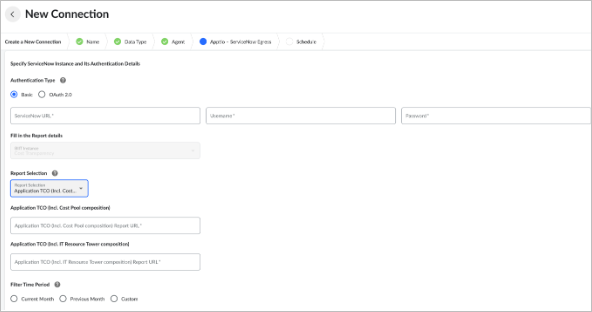

# Configurar uma conexão de saída ServiceNow

Os conectores de saída permitem o fluxo de dados do aplicativo Total Cost of Ownership (TCO) entre Apptio e ServiceNow.

Para exibir os insights de TCO do aplicativo nos painéis relevantes do ServiceNow, você pode usar a integração certificada ServiceNow Apptio. A integração traz estruturas de custo detalhadas, transparentes e defensáveis para as ofertas de aplicativos e serviços em ServiceNow. Ele é compatível com as versões Quebec, Paris e Orlando do site ServiceNow.

Há duas integrações no site ServiceNow :

- ServiceNow O conector de saída permite enviar dados de Apptio para ServiceNow.
- ServiceNow O conector de entrada permite enviar dados de ServiceNow para Apptio.

  [DataLink ServiceNow Conector de entrada](/docs/SSEXLU7/datalink/c-servicenow-about-connector.html)

## Para configurar uma conexão ServiceNow Egress

1. Na plataforma ServiceNow, instale o aplicativo Apps and Services TCO.

   [Saiba mais sobre a instalação do aplicativo Apps & Services TCO](#ConfigureaServiceNowEgressconnection__InstalltheApptioAppsandServicesTCOintegrationontheServiceNowplatform)
2. Em TBM Studio, configure os relatórios de TCO dos aplicativos.

   [Saiba mais sobre como configurar os relatórios de TCO dos aplicativos](#ConfigureaServiceNowEgressconnection__SetuptheappsservicesTCOreportsinTBMStudio)
3. Em DataLink, configure o conector de saída DataLink .

   [Saiba mais sobre como configurar o conector de saída DataLink](#ConfigureaServiceNowEgressconnection__ToconfigureaServiceNowEgressconnection)

Ao configurar a conexão ServiceNow Egress, você pode visualizar os dados de TCO em Apptio ServiceNow.

[Saiba mais sobre como visualizar os dados de TCO do Apptio em ServiceNow](#ConfigureaServiceNowEgressconnection__ToconfigureaServiceNowEgressconnection)

## Instale a integração de TCO do Apptio Apps and Services na plataforma ServiceNow

Observação: A instalação da integração é um pré-requisito para a execução do conector de saída.

Para usar o aplicativo Apps & Services Total Cost of Ownership integration ServiceNow, os usuários precisam ter a função x\_appti\_app\_servic.user. Os administradores com a função x\_appti\_app\_servic.admin também podem visualizar a página da interface do usuário de suporte, excluir quaisquer dados nas tabelas de preparação ou personalizadas e executar a integração.

1. Em ServiceNow,, navegue até Plugins.
2. Na página inicial dos plug-ins, selecione Localizar na loja.
3. Na loja de aplicativos ServiceNow, pesquise Apptio Application and Services IT TCO.
4. Selecione Install (Instalar).

Saiba mais sobre as dependências do aplicativo na [documentação do aplicativo na ServiceNow Store](https://store.servicenow.com/sn_appstore_store.do#!/store/application/88307d7d1b7b6010f78ba8e22a4bcbad/1.0.0?referer=%2Fstore%2Fsearch%3Flistingtype%3Dallintegrations%25253Bancillary_app%25253Bcertified_apps%25253Bcontent%25253Bindustry_solution%25253Boem%25253Butility%25253Btemplate%26q%3Dapptio&sl=sh "(Abre em uma nova guia ou janela)").

## Configure os relatórios de TCO de aplicativos e serviços em TBM Studio

Você precisa criar relatórios em Apptio que sejam adaptados à tabela de destino em ServiceNow. ServiceNow permite que o TCO do aplicativo seja representado com diferentes detalhamentos. Como o site Apptio só pode executar de duas a três pesquisas de objeto, com elementos de relatório de no máximo dois objetos, você precisa criar dois relatórios, configurados com as colunas listadas abaixo:

- [TCO do aplicativo (incluindo a composição do pool de custos)](#ConfigureaServiceNowEgressconnection__Applicat)
- [TCO do aplicativo (incluindo a composição da torre de recursos de TI)](#ConfigureaServiceNowEgressconnection__Applicat2)

[Saiba mais sobre como criar relatórios em TBM Studio](../reports/create-a-report.htm "(Abre em uma nova guia ou janela)")

## Relatório de TCO do aplicativo (incluindo a composição do pool de custos)

Esse relatório é uma pesquisa de Aplicativos para Fonte de custos.

**Colunas obrigatórias**

Observação: você precisa seguir a sintaxe exata mostrada.

- Modelo de custos: código rígido para o cálculo de custos de aplicativos empresariais
- Período fiscal: use a seguinte fórmula:

  ```
  = "FY"& CurrentDate("YY") &": "&"Q"&
          gettimeoffset("Quarter","Start","Year") +1
  ```
- Identificação da divisão: código rígido para unidade de negócios <--> aplicativo de negócios
- Aplicativo comercial: Nome do aplicativo (de Aplicativos)

  Observação: precisa corresponder ao campo de nome da tabela `cmdb_ci_business_app` ServiceNow.
- Bucket: Pool de custos (da origem de custos)
- Sub-bucket: Subpolo de custos (da origem de custos)
- Unidade de negócios: código rígido para `Check Apptio`
- Valor: `= QuarterToDate(Cost)`

## Colunas opcionais

- Approved for ServiceNow Egress: você pode usar isso como um filtro no relatório para filtrar os aplicativos que não deseja compartilhar com a comunidade ServiceNow. Isso precisa ser adicionado como um sinalizador ao objeto Applications.

## TCO do aplicativo (incluindo a composição da torre de recursos de TI)

Esse relatório é um detalhamento de Aplicativos para Torres de Recursos de TI.

**Colunas obrigatórias**

Observação: você precisa seguir a sintaxe exata mostrada.

- Modelo de custos: código rígido para o cálculo de custos de aplicativos empresariais
- Período fiscal: use a seguinte fórmula:

  ```
  = "FY"& CurrentDate("YY") &": "&"Q"&
          gettimeoffset("Quarter","Start","Year") +1
  ```
- Identificação da parada: código rígido para `Business Application <--> IT Shared Service`
- Aplicativo comercial: Nome do aplicativo (de Aplicativos)

  Observação: precisa corresponder ao campo de nome da tabela `cmdb_ci_business_app` ServiceNow.
- Serviço Compartilhado de TI: Nome da torre de recursos de TI (das torres de recursos de TI)
- Unidade de negócios: código rígido para `Check Apptio`
- Valor: `= QuarterToDate(Cost)`

## Colunas opcionais

- Approved for ServiceNow Egress: você pode usar isso como um filtro no relatório para filtrar os aplicativos que não deseja compartilhar com a comunidade ServiceNow. Isso precisa ser adicionado como um sinalizador ao objeto Applications.

## Configurar a conexão

Obter um token OAuth 2.0
:   Se você estiver usando a autenticação OAuth 2.0 para o seu conector, precisará obter um token de ServiceNow antes de configurá-lo, como segue:

    1. Registre DataLink como um aplicativo cliente com sua fonte ServiceNow OAuth 2.0.
    2. Anote os valores de **Client\_ID** e **Client\_Secret**.
    3. Digite um redirecionamento URL. Use o site URL que se aplica à sua região:
       - NA: [datalink.apptio.com/apptioconnect/app](http://datalink.apptio.com/apptioconnect/app "(Abre em uma nova guia ou janela)")
       - UE: [datalink-eu.apptio.com/apptioconnect/app](http://datalink-eu.apptio.com/apptioconnect/app "(Abre em uma nova guia ou janela)")
       - APAC: [datalink-au.apptio.com/apptioconnect/app](http://datalink-au.apptio.com/apptioconnect/app "(Abre em uma nova guia ou janela)")

Criar a conexão
:   1. Abra Datalink e selecione New Connection (Nova conexão).
    2. Digite um nome de conexão e selecione Next.
    3. Selecione ServiceNow Apps & Services TCO Egress connector e, em seguida, selecione Next.
    4. Selecione o agente.

    Você pode escolher um agente baseado na nuvem ou no local para sua conexão de saída. Para configurar um agente local, consulte [Configurar um agente local DataLink para ServiceNow](https://community.apptio.com/communities/community-home/librarydocuments/viewdocument?DocumentKey=db52ac1b-a916-40e2-a6cf-6d4fb63d36c4&Step=1&ReturnUrl=%2fcommunities%2fcommunity-home%2flibrarydocuments%2fviewdocument%3fDocumentKey%3ddb52ac1b-a916-40e2-a6cf-6d4fb63d36c4%26Step%3d1%26ReturnUrl%3d%252fcommunities%252fcommunity-home%252flibrarydocuments%252fviewdocument%253fDocumentKey%253ddb52ac1b-a916-40e2-a6cf-6d4fb63d36c4%2526Step%253d1%2526CommunityKey%253dd640115c-5870-485f-947d-fdb02dcbf248%2526ReturnUrl%253d%25252fcommunities%25252fcommunity-home%25252flibrarydocuments%25253fCommunityKey%25253dd640115c-5870-485f-947d-fdb02dcbf248%2526Action%253dnew "(Abre em uma nova guia ou janela)").

    Dica: Os agentes locais geralmente têm tempos de carregamento mais rápidos do que os agentes baseados na nuvem.

Configurar a autenticação
:   1. Selecione o tipo de autenticação para se conectar à sua instância ServiceNow : Básico ou OAuth 2.0.

       

       Observação: você só pode usar a autenticação OAuth 2.0 com agentes de nuvem.
    2. Digite a base ServiceNow URL (por exemplo, https://{instance}. service-now.com ).
    3. Digite seus detalhes de autenticação:
       - Se estiver usando a autenticação básica, digite o nome de usuário e a senha.
       - Se estiver usando a autenticação OAuth 2.0, faça o seguinte:
         1. Digite as informações do token:
            - Em **URL de autorização**, insira a URL usada para autorização do OAuth 2.0 (por exemplo, https:// {instance}. service-now.com/oauth\_auth.do ).
            - Em **Token URL**, digite o endereço URL para recuperar e atualizar os tokens de acesso (por exemplo, https://{instance}. service-now.com/oauth\_token.do ).
            - Nos campos **Client ID** e **Client Secret**, digite a ID do cliente e o segredo do cliente que você obteve em ServiceNow.

              [Saiba mais sobre como obter um token OAuth 2.0](https://help.apptio.com/en-us/studio/data%20studio/configure-servicenow-egress.htm?state=ec394c57-8eaa-41ed-8ec5-1e9319c4ba68#Obtain "(Abre em uma nova guia ou janela)")
         2. Se você quiser limitar o nível de acesso concedido ao token de acesso, especifique o escopo como acesso READ e WRITE ou READ.
         3. Selecione **Get Access Token**.

         DataLink criptografa o token de acesso e o utiliza durante a execução do conector.

       Observação: Quando o token de acesso OAuth 2.0 expirar, DataLink tentará atualizá-lo automaticamente.

Inserir detalhes do relatório
:   1. Em Fill in the Report details (Preencher os detalhes do relatório), selecione o host da BIIT onde reside o relatório Costing
       Standard . Se você tiver apenas uma instância da BIIT, o site DataLink a selecionará automaticamente.
    2. Selecione os relatórios de Costing Standard que você deseja carregar em ServiceNow, a partir dos relatórios que você configurou em Configurar os relatórios de TCO de aplicativos e serviços em TBM Studio.
    3. Insira os URLs do relatório Costing Standard para cada um dos relatórios, como segue:
       1. Navegue até Costing Standard e abra o relatório.
       2. Clique com o botão direito do mouse no relatório e selecione Show API URI.
       3. Copie o relatório URL no formato JSON para o campo DataLink Report URL do relatório.
    4. Selecione o período de tempo para os relatórios. Você pode escolher o mês atual ou anterior, ou um período de tempo personalizado.
    5. Selecione Next.

Agendar a conexão
:   Selecione sua opção de horário e preencha os detalhes:

    - Programação por horário
    - Agendar por evento, por exemplo, executar a conexão após a execução de uma conexão específica.

Salvar a conexão
:   Selecione Complete (Concluir) no canto inferior direito para salvar a conexão. DataLink adiciona o conector à lista.

Executar a conexão
:   Para executar a conexão, selecione a seta na coluna Executar ao lado da conexão na lista. Após a execução bem-sucedida da conexão, os dados de TCO de TBM Studio são enviados para sua instância de ServiceNow.

## Veja os dados de TCO do Apptio em ServiceNow

Para aproveitar ao máximo seus dados de TCO, recomendamos que você instale a tabela `itfm_allocation_breakdown` em sua instância ServiceNow. A instalação da tabela lhe dá acesso aos seguintes painéis, nos quais você pode analisar os gastos com aplicativos e serviços:

- TCO do aplicativo
- Cálculo de custos de aplicativos empresariais

Você pode instalar a tabela com um dos vários plug-ins, por exemplo:

- `com.snc.financial_management`
- `com.snc.financial_management_for_apm`
- `com.snc.financial_management_for_spm`

Observação: esses plug-ins são plug-ins pagos. Para obter informações sobre custos e solicitar ajuda para instalar o plug-in, entre em contato com o representante ServiceNow. A instalação dos plug-ins não é obrigatória para que o aplicativo e o conector de saída sejam executados.

Painéis customizados
:   O conector de saída cria os dados de TCO na tabela personalizada Apptio `x_appti_app_servic_apptio_tco`. Você pode usar essa tabela para criar painéis personalizados para exibir insights de TCO. Saiba mais sobre a criação de painéis personalizados na [documentação ServiceNow](https://docs.servicenow.com/ "(Abre em uma nova guia ou janela)")
