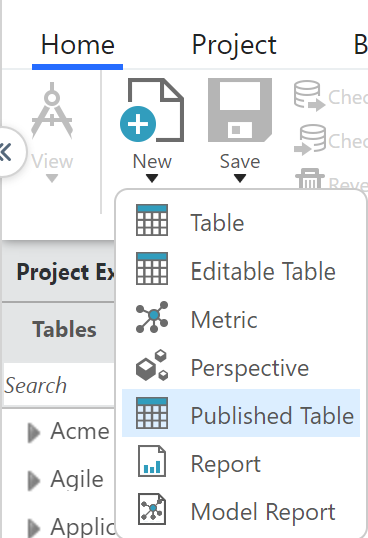
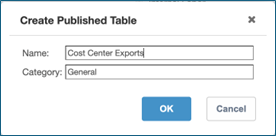
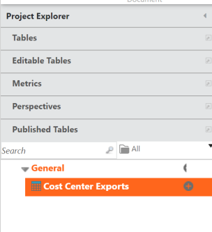
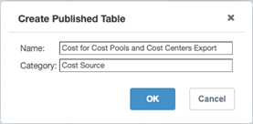
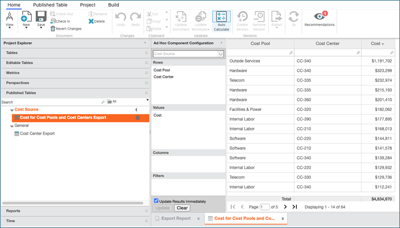
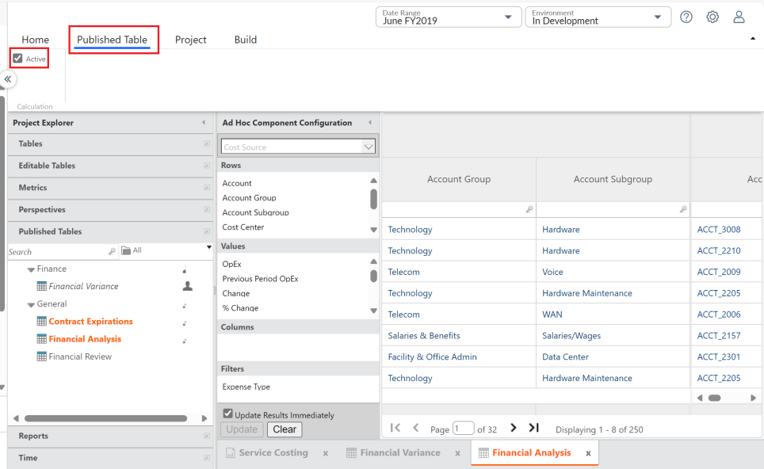
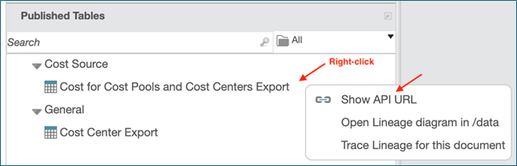
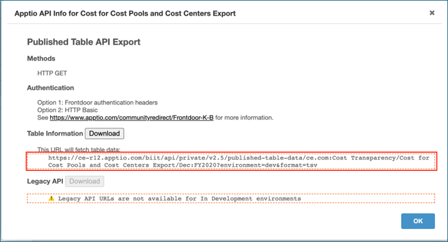

# Publicar tabelas para exportação

**Aplica-se a** : TBM Studio 12.11.3 e posterior. As tabelas publicadas são usadas para exportar dados de um projeto de cálculo de custos e planejamento para outro projeto de cálculo de custos e planejamento ou para um sistema de terceiros.

Antes desse recurso, os usuários tinham de criar um relatório para exportar dados. A principal preocupação era bloquear o relatório para que os usuários finais não pudessem acessá-lo. Algumas tabelas de exportação eram muito grandes, o que, por sua vez, aumentava a carga no sistema. Isso retardou o processo de cálculo de preparação, o que atrasou a disponibilidade da tabela.

Vantagens das tabelas publicadas

- Elimina o gerenciamento de relatórios e as permissões associadas durante a exportação de tabelas.
- Oferece suporte à criação de tabelas da mesma forma que um relatório.
- Oferece suporte à exportação assim que o cálculo do desenvolvimento é concluído.
- Cria uma maneira mais acessível, detectável e de fácil manutenção para exportar dados modelados.
- Remove a dependência da superfície de relatório TBM Studio de clientes que não são do Studio para exportar dados.

## Criação de uma tabela publicada

Há duas maneiras de criar uma tabela publicada.

## Método um: criar uma tabela publicada

1. Navegue até a guia **Home** e selecione **New (Novo** ).

   
2. Selecione **Tabela publicada**. Digite um nome e uma categoria e selecione **OK**.

   
3. A tabela recém-criada aparecerá na categoria especificada no Project Explorer.

   
4. Configure a tabela publicada da mesma forma que uma tabela de relatório (consulte a seção de ajuda [Tabelas em relatórios](../reports/tables/about-tables.htm "(Abre em uma nova guia ou janela)") ).

## Método dois: criar uma tabela publicada a partir de uma tabela de relatório existente

1. Navegue até um relatório existente com uma tabela que você deseja converter em uma tabela publicada.
2. Clique com o botão direito do mouse na tabela do relatório e selecione **Criar tabela publicada**.
3. Digite um nome e uma categoria e selecione **OK**.

   
4. A tabela recém-criada aparecerá na categoria especificada no Project Explorer.

   

## Opções de configuração

**Desativar / ativar o pré-cálculo**

1. No Project Explorer, faça checkout de todas as tabelas publicadas.
2. Selecione a guia Published Table (Tabela publicada) e ajuste a configuração Active (Ativo) adequadamente.

   

   - Se marcada, o sistema pré-calculará a tabela. Essa é a opção padrão, pois garante que a tabela estará pronta para exportação quando a API URL for usada.
   - Se estiver desmarcada, o sistema não pré-calculará a tabela. A API URL ainda funcionará, mas o sistema precisará calcular a tabela quando receber uma solicitação pela primeira vez.

## Uso de uma tabela publicada

1. Clique com o botão direito do mouse na **tabela publicada** para ver a API URL.

   
2. Copie o endereço URL e use-o em DataLinkou em uma automação com script.

   
