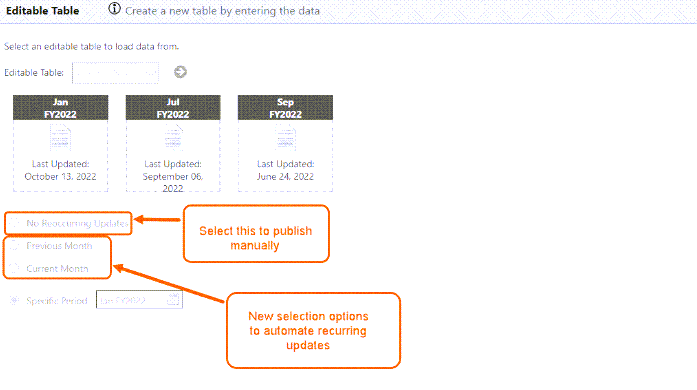

# Configurar o cronograma de atualização da tabela

**Aplica-se a** : TBM Studio 12.6 e posterior

Você pode publicar informações de uma tabela editável em uma tabela padrão por meio de três métodos principais:

1. Você pode "atualizar" manualmente em TBM Studio.
2. Você pode "publicar" manualmente as alterações do relatório.
3. Você pode "publicar" atualizações automaticamente em uma base rotineira.

## Atualizar manualmente em TBM Studio

1. Ir para **TBM Studio**
2. Selecione seu projeto na navegação à esquerda
3. Na seção Project Explorer, selecione uma tabela que deseja publicar. Por exemplo: Selecione a opção Transformar em Planejamento da demanda (com base em uma tabela editável).
4. Selecione a opção **Editable Table (Tabela editável** ) em **Steps (Etapas** ).
5. Depois de selecionar isso, você poderá ver diferentes períodos. Clique com o botão direito do mouse no ícone para atualizar esse período.

   

## Publicar manualmente as alterações na superfície de relatório

Você pode atualizar os dados em um relatório e publicar manualmente as alterações da tabela editável na tabela de transformação associada para ver os resultados no mesmo dia.

Pré-requisitos
:   Para publicar manualmente as alterações do relatório, você precisa de acesso Dev e acesso Stage como usuário, mas não precisa de acesso TBM Studio ou Admin.

Como publicar manualmente as alterações do relatório:
:   Em um relatório com uma tabela editável:

    1. Digite as alterações desejadas e selecione **Save (Salvar** ).
    2. Selecione **Publicar** na parte inferior do relatório > selecione **Publicar** novamente para ver o pop-up de aviso.
    3. Digite a descrição e selecione **Check In** no modal Check In.

## Configurar uma programação automática de atualização de tabela

1. Na barra da faixa de opções do site TBM Studio , selecione a guia **Build**.
2. Selecione **Promotion Options (Opções de promoção** ).
3. Selecione **Recurring Updates for Editable Tables (Atualizações recorrentes para tabelas editáveis** ).
4. Schedule Repeat (Programar repetição) = Daily (Diário) e definir Start Time (Hora de início) com Offset (Deslocamento).
5. Selecione **Adicionar nova hora de início** para criar até quatro tempos de execução.
6. Desmarque Ativar para desativar o recurso.

**Tópico pai:** [Tabelas editáveis: Acomodando a entrada do usuário](../../studio/data_studio/editabletables.html "Aplica-se a: TBM Studio 12.6 e posterior")
