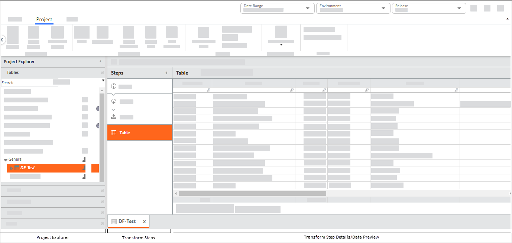
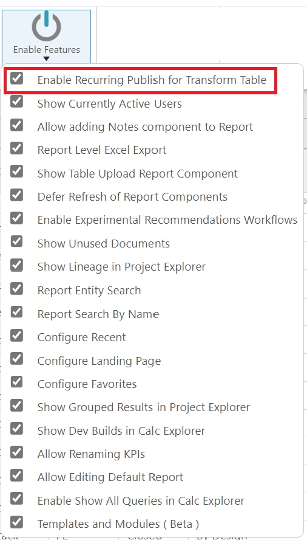
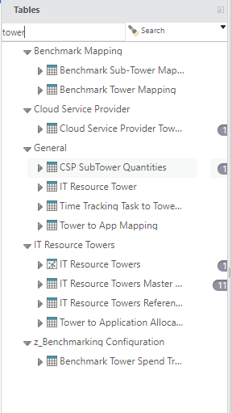
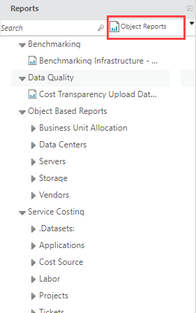
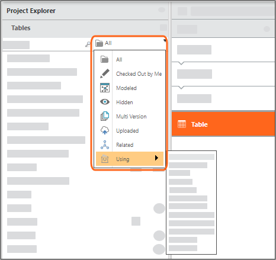
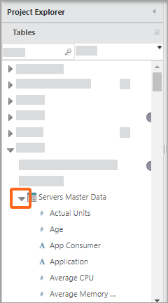
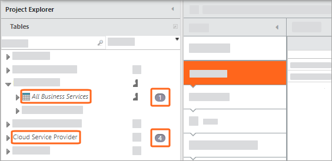
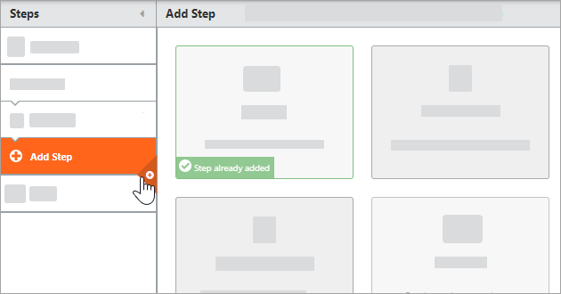

# O espaço de trabalho de transformação de dados

**Aplica-se a** : TBM Studio 12.0 e posterior. Use o espaço de trabalho de transformação de dados para importar dados e modificá-los para atender aos seus requisitos de dados.

O espaço de trabalho de transformação de dados é dividido em três painéis.

- Painel **Project Explorer** : Use para selecionar uma tabela que você deseja transformar.
- Painel **Transform Steps (Etapas de transformação** ): Use para adicionar etapas de transformação.
- Painel **Detalhes da etapa de transformação/visualização de dados** : Exibe detalhes sobre uma etapa de transformação ou exibe a tabela depois que a etapa atual é aplicada. As guias na parte inferior dos painéis Transform Steps (Etapas de transformação) e Transform Step Details (Detalhes da etapa de transformação) são documentos que você selecionou no **Project Explorer**.

  

## Explorador de projetos

O painel **Project Explorer** exibe os documentos que estão disponíveis. Os tipos de documentos são:

- Tabelas
- Tabelas editáveis
- Métricas
- Perspectivas
- Tabelas publicadas
- Relatórios
- Tempo

Ao trabalhar com dados, você se concentrará na seção **Tables (Tabelas** ).

Para exibir o painel **Project Explorer** :

- Em TBM Studio v12.1 e anteriores, clique no ícone do modo TBM
  Studio  no lado direito do cabeçalho Global.
- Em TBM Studio v12.2+, abra o menu Aplicativos/Projetos e clique em **TBM Studio**.

Para alterar a largura do painel **Explorer**, arraste a alça da borda direita. Para minimizar o painel **Explorer**, clique na seta de minimização no canto superior direito do painel.

## Expansão de pastas filtradas - Project Explorer

**Aplica-se a** : 12.11.2 e posterior

Esse recurso permite que você filtre e veja a qual pasta pertence uma tabela, tabela editável, perspectiva ou relatório. Para ativar esse recurso, navegue até a guia **Projetos** > **Ativar recursos** e marque a caixa de seleção **Mostrar resultados agrupados no Project Explorer**.

Para localizar um documento no **Project Explorer**, digite o termo de pesquisa na barra de pesquisa do Project Explorer ou selecione um filtro predefinido no menu suspenso. Os resultados da pesquisa serão mostrados dentro da pasta associada em uma exibição expandida. A exibição de pasta expandida não se aplica à seção Métricas e Tempo.

Limpar o termo de pesquisa na barra de pesquisa retornará automaticamente à exibição "Todos" no menu suspenso.

Observação: O triângulo azul indica que o sistema está consultando o back-end e os resultados ainda não foram retornados.

## Seção de tabelas

As tabelas são agrupadas por categoria. Por padrão, há uma categoria **Geral**. Também haverá outras categorias baseadas no aplicativo que você está usando e categorias personalizadas criadas por outros usuários. Você pode criar novas categorias ao criar uma nova tabela.

Para limitar as tabelas exibidas, use o filtro mostrado abaixo:

## Colunas da tabela

Para exibir as colunas em uma tabela, clique na seta à esquerda do nome da tabela. No exemplo abaixo, a tabela é **Servers Master Data (Dados mestre dos servidores** ).

As colunas são Unidades reais, Idade, etc.

O símbolo na frente do nome de uma coluna indica o tipo de coluna:

- () Tecla
- () Etiqueta
- () Numérico
- () Data

O status de um documento é indicado pela fonte:

- Simples: Com check-in
- *Itálico* : Verificado por outra pessoa
- **Orange Bold** : Verificado por você

## Erros de tabela

(Aplica-se a: TBM Studio v12.1, v12.2+.4 )

Ao trabalhar com tabelas e com o pipeline de transformação, pode ocorrer uma grande variedade de erros. Alguns dos erros típicos estão listados abaixo.

- Uma tabela anexada está faltando
- Uma etapa de transformação faz referência a uma coluna ausente em uma tabela

Se uma tabela tiver um ou mais erros, no Project Explorer, será exibido um número à direita do nome da tabela, indicando o número de erros. No exemplo abaixo, a tabela All Business Services tem um erro e a tabela Cloud Service Provider tem quatro erros. Quando você exibe o pipeline da tabela, um número é exibido à direita do nome da etapa, indicando o número de erros. Quando você aponta para o número com o cursor do mouse, uma dica de ferramenta exibe a mensagem de erro:

## Transformar o pipeline de etapas

Adicione etapas ao pipeline Transform Steps conforme necessário.

- Para exibir o painel **Transformar etapas**, selecione uma tabela na seção **Tabelas** do **Project Explorer**.
- Para adicionar uma etapa, mova o cursor até a linha que divide duas etapas existentes e, em seguida, clique no sinal de mais na borda direita do painel **Transformar etapas**. Clique no tipo de etapa que você deseja adicionar. Alguns tipos de etapas podem ser usados apenas uma vez em um pipeline, por exemplo, **Data Partition**. Se a etapa já tiver sido adicionada ao pipeline, um banner será exibido no canto inferior esquerdo da opção de etapa.

  
- Para alterar onde uma etapa ocorre em um pipeline, arraste a etapa para uma nova posição no pipeline. As etapas a seguir não podem ser reordenadas: Origem, Upload, Importação, Tabela, Modelo.
- Para minimizar o painel **Etapas**, clique na seta no canto superior direito do painel.
- Para ajustar a largura do painel **Project Explorer**, arraste a alça do divisor na borda direita.
- Para salvar as etapas de transformação, clique na guia **Home** e, em seguida, clique em **Save (Salvar** ).
