# Carregar um arquivo de dados

**Aplica-se a** : TBM Studio 12.0 e posterior. TBM Studio aceita dados de arquivos simples nos formatos separados por vírgula, tabulação, pipe, til, dois pontos e ponto e vírgula. Antes de fazer upload de dados, você deve criar uma tabela na qual os dados serão carregados, caso ela ainda não exista.

Para saber mais, consulte [Criar uma tabela](create-table.htm "(Abre em uma nova guia ou janela)"). Assista a este vídeo de demonstração do Apptio Education Services: [Importação de dados e configuração de cabeçalho na primeira linha (3 min.)](https://community.apptio.com/videos/1642 "(Abre em uma nova guia ou janela)")

Ou navegue por [todos os vídeos do site Apptio](https://community.apptio.com/docs/DOC-7714 "(Abre em uma nova guia ou janela)").

## Fazer upload de dados

Dica: se o nome do arquivo contiver mais de um ponto (.), o site TBM Studio retornará um erro de extensão de arquivo não suportada e não fará o upload do arquivo. Certifique-se de que o nome do seu arquivo tenha apenas um único ponto final antes da extensão do tipo de arquivo. Exemplos:

- example\_data.xlsx está correto.
- example.data.xlsx não está correto.

1. Em TBM Studio, verifique um documento. Para saber mais, consulte [Práticas recomendadas: Check-out e check-in](../admin/bp-check-out.html "(Abre em uma nova guia ou janela)").
2. Clique em **Source** no pipeline de transformação da tabela.
3. No campo **Descrição da tabela**, digite uma breve descrição da finalidade da tabela.
4. Clique em **File Upload**.
   - Se você fez check-out de uma tabela existente, já deve ter uma etapa de Upload.
   - Se você tiver criado uma nova etapa, uma etapa **de Upload** será adicionada ao pipeline.
5. Execute uma das seguintes ações:
   - Clique no painel **Detalhes** e navegue até o arquivo que deseja carregar.
   - Arraste um arquivo para o painel **Detalhes**.

     Uma etapa **de importação** é adicionada ao pipeline.

     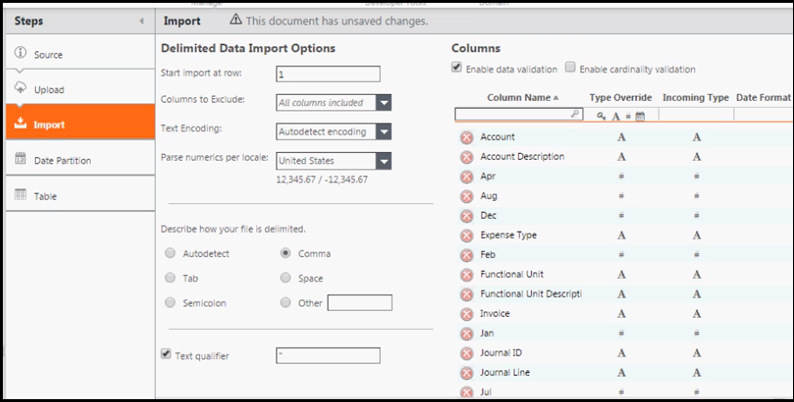
6. Clique na etapa **Importar** no pipeline e revise as configurações:
   - **Iniciar a importação na linha** : Indique a primeira linha da tabela a ser incluída na importação. A importação sempre inclui a linha do cabeçalho no arquivo. O número inserido designa a linha de dados em que a importação será iniciada. Por exemplo, na planilha abaixo, inserir um 2 no campo começará com a linha de Nova York, pois é a segunda linha de dados.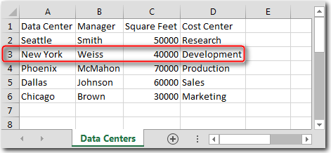
   - **Colunas a serem excluídas** : Indique se há colunas que você deseja excluir.
   - **Codificação de texto** : Se o arquivo de dados usar uma codificação de caracteres específica, selecione o esquema de codificação na lista. Se você não tiver certeza sobre a codificação, selecione a opção **Autodetect encoding (Detectar codificação automaticamente** ).
   - **Delimitado** : Selecione o caractere que separa os campos de dados no arquivo. Na maioria das vezes, será uma vírgula.
   - **Qualificador de texto** : Se houver caracteres de texto especiais nos dados, indique o qualificador de texto que é usado para envolver esses caracteres. O padrão são aspas duplas.
   - **Columns (Colunas** ): Revise as colunas listadas e, se desejar, altere os tipos de coluna. Para filtrar por tipo de coluna (chave, texto, número, data), clique em um ícone de tipo no campo de pesquisa da coluna **Tipo**.

     Dica: a etapa Importar suporta validações de dados e de cardinalidade, conforme descrito abaixo.
7. Para revisar a tabela carregada, clique na etapa **Tabela** no pipeline.
8. Se a tabela for aceitável, clique em **Save (Salvar** ) na guia Home (Página inicial).
9. Se você terminar de fazer as edições, clique em **Check In**.

## Validação de dados e cardinalidade

(Aplica-se a: TBM Studio v12.1 e posterior)

Quando você faz upload de dados, o aplicativo pode verificar a validação de dados e a validação de cardinalidade. As opções estão disponíveis na etapa Importar dos pipelines de transformação.

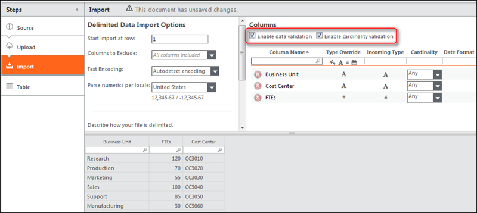

A validação de dados se aplica quando você está fazendo upload de dados para uma tabela existente. Ele verifica o seguinte:

- Coluna adicionada
- Coluna excluída
- Alteração da cardinalidade da coluna
- O tipo de coluna foi alterado entre a substituição de tipo, o documento da tabela bruta existente e o documento da tabela de preparação

A validação de cardinalidade se aplica a novas tabelas e a tabelas existentes. Ele verifica o conteúdo de uma coluna. Ele pode ser aplicado a cada coluna separadamente. Há três opções:

- Qualquer: Desativa a validação de cardinalidade da coluna.
- Um: verifica se a coluna contém valores exclusivos. Não há duplicatas.
- Muitos: Verifica se todas as entradas da coluna estão duplicadas.

## Fazer upload de dados adicionais em uma tabela

Você pode carregar dados adicionais em uma tabela. Por exemplo, você pode querer carregar dados de custo mensal. Você pode anexar os dados ou substituir os dados existentes por novos dados.

O upload de dados adicionais em uma tabela pode ser feito de duas formas:

- Anexar vários arquivos ao mesmo período de tempo.
- Carregar os dados da mesma tabela em diferentes períodos de tempo, que esta seção descreve.

Para carregar dados adicionais em uma tabela:

1. Dê uma olhada na tabela.
2. Altere o seletor de data para o período em que os dados serão adicionados. Um espaço reservado é adicionado à etapa Upload no pipeline de transformação. Na imagem a seguir, foi adicionado um espaço reservado para março: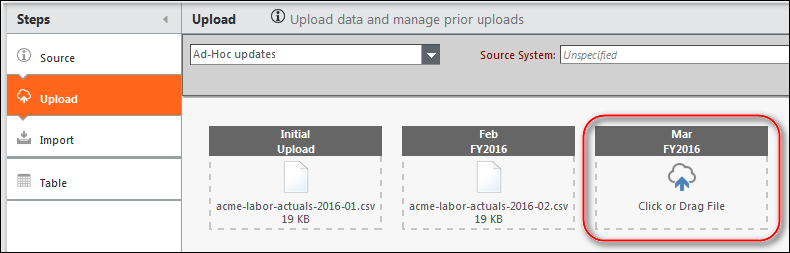
3. Clique no espaço reservado e navegue até o arquivo que deseja carregar ou arraste um arquivo do Windows Explorer para o espaço reservado.
4. Salve as alterações.

Upload de dados durante um período de tempo inválido
:   Um exemplo de critério para as seguintes condições

    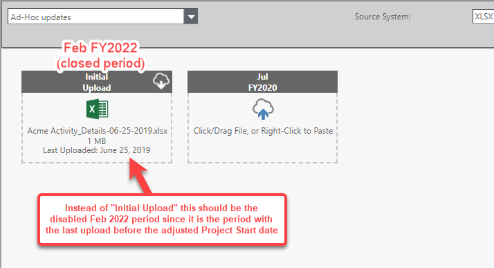

    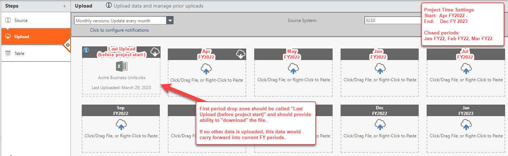

    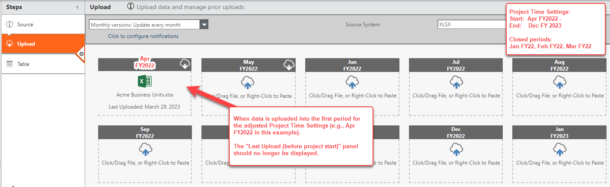

    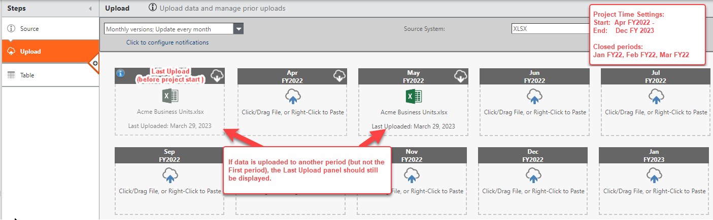

## Formatos de dados

O aplicativo aceita dados de arquivos simples nos formatos separados por vírgula, tabulação, pipe, til, dois pontos e ponto e vírgula. Para carregar um arquivo de dados, clique na opção **File Upload**. Antes de fazer upload de dados, você deve criar uma tabela na qual os dados possam ser carregados.

Dica: se o nome do arquivo contiver mais de um ponto (.), o site TBM Studio retornará um erro de extensão de arquivo não suportada e não fará o upload do arquivo. Certifique-se de que o nome do seu arquivo tenha apenas um único ponto final antes da extensão do tipo de arquivo. Exemplos:

- example\_data.xlsx está correto.
- example.data.xlsx não está correto.

## Ciclos de atualização de dados

Ao criar uma nova tabela por meio do upload de um arquivo de dados, é possível selecionar um ciclo de atualização no campo na parte superior da tela que descreve a frequência com que se espera que um conjunto de dados seja atualizado. As opções são mostradas abaixo. Isso é apenas descritivo. Ele não executa uploads.

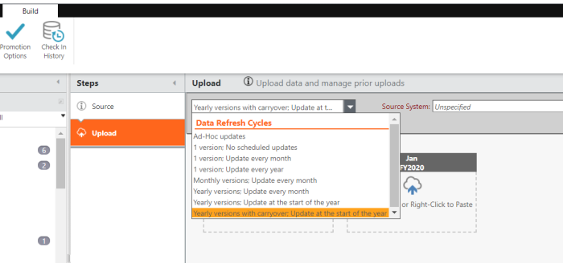

Dica: você pode alterar o ciclo de atualização de dados de **atualizações Ad-Hoc** para versões mensais ou anuais. Para fazer isso, você deve se certificar de carregar arquivos de dados para cada um dos períodos de upload exibidos no painel **Upload**. Se você deixar períodos de upload sem arquivos de dados, isso poderá afetar o modelo de custo.

Os ciclos de atualização de dados são descritos abaixo:

|  |  |
| --- | --- |
| Atualizações ad hoc | As atualizações serão feitas conforme necessário. Os dados podem ser anexados à tabela existente ou substituir a tabela existente. Nenhuma verificação de expiração de dados será executada. |
| 1 versão; sem atualizações programadas | Os dados carregados substituirão os dados existentes. Nenhuma verificação de expiração de dados será executada. |
| 1 versão; atualização mensal | Os dados serão atualizados todos os meses. Os novos dados substituirão os dados existentes. No relatório de qualidade de dados Costing Standard , as verificações de expiração de dados mostrarão os dados como expirados se não tiverem sido atualizados no último mês. |
| 1 versão; atualização anual | Os dados serão atualizados todos os anos. Os novos dados substituirão os dados existentes. No relatório de qualidade de dados Costing Standard , as verificações de expiração de dados mostrarão os dados como expirados se não tiverem sido atualizados no último ano. |
| Versões mensais; atualização todo mês | Os dados serão atualizados mensalmente. Os novos dados serão adicionados a um período diferente e não sobrescreverão os dados existentes. No relatório de qualidade de dados Costing Standard , as verificações de expiração de dados mostrarão os dados como expirados se não tiverem sido atualizados no último mês. |
| Versões anuais; atualização mensal | Um ano de dados é carregado todo mês, abrangendo os últimos 12 meses. Os novos dados serão adicionados a um período diferente e não sobrescreverão os dados existentes. No relatório de qualidade de dados Costing Standard , as verificações de expiração de dados mostrarão os dados como expirados se não tiverem sido atualizados no último mês. |
| Versões anuais; atualização no início do ano | Os dados de um ano são carregados no início de cada ano fiscal. Os novos dados serão adicionados a um período diferente e não sobrescreverão os dados existentes. Se um conjunto de dados não for carregado para o próximo ano, os dados serão transferidos para o período subsequente. No relatório de qualidade de dados, as verificações de expiração de dados mostrarão os dados como expirados se não tiverem sido atualizados no último ano. Selecione essa opção para tabelas em que os valores são diferentes a cada ano. |
| Versões anuais com transporte; atualização no início do ano | Os dados de um ano são carregados no início de cada ano fiscal. Os novos dados serão adicionados a um período diferente e não sobrescreverão os dados existentes. Se um conjunto de dados não for carregado para o ano seguinte, os valores do ano anterior serão transferidos. Selecione essa opção para tabelas em que os valores são praticamente os mesmos a cada ano. |

## Verificação da expiração de dados

Esse recurso é aplicável à versão 12.10.8 e superior.

O link **Clique para configurar as notificações** permite configurar as notificações para os usuários quando os dados carregados expirarem. Ele envia lembretes para que os usuários façam o upload dos dados novos, de acordo com o ciclo de atualização de dados escolhido.

Observação: esse link aparece para todas as opções de atualização de dados, exceto **atualizações Ad-Hoc** e **versão 1; sem atualizações programadas**.

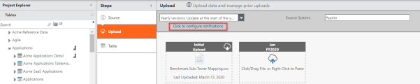

Clique no link para fornecer os detalhes e selecione o botão **Create (Criar** ).

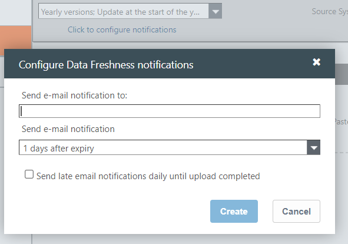

|  |  |
| --- | --- |
| Enviar notificação por e-mail para: | Digite o ID de e-mail do usuário para o qual a notificação deve ser enviada. Você pode inserir vários IDs de e-mail aqui. |
| Enviar notificação por e-mail | Escolha o número de dias após os quais o e-mail de notificação deve ser enviado. |
| Enviar notificações por e-mail diariamente até a conclusão do upload | Marque essa caixa de seleção se quiser enviar diariamente e-mails de notificação de arquivos atrasados. Os e-mails serão enviados até que os dados novos sejam carregados. |

Depois que a configuração for criada, você poderá passar o cursor sobre o link para ver os detalhes da configuração.

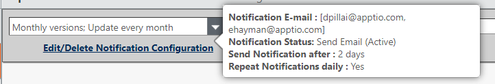

## Verificação do frescor da data

Para verificar se novos dados foram carregados, navegue até a aba **Projeto** e então selecione **a opção Atualidade dos Dados**.

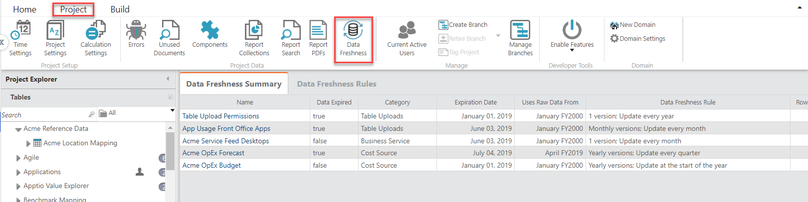

Você pode ver os seguintes detalhes aqui:

- **Resumo do frescor dos dados** : mostra a lista de arquivos com suas informações de expiração
- **Data Freshness Rules (Regras de atualização de dados** ): mostra a lista de regras, com a opção de adicionar mais regras

## Criar uma tabela a partir de uma tabela existente

Para criar uma tabela a partir de uma tabela existente, clique com o botão direito do mouse em uma etapa do pipeline de transformação e clique em **Criar nova tabela a** partir dessa etapa. A ação Criar nova tabela está disponível em algumas, mas não em todas, as etapas de um pipeline. A tabela criada não será vinculada à tabela original. Para saber mais, clique [aqui](create-table-from-existing-table.htm "(Abre em uma nova guia ou janela)").
