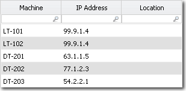
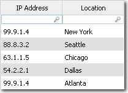
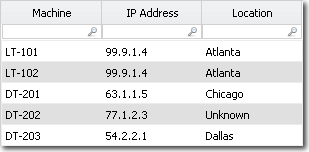

# Função IPLookup

**Aplica-se a** : TBM Studio 12.0 e posterior

Localiza um endereço IP em uma coluna de origem especificada na tabela atual e procura um endereço IP em uma coluna especificada de uma tabela de pesquisa. IPLookup retorna o valor na coluna de substituição especificada correspondente da tabela de pesquisa para a última correspondência encontrada. Os endereços IP podem ser inseridos individualmente ou usar máscaras e intervalos.

## Onde usar

Essa função pode ser usada em:

- Conjuntos de dados
- Colunas de fórmula em tabelas de relatórios

## Sintaxe

`IPLookup(source_column,lookup_table,matching_column,replacement_column,"default_value")`

## Argumentos

*coluna\_fonte*

A coluna da tabela atual que contém o endereço IP que você deseja pesquisar. Observação: digite apenas o nome da coluna, não o nome da tabela name.column.

*tabela de pesquisa*

O nome da tabela que contém os valores de retorno.

*coluna\_correspondente*

A coluna na *lookup\_table* na qual se deve procurar uma correspondência. Os valores podem estar em um dos vários formatos:

- Endereços IP específicos, como 99.9.1.4.
- Máscaras de endereço IP, como 99.1.0.0, em que 0.0 corresponderá a qualquer conjunto de números. Por exemplo, 99.1.0.0 incluiria endereços IP como 99.1.5.6, 99.1.9.234 e 99.1.43.144.
- Faixas de endereços IP, como 99.1-99.6, que corresponderão a qualquer faixa de IP entre os dois valores. Por exemplo, o intervalo 99.1-99.6 incluiria endereços IP como 99.1.1.4, 99.3.1.54 e 99.6.6.6.

*coluna\_substituição*

A coluna na *lookup\_table* que fornece o valor de retorno.

*valor padrão*

O valor a ser retornado se nenhuma correspondência for encontrada. O valor deve estar entre aspas.

## Tipo de retorno

O tipo de *replacement\_column* ou *default\_value*, o que for aplicável.

## Exemplo

Suponha que você tenha a seguinte tabela, chamada Machines (Máquinas), que lista as máquinas e seus endereços IP:



Com base no endereço IP, você deseja preencher a coluna Location. Você tem a seguinte tabela chamada Locais que pode fornecer os locais:



Você insere o seguinte no campo Substituição de valor para a coluna Localização na tabela Máquinas:

```
=IPLookup(IP Address,Location,IP
          Address,Location,"Unknown")
```

O resultado é:



Nota:

- As duas primeiras máquinas têm um endereço IP de 99.9.1.4 e são atribuídas a Altanta, não a Nova York. Isso ocorre porque, na tabela Locations (Locais), a última referência para o endereço IP 99.9.1.4 é Atlanta.
- 77.1.2.3 não está listado na tabela Locations, portanto, o valor **Unknown** é retornado.

Consulte também:

- [Lookup e Lookup\_Wild](lookupandlookup_wild.htm "(Abre em uma nova guia ou janela)")
- [LookupEx](lookupexandlookupex_wild.htm "(Abre em uma nova guia ou janela)")
- [LookupFromPath](lookupfrompath.htm "(Abre em uma nova guia ou janela)")
- [LookupMetric](lookupmetric.htm "(Abre em uma nova guia ou janela)")
- [LookupObjectTotalAllocated](lookupobjecttotalallocated.htm "(Abre em uma nova guia ou janela)")
- [LookupObjectTotalValue](lookupobjecttotalvalue.htm "(Abre em uma nova guia ou janela)")
- [LookupObjectUnitAllocated](lookupobjectunitallocated.htm "(Abre em uma nova guia ou janela)")
- [LookupObjectUnitValue](lookupobjectunitvalue.htm "(Abre em uma nova guia ou janela)")
