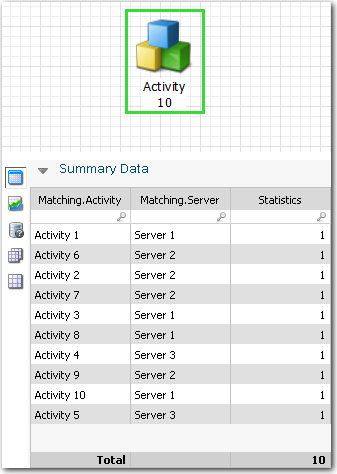
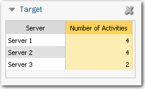

# LookupObjectUnitValue função

**Aplica-se a** : TBM Studio 12.0 e posterior

Encontra o valor de uma unidade para um objeto. Se o parâmetro driver for fornecido, ele procurará o valor total do driver especificado.

A função LookupObjectUnitValue é frequentemente usada para ponderar um direcionador de custo em relação ao custo calculado em outra parte de um modelo. Tenha cuidado para não criar referências circulares em seus cálculos.

## Onde usar

Essa função pode ser usada em:

- Métricas calculadas e relatórios com colunas de métricas
- Colunas de fórmula em tabelas de relatórios
- Texto Dinâmico
- Fórmulas de fontes de alocação

## Sintaxe

*LookupObjectUnitValue(object,metric,targetCol,lookupCol[,driver])*

## Argumentos

*objeto*

O nome do objeto que fornecerá um valor de custo.

*métrica*

O nome da métrica a ser pesquisada. Geralmente, essa é a mesma métrica em que você está usando a função.

*targetCol*

O nome da coluna na tabela de origem que será combinada com o lookupCol.

*lookupCol*

O nome da coluna na tabela de correspondência que fornecerá o valor de pesquisa.

*motorista*

Esse é um parâmetro opcional. Se você especificar um driver, isso limitará a função ao valor que está sendo contribuído pelo driver especificado. Por exemplo, se os drivers A e B contribuírem com valor para a unidade C, você poderá limitar a função LookupObjectUnitValue ao valor fornecido pelo driver A ou pelo driver B.

## Tipo de retorno

Sequência

## **Exemplo 1**

Suponha que você tenha o objeto e a tabela a seguir em um modelo chamado Statistics (Estatísticas):

Como mostrado acima, o objeto Activity tem um identificador de unidade Matching.Activity e um driver com a fórmula =1. A fórmula produz os valores na coluna Statistics (Estatísticas) na tabela acima. A função LookupObjectUnitValue usará os valores da coluna Statistics (Estatísticas) para fazer os cálculos.

Você colocou a seguinte tabela de destino em um relatório:

Você deseja determinar o número de atividades associadas a cada servidor e exibir o resultado na coluna **Number of Activities (Número de atividades** ) da tabela Target (Destino).

Na coluna **Número de atividades**, insira a seguinte fórmula:

`=LookupObjectUnitValue(Activity,Statistics,Server,Matching.Server)`

em que:

- **Activity** é o nome do objeto.
- **Statistics** é o nome da métrica do modelo.
- **Server** é o nome da coluna na tabela Target.
- **Matching.Server** é o nome da coluna de pesquisa na tabela de unidades de objeto Activity.

## Exemplo 2

Suponha que você tenha o modelo de custo mostrado na imagem a seguir:

No modelo, os valores do objeto Servers são alocados para o objeto OS Direct, conforme mostrado. O resultado é que 80% dos custos diretos são alocados aos servidores Windows e 20% aos servidores Linux. O objeto Shared representa um único balde de US$ 600. Você deseja alocar os US$ 600 para o objeto OS Indireto na mesma proporção que os custos do objeto OS Direto.

Para alocar os custos, você cria duas alocações separadas do objeto Shared para o objeto OS Indirect: uma para o Windows e outra para o Linux. Para ambas as alocações, você usa a seguinte fórmula:

=SOURCE\*LookupObjectUnitValue(OS Direto, Custo, OS Indirect.OS,OS Direct.OS)/LookupObjectTotalValue(OS Direto, Custo)

Na fórmula, os US$ 600 (SOURCE) são multiplicados pela proporção entre LookupObjectUnitValue e LookupObjectTotalValue.

Para direcionar cada alocação para o sistema operacional correto, selecione a opção **Some (Alguns** ) na caixa de diálogo **Properties (Propriedades** ) e filtre por Windows ou Linux.

**Consulte também:**

- [Pesquisa de IP](iplookup.htm "(Abre em uma nova guia ou janela)")
- [Lookup e Lookup\_Wild](lookupandlookup_wild.htm "(Abre em uma nova guia ou janela)")
- [LookupEx](lookupexandlookupex_wild.htm "(Abre em uma nova guia ou janela)")
- [LookupFromPath](lookupfrompath.htm "(Abre em uma nova guia ou janela)")
- [LookupMetric](lookupmetric.htm "(Abre em uma nova guia ou janela)")
- [LookupObjectTotalValue](lookupobjecttotalvalue.htm "(Abre em uma nova guia ou janela)")
- [LookupObjectTotalAllocated](lookupobjecttotalallocated.htm "(Abre em uma nova guia ou janela)")
- [LookupObjectUnitAllocated](lookupobjectunitallocated.htm "(Abre em uma nova guia ou janela)")
