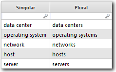

# Função no plural

retorna a forma plural de um determinado substantivo singular com base em uma contagem. Isso é útil para gerar dinamicamente rótulos ou cadeias de caracteres de exibição gramaticalmente corretos.

## Sintaxe

`Plural(noun,count)`

## Argumentos

*substantivo* : A forma singular de um substantivo para pluralizar (por exemplo, "servidor", "data center"). Há suporte para substantivos compostos e frases com várias palavras. Observação: esse parâmetro aceita uma expressão, o que significa que você pode fornecer um valor literal, uma referência de coluna ou o resultado de outra função. Necessário

*contagem* : Uma expressão numérica usada para determinar se o substantivo deve ser pluralizado. Se o valor for maior que 1, o substantivo será pluralizado. Se for omitido, o substantivo será sempre pluralizado. Observação: esse parâmetro aceita uma expressão, o que significa que você pode fornecer um valor literal, uma referência de coluna ou o resultado de outra função. Opcional

## Tipo de retorno

Sequência

## Exemplo

- `Plural("server", 2)`: Retorna "servidores" porque a contagem é maior que um.
- `Plural("network", {Network Count})`: Retorna "network" ou "networks" com base no valor em {NetworkCount}.
- `Plural("operating system")`: Retorna "operating systems" (sistemas operacionais), pois nenhuma contagem é especificada (sempre no plural).

Nota:

- Essa função não converte automaticamente a saída em letras minúsculas. Para fazer isso, envolva-o na função Lower (por exemplo, Lower(Plural(...))).
- Melhor usado em colunas do tipo rótulo ou expressões de saída formatadas em que a precisão gramatical é importante.
- Não há suporte para substantivos irregulares - aplicam-se as regras de pluralização padrão.
