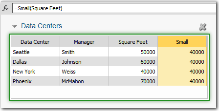

# Função pequena

Retorna o menor valor em uma coluna especificada.

## Sintaxe

`Small([rollup_operator]column)`

## Parâmetros

*operador de rollup*

@, SOURCE, ~ ou TARGET. Esse argumento é opcional e usado somente com métricas. Consulte [Operadores de rollup](../operators.html "Aplica-se a: TBM Studio 12.0 e posterior").

*coluna* : A coluna para pesquisar o menor valor. Você pode especificar um prefixo de tabela usando TableName:ColumnName. Necessário

## Comportamento

Examina a coluna especificada e retorna o menor valor (mínimo).

## Tipo de retorno

Número

## Exemplos

`=Small(@Desktop)`

`=Small(Desktop)`

`Small(Budget)`: Retorna o menor valor da coluna "Orçamento".

`Small(Financials:Cost)`: Retorna o menor valor da coluna "Cost" na tabela "Financials".
