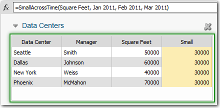

# SmallAcrossTime função

**Aplica-se a** : TBM Studio 12.0 e posterior

Retorna o menor valor em uma coluna especificada em um ou mais períodos de tempo.

Se nenhum período de tempo for especificado, ele se comportará como a função Small. A exceção é se houver um trend\_append[timeperiods] mais adiante no caminho, caso em que o trend\_append injetará seus períodos de tempo na função SmallAcrossTime em algum ponto do caminho quando for encontrar as tabelas a serem incluídas na tendência.

## Onde usar

Essa função pode ser usada em:

- Conjuntos de dados (com argumentos de coluna e rollup)
- Métricas calculadas e relatórios com colunas de métricas (com argumento de rollup)
- Colunas de fórmula em tabelas de relatórios (com argumentos de coluna e rollup)

Em qualquer driver de unidade de objeto modelado ou em qualquer tabela agrupada.

## Sintaxe

`Small(column, period, period, etc.)`

## Argumentos

*coluna*

A coluna da qual será retornado o menor número.

*período*

O período ou períodos a serem pesquisados. O formato deve ser MMM AAAA. Por exemplo: Janeiro de 2013. Não há limite para o número de períodos que você pode incluir.

## Tipo de retorno

O mesmo que o tipo de coluna.

## Exemplos

No exemplo abaixo, o valor da coluna Small está sendo extraído de um período diferente do período exibido atualmente:

Consulte também:

- [Média](average.htm "(Abre em uma nova guia ou janela)")
- [Percentil](percentile.htm "(Abre em uma nova guia ou janela)")
- [Grande](large.htm "(Abre em uma nova guia ou janela)")
- [Min](min.htm "(Abre em uma nova guia ou janela)")
- [Máx.](max.htm "(Abre em uma nova guia ou janela)")
