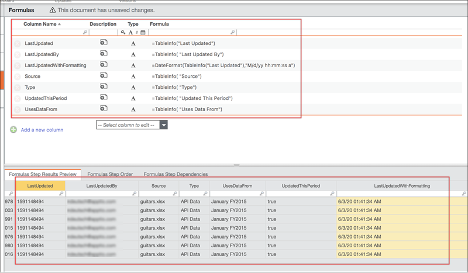

# TableInfo função

**Aplica-se a** : TBM Studio 12.9 e posterior

A função TableInfo adiciona uma ou mais colunas de tabela que fornecem informações sobre o último upload para a tabela. TableInfo são especialmente úteis para a validação de dados. Não há suporte para períodos agregados.

**Onde usar**

Essa função é usada em qualquer tabela em que você possa aplicar fórmulas.

**Sintaxe**

`TableInfo(metric,<tableName>,[timePeriod])`

**Argumentos**

*métrica*

Cada uma das métricas a seguir adiciona uma coluna:

- **Last Updated (Última atualização** ) - A data (carimbo de data/hora) em que os dados brutos foram atualizados pela última vez. Essa métrica retorna o número de segundos desde 1º de janeiro de 1970, que pode ser formatado opcionalmente com a fórmula DateFormat. Por exemplo:
- =DateFormat(TableInfo("Last Atualizado"), "M/d/yy hh:mm:ss a")
- Last Updated By - O endereço userID da pessoa que atualizou os dados brutos pela última vez.
- **Fonte** - O nome do arquivo carregado, semelhante à coluna Fonte na tabela.Datasets.
- **Type** (Tipo) - O tipo da fonte de dados, semelhante à coluna Type (Tipo) na tabela.Datasets.
- **Usa dados de** - O período de tempo do qual os dados brutos estão sendo copiados.
- **Atualizado neste período** - Verdadeiro/falso, indicando se o arquivo foi carregado nesse período.
- *tableName -* O nome da tabela que está ingerindo as informações recuperadas. O padrão é o nome da tabela atual, a menos que especificado de outra forma.
- *timePeriod* - O período atual, se não especificado de outra forma.
- **Tipo de retorno** - A função suporta texto e números.

## Exemplos

A seguir, um exemplo de várias fórmulas de métricas e as colunas resultantes.

