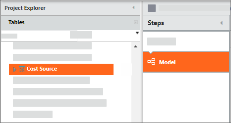
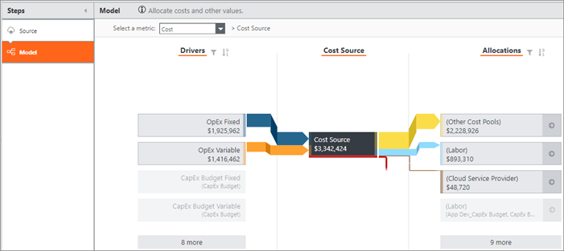

# Adicionar uma tabela ao modelo

**Aplica-se a** : TBM Studio 12.0 e posterior

Se você quiser que uma tabela faça parte do modelo, adicione uma etapa **Model** à transformação da tabela.

## Adicionar uma etapa de modelo

1. Dê uma olhada na tabela.
2. Adicione uma nova etapa e selecione Modelo como o tipo de etapa que você deseja adicionar.
3. Salve as alterações.

Depois de adicionar a etapa **Modelo**, a tabela é exibida em uma única visualização de tabela:

