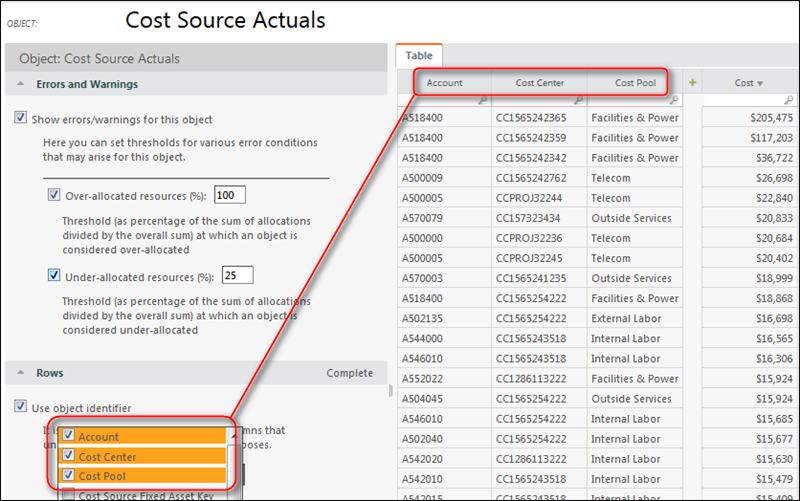

# Criar um identificador de tabela personalizado

**Aplica-se a** : TBM Studio 12.0 e posterior. O ambiente de modelagem Apptio oferece uma estrutura flexível para manipular dados em agrupamentos que formam a base para alocações e relatórios. A seguir, serão explicadas as práticas recomendadas para escolher o identificador correto para uma determinada tabela de modelos.

Os identificadores de tabela são usados para vincular tabelas modelo a uma coluna subjacente em uma tabela. O identificador é semelhante a uma chave primária em um banco de dados relacional, e a melhor prática é fazer com que o identificador consista em valores exclusivos. Os valores exclusivos suportam relatórios granulares e a capacidade de detalhar o item de linha individual.

Ao escolher um identificador, você deve considerar o seguinte:

- Qual é o nível mais granular de agrupamento que quero usar nessa tabela?
- Posso encontrar uma única coluna que tenha valores exclusivos para cada linha?
- Preciso concatenar várias colunas para obter exclusividade?
- Como os dados que fazem o backup dessa tabela se relacionam com os dados da(s) tabela(s) à(s) qual(is) ela se aloca?

Por padrão, o aplicativo cria um identificador que identifica exclusivamente cada linha. No entanto, você pode criar um identificador personalizado que forneça o nível de detalhe que deseja usar ao alocar valor no modelo e ao criar relatórios. Por exemplo, você pode querer agrupar valores por departamento, conta ou algum outro valor para reduzir os tempos de cálculo e fornecer relatórios de nível mais alto.

Para criar um identificador de tabela personalizado:

1. Clique na etapa **Modelo** no pipeline de transformação da tabela.
2. Clique na tabela na visualização **Single-Table** do modelo.
3. No painel **Rows (Linhas** ) mostrado na imagem a seguir, marque as colunas que você deseja usar para criar o identificador. As colunas são adicionadas à tabela à direita. A tabela mostra o custo de cada linha e o valor alocado:
4. Para retornar ao diagrama Sankey, clique em **Close (Fechar** ) na parte inferior do painel.
