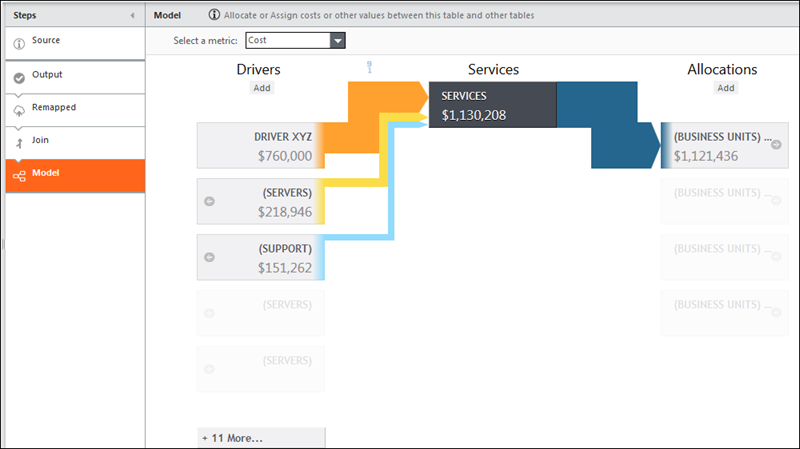
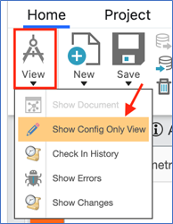
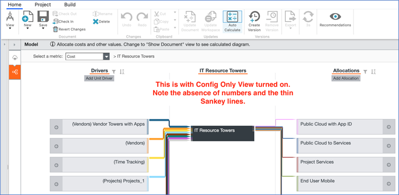
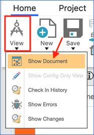

# O espaço de trabalho de edição do modelo

**Aplica-se a** : TBM Studio 12.0 e posterior

Use o espaço de trabalho de edição de modelo para adicionar drivers a uma tabela e alocar valores da tabela para outras tabelas. Para exibir o espaço de trabalho, clique na etapa **Modelo** na transformação de uma tabela. Um exemplo do espaço de trabalho é mostrado na imagem a seguir:

Assista a este vídeo de demonstração do Apptio Education Services: [Visualizar estratégias de alocação de custos (2 min.)](https://community.apptio.com/videos/1829 "(Abre em uma nova guia ou janela)") Ou navegue por [todos os vídeos do site Apptio](https://community.apptio.com/docs/DOC-7714 "(Abre em uma nova guia ou janela)").

## Motoristas

No espaço de trabalho de edição, a tabela que está sendo editada é exibida na coluna central. Na Figura A, a tabela é Serviços. A unidade e os drivers de alocação são exibidos na coluna da esquerda.

- Na imagem anterior, há um driver de unidade chamado **Driver XYZ**.
- Os títulos dos drivers de alocação estão entre parênteses. Isso ocorre porque eles estão usando os nomes padrão para as tabelas. Se você alterar o nome padrão, os parênteses não serão exibidos. Na Figura A, há dois drivers de alocação: **Servidores** e **Suporte**. Para navegar até um driver de alocação, clique na seta na borda esquerda da caixa do driver.

## Alocações

As tabelas de alocação de destino são exibidas na coluna da direita. O valor da tabela que está sendo editada pode ser alocado a uma ou mais tabelas. Na imagem anterior, o valor de **Serviços** está sendo alocado para a tabela de **Unidades de Negócios**.

## Visualização somente de configuração

Se estiver editando uma tabela modelada, poderá usar a visualização "Config Only" para tornar as coisas mais rápidas. Isso permite que você edite a configuração mais rapidamente, sem tantos atrasos relacionados à atualização das visualizações pelo sistema. Lembre-se de que isso é alternado de acordo com o objeto.

O modo Config Only (Somente configuração) pode ser acessado pelo menu suspenso "View" (Exibir) na faixa de opções, como segue:

Quando isso estiver ativado, você não verá números na visualização do modelo:

Para desativar a visualização somente de configuração, selecione "Show Document" (Mostrar documento) no mesmo menu suspenso:

