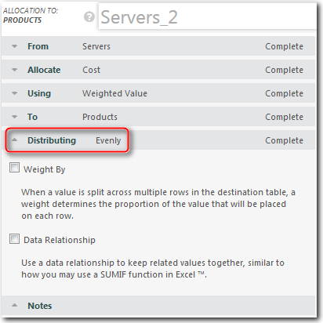
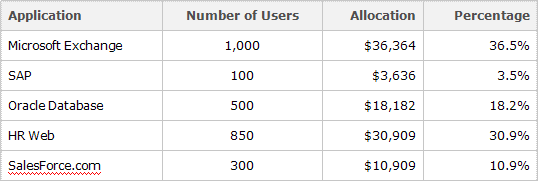

# Alocações de recursão

**Aplica-se a** : TBM Studio 12.0 e posterior

A premissa básica da alocação recursiva é que algum valor permaneça em uma ou mais unidades de destino após cada iteração. A cada iteração, o valor nas unidades de destino aumenta e o valor restante nas unidades de origem diminui até que haja uma quantidade mínima restante nas unidades de origem.

Em uma alocação de recursão, os objetos de origem e destino devem ter unidades idênticas.

Ao definir uma alocação recursiva, você define três parâmetros:

- **Precisão** - Especifica o valor mínimo que deve existir na tabela de origem para que uma alocação recursiva seja executada. Se o valor ficar abaixo do mínimo, nenhuma outra iteração será executada. O valor é a quantidade total movida para a iteração, não uma quantidade por linha.
- Máximo **de iterações** - Especifica o número máximo de vezes que a alocação será repetida. Se o valor de precisão for atingido antes que o número máximo de iterações tenha sido realizado, as iterações restantes não serão realizadas.
- **Usar modo incremental** - Quando marcado, o valor de origem para cada iteração é o total do valor original mais o valor alocado ao destino da iteração anterior. Quando verificado no final da recursão, o valor total de ambos os objetos será maior do que o valor de origem original.

## São necessárias tabelas de origem e destino exclusivas

Você pode ter várias alocações recursivas em um modelo, mas cada alocação recursiva deve ter tabelas de origem e destino exclusivas e não deve se sobrepor. Por exemplo, suponha que você tenha cinco tabelas em um modelo:

> A -> B -> C -> D -> E -> F

Você poderia criar alocações recursivas entre as tabelas A e C e as tabelas D e F, mas não poderia criar uma terceira alocação recursiva entre as tabelas B e E. A terceira alocação se sobreporia às duas primeiras alocações.

## Como funciona a alocação recursiva

A premissa básica da alocação recursiva é que algum valor permaneça em uma ou mais unidades de destino após cada iteração. A cada iteração, o valor nas unidades de destino aumenta e o valor restante nas unidades de origem diminui até que haja uma quantidade mínima restante nas unidades de origem.

Por exemplo, suponha que você tenha uma tabela de origem e uma tabela de destino, cada uma com as seguintes unidades:

- Região Oeste
- Região Central
- Região Leste

  -----------------------------------
- Serviço de Help Desk
- Serviço de Servidores
- Serviço telefônico

As regiões Oeste, Central e Leste alocam 100% de seu valor para si mesmas. Os serviços de Help Desk, Servidores e Telefone alocam seu valor para as três regiões, bem como entre si. Suponha que 10% dos custos de serviço sejam alocados para as três regiões em cada iteração. Os 90% restantes dos custos de serviço são alocados de forma cruzada entre os serviços.

Após a primeira iteração, 10% do custo dos serviços foram alocados para as regiões, deixando 90% do custo nos serviços. Após a segunda iteração, um pouco menos de 20% do custo foi alocado para as regiões, deixando um pouco mais de 80% do custo nos serviços. As iterações continuam até que o número especificado de iterações tenha sido concluído ou o valor restante nos serviços tenha caído abaixo do valor inserido no campo **Precisão**. A cada iteração, o valor total das regiões aumenta e o valor total dos serviços diminui.

## Requisitos

A seguir estão os requisitos para uma alocação recursiva:

- A tabela de origem e a tabela de destino devem ter unidades idênticas
- Algum valor deve permanecer em uma ou mais unidades de destino após cada iteração

## Diretrizes

As alocações recursivas exigem muito mais poder de processamento do que as alocações padrão. Para manter os tempos de processamento dentro do razoável:

- Usar um número limitado de alocações recursivas em um determinado modelo
- Use o menor número possível de iterações
- Defina o valor de precisão o mais alto possível

## Opções de distribuição

Há três opções de distribuição:

- Mesmo
- Peso por
- Relacionamento de dados

## Mesmo

A opção **Even** é a opção padrão e entra em vigor quando as opções **Weight By** e **Data Relationship** não estão selecionadas.

Ele distribui a alocação uniformemente entre todas as unidades identificadas na tabela de alvos pela propriedade **To**. Por exemplo, se houver uma tabela de destino de aplicativos com cinco aplicativos e US$ 100.000 estiverem sendo alocados, US$ 20.000 serão alocados para cada aplicativo.

## Peso por

A opção **Weight By (Ponderar por** ) distribui a alocação com base na proporção (tamanho relativo) dos valores em uma coluna que você selecionar.

Por exemplo, suponha que haja cinco aplicativos com vários números de usuários, conforme mostrado na tabela abaixo, e que US$ 100.000 estejam sendo alocados. Você deseja ponderar a distribuição pelo número de usuários. Os US$ 100.000 seriam distribuídos conforme mostrado abaixo na coluna **Alocação** :

Observação: se você tentar ponderar uma alocação por uma coluna numérica que contenha pelo menos um valor não numérico, a ponderação será ignorada. Para corrigir o problema, remova os valores não numéricos da coluna.

## Relacionamento de dados

A opção **Relacionamento de dados** distribui a alocação uniformemente entre as unidades que correspondem aos valores em uma coluna na tabela de origem com os valores em uma coluna na tabela de destino. Por exemplo, suponha que a tabela de origem inclua informações sobre aplicativos. As tabelas de origem e destino incluem uma coluna **Application Category (Categoria do aplicativo** ). Uma das categorias é identificada como **Bancos de dados**, mas há dois aplicativos de banco de dados: Oracle e SAP. O valor das entradas do banco de dados na tabela de origem seria agregado e alocado igualmente às entradas do banco de dados na tabela de destino. Se estivessem sendo alocados US$ 20.000, eles seriam divididos em US$ 10.000 para Oracle e US$ 10.000 para SAP.

Você pode especificar mais de um relacionamento. Se você especificar mais de uma relação, todas as relações deverão corresponder para que o valor seja alocado.
