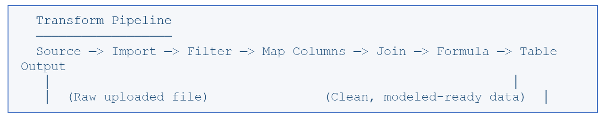

# Transformar tabelas

**Objetivo:** Limpar, combinar e reformular dados no TBM Studio.

Cada tabela no ` Data Studio ` possui um pipeline de transformação associado. Uma tabela de transformação é o resultado desse pipeline — o resultado da aplicação de uma ou mais etapas de transformação aos seus dados de origem. Você também pode criar novas tabelas de transformação derivadas das existentes, construindo cadeias de transformações que refinam progressivamente seus dados.

Pense nas tabelas de transformação como uma linha de montagem. Os dados brutos entram por uma extremidade, passam por uma série de etapas de processamento (etapas de transformação) e saem pela outra extremidade como dados limpos e estruturados, prontos para o modelo de custos.

Principais características das tabelas de conversão:

- As etapas são executadas de cima para baixo, na ordem em que aparecem no pipeline.
- Você pode adicionar, remover, reordenar e editar etapas a qualquer momento.
- A etapa “Tabela” no final do pipeline sempre mostra o resultado final de todas as transformações.
- Os resultados das transformações podem ser usados como entradas para outras transformações, criando cadeias de processamento de dados reutilizáveis.

**Tópico principal:** [Tabelas e tipos de tabelas](../../../../studio/new-uc/concepts-architecture/data-architecture/table-types.html)
