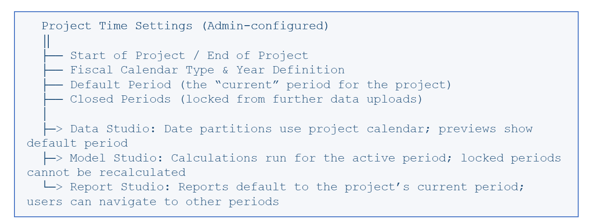

# Controle de versões e períodos

O TBM Studio é, essencialmente, uma plataforma centrada no mês. Praticamente tudo — dados, modelos e relatórios — funciona no contexto de um período mensal específico. Entender como funcionam os períodos de tempo e o controle de versões é essencial para trabalhar de forma eficaz com a plataforma.

## Conceitos de períodos de tempo

Um período no TBM Studio corresponde a um único mês de dados. Ao visualizar uma tabela de transformação, você vê os dados de um mês por vez. Quando você executa um cálculo do modelo, ele é feito para um período específico. Ao visualizar um relatório, são apresentados os dados relativos ao período selecionado no momento (embora os relatórios possam agregar dados de vários períodos para análise de tendências).

Este modelo centrado no mês reflete a realidade da gestão financeira de TI: os custos são normalmente monitorados, alocados e relatados em um ciclo mensal.

Nota:

**Conceito-chave**

Data Studio impõe um único período ativo para as visualizações de transformação. Não é possível visualizar vários meses simultaneamente na área de trabalho de transformação. A agregação de vários períodos é realizada na camada de relatórios, e não no Data Studio

## Ciclos de atualização de dados e controle de versões

Ao criar uma tabela e carregar dados, você deve definir um ciclo de atualização que indique a frequência com que se espera que os dados sejam atualizados. Esta configuração controla como o controle de versões funciona para a tabela:

|  |  |  |
| --- | --- | --- |
| **Ciclo de atualização** | **Comportamento do controle de versões** | **Ideal para** |
| Atualizações pontuais | Os dados podem ser acrescentados ou substituídos conforme necessário. Sem verificação de validade. | Dados de referência únicos que raramente mudam |
| Versão 1; Sem atualizações programadas | Os dados enviados substituem os dados existentes. Sem verificação de validade. | Tabelas de configuração estáticas |
| Versão 1; Atualização mensal | Versão única atualizada mensalmente. Os dados serão marcados como expirados se não forem atualizados no prazo de um mês. | Tabelas de consulta que mudam periodicamente |
| Versão 1; Atualização anual | Versão única atualizada anualmente. Os dados são marcados como expirados se não forem atualizados no prazo de um ano. | Listas de preços anuais |
| Versões mensais; Atualização mensal | Cada mês tem sua própria versão. Os novos dados não substituem os dos meses anteriores. | Dados contábeis, orçamentos e previsões (mais comum para dados financeiros) |
| Versões anuais; Atualização mensal | Doze meses de dados carregados mensalmente, cada um em seu próprio período. | Análises dos últimos doze meses |
| Versões anuais com elementos mantidos | Dados anuais carregados no início do exercício fiscal. Os valores do ano anterior serão mantidos caso não sejam carregados novos dados. | Tabelas em que os valores permanecem praticamente os mesmos ano após ano |

O padrão mais comum para dados financeiros é a publicação mensal. Com essa abordagem, a exportação do Razão, o arquivo de orçamento ou a previsão de cada mês passa a constituir uma versão independente. O modelo utiliza a versão correta de acordo com o período em vigor, garantindo que as alocações de janeiro utilizem os dados de janeiro e as alocações de fevereiro utilizem os dados de fevereiro.

## Calendário Fiscal

O TBM Studio é compatível tanto com anos civis padrão (janeiro a dezembro) quanto com calendários fiscais personalizados. O calendário fiscal determina como os períodos são denominados, como são definidos os limites do exercício fiscal e como funcionam recursos como os cálculos acumulados no ano.

A configuração do calendário fiscal inclui:

- **Tipo de calendário:** Padrão (12 meses) ou modelos personalizados, como agrupamentos de 4-4-5 semanas.
- **Definição do exercício fiscal:** se o exercício fiscal é identificado pelo período inicial ou pelo período final. Por exemplo, um ano fiscal de junho de 2025 ( 2024–May ) poderia ser identificado como FY2024 (período inicial) ou FY2025 (período final).
- **Formato de exibição:** se as datas serão exibidas como nomes de meses (jan. 2024, fev. 2024) ou números de meses ( P1. 2024, P2. 2024).

As configurações do calendário fiscal são definidas no nível do projeto e afetam todos os componentes da plataforma — transformações, modelos e relatórios herdam todos o mesmo calendário.

## Herança de intervalos de tempo

As configurações de tempo são aplicadas a partir do nível do projeto para todo o sistema:

Nota:

**Importante**

Os períodos encerrados bloqueiam o envio de dados e impedem o recálculo dos modelos para esses meses. Isso protege os dados financeiros finalizados contra alterações acidentais. As publicações de tabelas editáveis também podem ser bloqueadas quando direcionadas a períodos encerrados.
