# Notas de lançamento de 2024

## Servidor 12.11.10.1 - 13 de dezembro de 2024

- Resolvido o problema de processamento de arquivos para CCM no Gov.
- Estabilidade aprimorada do servidor de cálculo.

## Gerenciamento de emissões de tecnologia - 12 de dezembro de 2024

Hoje lançamos o Technology Emissions Management ("TEM"). O TEM foi projetado para ajudar as organizações a examinarem seu patrimônio de carbono de TI (na nuvem e no local) para atender às necessidades internas de sustentabilidade e dar suporte aos requisitos de relatórios.

Antes dessa versão, os usuários não conseguiam visualizar relatórios relevantes relacionados a medidas de sustentabilidade para reduzir os esforços de carbono.

Os clientes podem ver as métricas mensais e acumuladas para as emissões em kWh e CO2e.

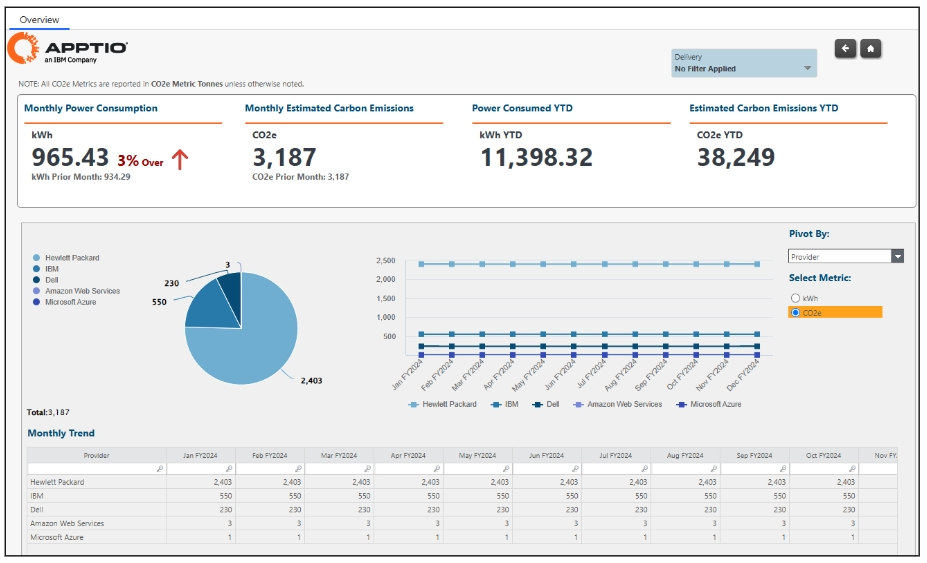

Os dados são ingeridos a partir de Cloudability e Costing (quando aplicável), para fornecer uma visão única das emissões de carbono. As emissões no local e na nuvem serão mostradas em painéis para fornecer uma visão completa dos esforços e do uso de ESG/Sustentabilidade, com suporte a várias personas.

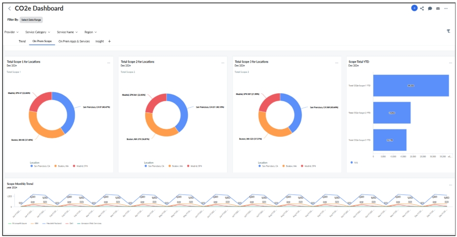

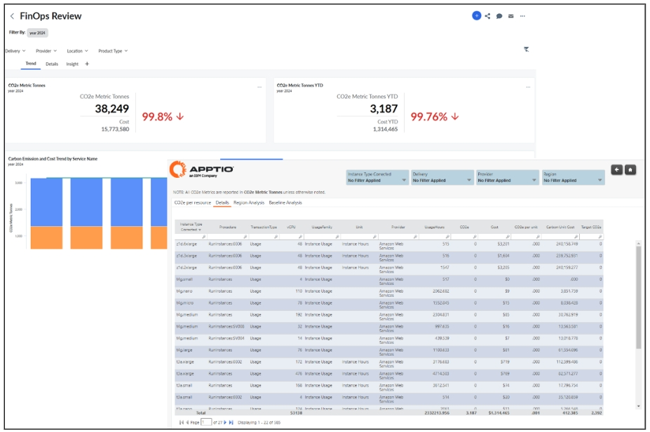

## Como esse recurso pode ajudá-lo

As organizações precisam de uma solução que ofereça uma visão única e uma metodologia defensável para medir de forma consistente as emissões de carbono da TI em todos os provedores de nuvem e no local. Elas também precisam monitorar as métricas de carbono e reduzir as emissões para atingir as metas de sustentabilidade.

O Technology Emissions Management ("TEM") permite que os clientes equilibrem o custo com as emissões de carbono para TI em toda a infraestrutura no local e em Public Cloud .

O TEM oferece ao cliente transparência em seus cálculos de emissões de carbono de TI, bem como flexibilidade para melhorar as áreas de dados que podem ser afetadas.

Para saber mais, entre em contato com o seu representante Apptio.

## Servidor 12.11.10 - 22 de novembro de 2024

Modelo de aplicativo: 8160

Nota:

Na versão 12.9 e superior, inclua os seguintes valores de cabeçalho em todas as chamadas de API para a API da plataforma.

**tipo de aplicativo="Flagship"**

**versão do aplicativo="NA"**

Isso inclui chamadas de API que fazem upload ou download em Costing Standard ou em outros projetos de plataforma. Esses cabeçalhos são adicionais aos cabeçalhos de API existentes que você já pode estar usando.

## Novos recursos do aplicativo

## Costing Essentials aprimoramentos ( v200 )

Os dois novos componentes a seguir foram introduzidos nesta versão.

- **Componentes de dispositivos de usuário final (GA)** : Um novo componente End User Devices está disponível no Template v200. Ele fornece insights para que o gerente de ativos de TI/gerente de suporte a desktops tome decisões baseadas em dados sobre a otimização e a consolidação da frota para ajudar a decidir o tamanho geral da frota e os custos associados. Ele também ajudará no planejamento e na previsão dos custos estimados de atualização para dispositivos em fim de vida útil e fora de conformidade.

  

  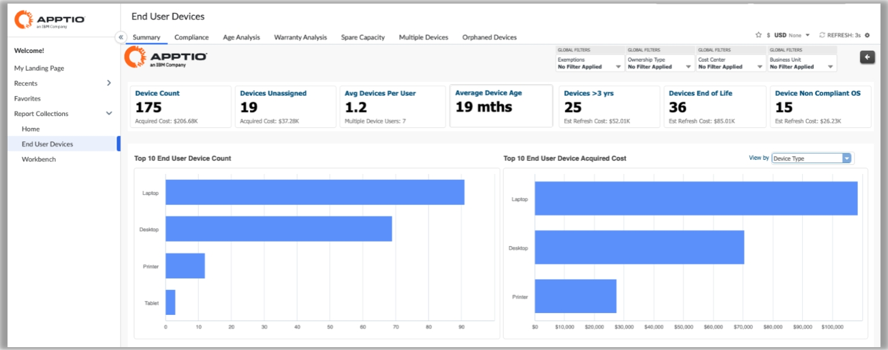

  Para saber mais, consulte [Dispositivos do usuário final](../../apptio-cost-management/getting_started/eud-intro.html).
- **Componente Cost Pool Benchmark (BETA)** : O Cost Pool Benchmark fornece insights para a liderança de TI e para o departamento financeiro de TI, apoiando as decisões estratégicas de investimento em relação à função da TI na empresa e ao modelo operacional atual de TI e às estratégias de sourcing. Os benchmarks podem ser usados para entender a estrutura de custos da estratégia atual e para justificar ou ajustar o investimento atual e as abordagens de sourcing. Compare os gastos de TI com os benchmarks do setor (por exemplo, gastos de TI como uma % da receita).
- 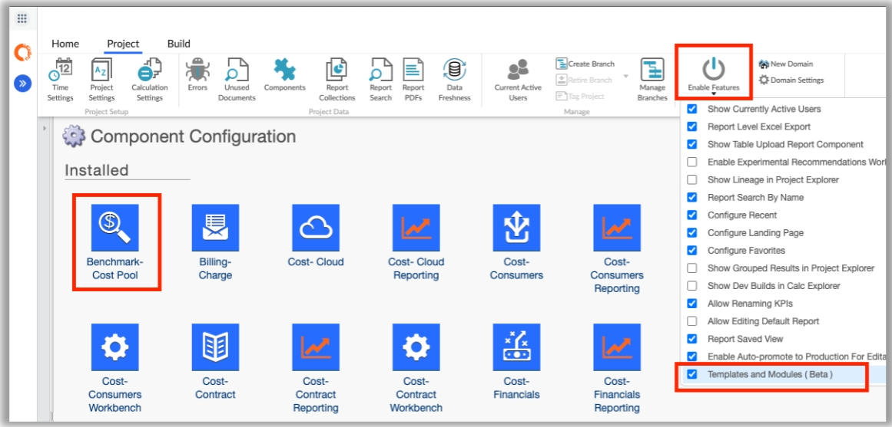

  

  Para saber mais, consulte [Benchmarks do pool de custos](../../apptio-cost-management/admin/setup-be.html).

## Billing Essentials (BETA, v200 )

Esse recurso permite que os gerentes de unidades de negócios, os proprietários de serviços e os gerentes financeiros de TI comuniquem o consumo e o custo dos serviços faturáveis aos consumidores. Esse recurso automatiza o processo de cobrança de serviços de TI selecionados, permitindo que os usuários cobrem serviços com base em uma abordagem PxQ, definam taxas usando custos unitários e ajustem a recuperação prevista acima ou abaixo. Além disso, os usuários podem gerar e enviar faturas mensais aos consumidores e armazenar registros de faturamento e estorno para uma trilha de auditoria clara, simplificando o processo de faturamento e reduzindo o esforço manual

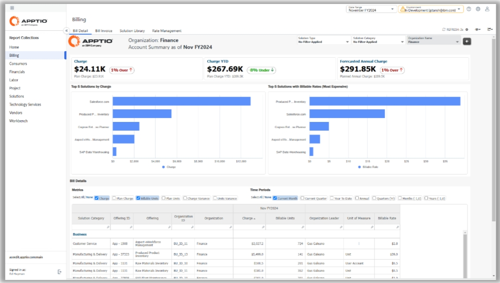

## Labor Workbench for CT Configurations (BETA, v120 )

Esse novo recurso permite que os administradores e proprietários de unidades de negócios mapeiem facilmente os recursos de mão de obra para as torres de TI usando tabelas editáveis e, opcionalmente, para os aplicativos. Para começar, os administradores podem instalar o componente "CTF- Labor Workbench", que inclui o relatório do Labor Workbench e tabelas editáveis. Os usuários finais podem então modificar o mapeamento de mão de obra para Torres de TI nos relatórios do site Apptio e usá-lo em conjunto com o Time Tracking. Um guia de configuração está disponível para fornecer instruções de configuração passo a passo.

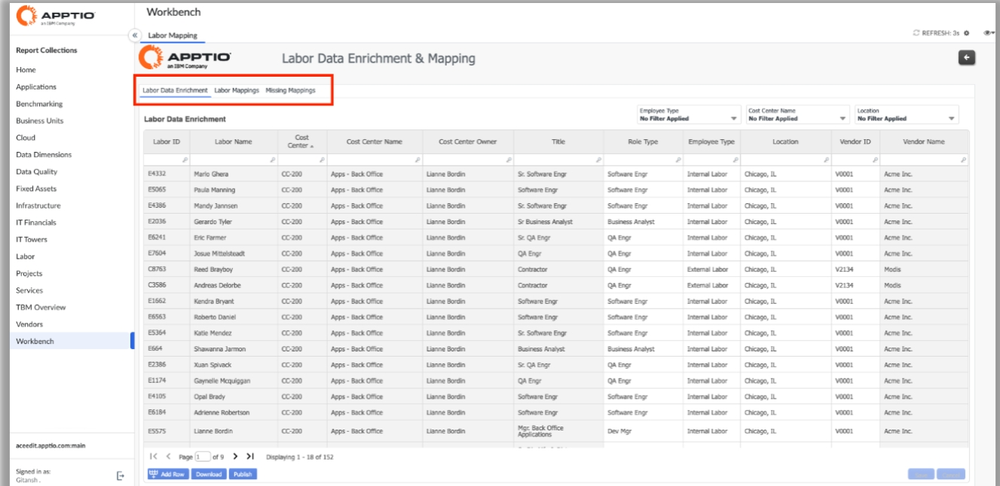

Para saber mais, consulte [Costing Standard Workbench](../../cost-transparency/workbench/introduction.html).

## Aprimoramentos no painel de componentes

Os principais aprimoramentos a seguir foram feitos na seção Instalado do painel Componentes:

- **Indicador de carregamento** : Um "Loading. A mensagem "Please Wait" (Aguarde, por favor) agora é exibida ao expandir os pacotes de componentes, garantindo uma melhor experiência do usuário durante o tempo de carregamento.
- **Filtragem aprimorada** : Somente os componentes instalados mais recentes são exibidos, e as versões mais antigas não são mais mostradas na seção Disponível.
- **Componentes instalados ocultos** : os componentes instalados agora estão ocultos na seção Disponível, reduzindo a desordem e melhorando a usabilidade.
- **Atualizações de API** : Adicionamos uma nova API ou opção para dar suporte a essas alterações, aprimorando a experiência geral de gerenciamento de componentes.
- **Experiência simplificada para autores sem conteúdo** : Os autores sem conteúdo agora só veem as versões mais recentes de cada pacote na seção Disponível, facilitando a localização do que precisam.

## Corrigido nesta versão

- Otimização do Precision Calc para ignorar o cálculo de componentes ocultos do relatório.
- Foi corrigido o problema de exibição de "Model Metrics" duas vezes nos detalhes do componente.
- Foi corrigido o problema em que a interface do usuário deixava de responder após a atualização do componente CTF - Cost Source.
- Correção de problemas de vulnerabilidade.

## Cliente 2.10 - 22 de novembro de 2024

Observação: Dependência

\*O cliente v2.10 é compatível com o servidor 12.11.10 e 12.11.9.x

\*Alguns recursos do Client v2.10 dependem de novos recursos do Server 12.11.10.

## Novos recursos do cliente

O recurso Upload de tabelas agora é GA

## Aprimoramentos na distribuição de e-mails

O recurso de assinatura de e-mail agora é GA, com os seguintes aprimoramentos adicionais:

- \*Três períodos de tempo adicionais foram adicionados para links de e-mail e geração de PDF, proporcionando maior flexibilidade na seleção do período de relatório.
  - Período atual
  - Período anterior
  - Período de tempo padrão
- A frequência de distribuição de relatórios agora está definida como "Mensal" por padrão, garantindo que a maioria das atualizações de dados e relatórios esteja alinhada com o ciclo contábil mensal.
- Ao criar uma nova assinatura, os campos Coleção de relatórios e Relatório são preenchidos automaticamente com base no relatório atual. Essa atualização reduz a necessidade de entrada manual e simplifica o processo de assinatura.

  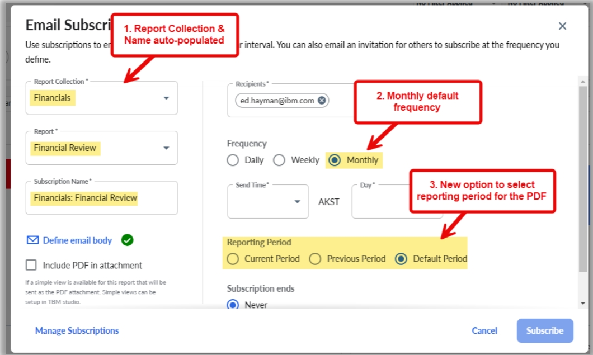

Anteriormente, o período do relatório era definido como o período de tempo padrão e a frequência de distribuição era diária.

Para saber mais, consulte [Assinaturas de e-mail](../reports/email-subscription.html).

## Aprimoramentos nas exibições salvas

\*Os seguintes aprimoramentos foram feitos no recurso Visualizações salvas.

- A duração da exibição da mensagem do brinde foi aumentada para 5 segundos para que os usuários tenham mais tempo para visualizar as notificações.
- O sinalizador de recurso agora está ativado por padrão para todos os usuários.
- Se um relatório não contiver dados, o recurso associado será automaticamente ocultado para melhorar a experiência do usuário.
- Os filtros de tabela e a ordem de classificação das colunas agora são preservados ao salvar exibições de relatórios.
- Foi adicionado um indicador azul próximo ao ícone de olho para indicar quando um relatório está sendo visualizado.
- Suporte à tradução para o japonês.

  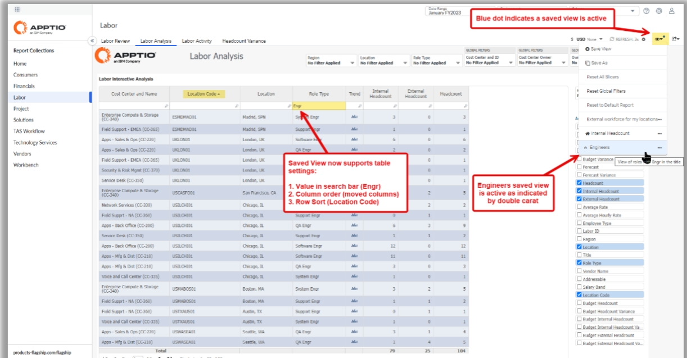

Anteriormente, o recurso de visualizações salvas ficava atrás da bandeira e não era ativado por padrão. A pesquisa de tabela e os filtros de coluna não persistiam no salvamento e era difícil saber se o usuário estava em uma exibição salva ou em uma exibição normal.

Para saber mais, consulte [Visualizações salvas](../../costing-billing/saved-views.html "Aplica-se a: 12.11.9 e posterior para todos os produtos.").

## Tabela editável

- **Fluxo automático de dados para tabelas editáveis enriquecidas** - Essa atualização permite que os usuários desativem/ativem o fluxo de dados em tabelas de transformação enriquecidas, reduzindo a confusão e proporcionando mais controle sobre as atualizações de dados. Com essa alteração, os usuários podem modificar as tabelas de transformação de origem sem atualizar automaticamente a transformação da tabela editável enriquecida, garantindo que os números do modelo de custo não sejam afetados até que as alterações sejam explicitamente publicadas. Além disso, o Score ET Transform não será atualizado automaticamente, exigindo que os usuários publiquem explicitamente as alterações para ver as alterações da tabela subjacente. Para ativar esse recurso, navegue até **Configurações do projeto** e selecione a **opção Desativar fluxo de dados em transformações enriquecidas**.

  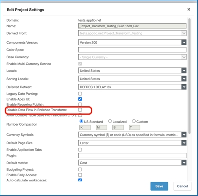

  Anteriormente, qualquer alteração na tabela de origem era automaticamente transferida para a tabela editável, sem a etapa de publicação. Isso afetou os números no modelo de custo para os clientes.

  Para saber mais, consulte [Desativar fluxo de datas](../data_studio/create-table-from-et.html).
- **Opção de programação recorrente para "Promover automaticamente para produção** " - Uma nova coluna "Promover automaticamente para produção" foi adicionada à tela Programação recorrente, para permitir que os administradores tenham controle sobre o gerenciamento de dados e facilitar o monitoramento e o gerenciamento mais eficientes de trabalhos recorrentes. A função "Auto Promote To Production" promove dados novos e atualizados do ambiente de preparação para o ambiente de produção com base nos requisitos do administrador. Para ativar essa coluna, navegue até Projeto > Ativar recursos e selecione a opção **Ativar promoção automática para produção para programações recorrentes de tabelas editáveis**.

  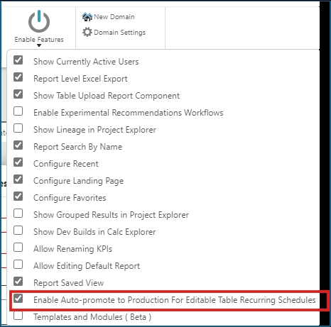

  Ao selecionar essa opção, o **campo** "Auto Promote To Production" (Promover automaticamente para produção) e a **coluna** "Auto Promote to Production" (Promover automaticamente para produção) são exibidos conforme mostrado.

  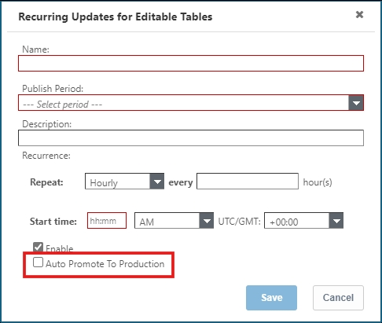

  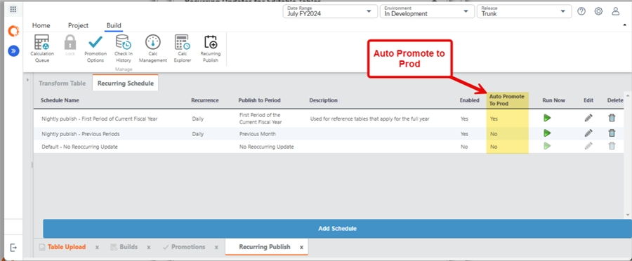

  Para saber mais, consulte [Recurring Publish](../admin/recurring-publish-et.html "Aplica-se a: 12.11.7 e posterior. A opção Recurring Publish (Publicação recorrente) permite que o TBMA agende programações de publicação recorrentes automáticas para tabelas editáveis que tenham tabelas de transformação. Quando esse recurso for ativado, a opção \"Publicar no período\" será convertida em uma programação padrão e será anexada no pipeline Tabela editável, em Transformar tabela. Todos os \"Publicar no período\" serão convertidos em agendamento padrão na página Recurring Schedule, e a transformação vinculada ao agendamento estará disponível na página Transform Table.").
- **Novas funções para exibir a última e a próxima hora de publicação no relatório -** Duas novas funções GetNextPublishTime e GetLastPublishTime foram adicionadas para exibir a última hora de publicação e a próxima hora de publicação da transformação na superfície do relatório para tabelas editáveis. Esse recurso permite que os usuários visualizem facilmente o histórico de publicações e garantam que suas alterações tenham sido propagadas com sucesso para a tabela de transformação.

  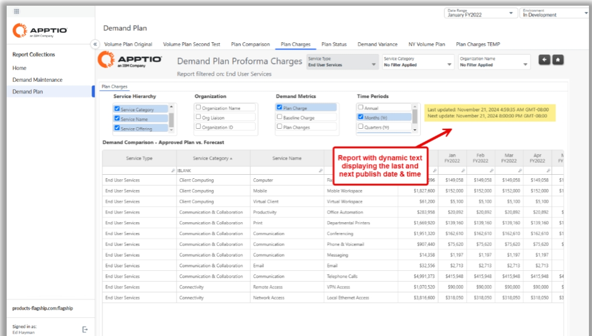

  Para saber mais, consulte [Funções](../formulas-and-functions/functions/functions.html "Aplica-se a: TBM Studio 12.0 e posterior").
- **Suporte a valores em branco na lista de valores possíveis** - As tabelas editáveis agora suportam valores em branco nas listas de valores possíveis, reduzindo assim os erros e tornando os dados mais eficientes. Essa alteração permite que os usuários do TBMA insiram valores em branco em tabelas editáveis sem receber uma mensagem de erro. Ao adicionar uma linha a uma tabela editável, as colunas configuradas com valores possíveis não exibirão mais um erro se forem deixadas em branco, proporcionando uma experiência mais flexível e fácil de usar.

  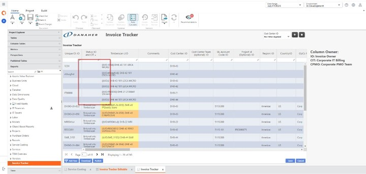

## Corrigido nesta versão

- Correção do erro de acesso negado ao alternar entre os relatórios Cloud Reporting e Billing Standard .
- Re-sincronização das definições de coluna para resolver o erro na tabela editável após o upgrade e a mesclagem.
- Correção de vulnerabilidades de segurança.

## Servidor 12.11.9.1 - 7 de novembro de 2024

- Atualização trimestral do Java.

## Apptio Transição da comunidade para IBM TechXchange - 1º de novembro de 2024

Atualmente, a comunidade Apptio fez a transição completa para IBM TechXchange.

Use e marque esta nova página inicial para os grupos de tópicos do Apptio.

- Acesse o grupo de tópicos relevante para suas necessidades; alguns dos grupos de tópicos com os quais você está familiarizado foram combinados em novos grupos de tópicos.

Os seguintes grupos de tópicos estão disponíveis:

> - [Apptio](https://community.ibm.com/community/user/apptio/communities/community-home?CommunityKey=4100dfb8-fc23-4203-83c7-019253cf7c0b "(Abre em uma nova guia ou janela)") : Costing Essentials, Costing Standard (CT-Foundation), Apptio Planning (ITP/ITFMF), Faturamento (Billing Standard), Benchmarking (Benchmarking), ServiceNow Integração
>
>   - [Notas de lançamento de planejamento](https://community.ibm.com/community/user/apptio/viewdocument/apptio-planning-whats-new-cumula?CommunityKey=4100dfb8-fc23-4203-83c7-019253cf7c0b&tab=librarydocuments "(Abre em uma nova guia ou janela)")
>   - [TBM Studio notas de versão de aplicativos e aplicativos](https://community.ibm.com/community/user/apptio/viewdocument/tbm-studio-and-applications-r12-rel?CommunityKey=44bcb0d2-5ce6-4504-89eb-019253d3b5d8&tab=librarydocuments "(Abre em uma nova guia ou janela)")
> - [Cloudability](https://community.ibm.com/community/user/apptio/communities/community-home?CommunityKey=15c0e07d-35c0-49de-a84b-019253d13376 "(Abre em uma nova guia ou janela)") : Cloudability Financial Planning, Cloudability TotalCost, Apptio Integração Turbonômica
> - [https://community.ibm.com/community/user/apptio/communities/community-home?CommunityKey=55a3712d-1835-4ec2-bcd7-603e88cd9dd2](https://community.ibm.com/community/user/apptio/communities/community-home?CommunityKey=55a3712d-1835-4ec2-bcd7-603e88cd9dd2 "(Abre em uma nova guia ou janela)")[Processo-alvo](https://community.ibm.com/community/user/apptio/communities/community-home?CommunityKey=55a3712d-1835-4ec2-bcd7-603e88cd9dd2 "(Abre em uma nova guia ou janela)")
> - [Plataforma](https://community.ibm.com/community/user/apptio/communities/community-home?CommunityKey=44bcb0d2-5ce6-4504-89eb-019253d3b5d8 "(Abre em uma nova guia ou janela)") : Apptio BI, ATUM, Automated Data Management, DataLink, Frontdoor, TBM Studio
> - [Apptio para todos](https://community.ibm.com/community/user/apptio/communities/community-home?CommunityKey=2e85ed45-9b8a-486c-bd55-019253d466eb "(Abre em uma nova guia ou janela)")

- Quando estiver em seu grupo de tópicos, leia e contribua com todo o conteúdo habitual, como links rápidos, discussões, perguntas e blogs.
- Confira [estes recursos](https://community.ibm.com/community/user/participate/resources "(Abre em uma nova guia ou janela)") sobre como navegar e utilizar a comunidade.
- Comece a enviar solicitações de aprimoramentos em [IBM Ideas](https://login.ibm.com/idaas/mtfim/sps/idaas/login?client_id=NWNjMzc5NjEtMzlkYi00&Target=https%3A%2F%2Flogin.ibm.com%2Foidc%2Fendpoint%2Fdefault%2Fauthorize%3FqsId%3Dc75ff073-50e8-4426-8979-7e4b6b992e80%26client_id%3DNWNjMzc5NjEtMzlkYi00 "(Abre em uma nova guia ou janela)").

  - IBM usa um portal de ideias unificado em [ideas.ibm.com](https://ideas.ibm.com/ "(Abre em uma nova guia ou janela)") para que você possa levantar ideias sobre todos os produtos. A partir de hoje, essa lista foi ampliada para incluir os produtos recentemente adquiridos da Apptio. As ideias enviadas antes da aquisição serão disponibilizadas para as equipes de produtos e poderão ser adicionadas ao portal em uma data futura para garantir a continuidade.

Entre em contato com a equipe da comunidade em nosso novo e-mail, [support@communitysite.ibm.com](mailto:support@communitysite.ibm.com "(Abre em uma nova guia ou janela)") com qualquer dúvida ou necessidade.

## Servidor 12.11.9 - 11 de outubro de 2024

Modelo de aplicativo: v120-8111

## Novos recursos do aplicativo

## IBM Apptio Costing Standard + IBM Integração Turbonômica EA

Hoje, lançamos a primeira integração nativa entre IBM Turbonomic e IBM Apptio, disponível via Early Access, com as versões 8.13.6 e R12.11.9, respectivamente.

Os usuários finais do IBM Apptio Costing, incluindo os proprietários de finanças, serviços e aplicativos de TI, agora podem expandir sua perspectiva de custo de TI híbrida para incluir visualizações de otimização agregadas de sua TI híbrida. Por meio de uma integração prescritiva, as oportunidades de otimização da IBM Turbonomic (ações pendentes e executadas) são enviadas para Apptio, onde as recomendações são quantificadas, visualizadas e alinhadas à estrutura da TBM Solutions.

- **Integração prescritiva entre Turbonomic e Apptio, alimentada por novos componentes** : Um novo tipo de alvo IBM Apptio está disponível no Turbonomic, facilitando a integração prescritiva, enviando ações granulares On Prem e agregadas na Nuvem - Pendentes e Executadas para Apptio.

  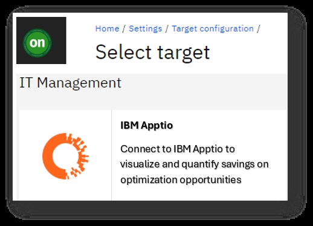

  *O novo tipo de alvo da Turbonomic Apptio*

  Três novos componentes de conteúdo TBM Studio (modelo v120 ) estão disponíveis em IBM Apptio criados para padronizar, quantificar e fornecer relatórios sobre as oportunidades de otimização da TI híbrida.

  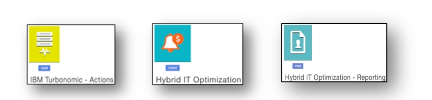

  *Apptio novos componentes de conteúdo da empresa*
  - **IBM Turbonomic - Ações** : Permite a integração dos dados de ação do IBM Turbonomic no Apptio. Instala vários conjuntos de dados que automatizam a ingestão e a normalização dos dados de ações pendentes e executadas, tanto no local quanto na nuvem.
  - **Otimização de TI híbrida** : Cria uma nova estrutura de modelo de TI híbrida paralela. Instala vários conjuntos de dados mestre, modelos e métricas que facilitam a quantificação e a alocação das oportunidades de otimização da TI híbrida.
  - **Otimização da TI híbrida - Relatórios** : Capacita os usuários finais com dois novos relatórios de otimização de TI híbrida. Um relatório de visualização do provedor, voltado para os proprietários de serviços técnicos e financeiros de TI, e um relatório de visualização do consumidor para os proprietários de aplicativos.

  Com esses componentes, seus insights de otimização da Turbonomic podem ser importados sem problemas para Apptio, quantificados e visualizados para capacitar seus proprietários de finanças, serviços e aplicativos de TI com insights acionáveis diretamente em Apptio.

  Para obter mais informações, consulte o guia de [configuração](../../cost-transparency/technology-integration/configuations.html).
- **Visibilidade da otimização da TI híbrida com potencial quantificado e economia realizada** : Aproveitando o modelo de custo Apptio, a integração facilita a ingestão, a modelagem e a quantificação das economias potenciais e realizadas das oportunidades de otimização. Os insights de otimização são apresentados por meio da estrutura da TBM, permitindo que os usuários, como os proprietários de aplicativos, avaliem as recomendações no contexto de seus próprios portfólios, garantindo que as economias sejam facilmente vinculadas à estrutura de relatórios e às principais dimensões da organização. O Índice de Otimização de Custos (COIN) é usado para impulsionar a responsabilidade e garantir que as cargas de trabalho estejam sendo otimizadas.

  Os usuários podem ver a economia obtida em termos de economia direta, economia atrasada e custos evitados. Por meio do link para o site IBM Turbonomic, as partes interessadas podem colaborar ainda mais para promover a excelência financeira e operacional contínua.

  Para obter mais informações, consulte o guia de [configuração](../../cost-transparency/technology-integration/configuations.html).

  

  *Apptio novo relatório de Otimização de TI híbrida da Hybrid IT, incluindo visualizações de provedor e consumidor*

## Novos recursos do servidor

## Tradução em japonês para Costing Essentials

As traduções em japonês para os aprimoramentos do Costing Essentials agora são GA. Essa atualização beneficia os usuários finais no mercado japonês, permitindo que eles interajam com o aplicativo em seu idioma nativo, melhorando assim a experiência do usuário para os clientes que falam japonês. Os usuários agora poderão visualizar rótulos de relatórios e cabeçalhos de colunas em japonês, melhorando a acessibilidade e a usabilidade. Vá para as configurações do usuário, selecione sua conta de usuário e defina seu idioma preferencial como japonês, juntamente com o local preferencial como ja-JP.

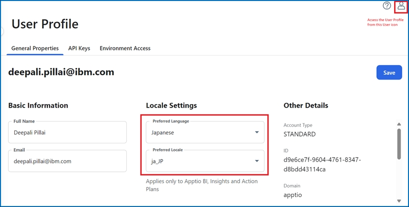

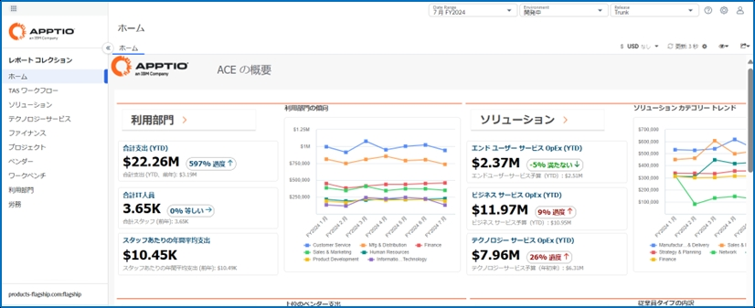

## Fluxo de trabalho de solução de problemas para alocações não utilizadas

Um novo fluxo de trabalho de solução de problemas é introduzido em alocações não utilizadas. Esse recurso aprimora a experiência do usuário ao fornecer etapas guiadas para resolver problemas identificados por meio do Configuration Recommendations, resultando em tempos de cálculo mais rápidos e melhor desempenho. Os administradores podem navegar por cada etapa do fluxo de trabalho, analisar os documentos de suporte e automatizar as alterações de configuração necessárias. O sistema também permite o check-in automático das alterações, marcando os problemas como resolvidos.

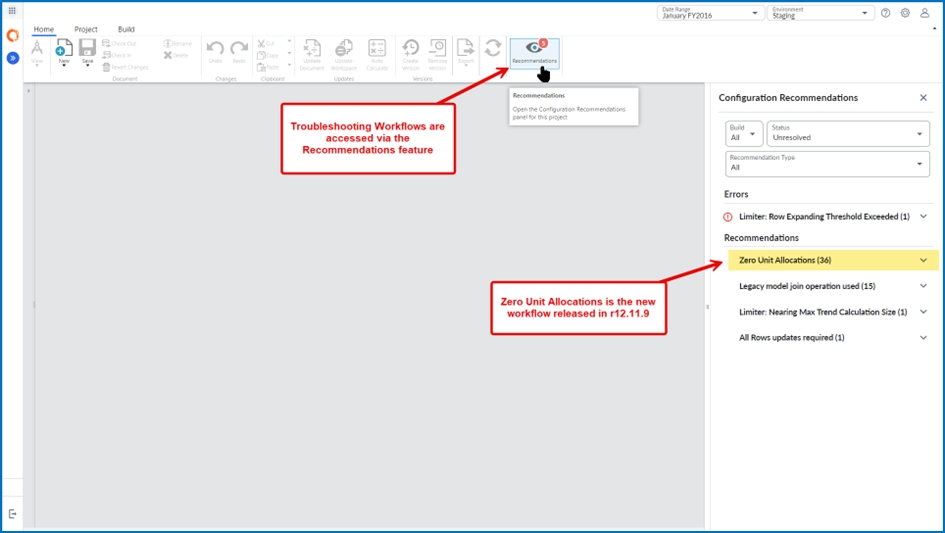

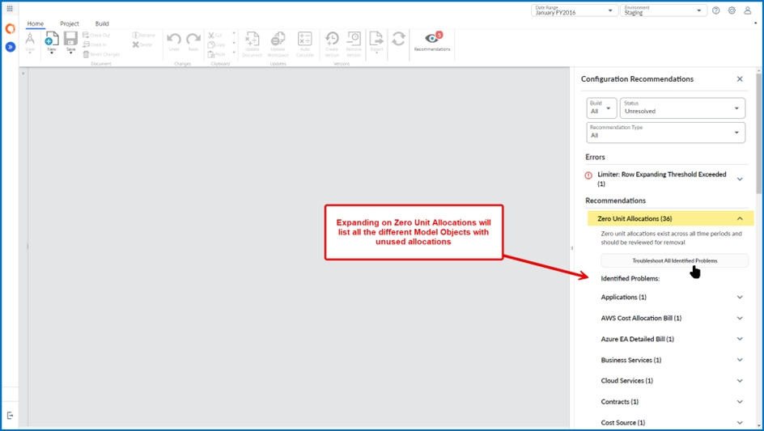

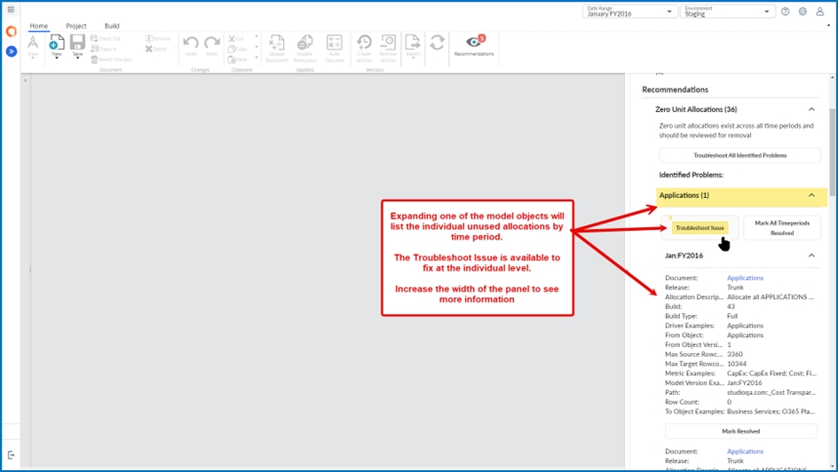

Para obter mais informações, consulte [Alocações não utilizadas](../troubleshooting/studio-troubleshooting-all-rows-recommendation.html "Esse recurso simplifica o processo, fornecendo orientação passo a passo com base em recomendações de especialistas, garantindo tempos de cálculo mais rápidos e melhor desempenho. Você pode acessar documentos e automatizar alterações de configuração para otimizar seu fluxo de trabalho. O sistema verificará automaticamente as alterações e marcará os problemas como resolvidos.").

## Calc explorer - mostrar todas as consultas

Uma nova caixa de diálogo foi adicionada ao Calc Explorer, exibindo todas as consultas em uma compilação em um formato de tabela. Essa tabela pode ser pesquisada e classificada, permitindo que os usuários localizem facilmente entidades específicas. Além disso, os usuários agora podem visualizar uma lista de períodos de tempo calculados diretamente nessa interface.

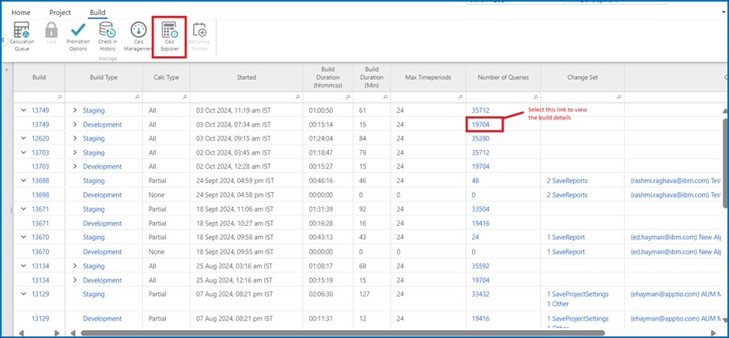

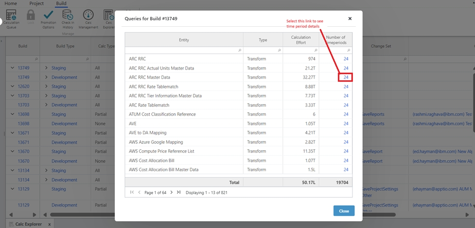

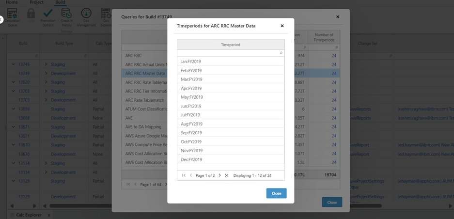

## Corrigido nesta versão

- Foi corrigido o problema da ocorrência aleatória de origem e destino em branco na etapa de alocação.
- Implementou a configuração pública para alocações positivas/negativas.
- Otimizações do Table Info.
- Correção de problemas de vulnerabilidade.

## Cliente 2.9 - 11 de outubro de 2024

## Dependência

O cliente v2.9 é compatível com o servidor 12.11.9 e 12.11.8.x

## Novos recursos do cliente

## Recurso aprimorado de distribuição de e-mail (BETA)

O recurso de assinatura de e-mail foi aprimorado para permitir que os usuários personalizem, compartilhem e utilizem os relatórios de forma eficaz. Os usuários agora podem nomear a distribuição do relatório, definir cronogramas de entrega (por exemplo, mensal ou semanal) e personalizar o conteúdo do e-mail, incluindo o remetente, o assunto e a mensagem. Eles também podem incluir um anexo em PDF com uma visualização de "layout de impressão" do relatório.

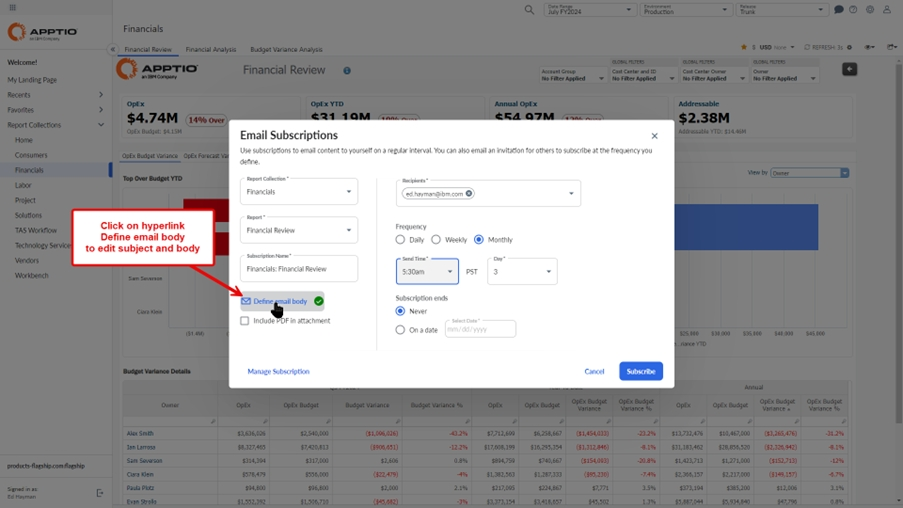

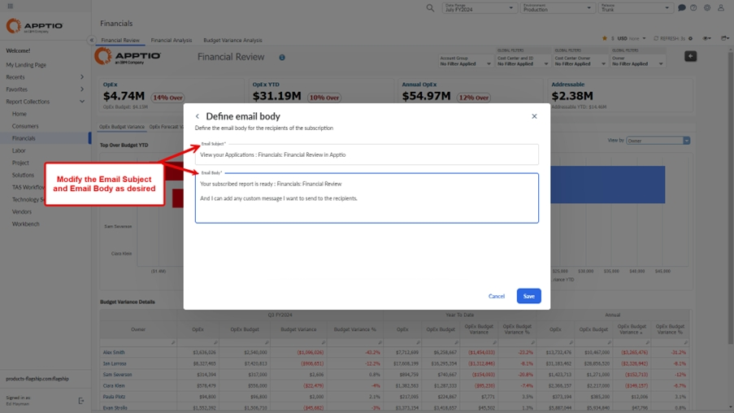

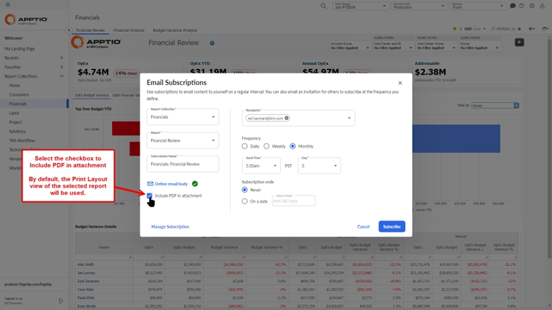

**Opção de PDF para relatórios simples** - Os usuários agora podem criar relatórios simples em PDF para assinaturas de e-mail, proporcionando uma visualização de impressão limpa sem as complexidades dos elementos interativos. Esse recurso foi desenvolvido para administradores que desejam aumentar o envolvimento do usuário final. Esse relatório é limitado a indicadores-chave de desempenho (KPIs), gráficos e tabelas, mas não oferece suporte à segurança em nível de linha.

Para obter mais informações, consulte [Assinaturas de e-mail](../reports/email-subscription.html).

## Navegação aprimorada - visualizações salvas (BETA)

O recurso Saved View foi introduzido para aprimorar sua experiência de relatório, permitindo que você selecione e salve configurações interativas para uso futuro. Ele também permite que você abra relatórios diretamente na visualização de sua preferência e alterne entre diferentes visualizações com menos cliques. No momento, esse recurso está em segundo plano e não é ativado por padrão. Para começar, ative esse recurso beta em TBM Studio > Project > Enable Features e selecione Report Saved View. Você pode criar uma exibição salva abrindo um relatório, ajustando Slicers, Column Pickers, Metric Pickers, Date Pickers, opções Group By e outros filtros. Clique no ícone Visualizar (o ícone do "olho") na barra de navegação superior direita e, em seguida, escolha "Salvar" ou "Salvar como" para nomear sua visualização. Além disso, você pode modificar as propriedades de uma visualização salva clicando no ícone Visualizar e selecionando os três pontos, o que permite renomear, definir como padrão ou excluir a visualização. Esse recurso foi projetado para simplificar seu acesso a insights e melhorar a eficiência geral dos relatórios.

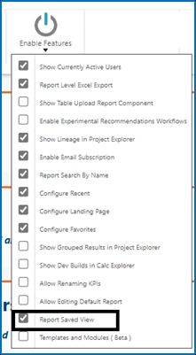

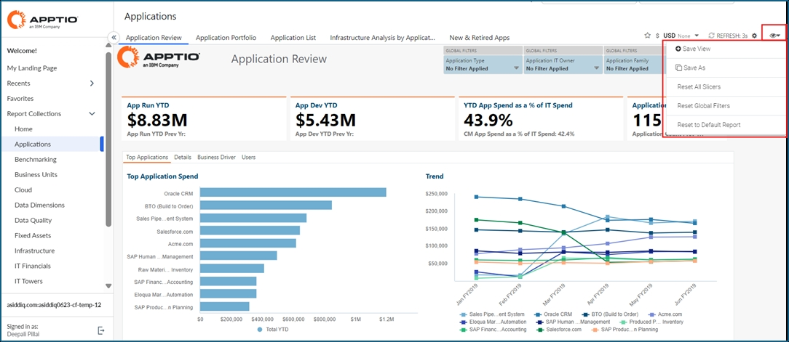

Para obter mais informações, consulte [Visualizações salvas](../../costing-billing/saved-views.html "Aplica-se a: 12.11.9 e posterior para todos os produtos.").

## Tabelas editáveis

- **Remoção do registro de preferências do usuário do histórico de check-in** - As entradas do SaveUserPreference agora serão removidas da interface do usuário do histórico de alterações e só poderão ser acessadas pelo administrador do Apptio.

  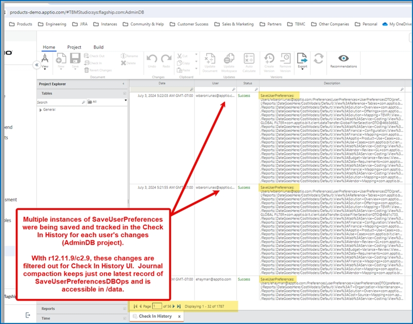

  Anteriormente, todas as alterações nas configurações de preferência do usuário final - histórico de relatórios recentes, relatórios favoritos e páginas de destino - eram registradas no histórico de alterações do site Admin.db, misturando assim as modificações do administrador e do usuário final.
- **Aparar espaços à esquerda/à direita ao criar uma nova coluna** - Para garantir a consistência e evitar incompatibilidades nas operações de dados, os espaços à esquerda e à direita nos nomes de novas colunas agora serão automaticamente aparados ao serem salvos.

  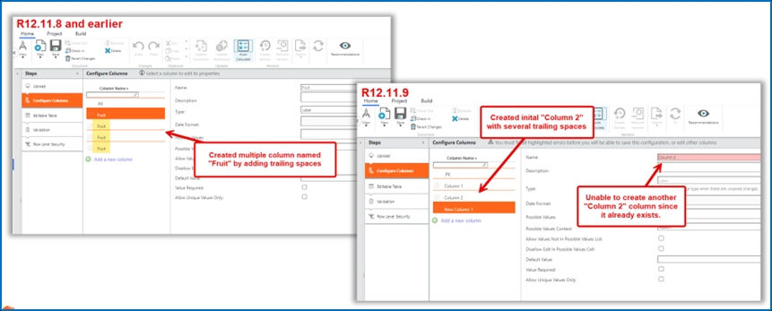

  Anteriormente, quando um administrador adicionava uma coluna com um espaço à direita, as ações como scripting e validação de dados não correspondiam ao nome da coluna, pois as outras operações aparavam os espaços à direita.
- A duplicação de **linhas agora copia todos os campos da tabela de apoio** - Texto BoxThe A duplicação de linhas em tabelas editáveis foi atualizada nesta versão. Se você duplicar uma linha em uma tabela editável de relatório, todos os campos da linha original serão copiados para a tabela editável de apoio por padrão, mesmo que não estejam listados em "Included Columns" (Colunas incluídas) Os campos só serão deixados de fora se você os remover ou alterar manualmente durante a duplicação.

  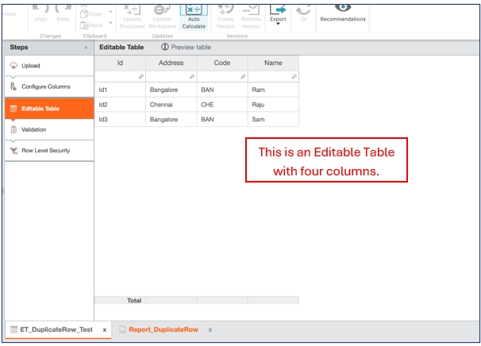

  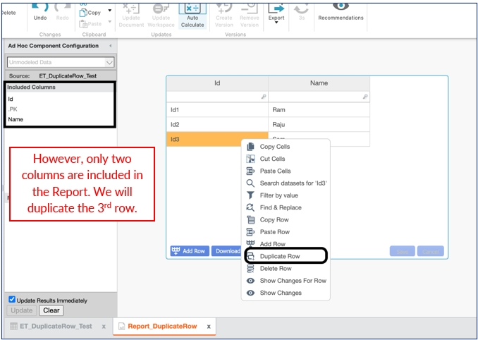

  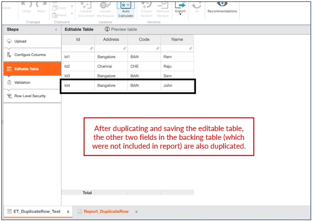

  Anteriormente, ao duplicar uma linha em uma tabela editável de relatório, apenas os campos listados em "Colunas incluídas" eram copiados para a tabela de apoio, enquanto outros campos eram deixados em branco.
- **Adição de opções avançadas para pesquisas de botões/scripts em outra tabela** - Os administradores agora podem configurar automações avançadas de botões para tabelas editáveis. Esse recurso permite que os botões executem scripts com base em valores de outra tabela editável, simplificando as alterações de dados e melhorando a experiência do usuário.

  O script procura por linhas na tabela primária que correspondam ao valor "Original" da tabela de pesquisa, substitui-o pelo valor "New" e atualiza o Comentário. Um segundo script limpa os valores da tabela de pesquisa.

## Corrigido nesta versão

- Desativou o botão Salvar em tabelas editáveis quando há um erro.
- Foi corrigido o problema em que os usuários com várias funções não conseguiam editar o componente de relatório de tabela editável.
- Foi resolvido o problema em que os dados da tabela editável tinham várias linhas para uma única chave primária.
- Foi corrigido o problema em que as linhas de arquivos carregados mantinham a mesma ordem em que foram carregados.
- Correção da inconsistência do formato de data durante o download de arquivos de tabelas editáveis.
- Alterada a fórmula da coluna User Type (Tipo de usuário) na tabela Logins para acomodar o login no domínio IBM.
- Corrigido o problema com a chave primária numérica em tabelas enriquecidas.
- Melhorias no desempenho das atualizações em massa do site ApptioScript.

## Servidor 12.11.8 - 23 de agosto de 2024

Modelo de aplicativo: v120-8038

Nota:

Na versão 12.9 e superior, inclua os seguintes valores de cabeçalho em todas as chamadas de API para a API da plataforma.

**tipo de aplicativo="Flagship"**

**versão do aplicativo="NA"**

Isso inclui chamadas de API que fazem upload ou download em Costing Standard ou em outros projetos de plataforma. Esses cabeçalhos são adicionais aos cabeçalhos de API existentes que você já pode estar usando.

## Novos recursos do aplicativo

Não há novos recursos de aplicativos.

## Novos recursos do servidor

## Calc Explorer: Usar notação compacta para métricas exibidas

A métrica usada para notação compacta no Calc Explorer foi aprimorada para melhorar a legibilidade. Métricas como esforço de cálculo, número de linhas e número de colunas agora serão exibidas em um formato simplificado (por exemplo, 9.74T em vez de 9.740.000.000.000). Essa alteração facilita a compreensão imediata e rápida de números grandes.

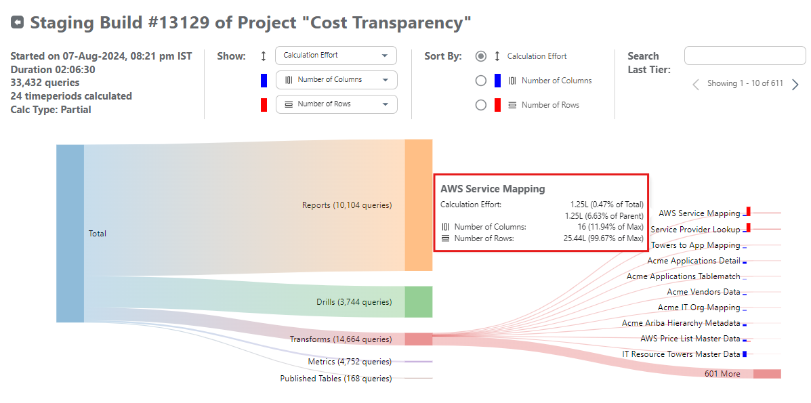

## Corrigido nesta versão

- Adicionado um recurso para criptografar dados confidenciais no armazenamento do navegador por padrão para usuários do governo, com uma opção para desativar a criptografia, se preferir.
- Foi corrigido o problema da mensagem de erro para valores que não seguem o upload da configuração de valores possíveis.
- Correção de problemas de vulnerabilidade

## Cliente 2.8 - 23 de agosto de 2024

## Dependência

O cliente v2.8 é compatível com o servidor 12.11.8 e 12.11.7.x

## Novos recursos do cliente

ApptioCosting Essentials Agora disponível em japonês

O aplicativo Costing Essentials (ACE) agora está totalmente localizado em japonês, melhorando a usabilidade para usuários que falam japonês. Todas as cadeias de caracteres usadas no ACE foram traduzidas para o japonês e integradas ao nosso sistema. O conteúdo foi redimensionado e realinhado dentro do aplicativo para melhorar o ajuste e o acabamento geral. Essas alterações garantem uma experiência de usuário mais refinada e visualmente atraente.

## Limpeza das opções de Ativação de recursos

O menu suspenso Habilitar recursos foi atualizado para mostrar apenas os recursos que estão por trás da bandeira.

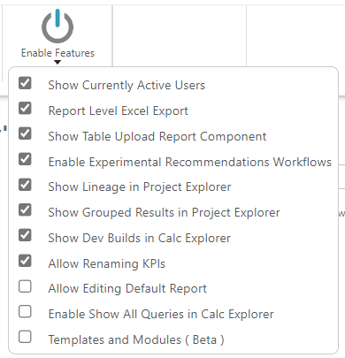

## Agregação de tempo dos últimos doze meses

O processo de cálculo de uma agregação de doze meses consecutivos (TTM) foi simplificado nesta versão. Agora, os administradores podem somar facilmente os dados dos 12 meses anteriores, com a opção de incluir os 13 meses posteriores para um calendário fiscal de 13 períodos. Se houver menos períodos disponíveis, o sistema anualizará automaticamente o valor. Esse aprimoramento é particularmente útil para a visualização de um total de 12 meses em execução, oferecendo uma alternativa mais flexível à perspectiva tradicional do calendário fiscal.

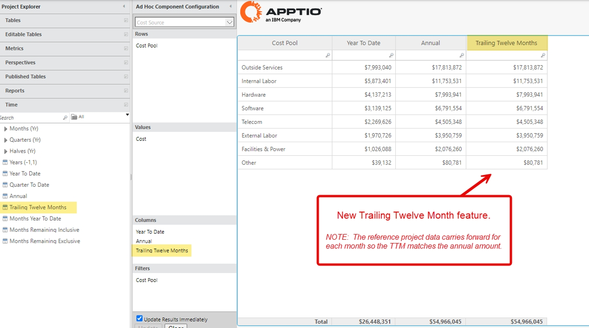

## Tabelas editáveis

- **Mostrar linhas excluídas no Histórico de alterações** : Os usuários podem visualizar as linhas em tabelas editáveis que não estão mais ativas (por exemplo, "excluídas") e identificar quem as excluiu. Como as tabelas editáveis são baseadas em um banco de dados bitemporal, as linhas marcadas para exclusão não são removidas fisicamente, mas são marcadas como inválidas a partir da data de exclusão e não são mais exibidas. Para visualizar as linhas excluídas, clique com o botão direito do mouse na tabela editável e selecione **Show Changes for Row** ou **Show Changes**. Uma nova coluna, "Valid Till", é adicionada ao histórico de linhas para identificar que todas as linhas com datas anteriores a "31 de dezembro de 9999" foram excluídas.

  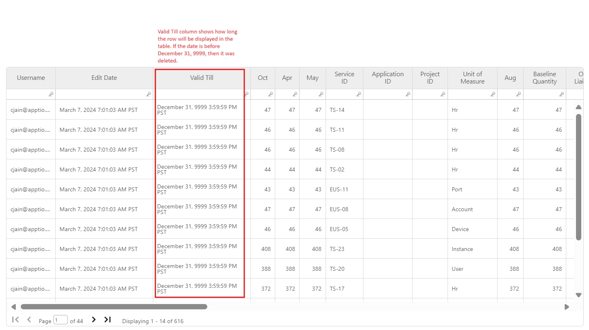

  Anteriormente, os usuários não conseguiam identificar quando e quem excluía as linhas na tabela editável.

  Para obter mais informações, consulte [Mostrar alterações](../reports/edit-row-properties.html).
- **Validação de dados de valores possíveis** : O processo de validação de dados para uploads de tabelas foi aprimorado com a inclusão de uma análise de valores possíveis, melhorando a qualidade e a precisão dos dados. O processo de validação verificará os valores possíveis e os erros serão destacados em vermelho e movidos para a parte superior da tabela para facilitar a correção. No entanto, o processo de upload continuará sem interrupção, mesmo que sejam encontrados erros.

  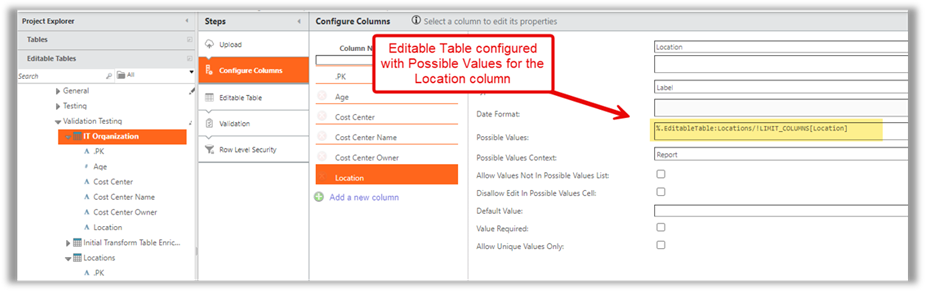

  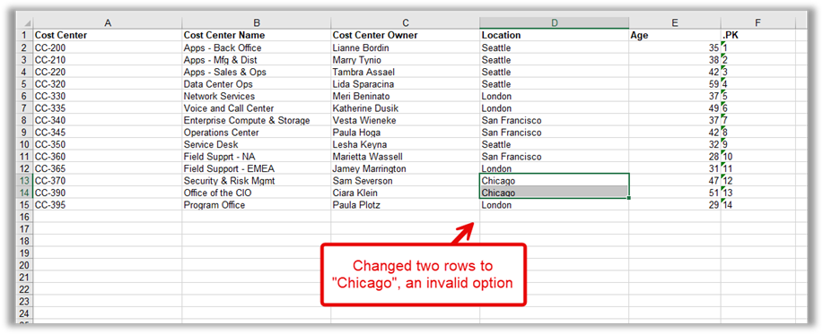

  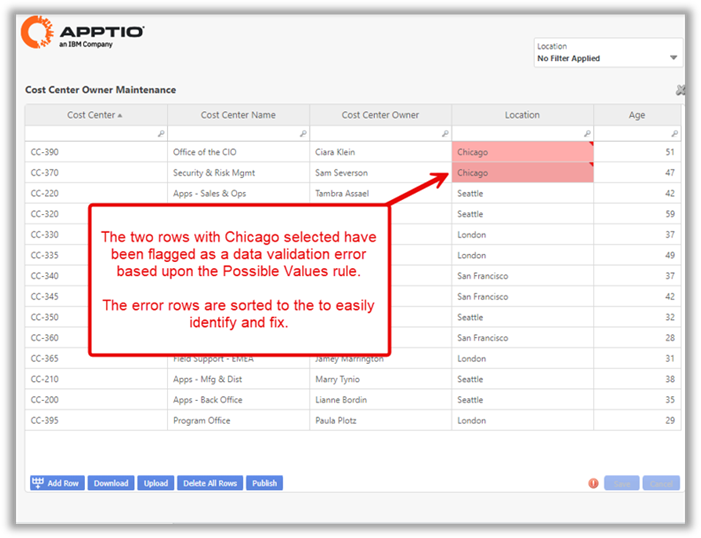

  Anteriormente, as verificações de validação durante o upload de uma tabela editável eram aplicadas somente à etapa de validação, excluindo os valores possíveis.
- **Aprimoramentos do Recurring Publish** : Em TBM Studio, a opção para ativar o novo recurso Recurring Publish foi movida de "Enable Features" para "Project Settings" Os administradores agora podem ativar esse recurso para projetos individuais. Se estiver migrando da versão 12.11.7 para 12.11.8, será necessário ativar manualmente esse recurso na tela Project Settings (Configurações do projeto), pois ele não será ativado por padrão. Não haverá perda de configuração; os cronogramas e as transformações permanecerão intactos e visíveis após a ativação.

  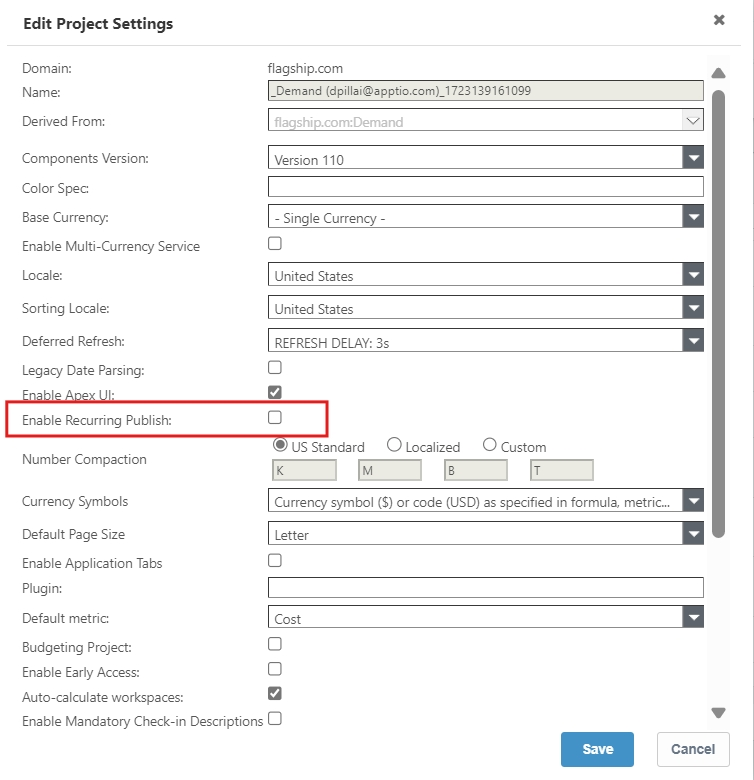

  Foram adicionadas duas novas colunas à tela Recurring Schedule: "Run Now" (Executar agora) e "Description" (Descrição) O recurso "Run Now" permite que os administradores executem programações instantaneamente, em vez de esperar pelo horário programado. A coluna "Description" permite que você adicione descrições significativas para cada programação. Uma mensagem de confirmação é exibida no canto inferior direito como "Updated Transform" (Transformação atualizada). Executou com sucesso a programação - "Nightly to First Period CY"

  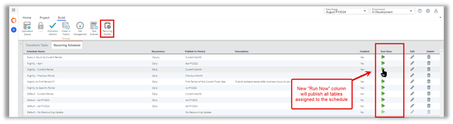

  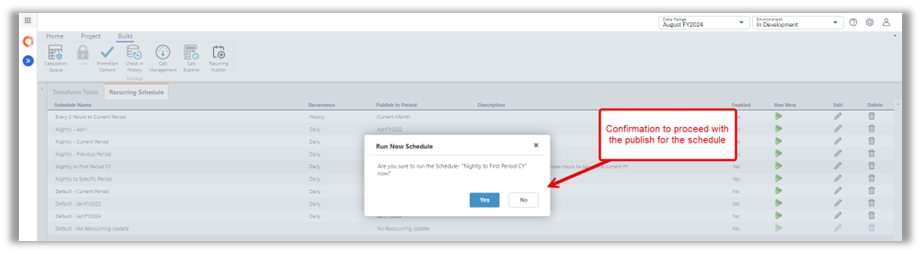

  Foram adicionadas mais três opções ao recurso "Publicar no período" - "Primeiro período do ano fiscal atual", "Primeiro período do próximo ano fiscal" e "Primeiro período do projeto"

  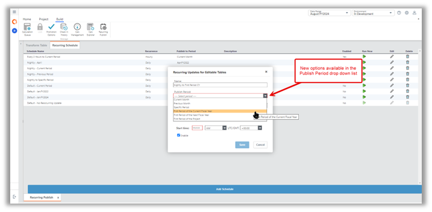

  Para obter mais informações, consulte [Publicação recorrente da tabela de transformação](../admin/recurring-publish-et.html "Aplica-se a: 12.11.7 e posterior. A opção Recurring Publish (Publicação recorrente) permite que o TBMA agende programações de publicação recorrentes automáticas para tabelas editáveis que tenham tabelas de transformação. Quando esse recurso for ativado, a opção \"Publicar no período\" será convertida em uma programação padrão e será anexada no pipeline Tabela editável, em Transformar tabela. Todos os \"Publicar no período\" serão convertidos em agendamento padrão na página Recurring Schedule, e a transformação vinculada ao agendamento estará disponível na página Transform Table.").

## Corrigido nesta versão

- Foi corrigido o problema de assinaturas de e-mail duplicadas e permitiu que os usuários inserissem um endereço de e-mail válido de um dos domínios compatíveis.
- Foi corrigido um problema com os Slicers em que a seleção de vários subvalores fazia com que o menu suspenso do filtro não fosse carregado novamente.
- Foi corrigido o problema em que as dimensões de tempo não eram adicionadas aos fatiadores globais.
- Foi corrigido um problema com o upload de anexos de tabelas de relatórios.
- Foi descontinuada a mensagem de falha no upload da tabela Append devido a colunas não correspondentes; as colunas não correspondentes agora são ignoradas.
- Predefinição de linesPerRow como 1 para a coluna de origem Enriched ET pk para melhorar a legibilidade e o foco.
- Correção da notificação "My Landing Page" vazia que estava sendo transferida para TBM Studio.
- Correção de problemas de vulnerabilidade

## Servidor 12.11.7.1 - 2 de agosto de 2024

- Atualização trimestral do Java.
- Foi corrigido um problema com o recurso de coluna de mapa que exigia outra região autorizada para o ambiente GovCloud.

## Servidor 12.11.7 - 5 de julho de 2024

Modelo de aplicativo: v120-8008

Nota:

Na versão 12.9 e superior, inclua os seguintes valores de cabeçalho em todas as chamadas de API para a API da plataforma.

**tipo de aplicativo="Flagship"**

**versão do aplicativo="NA"**

Isso inclui chamadas de API que fazem upload ou download em Costing Standard ou em outros projetos de plataforma. Esses cabeçalhos são adicionais aos cabeçalhos de API existentes que você já pode estar usando.

## Novos recursos do aplicativo

## O nome do componente exibe 3 linhas de texto

O recurso Componentes foi atualizado para exibir três linhas de texto, garantindo que os nomes completos dos componentes fiquem visíveis. Esse aprimoramento oferece vários benefícios: Facilita a capacidade de utilizar componentes existentes como parte da solução Costing Standard . Simplifica a transição para o conteúdo de relatórios futuros no New Report Designer. Permite diferenciar entre componentes com nomes mais longos, como Consumidores de custos, Consumidores de custos - Relatórios e Consumidores de custos - Workbench.

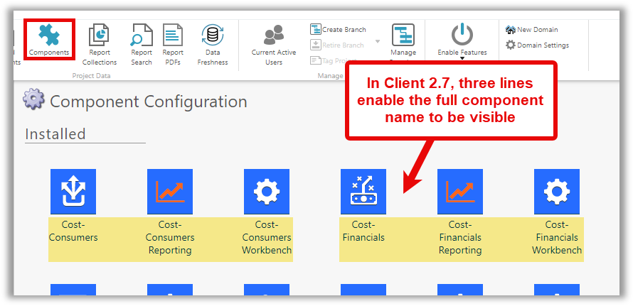

Anteriormente, os nomes dos componentes apareciam em duas linhas e geravam confusão com nomes mais longos.

## Novos recursos do servidor

## Informações de detalhes da perspectiva visíveis

As informações exibidas na seção Perspectivas do painel Project Explorer foram aprimoradas. Abra a seção **Perspectivas** no painel Project Explorer, selecione a perspectiva desejada e visualize a tabela de origem e as informações da coluna.

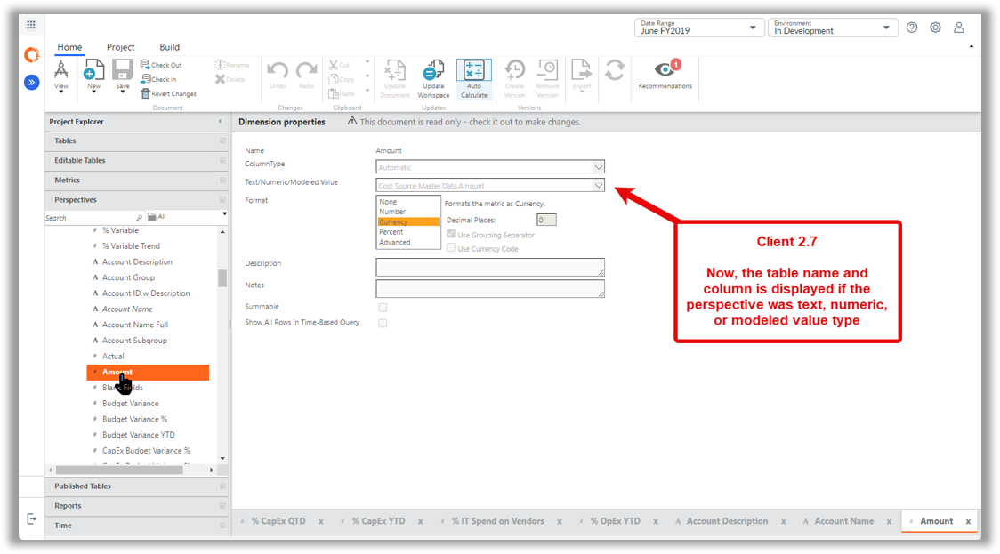

Anteriormente, os detalhes sobre perspectivas baseadas em tipos de valores textuais, numéricos ou modelados não estavam disponíveis, exceto para fórmulas.

## Confirmação aprimorada para fechar uma filial

O processo de fechamento de filiais tem uma etapa adicional para reduzir o risco de exclusões não intencionais e proporcionar uma experiência mais segura. Navegue até a guia **Project (Projeto** ) > **Manage Branches (Gerenciar ramificações** ) e clique no ícone "X" para fechar uma ramificação. É exibida uma janela pop-up de confirmação solicitando que os usuários digitem a palavra "delete" e, em seguida, cliquem em **OK**.

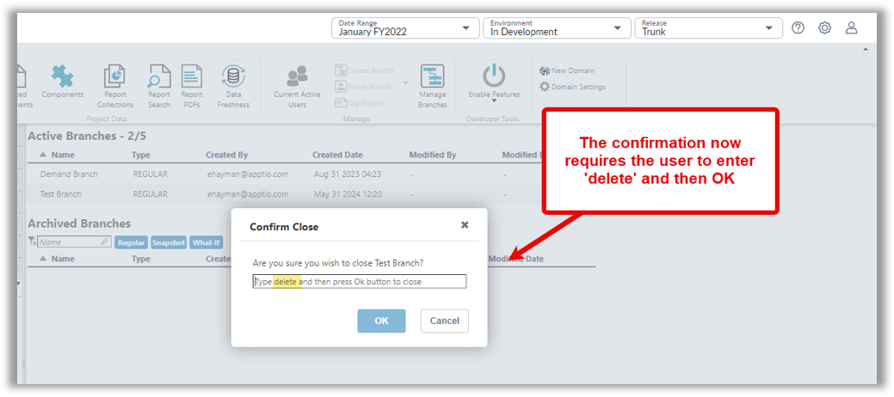

Anteriormente, o fechamento de uma filial exigia apenas que os usuários clicassem em OK, o que levava a exclusões permanentes acidentais por parte de alguns clientes.

## Aprimoramentos do Precision Calc

As seguintes otimizações foram implementadas para otimizar os processos de geração de relatórios, proporcionar tempos de geração mais rápidos e melhorar a capacidade de resposta em nossa plataforma.

- **Otimizações com reconhecimento de tempo** : Os períodos de tempo são calculados somente quando os dados são atualizados ou afetados. Essa abordagem direcionada reduz os cálculos desnecessários, aumentando a velocidade e a eficiência da geração de relatórios.
- **Otimizações de relatórios** : A necessidade de cálculos relacionados a alterações não materiais, como ajustes na paleta de cores, foi eliminada. Essa simplificação garante que os recursos computacionais sejam concentrados nos elementos essenciais do relatório, melhorando ainda mais o desempenho geral.

## Corrigido nesta versão

- Aumentou a solicitação de recursos da CPU e removeu os limites da implantação.
- Foi corrigido o problema de EditableTableConfigDTO não chamar super nos métodos copyFromPojo e copyToPojo.
- Correção de problemas de atualização de dados.
- Renomeou a função copyEditableTable para CopyToEditableTable.

## Cliente 2.7 - 5 de julho de 2024

## Dependência

O cliente v2.7 é compatível com o servidor 12.11.7 e 12.11.6.x

## Novos recursos do cliente

## IBM Apptio Costing Essentials é GA

IBM ApptioCosting Essentials lançou o Template v200, que foi projetado para agilizar e simplificar as soluções de custos para nossos usuários. Trata-se de uma solução de cálculo de custos prescritiva criada em R12, adaptada para clientes menores e menos complexos. Ele é implementado por meio do CS Delivery para configuração inicial e do TAS para suporte contínuo. Ele utiliza componentes padrão para facilitar o uso e a consistência entre as implementações.

Os administradores podem criar novos projetos usando o tipo de projeto "Costing Essentials". Esses projetos consistem em componentes criados diretamente no site R12. É uma estrutura atualizável que oferece suporte a componentes futuros, ampliando a funcionalidade para Costing Standard. Ele utiliza tabelas editáveis para entrada e manutenção de dados, incluindo mapeamentos que acionam métodos de alocação predefinidos.

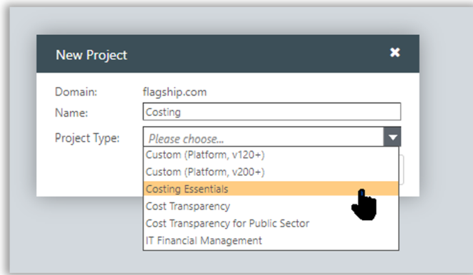

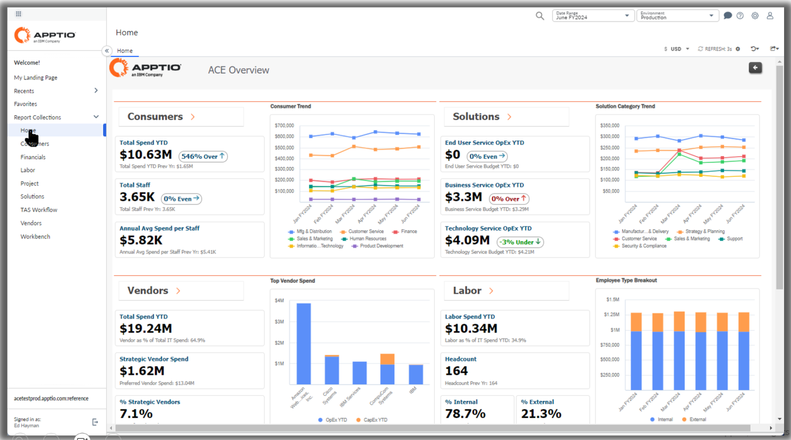

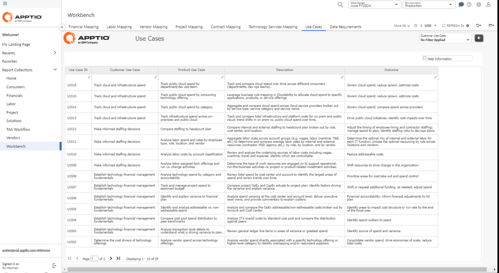

## Assinaturas de e-mail para relatórios padrão

Esse recurso simplifica o processo de gerenciamento e distribuição dos relatórios do Studio por meio de notificações agendadas por e-mail, oferecendo maior flexibilidade e controle aos administradores.

Os administradores podem se inscrever para assinatura de e-mail dos relatórios do Studio diretamente do modo "View" (Exibir) do aplicativo (exceto TBM Studio). Navegue até o ícone Exportar e selecione Assinatura de e-mail. Digite os valores obrigatórios e selecione Subscribe (Assinar). A opção Manage Subscriptions (Gerenciar assinaturas) permite a visualização da lista completa de assinaturas de relatórios de e-mail, que pode ser acessada tanto na visualização "relatório" quanto na visualização "destinatário".

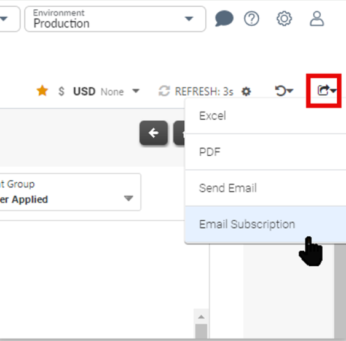

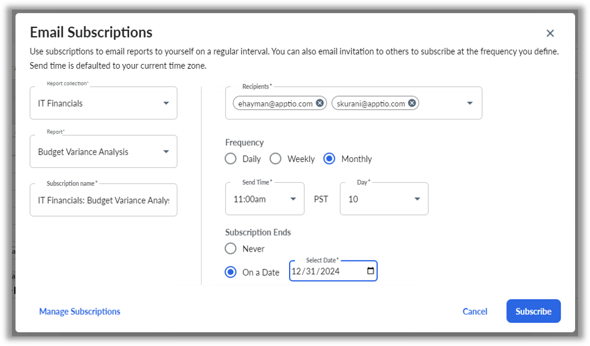

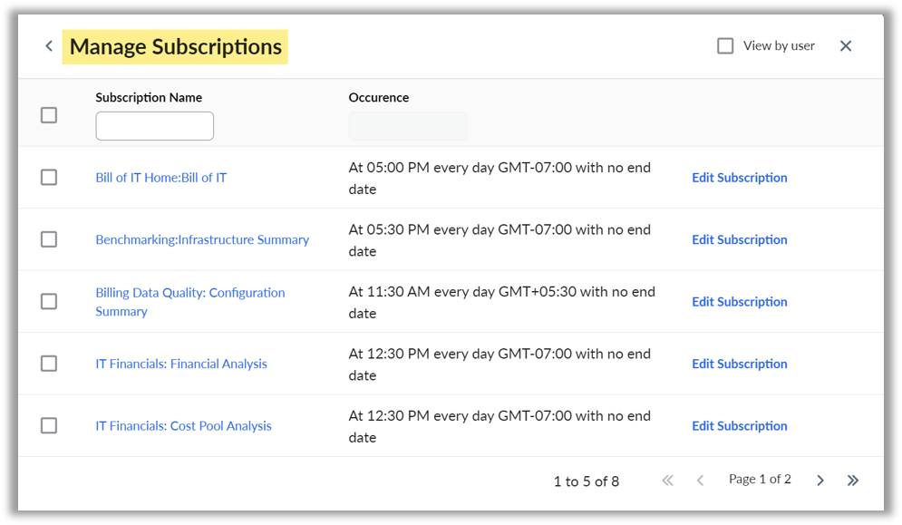

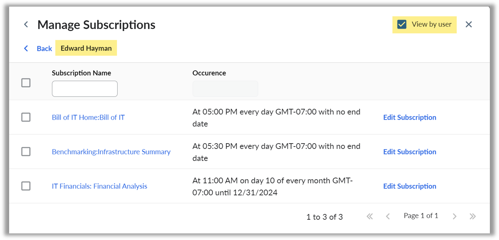

## Navegação aprimorada

- **Representação de usuários** : Os administradores podem se passar por usuários para aprimorar os recursos administrativos, permitindo a personalização perfeita das configurações de navegação para alinhar-se às preferências e funções do usuário na plataforma. Ele também permite a pré-configuração de páginas de destino e relatórios favoritos para as principais partes interessadas. Para se passar por um usuário, selecione o ícone **Usuário** > **Passar** por outro e digite o nome de usuário da conta a ser passada por outro. No modo Exibir, selecione o ícone de engrenagem e, em seguida, selecione Configurar página de destino/favoritos. Personalize a página de destino, selecione os relatórios favoritos e, em seguida, **Salve** as configurações para aplicá-las ao usuário com identidade falsa.

  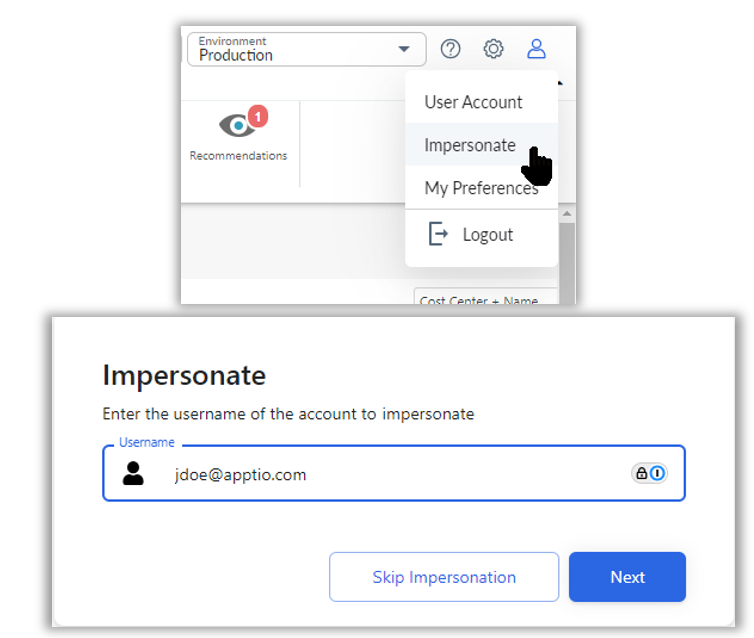
- **Exclusão de relatórios** : Esses aprimoramentos garantem uma experiência de usuário mais tranquila, gerenciando e comunicando com eficácia as alterações nas configurações de navegação, mantendo a clareza e a usabilidade na plataforma.

  Quando um relatório favorito ou landing page for excluído ou suas permissões forem alteradas pelo Administrador, os usuários serão notificados sobre isso. Se o usuário tentar abrir um relatório excluído ou inacessível, será exibida uma mensagem de erro. Da mesma forma, o relatório afetado será automaticamente removido das configurações da Landing Page ou da lista de favoritos.
- **Exibição aprimorada do nome do relatório** : Nesta versão, aprimoramos a forma como os nomes dos relatórios são exibidos. Essa atualização proporciona clareza e precisão na identificação do relatório, minimiza a confusão do usuário e elimina duplicatas durante a seleção. Quando os usuários inserem texto na caixa de texto Pesquisar e, se houver nomes de alias duplicados nas coleções de relatórios, o nome completo do relatório será exibido com o alias entre parênteses. Por exemplo, em vez de vários relatórios serem exibidos simplesmente como "Resumo", eles agora aparecerão como entradas distintas, como "Infraestrutura - Servidor (Resumo)".

  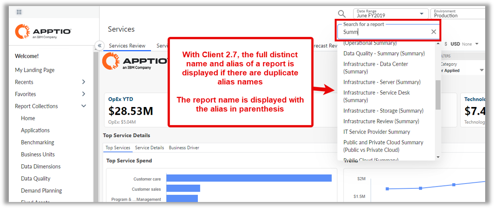

  Anteriormente, nomes de relatórios de alias duplicados causavam confusão ao pesquisar e selecionar relatórios.

## Tabelas editáveis

- **ApptioScript - Tipo de evento DuplicateRow** : Os administradores agora podem definir comportamentos específicos de colunas em Tabelas editáveis, usando o ApptioScript. Esse recurso também aprimora a integridade dos dados, promovendo a eficiência e reduzindo os erros no gerenciamento de dados.
  - **Add Row (Adicionar linha** ): Permite que todas as colunas sejam editáveis, facilitando a entrada inicial de dados.
  - **Duplicate Row** : permite que os administradores bloqueiem colunas mapeadas, garantindo a integridade dos dados e evitando modificações não intencionais.

  Por exemplo, durante as ações Add Row (Adicionar linha), os administradores podem exigir que todas as colunas sejam editáveis para uma entrada de dados abrangente. Mas as ações de Duplicar linha podem restringir as edições de colunas mapeadas para manter a consistência e a precisão.
- **Agendador de publicação aprimorado** : O Editable Tables Publish Scheduler permite que os administradores criem vários agendamentos e gerenciem centralmente as tabelas de transformação. Ele oferece a capacidade de suportar diferentes casos de uso de tabelas editáveis, necessidades de publicação de dados e é mais simples de manter e alterar as datas de "publicação até". Para ativar esse recurso, marque a caixa de seleção **Ativar publicação recorrente para tabelas de transformação** na guia **Projeto** > **Ativar recursos**. Uma nova opção **Recurring Publish** aparece na guia **Build**.

  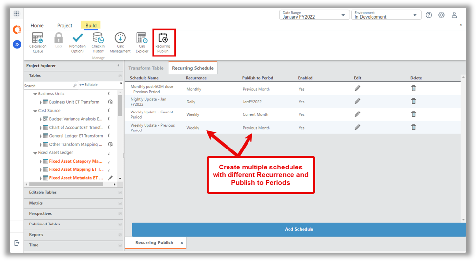

  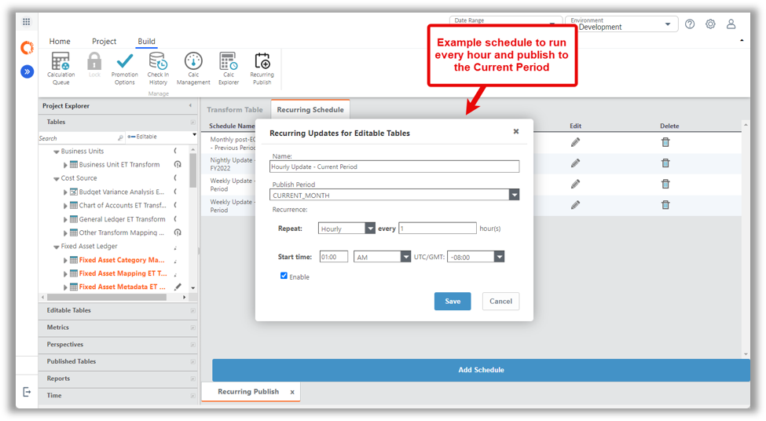

  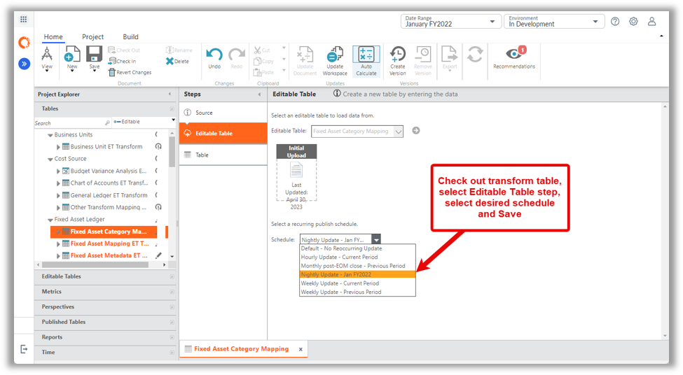

  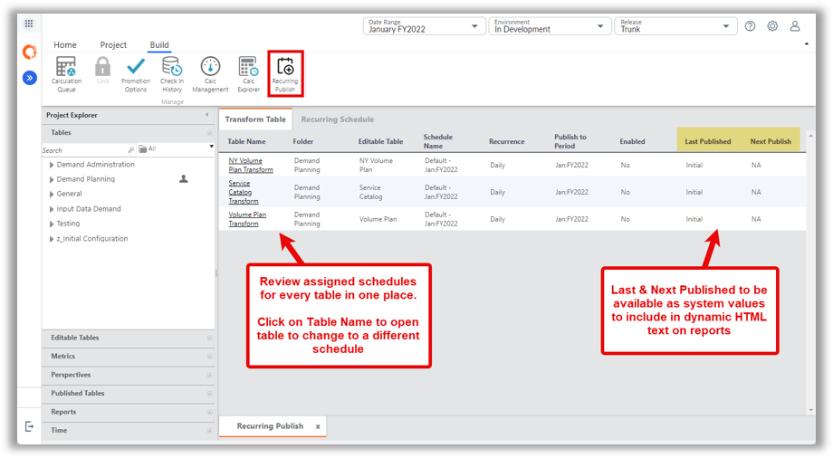

  Selecione a opção **Recurring Publish** (Publicação recorrente) para ver a página Recurring Publish (Publicação recorrente). Ele tem duas guias principais:

  - **Transform Table (Tabela de transformação** ): Fornece uma visão abrangente de todas as tabelas de transformação originadas de tabelas editáveis. Ele inclui detalhes como o nome da tabela editável subjacente e as informações de programação associadas.
  - **Programação recorrente** : Permite a criação e a modificação de várias programações. Os usuários podem especificar a frequência, publicar em períodos e outros parâmetros relevantes.

  A ativação desse recurso pode exigir etapas específicas para migrar as configurações existentes sem problemas. Para saber mais, consulte [Recurring Publish](../admin/recurring-publish-et.html "Aplica-se a: 12.11.7 e posterior. A opção Recurring Publish (Publicação recorrente) permite que o TBMA agende programações de publicação recorrentes automáticas para tabelas editáveis que tenham tabelas de transformação. Quando esse recurso for ativado, a opção \"Publicar no período\" será convertida em uma programação padrão e será anexada no pipeline Tabela editável, em Transformar tabela. Todos os \"Publicar no período\" serão convertidos em agendamento padrão na página Recurring Schedule, e a transformação vinculada ao agendamento estará disponível na página Transform Table.").

## Corrigido nesta versão

- Foi corrigido o problema em que a página Erros não era recarregada ao alterar o Ambiente selecionado no menu suspenso.
- Reduziu o tempo de upload de arquivos grandes em tabelas editáveis brutas.
- Foi corrigido o problema de alteração automática da largura do fatiador.
- Foi corrigido o problema de a "My Landing Page" não configurada não abrir no painel lateral direito no aplicativo não CT.
- Foi corrigido o problema de mudança da configuração de "Minha página de destino" para a coleção principal.
- Foi corrigido o problema de visibilidade das informações de detalhes das perspectivas.
- Resolveu vários problemas de vulnerabilidade para reforçar a segurança do sistema e garantir a conformidade.

## Servidor 12.11.6 - 24 de maio de 2024

Modelo de aplicativo: v110-7985

Nota:

na versão 12.9 e superior, inclua os seguintes valores de cabeçalho em todas as chamadas de API para a API da plataforma.

tipo de aplicativo="Flagship"

versão do aplicativo="NA"

Isso inclui chamadas de API que fazem upload ou download em Costing Standard ou em outros projetos de plataforma. Esses cabeçalhos são adicionais aos cabeçalhos de API existentes que você já pode estar usando.

## Novos recursos do aplicativo

Não há novos recursos de conteúdo de aplicativos.

## Novos recursos do servidor

## Tabelas publicadas (GA)

As tabelas publicadas são usadas para exportar dados de um projeto ApptioOne para outro projeto ApptioOne ou para um sistema de terceiros. Algumas das vantagens são:

- Elimina o gerenciamento de relatórios e as permissões associadas durante a exportação de tabelas.
- Oferece suporte à criação de tabelas da mesma forma que um relatório.
- Oferece suporte à exportação assim que o cálculo do desenvolvimento é concluído.
- Cria uma maneira mais acessível, detectável e de fácil manutenção para exportar dados modelados.
- Remove a dependência da superfície de relatório TBM Studio de clientes que não são do Studio para exportar dados.

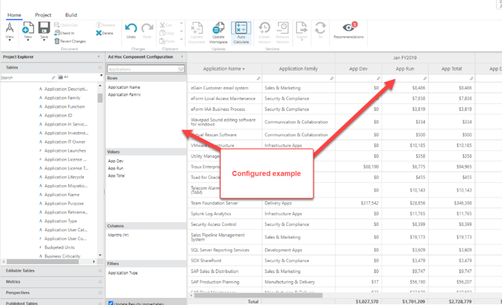

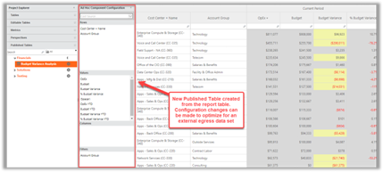

Antes desse recurso, os usuários tinham de criar um relatório para exportar dados. A principal preocupação era bloquear o relatório para que os usuários finais não pudessem acessá-lo. Algumas tabelas de exportação eram muito grandes, o que, por sua vez, aumentava a carga no sistema. Isso retardou o processo de cálculo de preparação, o que atrasou a disponibilidade da tabela.

Para saber mais, consulte [Publicar tabelas para exportação](../data_studio/published-tables.html "Aplica-se a: TBM Studio 12.11.3 e posterior. As tabelas publicadas são usadas para exportar dados de um projeto de cálculo de custos e planejamento para outro projeto de cálculo de custos e planejamento ou para um sistema de terceiros.").

## Etapa de validação no pipeline marcada como GA

Nesta versão, a etapa de validação no pipeline de dados está disponível por padrão. A administração pode optar por não participar desmarcando a opção **Enable Validation Step in Pipeline (Beta)**. Essa opção será removida de Enable Features na próxima versão.

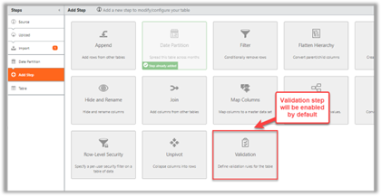

## Corrigido nesta versão

- Resolveu vários problemas de vulnerabilidade para reforçar a segurança do sistema e garantir a conformidade.
- Foi corrigido o problema em que o Automatic ALL\_ROWS não funcionava com Slicers.
- Corrigido o problema de enfileiramento automático no cálculo de precisão.
- A função Eval() foi removida do modelo v109.

## Cliente 2.6 - 24 de maio de 2024

## Dependência

O cliente v2.6 é compatível com o servidor 12.11.6 e 12.11.5.x

## Novos recursos do cliente

## Navegação aprimorada (GA)

A navegação do relatório foi modernizada para simplificar a experiência do usuário, introduzindo os seguintes novos recursos. Esses recursos são ativados por padrão em **TBM Studio** > **Projeto** > **Ativar recursos** : Pesquisa de relatório por nome, Configurar recentes, Configurar página inicial, Configurar favoritos.

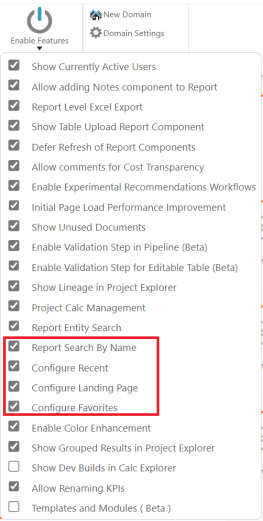

- **Favoritos** : É possível selecionar um ou mais relatórios e marcá-los como favoritos, para que você possa acessá-los facilmente, sem o incômodo de pesquisar ou navegar até eles. Para marcar um relatório como favorito, você pode selecionar o ícone de favorito ou usar a opção **Configurar favoritos** no menu **Configurações**.

  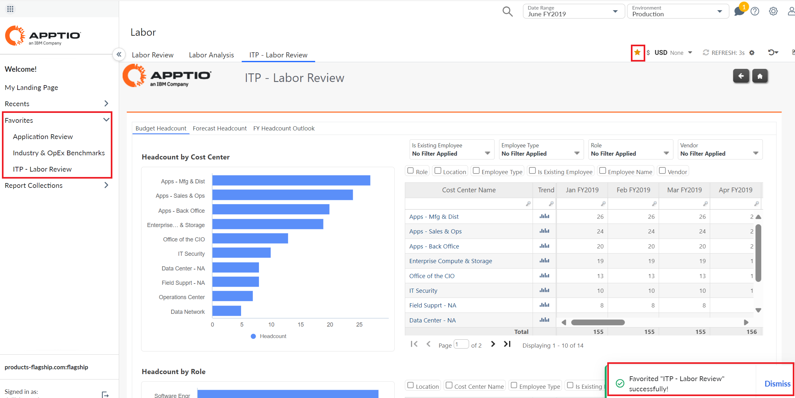

  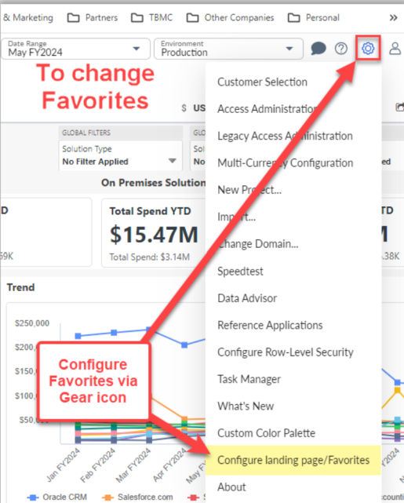
- **Recentes** : A opção Recentes aparecerá no menu de navegação esquerdo dos ambientes de produção e exibirá a lista de relatórios acessados recentemente. Ele mostrará um máximo de cinco relatórios, com o relatório acessado mais recentemente na parte superior.

  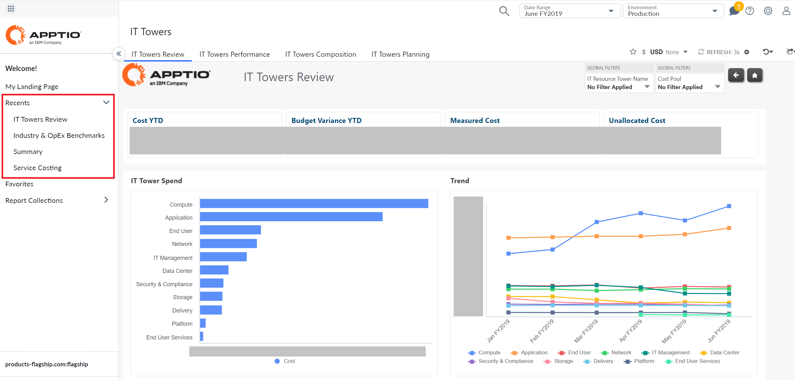
- **Pesquisa de relatórios** : Um ícone de pesquisa foi adicionado à interface do usuário para pesquisar um relatório e acessá-lo facilmente.

  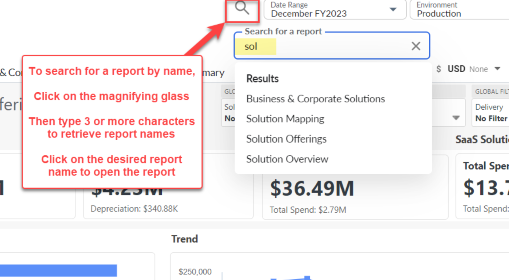
- **Minha página de destino** : Você pode iniciar e retornar rapidamente à sua página de destino preferida.

  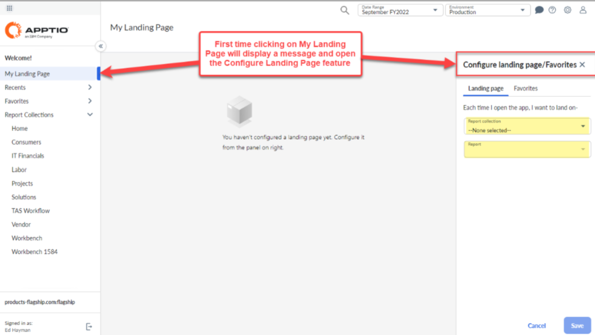

  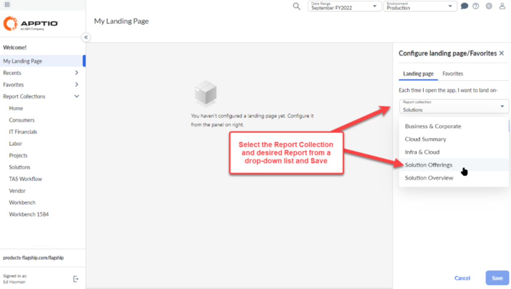

  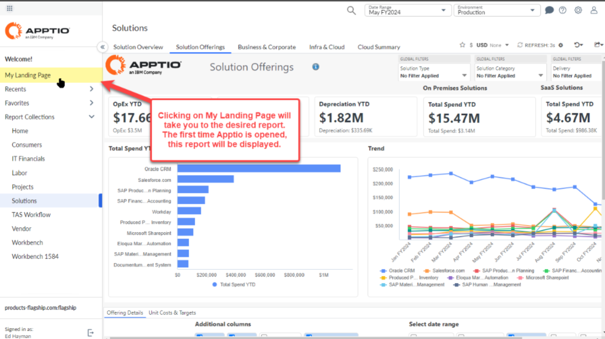

[Navegação aprimorada](../../costing-billing/home.html).

## Enviar aprimoramentos de e-mail ad hoc

Ao compartilhar um relatório com alguém por e-mail, o relatório URL, os comentários fornecidos pelo usuário estarão em *itálico*, e o link do relatório no e-mail nunca expirará. Além disso, se você abrir o link do relatório no e-mail, verá o relatório no mesmo contexto, ou seja, todos os filtros, divisores, selecionadores e intervalos de datas aplicados persistirão e o relatório aparecerá exatamente como foi compartilhado pelo remetente.

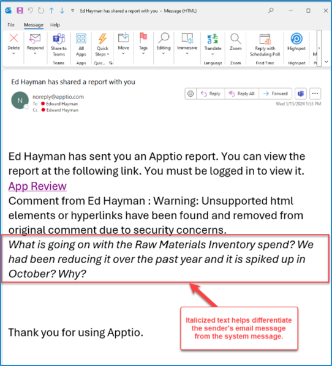

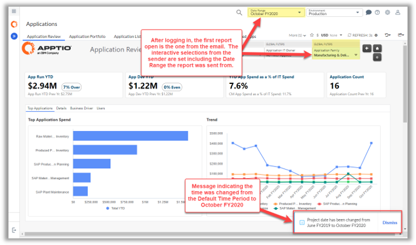

Anteriormente, era difícil identificar os comentários do remetente e o relatório URL costumava expirar após algum tempo. Ao clicar em URL, a data/intervalo não persistiu e, portanto, o receptor não pôde ver o relatório no mesmo contexto que o remetente.

[Imprimir e exportar relatórios](../reports/printexportreports.html "Aplica-se a: Apptio TBM Studio R12.5 e posterior. O TBM Studio se baseia na exportação de relatórios para o formato PDF para impressão e compartilhamento de relatórios fora da suíte TBM. O administrador do TBMA ou do TBM Studio pode personalizar as opções de layout de PDF por relatório para todos os usuários do site Apptio ao imprimir ou enviar relatórios por e-mail.")

## Tabelas editáveis

- **Tabela editável - Aprimoramentos de Excluir todas as linhas** : Ao selecionar o botão Excluir todas as linhas, é exibida uma janela pop-up de confirmação. O usuário deve digitar "delete" para prosseguir. O botão OK permanecerá desativado a menos que o usuário digite "delete". Anteriormente, o usuário podia excluir todas as linhas sem ver nenhuma mensagem de aviso/confirmação. Isso resultou em exclusão acidental e, portanto, em perda de dados.

  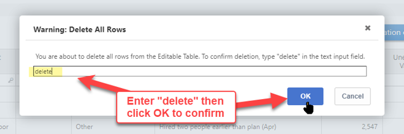

  Além disso, se todas as células do conjunto filtrado de linhas visíveis estiverem bloqueadas, os botões **Adicionar linha**, **Excluir linha** e **Duplicar linha** permanecerão desativados, mas o botão **Excluir todas as linhas** ainda estará ativado. Anteriormente, o botão Excluir todas as linhas também estava desativado e era difícil planejar o processo operacional do próximo mês.

  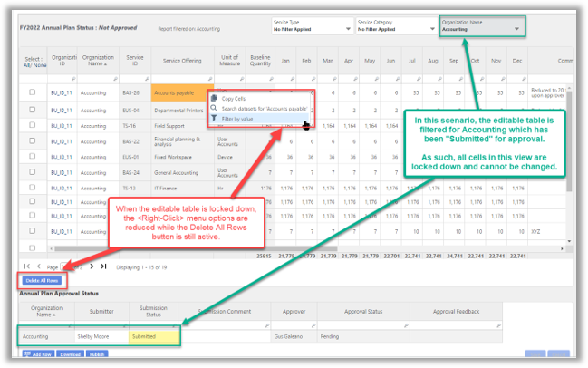
- **Tabela editável - CopyTable suporte a funções para tabelas editáveis** : Os administradores agora podem configurar scripts para copiar valores em uma tabela editável bruta. Isso ajudará a facilitar o upload de dados para atualizações recorrentes e garantirá que a tabela correta seja carregada. O administrador deve criar um relatório com um botão, um script de automação e incluir um texto HTML com instruções. A sintaxe deve ser: CopyToEditableTable(source project, source table, destination project, destination table, mode = "overwrite"|"append" (obrigatório), autocheckin="true"|"false"). Quando isso for concluído, o usuário final poderá simplesmente abrir o relatório e clicar no botão para executar a cópia da tabela.

  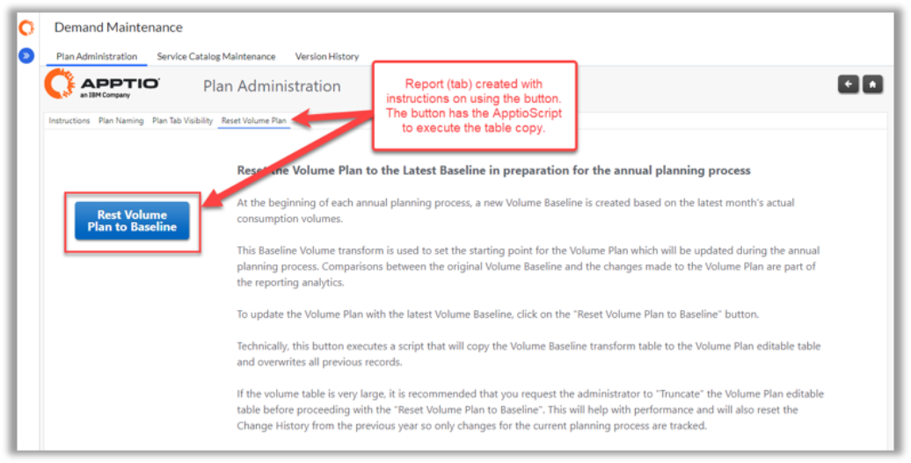

  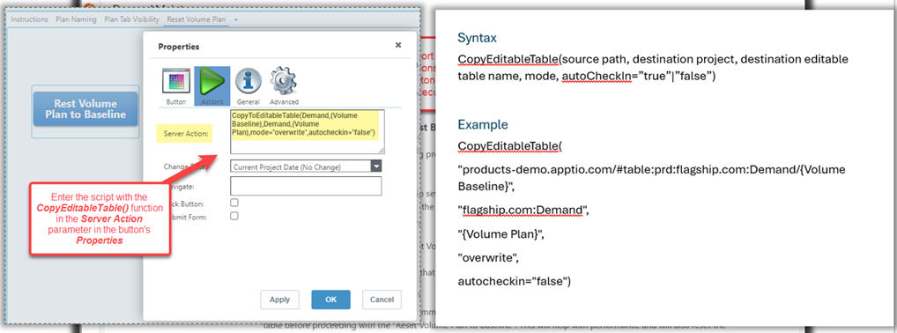
- **Tabela editável - Recursos avançados de seleção de caixa de seleção** : A caixa de seleção agora foi integrada ao site ApptioScript para que as alterações em massa possam ser automatizadas. O administrador deve criar scripts específicos de botão para automatizar tarefas comuns e **ativar a caixa de seleção** na guia Advanced das propriedades. Depois que o script é criado, o usuário final pode usar a caixa de seleção para selecionar as linhas para aplicar as alterações e, em seguida, selecionar o botão para executar o script.

  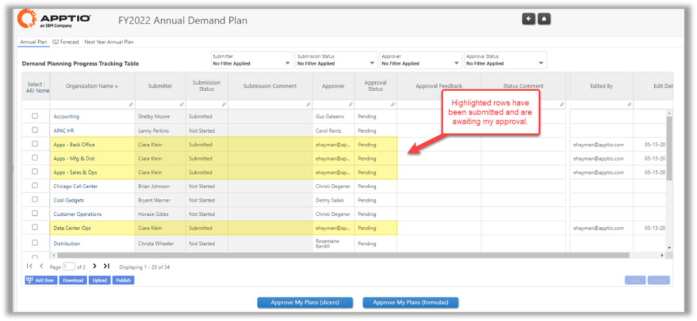

  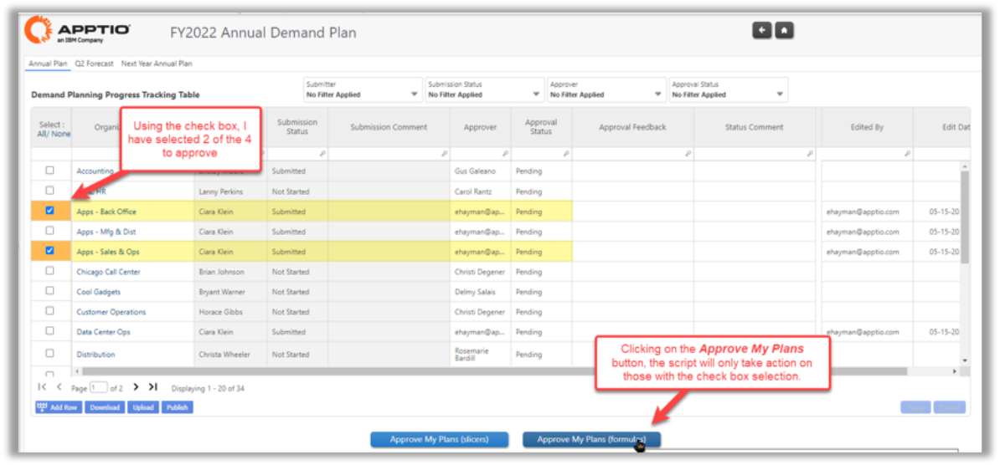

  Anteriormente, o usuário não tinha a opção de selecionar apenas algumas linhas para agir sobre elas. Eles tinham que selecionar manualmente cada linha e executar a ação necessária.

## Renomear rótulos de KPI em relatórios (Beta)

Os usuários podem criar KPIs com métricas e renomeá-los com o rótulo desejado. Para renomear um KPI, ative a opção **Permitir renomeação de KPIs** em **Projeto** > **Habilitar recursos**. Em seguida, adicione um componente de relatório de KPI a um relatório, arraste as métricas para o painel de configuração de KPI, clique com o botão direito do mouse na métrica e selecione **Renomear**. Digite um novo nome para o KPI e salve-o. Não é possível renomear o nome da perspectiva usada em um KPI.

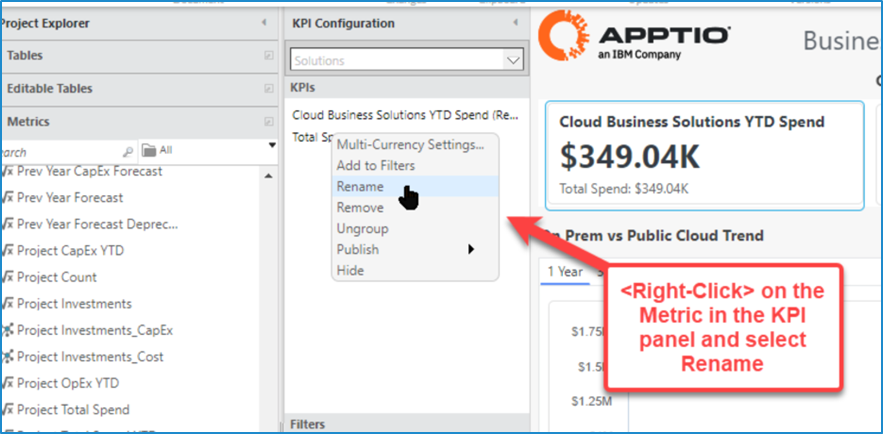

Anteriormente, era necessário criar uma dimensão ou perspectiva para renomear uma cadeia específica no KPI.

## Corrigido nesta versão

- Foi corrigido o problema de meses fechados que saltavam para anos anteriores.
- A moeda nos relatórios não pode ser revertida após a alteração da localidade.
- Foi corrigido o problema em que os gráficos de sobreposição não eram exportados quando o eixo Y estava oculto.

## Servidor 12.11.5.2 - 3 de maio de 2024

- Foi corrigido um problema com uma versão específica do arquivo zip após a atualização para r12.11.4.
- Atualizações trimestrais de vulnerabilidades do Java.

## Servidor 12.11.5.1 - 19 de abril de 2024

Foi corrigido um problema no lado do servidor em que os e-mails de distribuição de faturamento não estavam sendo enviados se um logotipo personalizado fosse usado devido a um nome de host inválido para logos.apptio.com. Como resultado, nenhum e-mail foi enviado. Correção: adicionado logos.apptio.com à lista de nomes de host válidos.

## Servidor 12.11.5 - 12 de abril de 2024

Modelo de aplicativo: v120-7974

Nota:

na versão 12.9 e superior, inclua os seguintes valores de cabeçalho em todas as chamadas de API para a API da plataforma.

tipo de aplicativo="Flagship"

versão do aplicativo="NA"

Isso inclui chamadas de API que fazem upload ou download em Costing Standard ou em outros projetos de plataforma. Esses cabeçalhos são adicionais aos cabeçalhos de API existentes que você já pode estar usando.

## Novos recursos do aplicativo

Não há novos recursos de conteúdo de aplicativos.

## Novos recursos do servidor

## Tabelas publicadas (BETA)

- **Agrupamento** : As tabelas publicadas podem ser organizadas em grupos para ajudar a melhorar a organização e a manutenção. Ao criar uma nova tabela publicada, especifique o nome e a categoria. A nova tabela publicada será listada na categoria no Project Explorer

  
- **Ativar/desativar aviso de cálculo** : Para melhorar o desempenho do cálculo e o tempo de resposta das chamadas de API, uma nova caixa de seleção chamada "Ativo" foi adicionada à tabela publicada. Para ativar ou desativar o pré-cálculo, abra uma tabela publicada > selecione a guia **Tabela publicada** e marque ou desmarque a caixa de seleção **Ativo**

  
- **Renomear coluna** : Os usuários podem renomear o nome da coluna de uma tabela publicada, e o nome da dimensão original será exibido no painel Ad Hoc Component Configuration.

  

## Aprimoramentos na interface do usuário do Calc Explorer

O Calc Explorer foi aprimorado para mostrar compilações específicas do Trunk ou de uma ramificação, separadamente. O usuário pode alternar entre o Tronco e qualquer Filial ativa para visualizar as compilações desejadas, em vez de percorrer a enorme lista. Além disso, o "quilate" será exibido somente se houver vários cálculos da mesma construção.

Anteriormente, todas as compilações eram exibidas em uma única lista grande e era tedioso pesquisar uma compilação específica. Além disso, o quilate foi mostrado mesmo para as construções que têm apenas um único cálculo.

## Fluxo de trabalho Fix It renomeado para Troubleshooting (Solução de problemas)

Em **TBM Studio** > guia **Início** > **Recomendações de configuração**, o nome do botão "Corrigir todos os problemas identificados" foi alterado para **Solucionar todos os problemas identificados**. Clicar no botão iniciará um fluxo de trabalho de várias etapas para envolver o administrador na solução de problemas e no processo automatizado de "conserto".

Anteriormente, a opção Fix All Identified Problems (Corrigir todos os problemas identificados) era exibida para iniciar um fluxo de trabalho, mas alguns administradores temiam que ela fizesse alterações sem seu controle e não queriam usá-la.

## Otimização da interface do usuário do Precision Calc Apex

Com essa otimização, a alteração de uma configuração de projeto para "Ativar Apex UI" não exigirá mais otimizações de cálculo para definir o sinalizador Apex UI nas **configurações do projeto**.

## Corrigido nesta versão

- Resolveu vários problemas de vulnerabilidade para reforçar a segurança do sistema e garantir a conformidade.
- Foi resolvido o problema da mensagem de erro na etapa de partição de data do pipeline de transformação.

## Cliente 2.5 - 12 de abril de 2024

## Dependência

O cliente v2.5 é compatível com o servidor 12.11.5 e 12.11.4.x

## Novos recursos do cliente

## Navegação aprimorada (BETA)

A navegação do relatório foi modernizada para simplificar a experiência do usuário, introduzindo os seguintes novos recursos. No momento, esses recursos estão atrás da bandeira e não são ativados por padrão. Os administradores podem ativar esse recurso beta por meio de **TBM Studio** > **Projeto** > **Ativar recursos** e selecionar: Pesquisa de relatório por nome, Configurar recente, Configurar página inicial, Configurar favoritos.

- **Favoritos** : É possível selecionar um ou mais relatórios e marcá-los como favoritos, para que você possa acessá-los facilmente, sem o incômodo de pesquisar ou navegar até eles. Para marcar um relatório como favorito, você pode selecionar o ícone de favorito ou usar a opção **Configurar favoritos** no menu **Configurações**.

  

  
- **Recentes** : A opção Recentes aparecerá no menu de navegação esquerdo dos ambientes de produção e exibirá a lista de relatórios acessados recentemente. Ele mostrará um máximo de cinco relatórios, com o relatório acessado mais recentemente na parte superior.

  
- **Pesquisa de relatórios** : Um ícone de pesquisa foi adicionado à interface do usuário para pesquisar um relatório e acessá-lo facilmente.

  
- **Página de destino preferencial** : Você pode selecionar uma página ou relatório específico para ser sua página de destino padrão. Para marcar um relatório como a página de destino, use a opção Configurar página inicial no menu Configurações.

  

  

  Para saber mais sobre os aprimoramentos de navegação, consulte [Navegação aprimorada](../../costing-billing/home.html).

## Enviar e-mail com um link simplificado

Ao compartilhar qualquer relatório com alguém por e-mail, a mensagem de e-mail será um relatório específico do contexto URL. Anteriormente, o e-mail continha um link de relatório URL extenso e com várias linhas, que parecia pouco atraente e confuso.

## Tabelas editáveis

- **Explore a configuração sem fazer check-out** : Os administradores agora podem explorar a seção da coluna de configuração sem fazer o check-out da tabela editável. Para fazer isso, abra uma tabela editável, selecione as diferentes etapas do pipeline e, em seguida, selecione as diferentes colunas nas etapas de Configure Columns (Configurar colunas) para ver as configurações específicas.

  Anteriormente, os administradores eram obrigados a consultar o documento para revisar a configuração

  
- **Tabela editável - Opção de hora em hora para o agendador de publicações recorrentes** : Uma nova opção **Hourly** foi adicionada ao agendamento de publicação de uma tabela editável, para que a publicação recorrente possa ser executada a cada hora. Isso ajudará a obter informações precisas, sem modificar as caixas de texto HTML durante as transições do horário de verão. O horário de início pode ser modificado para permitir uma cronometragem precisa.

  Anteriormente, se houvesse várias publicações em um dia, o administrador selecionava a recorrência diária com vários horários de início, e o número de horários de início era originalmente 8.

  
- **Tabela editável - seleção de caixa de seleção para filtragem futura usando o ApptioScript** : Um novo valor **da coluna Adicionar caixa de seleção** foi adicionado na guia **Propriedades** > **Avançar** do componente Relatório de tabela editável. Ao marcar essa caixa de seleção, uma nova coluna aparece no início da tabela editável. Essa caixa de seleção é usada para selecionar uma ou várias linhas e excluí-las. Marque a caixa de seleção e clique com o botão direito do mouse para ver a opção **Excluir linha**.

  

  
- **Tabela editável - Recupere o esquema da tabela editável sem carregar dados para tabelas muito grandes** : Os usuários agora podem suprimir o carregamento inicial da tabela editável no relatório selecionando a opção **Suprimir solicitação de dados inicial** na guia **Propriedades** > **Avançado**. Ao ativar essa opção, somente a configuração ficará visível, e não os dados. A página deve ser atualizada manual ou automaticamente após a aplicação do filtro. Os dados também ficarão visíveis ao selecionar **Update Data (Atualizar dados)** no menu do botão direito do mouse.

  

  

  
- **Tabela editável - Validação de dados para "tabela de interseções":** Uma etapa de validação de dados foi adicionada às tabelas editáveis. Se você inserir um dado que não existe na tabela de validação, a célula ficará vermelha e, ao passar o mouse sobre ela, será exibida uma mensagem de erro. Você poderá salvar as alterações, mas a célula permanecerá vermelha e as linhas com erros aparecerão na parte superior da tabela para facilitar a identificação. Veja o exemplo abaixo - o nome da validação é *Locais*, mas a coluna de validação é *Local*.

  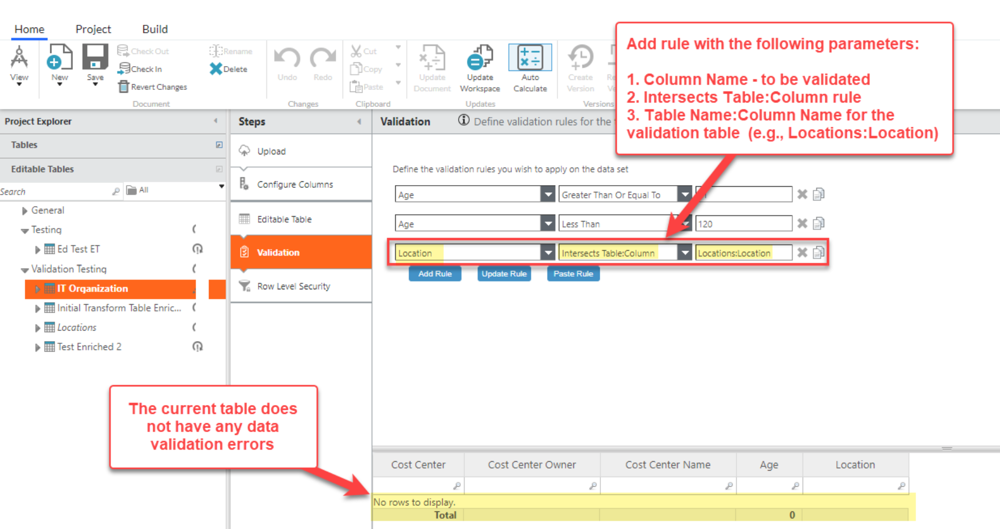

  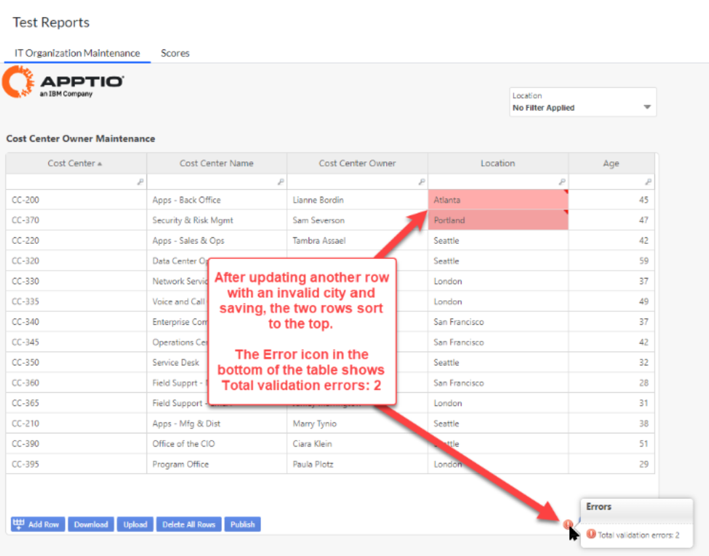

## Corrigido nesta versão

- Resolvido o problema de sincronização durante a verificação do relatório ET.
- Foi corrigido o problema de falha na exportação de PDFs devido a fatiadores compactos.
- Foi corrigido o problema das tabelas editáveis que ficavam acinzentadas e sem resposta.
- Foi resolvido o problema da exibição de uma mensagem de erro incorreta ao anexar tabelas editáveis.
- Resolveu vários problemas de vulnerabilidade para reforçar a segurança do sistema e garantir a conformidade.
- Foi corrigido o problema do seletor de tempo estar fora de sincronia com o download de relatórios e dados.

## Servidor 12.11.4.1 - 28 de março de 2024

Esta versão corrigiu um problema no lado do servidor em que o Calc Explorer estava perdendo de 3 a 4% das atividades de cálculo.

## Servidor 12.11.4 - 1º de março de 2024

Modelo de aplicativo: v110-release

Nota:

na versão 12.9 e superior, inclua os seguintes valores de cabeçalho em todas as chamadas de API para a API da plataforma.

tipo de aplicativo="Flagship"

versão do aplicativo="NA"

Isso inclui chamadas de API que fazem upload ou download em Costing Standard ou em outros projetos de plataforma. Esses cabeçalhos são adicionais aos cabeçalhos de API existentes que você já pode estar usando.

## Novos recursos do aplicativo

## SaaS Insights obsoletos ( v110 )

No Template v110, os componentes do SaaS Insights foram movidos para a versão beta e não devem mais ser usados. Os clientes atuais do SaaS Insights poderão continuar a usar as análises Salesforce, ServiceNow, e Office365. O suporte e os aprimoramentos não estarão disponíveis.

## Novos recursos do servidor

## Calc Explorer (GA)

O Calc Explorer é um novo recurso inovador projetado para oferecer aos administradores uma visão inigualável dos cálculos de construção. Com esse recurso, os administradores podem revisar a lista de compilações e detalhar uma compilação individual para entender quais atividades de cálculo ocorreram e identificar o que está gerando o maior esforço de cálculo. Essas informações podem ser usadas para limpar e otimizar a configuração do projeto.

O Calc Explorer pode ser acessado na guia TBM Studio > Build.

- Exibe uma lista de compilações recentes para explorar.
- Abra uma compilação específica para ver uma visualização Sankey que representa os componentes de cálculo, incluindo relatórios, exercícios, transformações e métricas.
- O diagrama Sankey interativo permite que os administradores analisem a construção por esforço de cálculo, número de linhas ou número de colunas.
- Pesquise em um tipo específico de componente de cálculo para visualizar as entidades individuais classificadas de forma decrescente por esforço de cálculo.
- Aprofunde-se nos períodos de tempo e, no caso dos relatórios, aprofunde-se nos componentes específicos do relatório.

Os aprimoramentos futuros incluirão a detecção de anomalias para identificar e alertar os administradores quando os cálculos se desviarem das compilações anteriores.

► Saiba mais: [Calc Explorer](../admin/calc-explorer.html)

## Cálculo de precisão

O recurso Precision Calc tem duas novas otimizações com esta versão.

- As alterações não materiais no pipeline de transformação eliminam a necessidade de realizar uma atualização de cálculo quando:
- Altere as notas de Descrição da tabela nas etapas de Origem na seção Tabelas
- Alterar o Source System na etapa Upload em Tabelas
- Mover a tabela para uma nova categoria
- Adicionar / alterar descrição em Perspectivas
- Adicionar / alterar notas em Perspectivas
- As alterações de configuração da interface do usuário em Configurações de cálculo eliminam a necessidade de realizar uma atualização de cálculo quando as prioridades de cálculo padrão são alteradas, um cálculo ativo é movido na fila ou um cálculo de preparação é ativado ou desativado para um projeto.

## Corrigido nesta versão

- Melhoria do desempenho do tempo de resposta para tabelas editáveis, otimizando o código para buscar apenas informações sobre a tabela necessária.
- Corrigido o problema de leitura do domínio correto
- Foi corrigido um problema em que uma perspectiva apresentava comportamento inconsistente em um gráfico de relatório ao puxar colunas de vários objetos.
- Foi corrigido um problema em que a alteração do local da opção de upload causava a corrupção do cache.
- Resolveu vários problemas de vulnerabilidade para reforçar a segurança do sistema e garantir a conformidade.

## Cliente 2.4 - 1º de março de 2024

## Dependência

O cliente v2.4 é compatível com o servidor 12.11.4 e 12.11.3.x

## Novos recursos do cliente

## Tabelas editáveis

- **Upload de tabela editável - padrão para anexar ou sobrescrever** : O componente de relatório Tabela editável agora inclui um recurso que permite que os administradores especifiquem o método de upload de dados desejado - "anexar" ou "substituir" dados existentes da superfície de relatório. Para acessar essa configuração, clique com o botão direito do mouse no componente do relatório e navegue até Propriedades > Avançado. Lá, você encontrará uma opção para "Anexar dados no upload" Ao selecionar essa opção, os administradores definem o método de tratamento de dados diretamente para a caixa de diálogo Opções de upload.

  No modo de visualização de relatório, os usuários finais com permissões podem fazer upload de dados diretamente da superfície de relatório. Depois de selecionar o arquivo, o modal de upload exibirá "O comportamento de upload da tabela está configurado para:" seguido pelo método selecionado, "Overwrite" ou "Append" Essa configuração é predefinida pelo administrador e não pode ser alterada pelo usuário.

  Os administradores ainda poderão selecionar "anexar" ou "substituir" ao fazer o upload para uma tabela editável no pipeline de dados em TBM
  Studio.

  

  

  Antes desta versão, era necessário que o usuário selecionasse o método de upload, "Upload" ou "Append", depois de selecionar o arquivo. Isso não é apropriado, pois o usuário pode não entender a diferença e, por engano, substituir atualizações de outros usuários.
- **Scripts de botão - reconhecem a linha filtrada** : Os botões podem automatizar atualizações em massa de tabelas editáveis usando o script Apptio. Com esta versão, as funções EditRow e DeleteRow são aplicadas somente a linhas filtradas usando slicers ou a barra de pesquisa.

  Antes desta versão, os scripts não consideravam os filtros na exibição do relatório. Dessa forma, alguns registros podem ter sido atualizados de forma incorreta ou inconsciente.
- **Scripts de botão: pesquisa de valores em outra tabela editável** : Os administradores agora podem configurar scripts de botão de tabela editável mais complexos com base em valores de outra tabela editável. Isso simplificará a experiência do usuário final ao automatizar atualizações comuns de dados em massa. Nesta versão, somente a função EditRow é compatível e usa uma tabela editável de "linha única" para capturar a entrada dos usuários. Se houver várias linhas na tabela, será usado o "primeiro valor" encontrado, semelhante à função vlookup() do Excel.
- **Truncar** : Um novo recurso de truncamento remove permanentemente todas as linhas, inclusive o histórico de auditoria, tanto para tabelas editáveis brutas quanto enriquecidas. Para tabelas brutas, a tabela ficará em branco; para tabelas editáveis enriquecidas, a tabela refletirá a tabela de origem subjacente. O recurso Show History não exibirá nenhum registro.

  O recurso Truncar está disponível apenas para administradores. Um caso de uso é redefinir uma tabela editável após a configuração inicial e o teste. Ao truncar a tabela antes da implementação da produção, a tabela será nova, sem nenhum histórico de testes anteriores. Da mesma forma, o Truncate pode ser usado para limpar tabelas em que o histórico de alterações não é mais necessário. Isso pode ser especialmente útil para tabelas muito grandes carregadas com frequência.

  O recurso Truncate é acessado pelo site TBM Studio na etapa Editable Table do pipeline de dados. O botão aparece no canto inferior direito. A ativação do botão aciona um pop-up de confirmação, garantindo que os administradores tomem uma decisão informada ao confirmar ou cancelar a solicitação. É importante observar que, uma vez truncados, os dados são irrecuperáveis.

  

  

  Antes desta versão, somente um engenheiro do Apptio podia remover permanentemente todas as linhas do banco de dados SQL subjacente.

## Corrigido nesta versão

- Resolveu vários problemas de vulnerabilidade para reforçar a segurança do sistema e garantir a conformidade.
- Criou uma barreira para impedir o salvamento de uma coluna de fórmula se o seu nome duplicar o de uma coluna existente em uma tabela editável.
- Foi corrigido um problema em que o check-out de um documento selecionava o documento errado.
- Foi corrigido um problema com gráficos de sobreposição em que os valores ao passar o mouse sobre o gráfico não estavam alinhados com a escala do eixo y.

## Servidor 12.11.3 - 19 de janeiro de 2024

Modelo de aplicativo: v110-7952

Nota:

na versão 12.9 e superior, inclua os seguintes valores de cabeçalho em todas as chamadas de API para a API da plataforma.

tipo de aplicativo="Flagship"

versão do aplicativo="NA"

Isso inclui chamadas de API que fazem upload ou download em Costing Standard ou em outros projetos de plataforma. Esses cabeçalhos são adicionais aos cabeçalhos de API existentes que você já pode estar usando.

## Novos recursos do aplicativo

Não foram feitas alterações no modelo de aplicativo v110.

## Novos recursos do servidor

## Fluxo de trabalho do Fix It GA

Fluxo de trabalho **de todas as linhas** e **colunas não utilizadas** : esses fluxos de trabalho de recomendação de correção agora estão disponíveis para todos os clientes por padrão.

Funcionalidade de fluxo de trabalho de colunas não utilizadas: O fluxo de trabalho otimiza o desempenho do sistema ocultando colunas não utilizadas em tabelas de dados, reduzindo as cargas de cálculo e melhorando a eficiência geral do sistema.

Os administradores podem acessar esse recurso por meio de Configuration Recommendations (Recomendações de configuração) e selecionar 'Fix All Identified Problems' (Corrigir todos os problemas identificados) na recomendação Unused Columns (Colunas não utilizadas). O processo inclui:

- Verificar documentos para edição.
- Selecione as tabelas a serem corrigidas.
- O sistema ocultará automaticamente as colunas não utilizadas nas etapas da fórmula dentro do pipeline de dados da tabela.
- Verificação de alterações e marcação de problemas como resolvidos.

  

  As próximas atualizações tratarão de problemas de desempenho relacionados à análise de JSON.

## Tabelas publicadas (Beta)

Lançadas inicialmente como uma versão Beta de acesso antecipado no Server 12.11.2 / Client 2.2, as Published Tables oferecem uma maneira mais acessível e de fácil manutenção para exportar dados modelados do TBM Studio. Com esta versão, as tabelas publicadas agora podem ser ativadas por meio de Enable Features e selecionando Published Tables. As tabelas publicadas podem ser criadas do zero, usando o recurso Novo > Tabelas publicadas na guia Página inicial, ou a partir de um componente de tabela de relatório existente, clicando com o botão direito do mouse e selecionando Criar tabela publicada.

Anteriormente a esse recurso, os administradores precisavam criar tabelas de relatórios, promovê-las à produção, clicar com o botão direito do mouse no componente da tabela de relatórios para abrir o menu, selecionar 'Show API URL ' e copiar/colar a API desejada URL.

## Precision Calc - otimização consciente do tempo (EA Beta)

O recurso Precision Calc tem duas novas otimizações com esta versão.

**As otimizações com reconhecimento de tempo** aumentam a eficiência calculando apenas os períodos de tempo em que os dados foram atualizados ou afetados. Esse recurso beta de acesso antecipado requer a aprovação do gerente de produto para ativar a funcionalidade e é ativado ao definir biit.background.cacher.enable.timeaware.optimization como true.

**As otimizações** da coleção de relatórios aumentam a eficiência, eliminando a necessidade de realizar uma atualização de cálculo quando um relatório é adicionado ou removido de uma coleção de relatórios.

Antes dessa versão, todos os períodos de tempo abertos e quaisquer alterações nas coletas de relatórios eram recalculados.

## Pré-processador de dados para tabelas JSON (EA Beta)

Um novo serviço de pré-processador de dados foi desenvolvido para analisar tabelas JSON antes de serem carregadas no site TBM Studio. A análise de JSON é um processo de cálculo intensivo que é executado novamente toda vez que o sistema exige um cálculo desses dados. Ao analisar os dados fora do mecanismo de cálculo do BIIT, o sistema terá um desempenho melhor e os tempos de cálculo serão reduzidos. Esse recurso requer aprovação do produto para ser ativado. Uma implementação controlada será programada ao longo de 2024 para migrar os clientes para esse novo serviço.

A funcionalidade futura permitirá que a filtragem, o agrupamento e a categorização de dados sejam aplicados antes de serem carregados no site TBM Studio.

## Corrigido nesta versão

- Correção de um erro encontrado ao acessar documentos não utilizados.
- Foi adicionado suporte para desativação de matrizes densas compactadas, controlável por meio do sinalizador disable.compressed.dense.matrix (padrão: false).
- Foi resolvido um problema com a visibilidade do bloco "Novos componentes".
- Foi corrigido um problema que fazia com que as cores personalizadas fossem revertidas para as cores padrão do site Apptio.
- Foi corrigido o problema de alguns projetos não estarem visíveis na nova interface do usuário.
- Resolveu vários problemas de vulnerabilidade para reforçar a segurança do sistema e garantir a conformidade.

## Cliente 2.3 - 19 de janeiro de 2024

## Dependência

O cliente v2.3 é compatível com o servidor 12.11.3 e 12.11.2.x

## Novos recursos do cliente

## Tabelas editáveis

- **Recurso Excluir todas as linhas:** Um novo recurso opcional, **Excluir todas as linhas**, foi introduzido no componente de relatório de tabelas editáveis. O uso desse botão excluirá todas as linhas das tabelas editáveis brutas, deixando a tabela em branco; e removerá todas as linhas adicionadas ou modificadas das tabelas editáveis enriquecidas, deixando a tabela no mesmo estado da tabela de origem. As alterações na tabela editável serão rastreadas e estarão disponíveis por meio do recurso "Mostrar alterações".

  Esse recurso é desativado por padrão. Para ativá-la, clique com o botão direito do mouse no componente de relatório da tabela editável, selecione **Propriedades** > **Avançado** e ative a opção **Permitir excluir todas as linhas**. O botão **Excluir todas as linhas** ficará visível entre os botões "Adicionar linha" e "Publicar" na superfície do relatório para usuários com a permissão necessária.

  Antes desse recurso, os administradores precisavam criar um botão com o Apptio Script que executava duas condições opostas; por exemplo, se A=true, deleterow()); se A=false, deleterow(). Isso só funcionava para tabelas editáveis brutas. Se as linhas existentes precisassem ser excluídas de uma tabela editável enriquecida, era necessário que um engenheiro excluísse as linhas no banco de dados backend.

  

  

  Para saber mais, consulte a seção Excluir todas as linhas em [Editar propriedades de tabelas](../reports/tables/edit-properties-tables.html "Aplica-se a: TBM Studio 12.0 e posterior").
- **Slicers em várias tabelas editáveis** : Um slicer pode ser usado para filtrar em mais de um componente de relatório de tabela editável, mesmo que eles sejam baseados em tabelas editáveis diferentes. O nome da coluna deve ser o mesmo em ambas as tabelas editáveis. Um exemplo na solução ApptioOne Demand Planning é quando as tabelas editáveis Volume Plan e Plan Status são exibidas no mesmo relatório. A seleção de uma ou mais opções no fatiador filtrará ambas as tabelas. Se um slicer for colocado em um objeto de relatório de grupo, somente as tabelas dentro do grupo serão afetadas.

  Antes desse recurso, o administrador precisava ter um fatiador acima de cada tabela, com o fatiador usando uma coluna da tabela editável de origem. Os usuários finais precisariam então selecionar o(s) valor(es) desejado(s) em ambos os slicers para filtrar as duas tabelas com os mesmos valores.

  
- **UI de upload e download** : Os botões "Download" e "Upload" foram adicionados ao componente de relatório de tabela editável. O botão Download está ativado por padrão e funcionará com tabelas editáveis brutas e enriquecidas. A funcionalidade de **download** reflete o recurso "<clique com o botão direito do mouse> e abra no Excel. e se baseia na visualização do relatório filtrado.

  O botão Upload está desativado por padrão e deve ser ativado no modo de estúdio. Com o relatório verificado, clique com o botão direito do mouse no componente de relatório de tabela editável, selecione **Propriedades** > **Avançado** e ative a opção **Permitir upload**. O recurso Upload só está disponível para tabelas editáveis brutas e, no momento, não é compatível com tabelas editáveis enriquecidas.

  Antes desse recurso, o usuário podia fazer o download da tabela clicando com o botão direito do mouse para abrir o menu pop-up. Esse método não é visível nem facilmente acessível para usuários casuais. Os administradores também podem adicionar componentes de relatório de tabela editáveis de Download e Upload separados no relatório; no entanto, eles ocupam espaço no relatório.

  

  OBSERVAÇÃO: se um usuário tentar fazer upload de dados enquanto o relatório estiver em check-out, o upload não poderá ser feito. Os botões Upload e Save serão desativados e o usuário deverá fechar o modal Upload data set atualizando a tabela - clique com o botão direito do mouse na área da tabela e selecione a opção Update Data (Atualizar dados).

  
- **Aprimoramentos na interface do usuário e nas permissões de upload e download** : **As permissões** de tabelas editáveis foram atualizadas para maior flexibilidade e controle. As três novas permissões incluem: Permissão de download, Permissão de upload e Permissão de linha duplicada. O Duplicate Row fornece um controle separado e independente do Add Row.

  Anteriormente a esse recurso, a permissão Add Row controlava tanto a adição quanto a duplicação de linhas.

  
- **Validação de dados - Integrada ao fluxo do processo de upload de tabelas** : A validação de dados foi integrada ao componente de relatório de tabela editável para evitar o upload de dados corrompidos ou incorretos. Esse recurso pode ser ativado no menu suspenso **Projeto** > **Ativar recursos** e selecionando **Ativar etapa de validação para tabela editável (Beta)**. Os erros ou avisos são exibidos em tempo real à medida que os dados são inseridos, com explicações claras sobre qualquer problema. Quando um usuário faz upload de dados que não atendem às regras de validação de dados, as células serão destacadas em vermelho com explicações ao passar o mouse para ajudar o usuário a resolver qualquer problema com os dados.

  Habilitar a validação de dados

  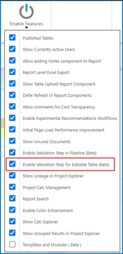

  O usuário final insere manualmente dados com valores incorretos

  

  O usuário final carregou o conjunto de dados com valores incorretos

  

  ► Saiba mais: [Validação de dados para tabelas editáveis](../reports/tables/data-validation-tables.html)
- **Respeitar as permissões Add Row com copiar/colar** : Para ações de copiar/colar em tabelas editáveis, novas linhas serão adicionadas conforme necessário, desde que o usuário tenha a "Permissão de adicionar linha". Sem essa permissão, será exibida uma mensagem de erro.

  Anteriormente a esse recurso, linhas adicionais eram adicionadas com a ação de copiar/colar, mesmo que o usuário não tivesse a "Permissão de adicionar linha".

  Usuário colando várias linhas sem permissão para adicionar linha

  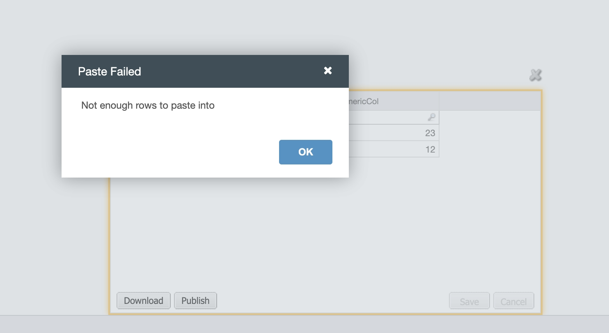

  **Apptio Script - nova função RowCount\_EditableTable(** ): Uma nova função, RowCount\_EditableTable(<Editable Table Name>), está agora disponível. Retorna o número total de linhas na tabela subjacente do relatório ou em uma tabela especificada se um nome for fornecido. Isso é útil ao usar um script avançado para excluir e/ou copiar tabelas.

  Anteriormente a esse recurso, os administradores podem ter tentado usar o recurso RowCount( ), que não funcionava para tabelas editáveis.

  ► Saiba mais sobre: [Função RowCount\_EditableTable( )](../formulas-and-functions/functions/rowcount-editabletable.html "Aplica-se a: TBM Studio 12.11.3 e posterior")

## Seleção de várias moedas e comportamento do fatiador

Os usuários agora podem alternar entre várias moedas sem redefinir a visualização padrão do relatório. As seleções ad hoc atuais (pivôs, filtros, seletores de coluna) são mantidas ao mudar de moeda.

## Corrigido nesta versão

- Foi corrigido um problema em que as descrições, os nomes e as notas não eram visíveis nas Perspectivas.
- Foi resolvido um problema em que as fórmulas eram salvas inadvertidamente ao criar uma perspectiva.
- Foi corrigido um problema em que o valor de entrada de um filtro Pipe desaparecia com a adição de um novo filtro.
- A exibição do painel de dimensões foi atualizada para mostrar detalhes de todas as variantes das dimensões publicadas.
- Foi resolvido um problema que causava ícones vermelhos/amarelos/verdes e formatação de tabelas muito grandes.
- Os administradores não podem mais criar tabelas editáveis com nomes já usados por conteúdo pronto para uso. Esses nomes agora são reservados.
- Correção de um problema de exibição com anotações de células de tabela.
- Foi corrigido um problema em que a ocultação do eixo "valor" em gráficos de barras e colunas causava falha nas exportações de PDF.
- Resolveu vários problemas de vulnerabilidade para reforçar a segurança do sistema e garantir a conformidade.
