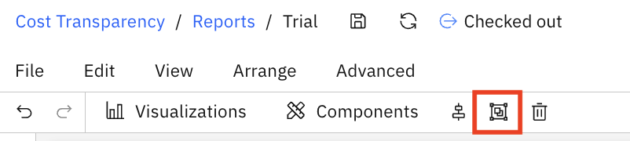
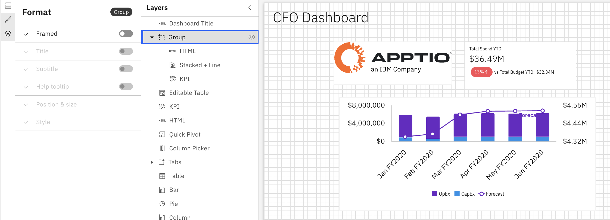

# Grupo

O recurso de agrupamento permite organizar facilmente vários componentes no layout do seu relatório, agrupando-os ou desagrupando-os. Isso ajuda a gerenciar componentes relacionados como uma única unidade.

## Quando usar Grupos

Use Grupos quando desejar:

- Mantenha o conteúdo relacionado visualmente junto
- Mover vários componentes juntos
- Simplifique layouts complexos

## Adicionar um grupo ao relatório

1. Crie um grupo selecionando vários componentes
   1. Pressione e mantenha pressionada a tecla **Shift** e clique para selecionar vários componentes na tela.
   2. Pressione **Ctrl + G (Cmd + G no Mac)** para agrupar os componentes selecionados. (Você verá os componentes agrupados aparecerem como uma hierarquia aninhada no **painel Camada.**)
2. Um **ícone de grupo** também está disponível na barra de ferramentas - clicar nele executa a mesma ação.

   
3. Criar um grupo emoldurado
   1. Adicione um grupo a partir do painel Componentes na barra de ferramentas
   2. Painel de formatação
      1. Propriedades gerais – Veja Propriedades do componente
4. Desagrupar
   1. Para desagrupar, selecione o componente agrupado e clique no ícone Agrupar novamente (ele funciona como Desagrupar quando um grupo é selecionado).
   2. A hierarquia é atualizada no painel Camada, mostrando novamente os componentes individuais.

Exemplo: Grupo

