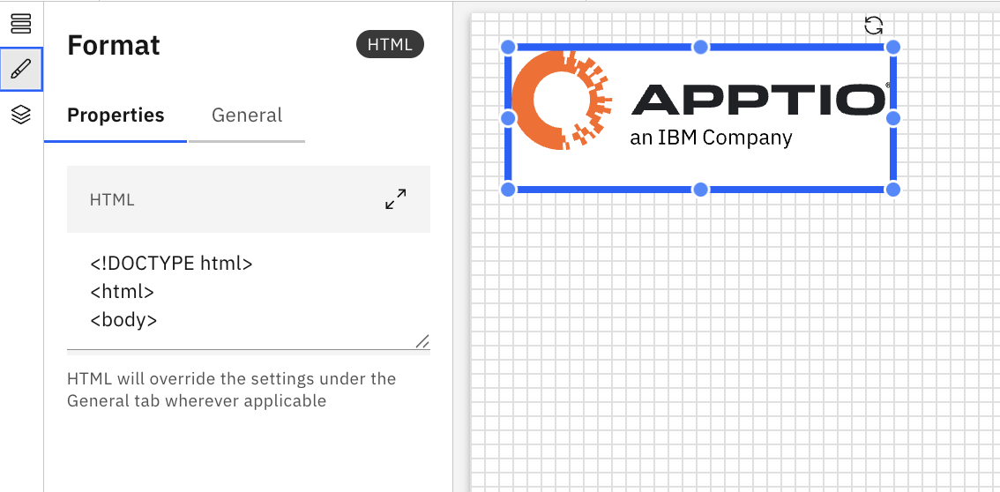

# HTML

O componente HTML permite incorporar conteúdo HTML personalizado diretamente em um relatório. É útil para adicionar rich text, links, imagens ou layouts personalizados que não estão disponíveis através dos componentes padrão.

## Quando usar HTML

Use o componente HTML quando desejar:

- Adicione texto formatado, como títulos, parágrafos ou listas
- Inclua hiperlinks para recursos externos ou internos
- Exibir imagens estáticas ou ícones
- Forneça conteúdo explicativo, isenções de responsabilidade ou anotações dentro de um relatório

## Adicionar um componente HTML ao relatório

1. Adicione um HTML a partir do painel Componentes na barra de ferramentas
2. Clique no HTML para ativar os painéis Dados e Formato.
3. Painel de dados
   1. Selecione o objeto modelo na lista suspensa
   2. Arraste as dimensões do Dimension Explorer para as seções de linhas, colunas, valores e filtros no painel de dados
4. Painel de formatação
   1. Propriedades gerais – Veja [Propriedades do componente](components.html#abt-comp__comprop)
   2. Propriedades específicas do HTML
      1. Clique no ícone de maximização ou digite o **conteúdo** HTML na caixa de texto.

Exemplo: HTML

O HTML suporta fórmulas personalizadas e dimensões de fórmulas. Para obter mais detalhes, consulte [Fórmulas personalizadas.](../create-first/custom-formula.html "As fórmulas personalizadas (também conhecidas como dimensões de fórmula) permitem definir novas dimensões calculadas utilizando campos existentes no seu modelo de dados. Isso permite uma análise mais profunda e insights mais ricos, sem a necessidade de alterações no conjunto de dados ou esquema subjacente.")
