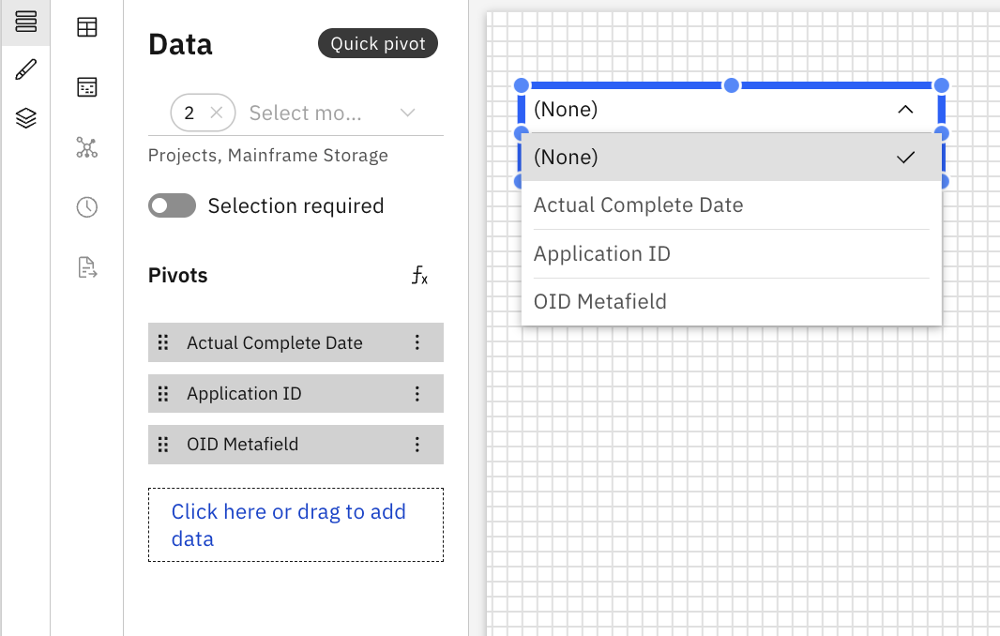

# Pivô rápido

O Quick Pivot funciona de maneira semelhante a uma tabela dinâmica no Excel, permitindo que os usuários alterem dinamicamente a forma como os dados são agrupados e resumidos em uma tabela.

## Quando usar o Quick Pivot

Use o Quick Pivot quando desejar:

- Agrupe dados por diferentes dimensões em tempo real
- Compare métricas entre diferentes classificações

## Adicionar um Quick Pivot ao relatório

1. Adicione um Quick Pivot a partir do painel Componentes na barra de ferramentas
2. Clique em Quick Pivot para ativar os painéis Dados e Formato.
3. Painel de dados
   1. Selecione o objeto modelo na lista suspensa
   2. Arraste as dimensões do Dimension Explorer para a seção pivôs no painel de dados
4. Painel de formatação
   1. Propriedades gerais – Veja [Propriedades do componente](components.html#abt-comp__comprop)

Exemplo: Pivô rápido

O Quick Pivot suporta fórmulas personalizadas e dimensões de fórmulas. Para obter mais detalhes, consulte [Fórmulas personalizadas.](../create-first/custom-formula.html "As fórmulas personalizadas (também conhecidas como dimensões de fórmula) permitem definir novas dimensões calculadas utilizando campos existentes no seu modelo de dados. Isso permite uma análise mais profunda e insights mais ricos, sem a necessidade de alterações no conjunto de dados ou esquema subjacente.")
