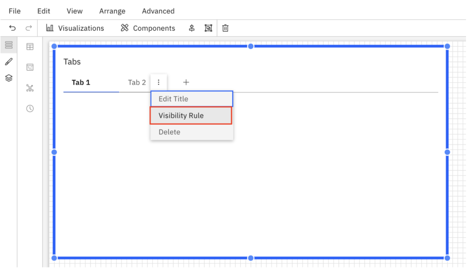
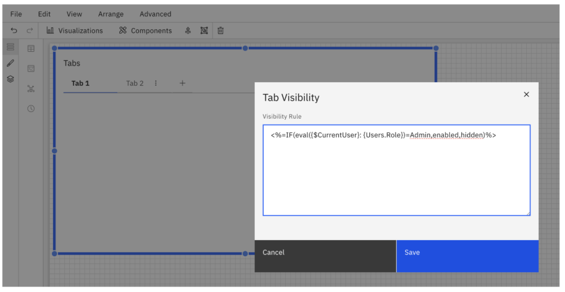

# Regras de visibilidade das guias

Você pode definir se uma guia fica visível ou oculta para os visualizadores do relatório definindo uma regra de visibilidade.

**Definir uma regra de visibilidade**

Cada guia em um grupo de guias (Guias) inclui um **menu de overflow** que oferece opções de configuração adicionais.

Para definir uma regra de visibilidade:

1. Abra o **menu de opções** da guia.
2. Selecione **a regra de visibilidade**.
3. Digite a expressão que determina se a guia deve ficar visível.

A guia será exibida ou ocultada para os usuários no visualizador de relatórios com base no resultado da expressão de visibilidade.

**Comportamento padrão**

- A primeira guia de um grupo de guias permanece sempre visível.
- Por esse motivo, a opção “Regra de visibilidade” está desativada na primeira guia.
- As regras de visibilidade só podem ser configuradas para as guias seguintes.

**Estados de visibilidade**

Uma guia pode apresentar um dos seguintes estados:

- **Visível** – A guia é exibida aos usuários quando visualizam o relatório.
- **Oculto** – A guia não é exibida aos usuários ao visualizar o relatório.

O estado de visibilidade é determinado pelo **resultado da expressão configurada**.

**Exemplo**

Você pode criar uma regra de visibilidade que permita aos administradores visualizar uma guia, mantendo-a oculta para os usuários finais.

Regra de visibilidade: `<%=IF(eval({$CurrentUser}:
{Users.Role})=Admin,enabled,hidden)%>`

Isso permite que os administradores de relatórios exibam informações específicas apenas para determinadas funções de usuário.

**Tópico principal:** [Abas](../../../studio/report-studio/components/rs-tabs.html "O componente \"Guias\" permite organizar o conteúdo do relatório em várias guias dentro de um único relatório. Cada guia pode conter seu próprio layout de componentes e visualizações, ajudando a estruturar relatórios complexos em seções claras e fáceis de navegar.")
