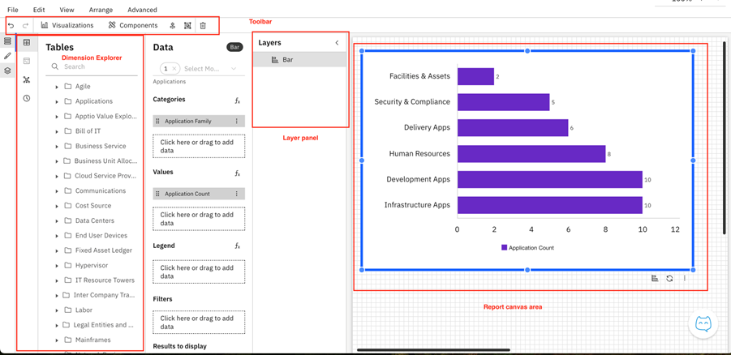
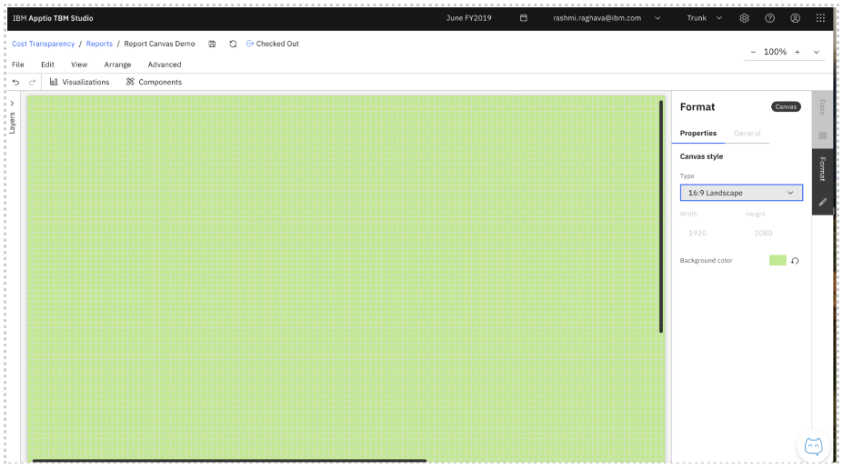
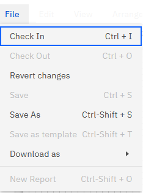

# Relatório Canvas

O Painel de Relatórios é onde os administradores criam e editam relatórios, adicionando componentes, configurando dados e organizando visualizações.

## Layout da tela

A tela do relatório está organizada nas seguintes áreas:

- **Área do painel de relatórios** – O espaço de trabalho principal onde os componentes e visualizações são colocados e organizados.
- **Barra de ferramentas superior** – Oferece ações como alinhar, agrupar, excluir, desfazer e refazer. Componentes e visualizações que você pode adicionar.
- **Painel Camadas (à esquerda)** : mostra a hierarquia dos componentes do seu relatório. A partir daqui, você pode copiar, colar, reordenar, excluir ou alterar a participação no grupo.
- **Explorador de dimensões (à direita)** : lista tabelas, tabelas editáveis, métricas e tempo. Use isso para arrastar e soltar dimensões nas configurações dos componentes.

## Painel Formato da tela

O painel Formato da tela permite controlar a aparência geral da tela do relatório. Essas configurações se aplicam a todo o layout do relatório.

- Tamanho da tela
  - Escolha um tamanho predefinido ou defina dimensões personalizadas
  - O tamanho da tela determina como o conteúdo é disposto e como o relatório aparece quando exportado para PDF.
- Cor de fundo da tela
  - Use Cor de fundo para definir a cor de fundo da tela do relatório.
  - Aplicado de forma consistente em todo o relatório

## Menu Canvas

A tela do relatório inclui menus que fornecem acesso a ações comuns durante a criação ou edição de relatórios.

**Menu Arquivo**

O menu **Arquivo** contém ações no nível do relatório para gerenciar versões do relatório e salvar alterações.

- Check-in – Salva suas alterações e torna o relatório disponível para outros usuários.
- Check Out – Bloqueia o relatório para edição, para que você possa fazer alterações sem conflitos.
- Reverter alterações – descarta as alterações não salvas e restaura o relatório para a última versão registrada.
- Salvar – Salva manualmente o estado atual do relatório.
- Salvar como – Cria um novo relatório salvando uma cópia do relatório atual com um nome diferente.

**Menu Editar**

O menu **Editar** fornece ações para fazer alterações no conteúdo da tela do relatório.

- Desfazer – Reverte a alteração mais recente.
- Refazer – Reaplica a última alteração desfeita.
- Copiar – Copia o componente ou visualização selecionado.
- Colar – Cola o componente ou visualização copiado na tela.

**Ver Menu**

O menu Exibir controla como a tela do relatório é exibida e como os elementos são posicionados durante a criação de um relatório.

- Tamanho real – Exibe a tela em sua escala original.
- Ajustar à página – Dimensiona a tela para que toda a página caiba na visualização disponível.
- Ajustar à largura – Dimensiona a tela para se ajustar à largura da área de trabalho.
- Mostrar grade – Exibe uma grade na tela para ajudar a alinhar os componentes.
- Mostrar réguas – Exibe réguas horizontais e verticais para um posicionamento preciso.
- Ajustar à grade – Alinha automaticamente os componentes à grade ao movê-los ou redimensioná-los.
- Mostrar camadas – Exibe o painel de camadas para gerenciar a ordem de empilhamento dos componentes.

**Organizar Menu**

O menu **Organizar** ajuda a organizar e posicionar componentes e visualizações na tela do relatório.

- Alinhar – Alinha os componentes selecionados ao longo de suas bordas.
- Distribuir – Espaça uniformemente os componentes selecionados horizontalmente (Shift+Alt+H) ou verticalmente (Shift+Alt+V).
- Trazer para a frente – Move o componente selecionado para o topo da ordem de camadas.
- Enviar para trás – Move o componente selecionado para a parte inferior da ordem de camadas.
- Avançar – Move o componente selecionado um passo à frente
- Enviar para trás - Move o componente selecionado um passo para trás

## Menu de transbordamento do cabeçalho do widget

Cada widget inclui um menu de overflow no cabeçalho que fornece ações rápidas para atualizar e inspecionar dados, converter para visualizações compatíveis, excluir e outras operações comumente usadas.

**Atualizar dados**

Use esta opção para atualizar manualmente o widget.

- Aciona uma nova busca dos dados mais recentes para o widget.
- Útil quando os dados subjacentes foram alterados e você deseja ver os resultados atualizados imediatamente.
- Não requer recarga completa do relatório.
- Use-o após atualizações de dados, alterações de configuração ou se o widget parecer fora de sincronia.

**Mostrar caminho completo dos dados**

Exibe o caminho de dados completo usado para gerar o widget.

- Abre um modal mostrando toda a hierarquia de dados e referências.
- Ajuda a entender como os dados do widget são obtidos e processados.
- Útil para depuração, validação e investigações de suporte.
- Use-o para rastrear a linhagem dos dados ou verificar a fonte de dados que alimenta o widget.

**Abrir em /data**

Abre os dados de depuração do widget em uma nova guia.

- Navega para o /data URL associado ao widget.
- Mostra os dados brutos ou em nível de depuração usados pelo componente.
- Destinado principalmente à resolução de problemas.
- Use-o para uma inspeção mais profunda dos dados ou para depuração.
