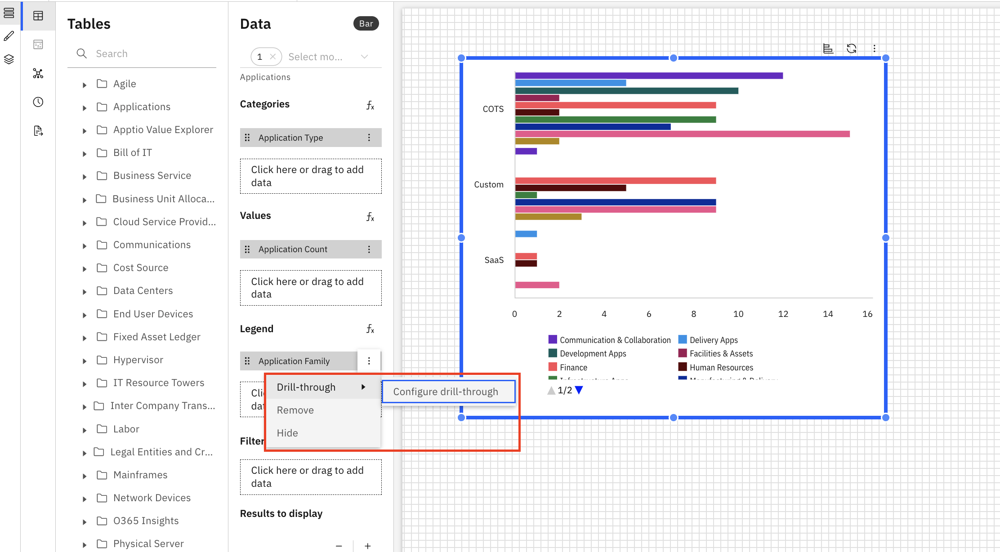
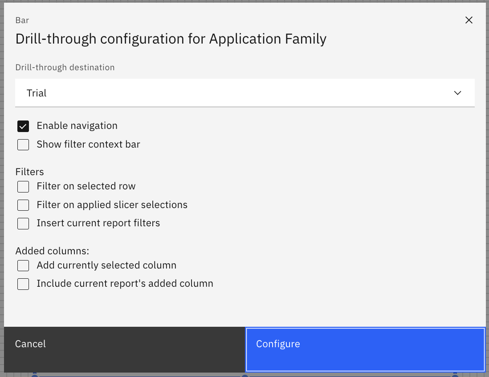
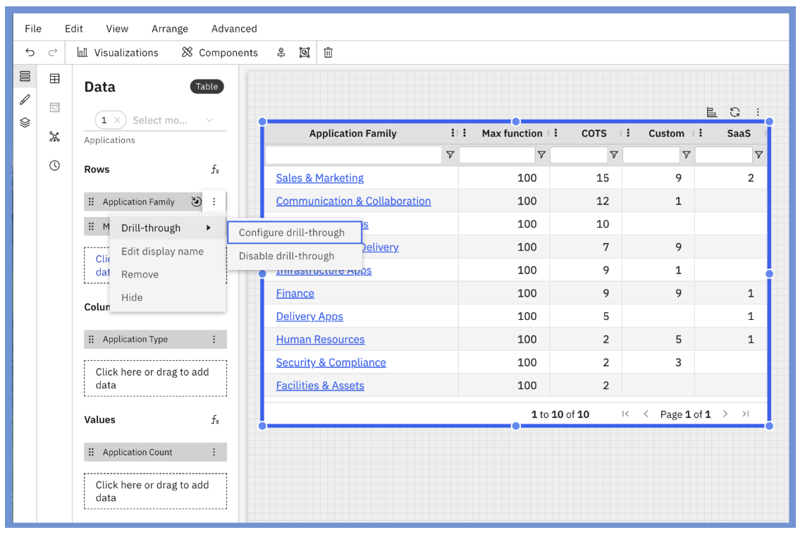

# Navegação da perfuração

A navegação por perfuração permite que os usuários explorem os dados de forma interativa clicando nos gráficos de um relatório para visualizar um relatório relacionado mais detalhado em uma sobreposição modal. Isso permite uma análise mais profunda e uma navegação perfeita entre as visualizações resumidas e detalhadas, tudo dentro da mesma experiência de relatório.

1. Adicionar uma pesquisa detalhada
   1. Abra o painel Configuração de dados do gráfico.
   2. No menu suspenso de uma dimensão, selecione Configurar Drill-Through.
   3. Observação: as dimensões adicionadas na seção Legenda do painel de dados têm a função de detalhamento ativada.

   
2. Configurar as definições de drill-through: O menu de configuração da navegação drill inclui as seguintes opções:
   1. Destino do drill-through
      1. Selecione o relatório de destino que será aberto em uma sobreposição do modelo quando o usuário clicar no gráfico.
      2. Esta é a visualização detalhada vinculada ao seu gráfico atual.
   2. Mostrar barra de contexto do filtro
      1. Adiciona uma barra de contexto de filtro ao relatório modal.
      2. Ativado por padrão para dar aos usuários visibilidade dos filtros aplicados ao explorar a visualização detalhada.
   3. Filtros
      1. Filtrar na linha selecionada: Filtra o relatório de destino usando os valores do ponto de dados clicado.
      2. Filtrar na seleção do segmentador aplicado – Filtra o relatório de destino usando as seleções do segmentador do relatório atual.
      3. Inserir filtros do relatório atual – Aplica todos os filtros atualmente ativos no relatório de origem ao relatório detalhado.
   4. Colunas adicionadas
      1. Adicionar coluna selecionada atualmente: inclui a coluna associada ao ponto de dados clicado no relatório detalhado.
      2. Incluir colunas adicionadas ao relatório atual: transfere todas as colunas adicionais selecionadas através do seletor de colunas para o relatório de destino.

      
   5. Usando a navegação por perfuração
      1. Após a configuração, os usuários podem clicar em um ponto de dados dentro do gráfico para abrir o relatório vinculado em uma sobreposição modal.
      2. Os filtros aplicados e o contexto são refletidos automaticamente, ajudando os usuários a rastrear insights de um resumo de alto nível até dados detalhados com um único clique.
      3. Funciona tanto no estúdio de relatórios quanto no visualizador de relatórios.
   6. Os usuários podem desativar as interações de detalhamento configuradas diretamente no Painel de Dados, sem precisar remover e recriar a configuração. Isso proporciona maior flexibilidade e controle na gestão das interações dos relatórios e permite ativar ou desativar facilmente o recurso de detalhamento à medida que as necessidades de relatórios evoluem.

   
