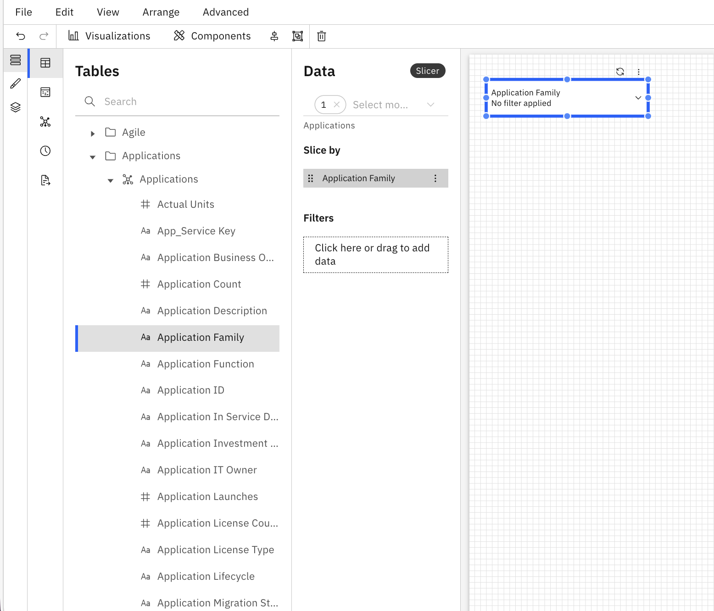
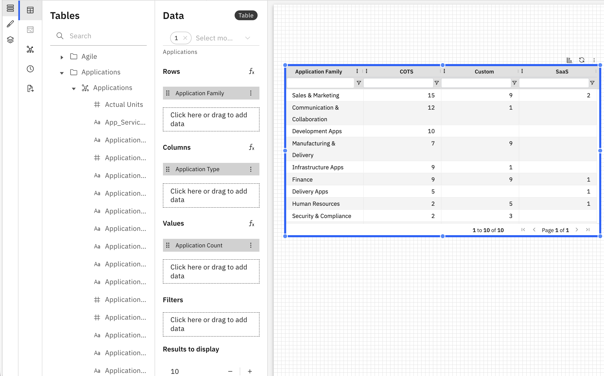

# Crie seu primeiro relatório

Este guia orienta você na criação de um novo relatório no novo Report Studio. Ao final deste guia, você terá um relatório com componentes e visualizações prontos para visualizar e compartilhar.

1. Navegue até a guia Novos relatórios
   1. Vá para a guia **Novos relatórios** na página inicial
   2. Clique no botão **Novo** e selecione **Relatório.**
2. Insira os detalhes do relatório
   1. **Nome do relatório** – Dê ao seu relatório um nome significativo.
   2. **Descrição (opcional)** - Adicione uma breve descrição para ajudar os usuários a entender o objetivo do relatório.
   3. **Visível por** – Esta propriedade controla quem pode ver e acessar o relatório.
      - Todos – O relatório fica visível para todos os usuários com acesso à área de relatórios.
      - Somente eu – O relatório é visível apenas para você. Útil para rascunhos, experimentação ou análise pessoal.
      - Selecionar funções – O relatório fica visível apenas para usuários atribuídos às funções selecionadas. As funções são selecionadas a partir de uma lista suspensa. Permite o controle de acesso baseado em funções para relatórios.
3. Adicionar componentes
   1. Na barra de ferramentas, selecione um componente no menu Componentes.
   2. Escolha entre os tipos de componentes disponíveis, tais como:
      - Fatiador
      - Seletor de colunas
      - Pivô rápido
      - HTML
      - Guias
      - Grupo
   3. Escolha um cortador
   4. Quando o divisor é adicionado, os painéis Dados e Formato abrem à direita.
      1. O painel de dados é usado para configurar os dados que acionam o filtro.
      2. O painel Formato é usado para personalizar a aparência e a formatação do segmentador.
   5. Configurar dados
      1. No painel de dados, selecione um objeto do modelo de dados no menu suspenso.
      2. Clique em “Clique aqui ou arraste para adicionar dados” para abrir o Dimension Explorer.
         - O Dimension Explorer exibe tabelas, tabelas editáveis, métricas e tempo.
      3. Escolha a dimensão pela qual deseja segmentar os dados.
      4. Arraste uma dimensão de Tabelas para o painel Dados.
      5. Use a seção de filtros para aplicar critérios de filtragem adicionais ao segmentador.

      

   Depois de configurado, o filtro segmenta o relatório com base na dimensão selecionada.
4. Adicionar visualizações
   1. Na barra de ferramentas, selecione uma visualização no menu Visualizações
   2. Escolha entre as visualizações disponíveis:
      - KPI
      - Tabela
      - Tabela editável
      - Gráficos de barras
      - Gráfico de barras empilhadas
      - Gráfico de colunas
      - Gráfico de colunas empilhadas
      - Gráfico de linhas
      - Gráfico de setores circulares
   3. Selecionar tabela
   4. Configurar dados
      1. No painel de dados, selecione um objeto do modelo de dados no menu suspenso.
      2. Configure as seções Linhas, Colunas e Valores do painel de dados adicionando dimensões diretamente do Dimension Explorer.
      3. Utilize a seção de filtros para aplicar critérios de filtragem adicionais à tabela.

      
5. Salve seu relatório
   1. Como o Autosave está ativado, suas alterações serão salvas automaticamente à medida que você cria o relatório.
   2. Você também pode clicar manualmente **em** Salvar a qualquer momento para garantir que seu trabalho seja salvo imediatamente.
