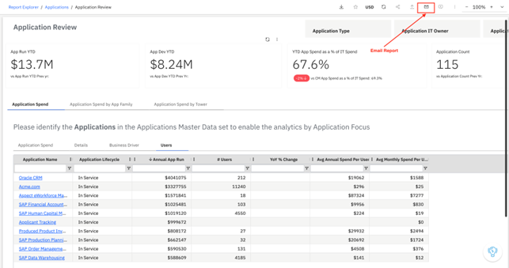
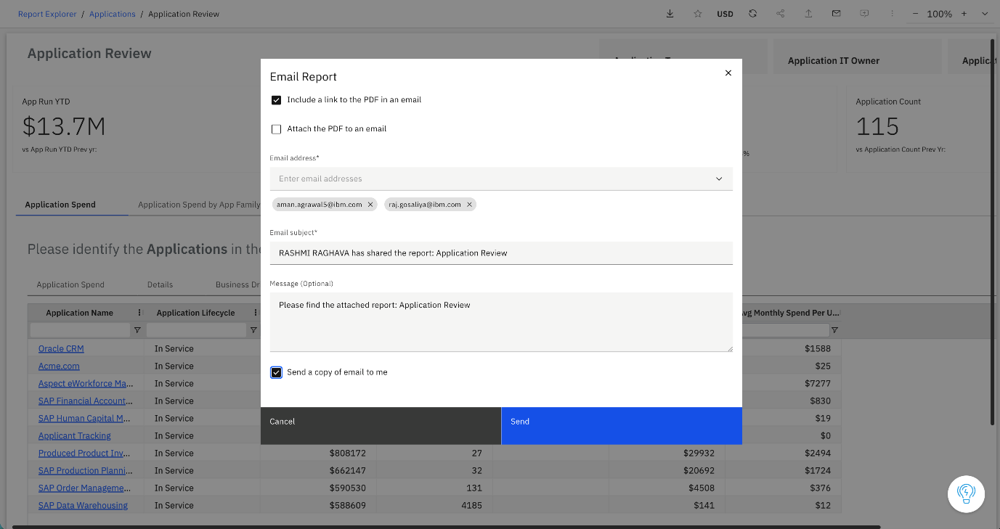

# Enviar relatório por e-mail

O recurso “Enviar por e-mail” no visualizador de relatórios permite enviar por e-mail o relatório que está sendo visualizado no momento. Você pode compartilhar o relatório anexando o PDF ao e-mail ou incluindo um link que permita aos destinatários visualizar ou baixar o relatório em formato PDF.

**Quando usar**

Use esta opção quando quiser:

- Compartilhe relatórios diretamente com as partes interessadas a partir do visualizador de relatórios
- Envie uma versão em PDF do relatório sem precisar baixá-lo e anexá-lo manualmente
- Forneça aos destinatários um link para visualizar ou baixar o relatório em formato PDF

**Enviar um relatório por e-mail**

Para enviar um relatório por e-mail a partir do visualizador de relatórios:

1. Abra o relatório no visualizador de relatórios
2. Clique no **ícone de e-mail** na barra de ações na parte superior do relatório.
3. A caixa de diálogo “Relatório por e-mail” é exibida.
4. Escolha como deseja compartilhar o relatório:
   1. Inclua um link para o PDF no e-mail
   2. Anexe o PDF ao e-mail
5. Insira o(s) endereço(s) de e-mail do(s) destinatário(s).
6. O assunto do e-mail é preenchido automaticamente por padrão, mas você pode editá-lo, se necessário.
7. Se desejar, adicione uma mensagem ao e-mail.
8. Selecione **“Enviar uma cópia para mim”** se desejar receber uma cópia do e-mail.
9. Clique em “Enviar e-mail”.

Depois que o e-mail for enviado, os destinatários poderão visualizar o relatório ou baixá-lo em formato PDF.
