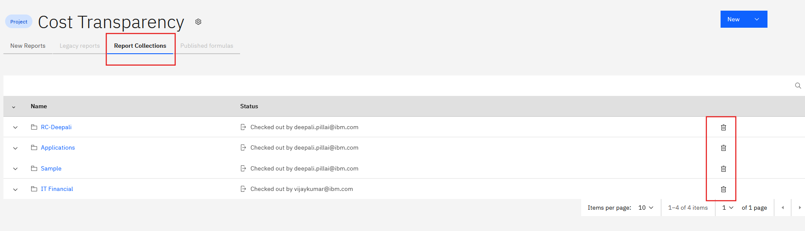

# Adicionar ou remover relatórios

1. Abra a coleção no menu Report Collections (Coleções de relatórios) na página de destino.
2. Você pode
   - Renomear a coleção
   - Adicionar ou remover relatórios.
   - Altere a visibilidade alternando **Mostrar coleção para os usuários finais**.
3. Excluir uma coleção de relatórios
   1. Na guia Coleções de relatórios, clique no ícone **Excluir** na coleção de relatórios.
   2. A exclusão de uma coleção não exclui os relatórios contidos nela. Eles permanecerão disponíveis no projeto.

      
