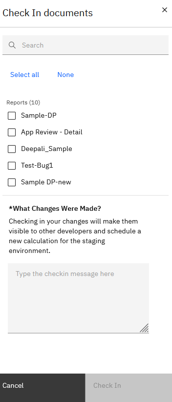
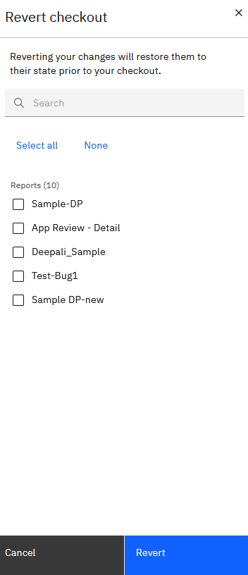

# Menu Arquivo

O menu Arquivo na tela do relatório é

***Check-in***

Para fazer o check-in de um relatório, vá para **Arquivo** > **Check-in**.

Isso aciona um recálculo, e outras pessoas podem ver as alterações que você fez no documento. As alterações serão disponibilizadas no ambiente de teste.você pode "selecionar todos" ou "nenhum" dos relatórios.

***Check-out***

Para editar um relatório, você deve primeiro verificá-lo. Para finalizar a compra, vá em **Arquivo** > **Finalizar compra**.

Quando você faz o check-out de um relatório, ele é bloqueado para que outras pessoas não possam editar o documento. Você pode salvar as alterações no documento sem acionar um novo cálculo. Quando terminar de editar um documento, salve-o e faça o check-in novamente.

***Reverter alterações***

A função de reversão abandona todas as alterações feitas nos documentos de check-out que você selecionou e, em seguida, descarta o check-out. Para reverter, siga estas etapas:

1. Na página Criar relatório, vá para **Arquivo** e clique em **Reverter alterações**.
2. Marque a caixa de seleção ao lado dos documentos que você deseja reverter e clique em **Revert Check Out**.

   

***Salvar***

Quando você cria um relatório pela primeira vez, o aplicativo salva automaticamente o relatório. Se você fizer alterações em um relatório e depois sair dele, o relatório será salvo automaticamente. Você também pode salvar um relatório clicando no ícone **Salvar** na página de criação do relatório.
