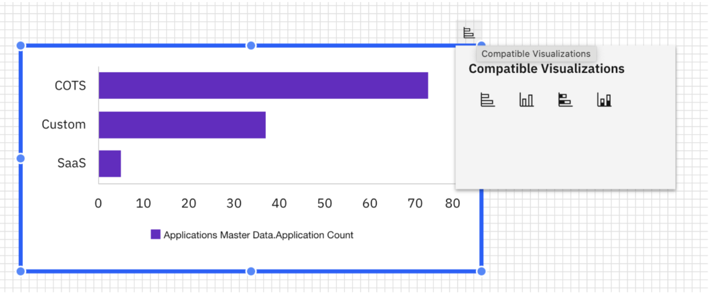
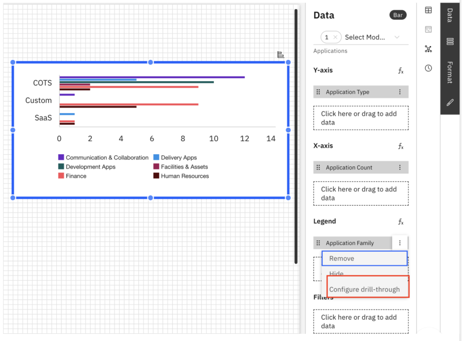
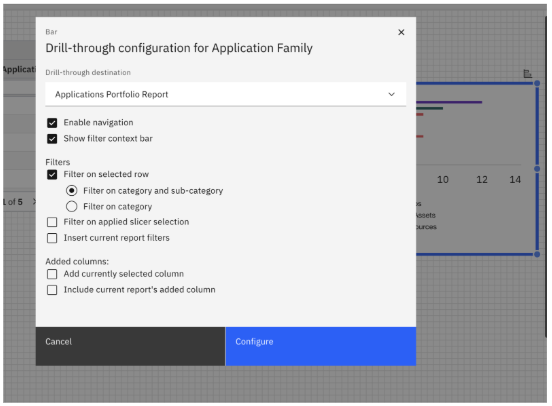

# Gráficos

Os gráficos, quando usados corretamente, podem transmitir informações valiosas rapidamente.

O aplicativo oferece uma ampla gama de tipos de gráficos, incluindo:

1. Barra (barra e barra empilhada)
2. Coluna (coluna e coluna empilhada)
3. Linha
4. Gráfico de pizza
5. KPI

## Visualizações compatíveis

O recurso Compatible Visualizations permite que você alterne rapidamente entre tipos de gráficos compatíveis sem precisar reconstruir a visualização. Isso o ajuda a experimentar diferentes formatos visuais e a encontrar aquele que melhor representa seus dados.

**Etapas para uso**

1. Selecione um gráfico
2. Clique em um gráfico (por exemplo, um gráfico de barras) em seu relatório.
3. Use a opção de conversão
4. No cabeçalho do widget, localize o ícone Visualizações compatíveis.
5. Selecione o ícone para exibir uma lista de visualizações compatíveis com o tipo de gráfico selecionado.

   
6. Selecione um tipo de visualização
7. Selecione entre opções como:
8. Gráfico de colunas
9. Gráfico de barras empilhadas
10. Gráfico de colunas empilhadas
11. O gráfico é atualizado instantaneamente para o tipo visual escolhido, mantendo os dados, a formatação e a configuração existentes.

## Navegação de perfuração para gráficos

A navegação por drill permite que os usuários explorem os dados de forma interativa, clicando em gráficos dentro de um relatório para visualizar um relatório relacionado e mais detalhado em uma sobreposição modal. Isso permite uma análise mais profunda e uma navegação perfeita entre as visualizações resumidas e detalhadas, tudo na mesma experiência de geração de relatórios.

Etapas para uso

1. Adicionar uma perfuração
   1. Abra o painel Data Configuration (Configuração de dados) para o gráfico.
   2. No menu de estouro de uma dimensão, selecione Configurar Drill-Through.
   3. Observação: as dimensões adicionadas na seção Legenda do painel de dados têm o drill-through ativado.

      
2. Configurar as definições de drill-through: O menu de configuração de navegação de perfuração inclui as seguintes opções:
   1. Destino da perfuração
      1. Selecione o relatório de destino que será aberto em uma sobreposição de modelo quando um usuário clicar no gráfico.
      2. Essa é a visualização detalhada vinculada ao seu gráfico atual.
   2. Mostrar barra de contexto do filtro
      1. Adiciona uma barra de contexto de filtro ao relatório modal.
      2. Ativado por padrão para dar aos usuários visibilidade dos filtros aplicados ao explorar a exibição detalhada.
   3. Filtros
      1. Filtrar na linha selecionada: Filtra o relatório de destino usando valores do ponto de dados clicado.
      2. Filtrar na seleção de segmentação aplicada - Filtra o relatório de destino usando as seleções de segmentação do relatório atual.
      3. Inserir filtros do relatório atual - Aplica todos os filtros atualmente ativos no relatório de origem ao relatório de pesquisa.
   4. Colunas adicionadas
      1. Adicionar coluna atualmente selecionada: Inclui a coluna associada ao ponto de dados clicado no relatório de pesquisa.
      2. Incluir as colunas adicionadas do relatório atual: Transporta todas as colunas adicionais selecionadas por meio do seletor de colunas para o relatório de destino.

         
   5. Usando a navegação de perfuração
      1. Após a configuração, os usuários podem clicar em um ponto de dados dentro do gráfico para abrir o relatório vinculado em uma sobreposição modal.
      2. Os filtros e o contexto aplicados são refletidos automaticamente, ajudando os usuários a rastrear insights de um resumo de alto nível para dados detalhados com um único clique.
      3. Funciona tanto no report studio quanto no visualizador de relatórios.
