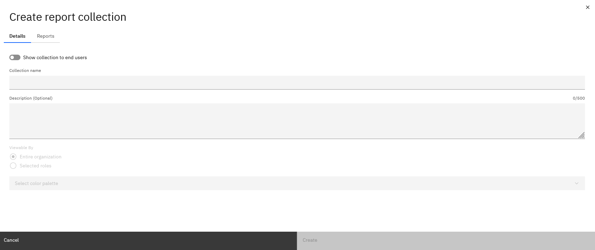
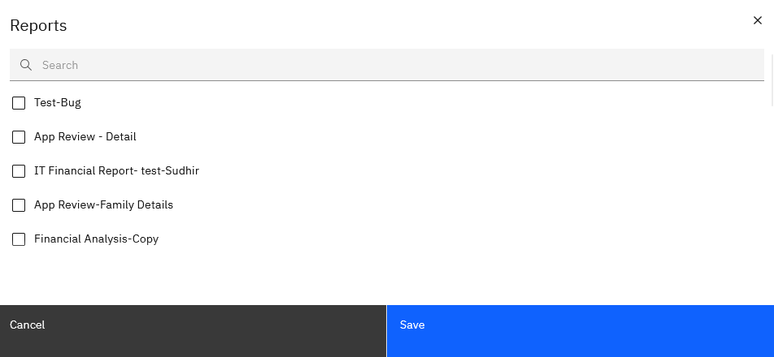

# Criando uma coleção de relatórios

Uma **coleção de relatórios** é um contêiner que agrupa relatórios relacionados para facilitar o acesso e a organização.

1. **Criar uma coleção**

   

   1. Na página inicial, clique em **Novo** e selecione **Coleção de relatórios**.
   2. Dê um nome e uma descrição opcional à sua coleção.
   3. Use o botão **Show collection to end users** se quiser que a coleção fique visível para os usuários finais.
      1. **Ligado** : A coleção aparecerá para os usuários finais em sua visualização.
      2. **Off** : a coleção fica oculta para os usuários finais e visível apenas para os administradores/designers de relatórios.
2. **Adicionar relatórios a uma coleção**
   1. Clique em Add Report (Adicionar relatório) para adicionar os relatórios existentes do projeto à coleção.

      
   2. Os relatórios adicionados serão listados na coleção.
